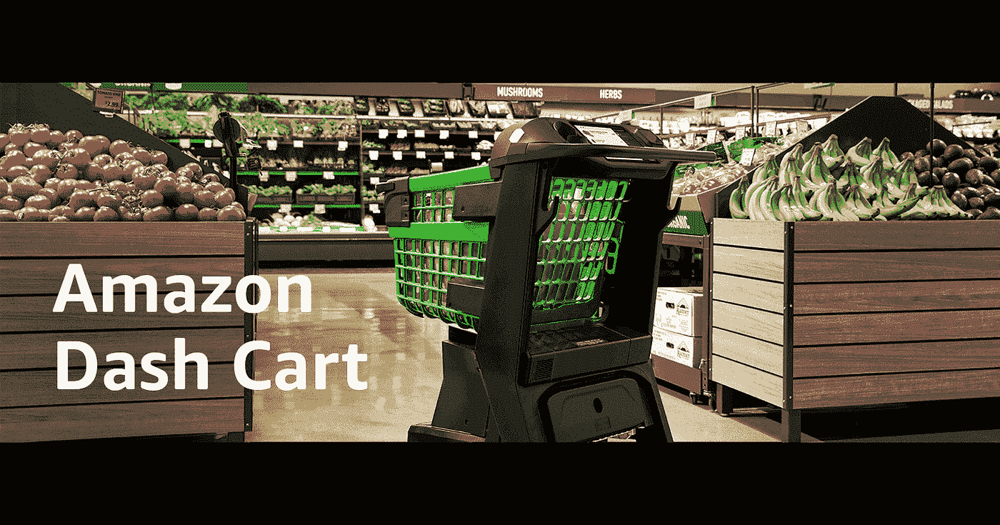
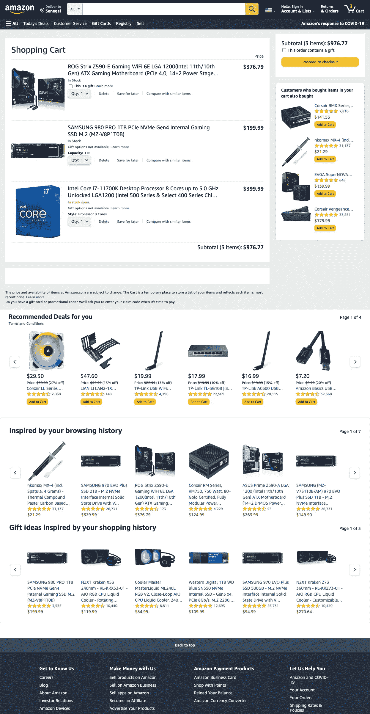
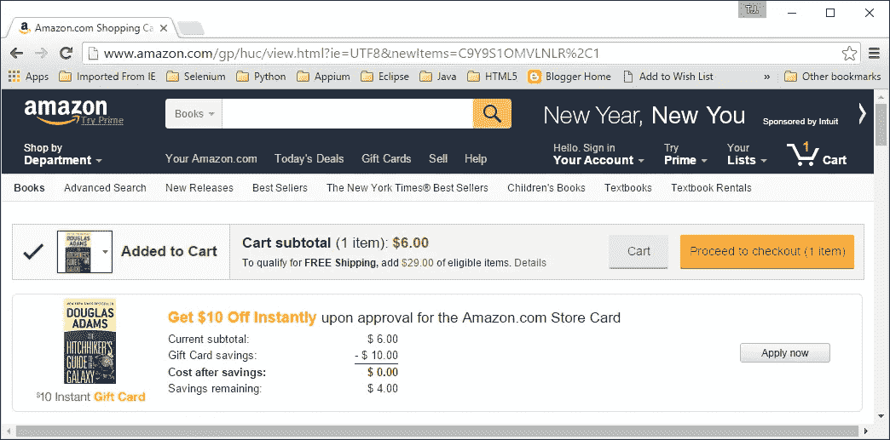

# 推车众筹

> 原文：<https://medium.com/nerd-for-tech/cart-crowdfunding-92b390ae42cb?source=collection_archive---------16----------------------->

## 对于像亚马逊这样的电子商务平台或像你这样的科技企业家来说，这是一个好主意

如果你可以去你选择的网上商店。这个在线商店可以是亚马逊，Etsy，为什么不像 short squeezers 推广的那样，将 [GameStop](https://mkrdiop.medium.com/gamestop-social-influence-in-the-stock-market-b03fcee415e) 更新为获胜的电子商务平台。

如果在这个商店里，你可以像在网上购物时一样，选择你在这个项目中需要的物品，这项工作对我们和这个世界都很重要。就像我对下面这个**屏幕商店**所做的那样，并指出这个错误**屏幕商店**对于一个可能有另一个电子商务目的的创业公司来说是一个很好的名字。我描述的手推车在这里

亚马逊购物车截图

如果像往常一样，你点击继续结帐，并在页面上填写你的信用卡账户信息，以支付这 976.77 美元，但不是填写你自己的信用卡，因为你的信用卡余额为零，你可以只点击运行众筹活动，并让你的购物车众筹活动页面准备好，让关心你的工作的人从 1 美元到整个购物车价值开始资助它。

亚马逊购物车图片

我没有在网上看到过这样的解决方案，如果你有，请告诉我，因为我需要它。否则，尝试建立它，因为我需要它，我还没有时间来建立它，我几乎可以肯定，许多人也将需要它。

这种推车众筹的概念与下面这篇文章背后的概念非常接近

 [## 像 ShareCart 这样传播的东西会赢

### 写这本书，我在这篇文章中宣布，我写的事实是，它是由这个点燃的…

mkrdiop.medium.com](https://mkrdiop.medium.com/things-that-spread-like-sharecart-win-23149d6fa522) 

这就是科技产品创意创业公司所做的，创造对个人和公司都很重要的科技产品。这两个是公开分享的，几年前就上架了，其他的可能通过特殊目的收购公司上市，或者卖给老牌公司、初创公司，或者缺乏创业想法的人。