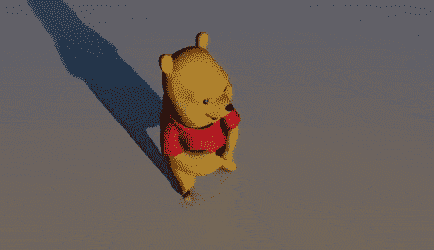
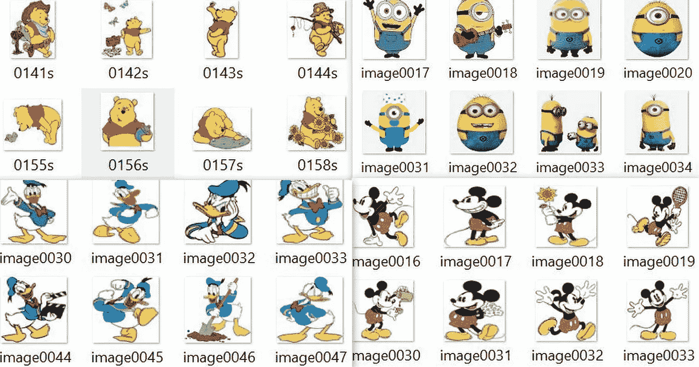
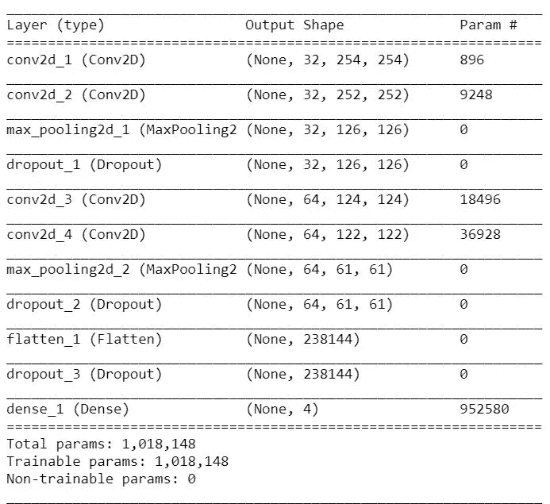
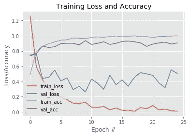
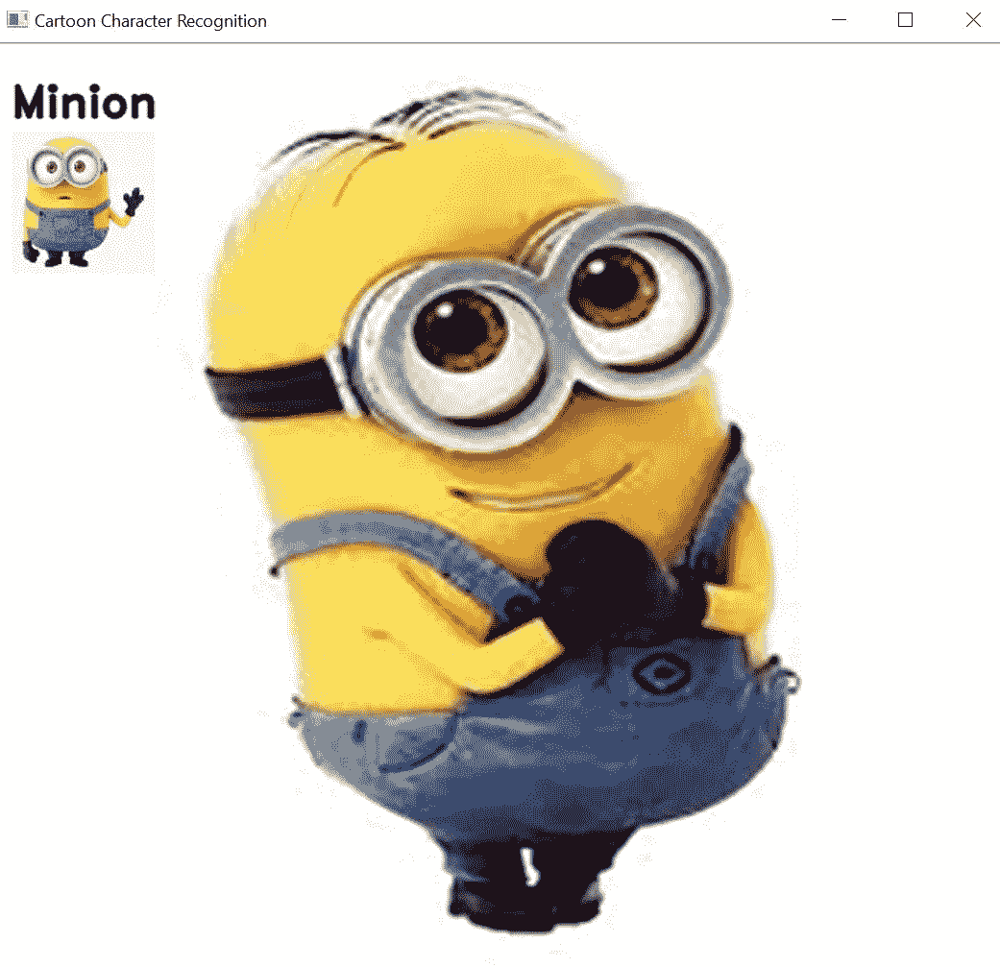

# 使用深度学习的卡通人物识别。

> 原文：<https://medium.com/nerd-for-tech/cartoon-character-recognition-using-deep-learning-c1ece3dbd94c?source=collection_archive---------7----------------------->

> 卡通人物，动画片中的人或动物，如米老鼠、汤姆和杰瑞等。卡通是每个童年必不可少的一部分。毫无疑问，它们是最受孩子们欢迎的娱乐方式，但远不止于此。在卡通的帮助下，孩子们可以了解我们周围的世界，了解新的情感，生活问题和其他重要的事情。因此，只是为了好玩，当前项目的目标是使用深度学习算法来识别卡通人物。

因此，在本文中，我们将研究如何使用深度神经网络模型在 OpenCV 中执行卡通人物识别。

# 目录

1.  资料组
2.  深度学习算法
3.  实验和结果
4.  下一步是什么？

## 资料组

数据集中使用的图片收集自谷歌浏览器和各种网站，如[迪士尼](https://cartoon-clipart.co/)。截至目前，该数据集包含 4 个类别(米老鼠、唐老鸭、小黄人和小熊维尼)，总共包含 2215 张图像。数据集被转换为结构化格式(在一个地方收集并手动标记图像)，所有预处理(如调整图像大小、应用过滤器去除噪声等)都是使用 OpenCV-python 完成的。

数据集的样本图像

## 深度学习算法

1.  **模型架构**:了解 CNN 模型，请浏览[T5 篇 。架构不同，有许多层、参数和超参数调整，但基本原理是相同的。](/analytics-vidhya/face-mask-detection-using-deep-learning-83f927654f1e)
2.  **计算 CNN 中的参数数量:**如果你一直在玩 CNN，那么经常会遇到下图所示的参数汇总。我们都知道计算激活尺寸很容易，因为它仅仅是宽度、高度和该层中通道数量的乘积。

CNN 模型摘要

## 首先，什么是参数？

> *参数通常是在训练期间学习的重量。它们是有助于模型预测能力权重矩阵，在反向传播过程中会发生变化。谁来管理变革？嗯，你选择的训练算法，尤其是优化策略，会让它们改变自己的值。*
> 
> *现在你知道什么是“参数”,让我们开始计算我们在上面看到的示例图像中的参数数量。但是，我想在这里再次包含该图像，以避免您的滚动努力和时间。*

1.  **输入层:**输入层不需要学习什么，它的核心是提供输入图像的形状。所以这里没有可学习的参数。因此**参数的数量= 0** 。
2.  CONV 层:这是 CNN 学习的地方，所以我们肯定会有权重矩阵。为了计算这里的可学习参数，我们所要做的就是将乘以形状的**宽度 m** 、**高度 n** 、**前一层的过滤器** **d** ，并考虑当前层中所有这样的过滤器 **k。不要忘记每个滤波器的偏置项。CONV 层中的参数数量将是: **((m * n * d)+1)* k)** ，由于每个滤波器的偏置项而增加 1。同样的表达式可以写成:**((滤镜宽度的形状*滤镜高度的形状*上一层滤镜数+1)*滤镜数)。**其中术语“过滤器”指当前层中过滤器的数量。**
3.  **池层:**它没有可学习的参数，因为它所做的只是计算一个特定的数字，不涉及反向传播学习！因此多个**参数= 0** 。
4.  **全连接层(FC):** 这当然有可学习的参数，事实上，与其他层相比，这类层有最多的参数，为什么？因为，每一个神经元都与其他神经元相连！那么，如何计算这里的参数个数呢？你可能知道，它是当前层的神经元数量 **c** 和前一层的神经元数量 **p** 的乘积，而且一如既往，不要忘记偏置项。因此这里的参数数量为:**((当前层神经元 c *前一层神经元 p)+1*c)** 。

现在让我们跟着这些指针计算参数的个数，好吗？

1.  第一个**输入层**没有参数。
2.  第二个 **CONV1(滤镜形状=3*3，步距=1)层中的参数为:** **((滤镜宽度的形状*滤镜高度的形状*上一层的滤镜个数+1)*滤镜个数)= (((3*3*3)+1)*32) = 896。**
3.  第四个 **CONV2(滤镜形状=3*3，步距=1)层中的参数为** : **((滤镜宽度形状*滤镜高度形状*上一层滤镜数量+1) *滤镜数量)= (((3*3*32)+1)*64) = 9248。**
4.  第三个 **POOL1 层**没有参数。
5.  中的参数第四个 **CONV3(滤镜形状=3*3，步距=1)层为** : **((滤镜宽度形状*滤镜高度形状*上一层滤镜数量+1) *滤镜数量)= (((5*5*32)+1)*64) = 18496。**
6.  中的参数第四个 **CONV4(滤镜形状=3*3，步距=1)层为** : **((滤镜宽度形状*滤镜高度形状*上一层滤镜数量+1) *滤镜数量)=((3 * 3 * 64)+1)* 64)= 36928。**
7.  第五层 **POOL2 层**没有参数。
8.  **Softmax 层有((当前层 c *上一层 p)+1*c)个参数= 238144*4 + 1*4= 952580。**

# 实验和结果

1.CNN 模型分析

训练值数据曲线的模型精度和损失

2.图像卡通人物识别的实现。

3.视频卡通人物识别的实现。

# 下一步是什么？

本文对卡通人物进行了准确的识别。我们已经使用了 4 个类别，这可以扩展到为更多类别训练模型，并且我们可以为对象检测创建数据集(将来将只为学习对象检测而做)。

# 参考

1.  [数据集收集](https://www.disneyclips.com/images/donaldduck9.html)
2.  [CNN 参数的计算](https://towardsdatascience.com/understanding-and-calculating-the-number-of-parameters-in-convolution-neural-networks-cnns-fc88790d530d)。
3.  [CNN 架构。](/analytics-vidhya/recognizing-real-time-creativity-of-user-using-deep-learning-786cbc5cd292)

该代码可在[**github.com/Devashi-Choudhary/Cartoon-Character-Recognition**](https://github.com/Devashi-Choudhary/Cartoon-Character-Recognition)获得。如有任何问题或疑问，请直接联系我，电话:[**github.com/Devashi-Choudhary**。](https://github.com/Devashi-Choudhary)