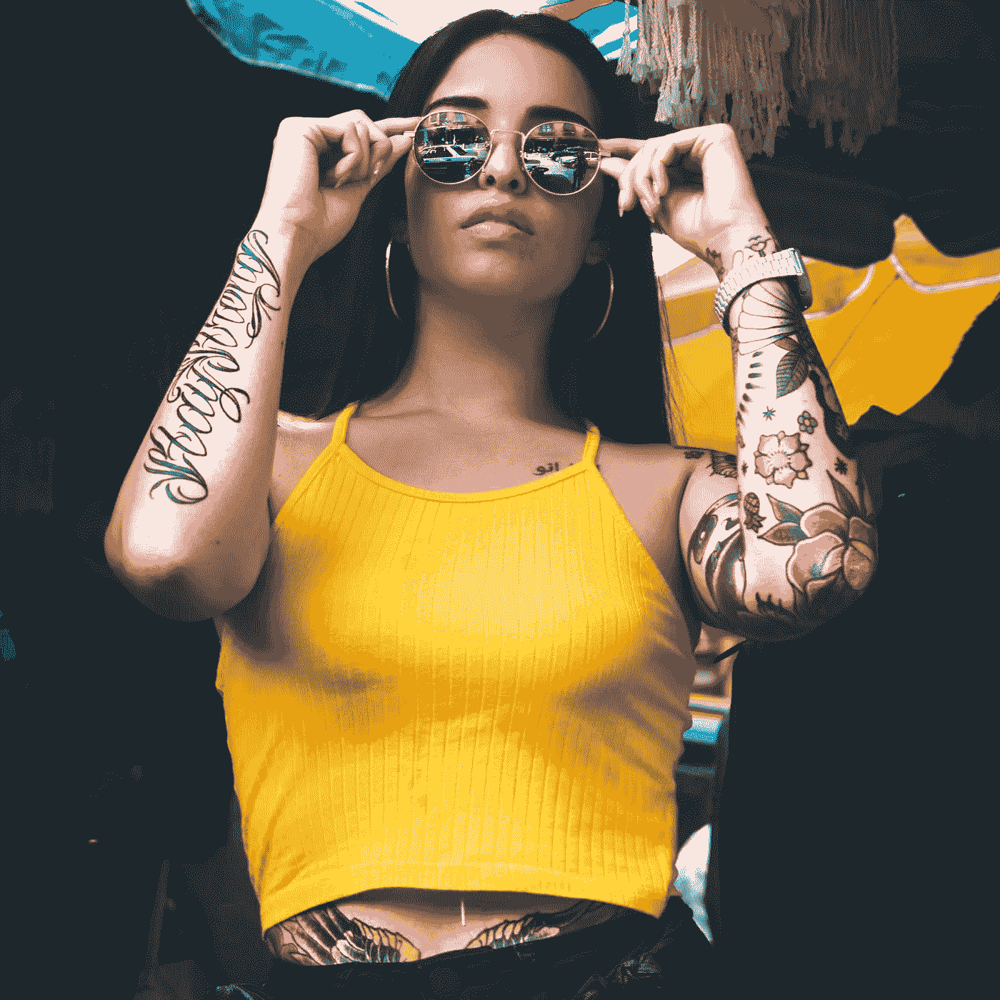
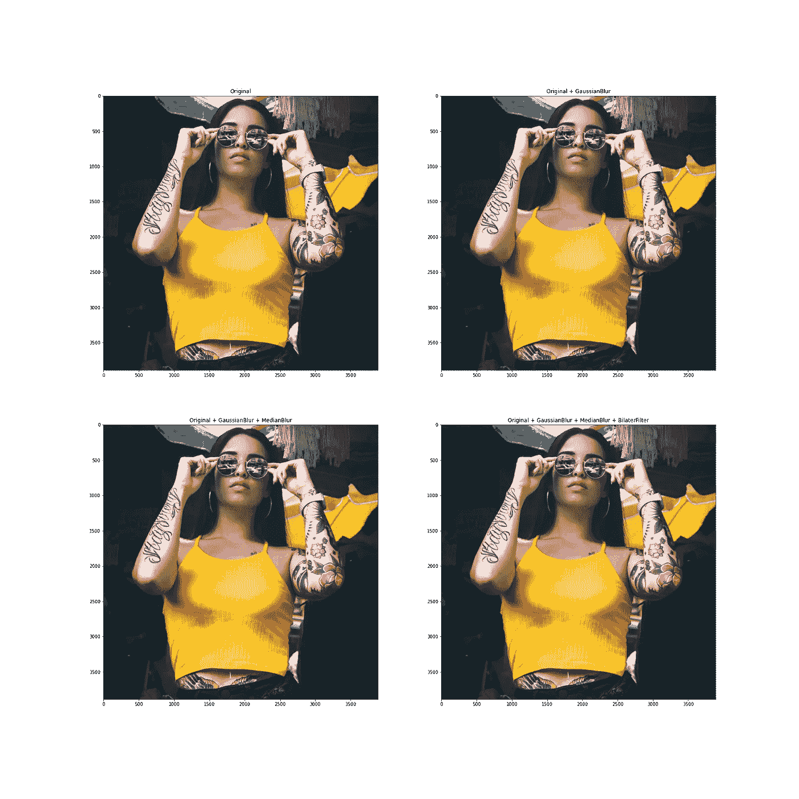
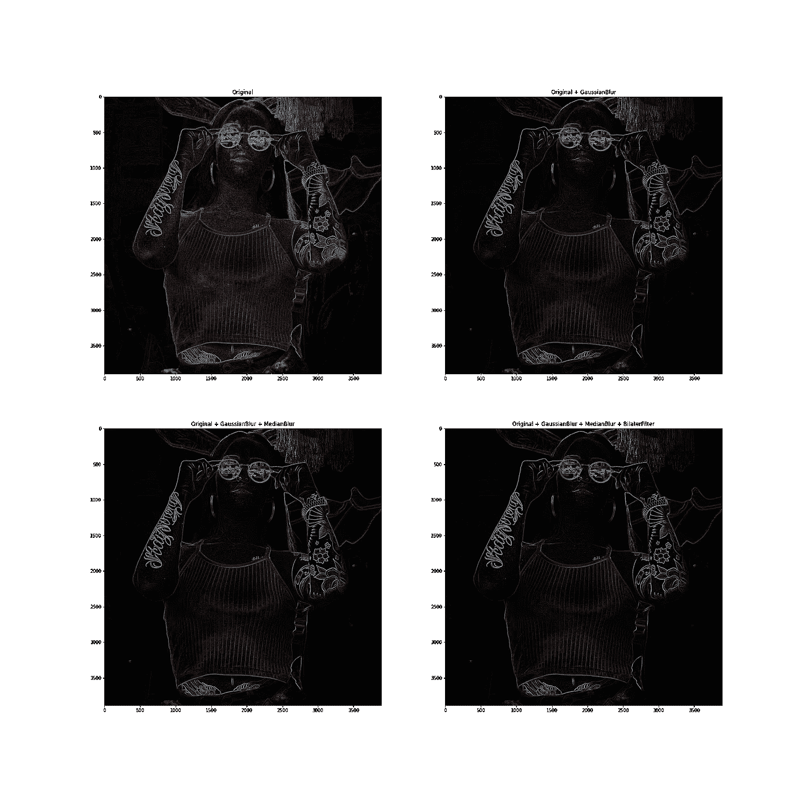
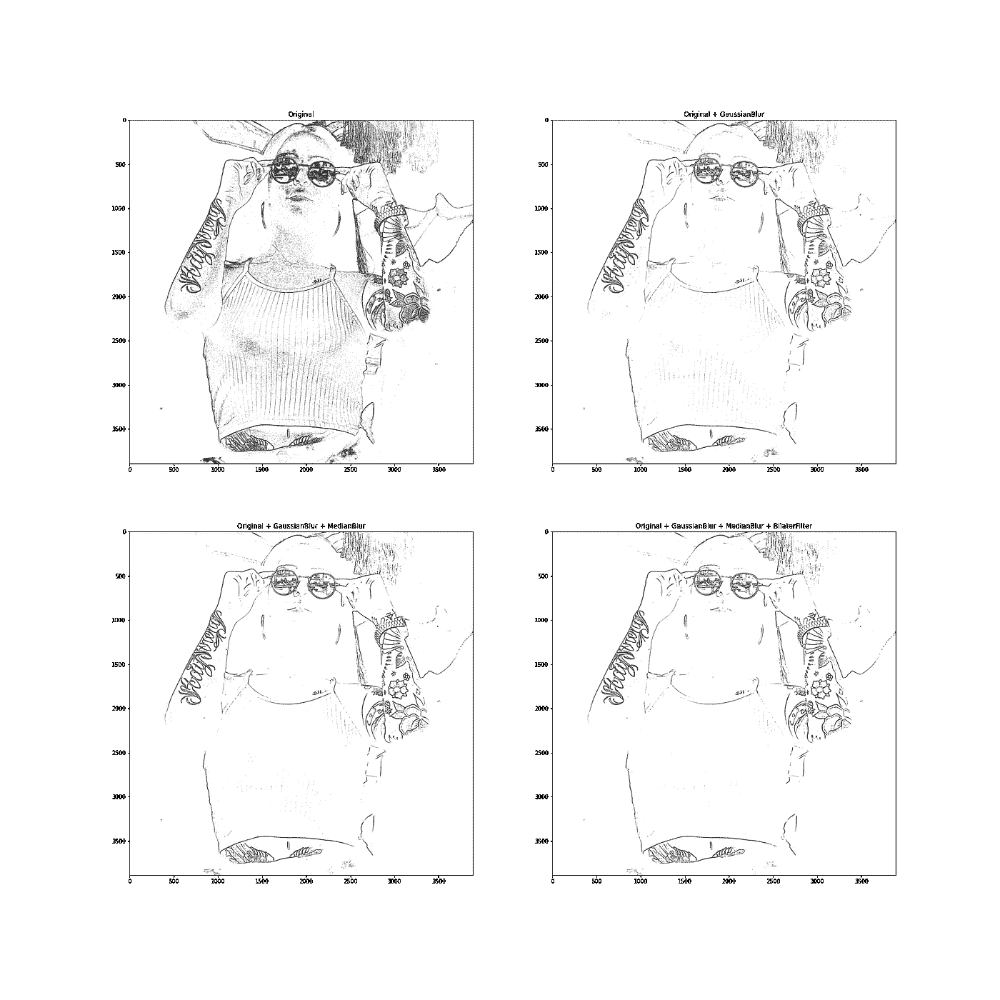
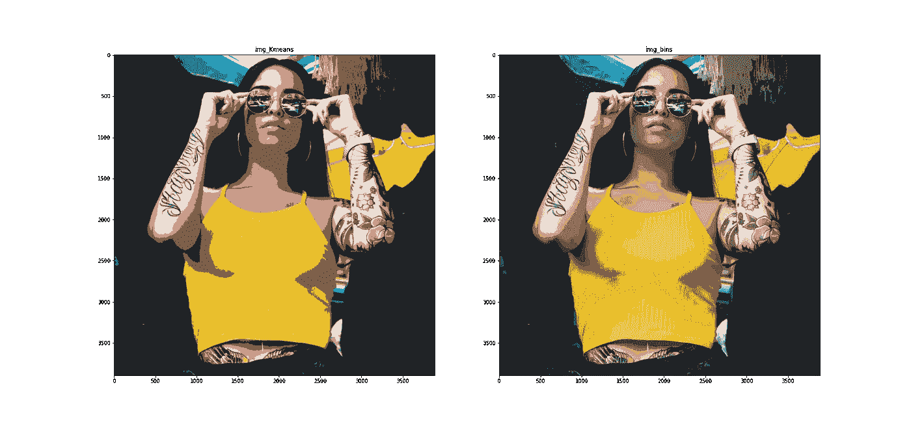
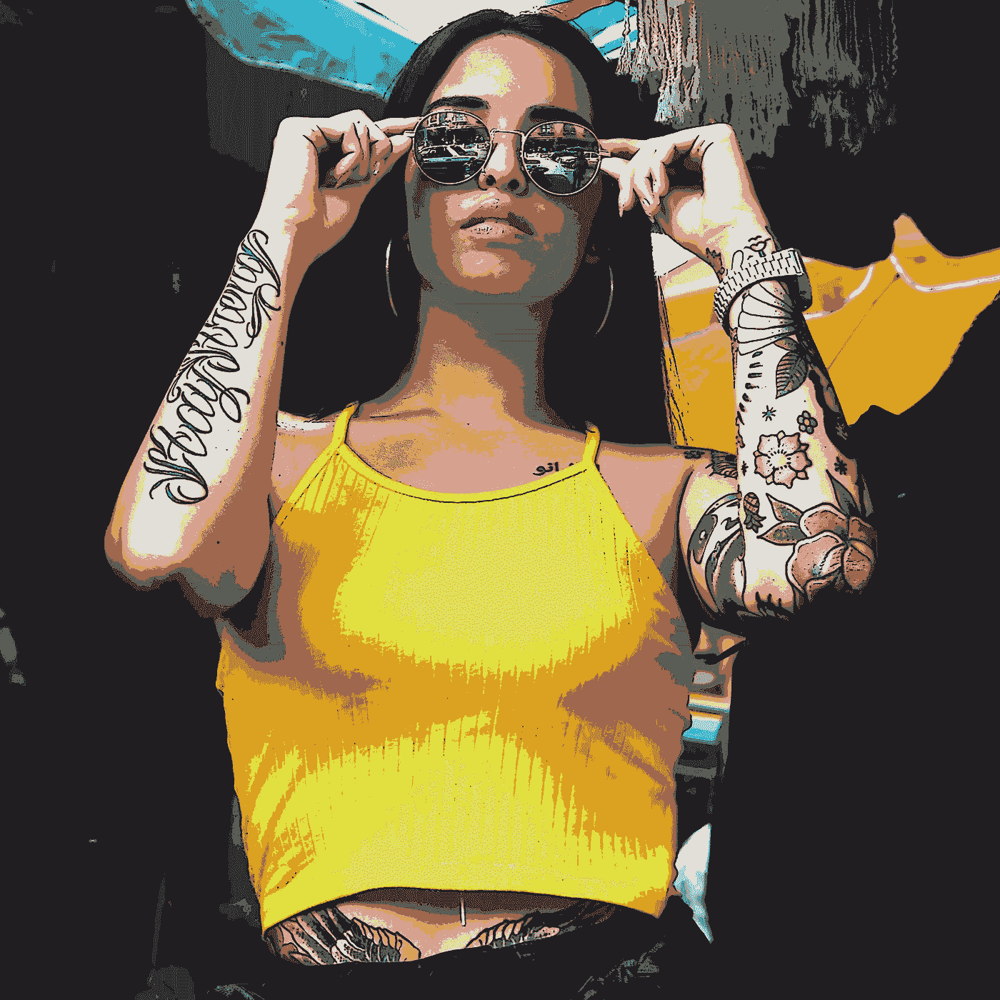

# 用 Python 卡通化图像

> 原文：<https://medium.com/nerd-for-tech/cartoonize-images-with-python-10e2a466b5fb?source=collection_archive---------4----------------------->



丹尼尔·戈麦斯在 Unsplash 上拍摄的照片

对于本教程，您需要 Python 和两个库，Numpy 和 OpenCV。Numpy 是 Python 中高效数组的黄金标准，OpenCV 是一个计算机视觉库。它提供了几个方便的工具，这将使本教程非常容易。

在本教程中，我不会深入研究算法，但是我会提供文档链接。

## 导入语句+打开图像

我们从导入两个库开始:

```
# Import necessary libraries
import cv2
import numpy as np
```

我们可以使用 cv2 库直接打开一个图像:

```
# Opens an image with cv2
img = cv2.imread('DanielGomez.jpg')
```

Cv2 使用 numpy 来打开图像,“img”变量现在包含一个 3 维的 numpy 数组。一个小注意，cv2 打开图像作为 BGR(光谱的顺序)，而不是大多数人习惯的 RGB。如果你摆弄一下笔记本(见本文末尾)，你会发现为了绘图，我把图像从 BGR 转换成了 RGB。

在本教程中，我将使用拉普拉斯过滤器来检测图像边缘。拉普拉斯过滤器是一个非常好的过滤器(阅读更多关于它的信息[这里](https://docs.opencv.org/3.4/d5/db5/tutorial_laplace_operator.html))。然而，它很容易产生噪音。这就是为什么我们将在应用拉普拉斯过滤器之前应用一些图像过滤:

## 过滤

```
# Apply some Gaussian blur on the image
img_gb = cv2.GaussianBlur(img, (7, 7) ,0)
# Apply some Median blur on the image
img_mb = cv2.medianBlur(img_gb, 5)
# Apply a bilateral filer on the image
img_bf = cv2.bilateralFilter(img_mb, 5, 80, 80)
```

当然，我们也可以将结果可视化，以查看差异。



照片由[丹尼尔·戈麦斯](https://unsplash.com/@mundodeparra?utm_source=unsplash&utm_medium=referral&utm_content=creditCopyText)在 Unsplash 上拍摄——由作者编辑

看不出图像之间的差异？我也没有那么好，如果你知道每个过滤器是做什么的，你就能发现不同之处！拉普拉斯滤波器将检测差异。

## 边缘检测

接下来，我们可以应用拉普拉斯过滤器，为了比较起见，我们对所有 4 个不同的图像应用过滤器，并可视化结果。对于每个拉普拉斯滤波器，我们使用 5 的核大小。你当然可以玩一会儿，但在我看来，这将给出最好的结果。“CV_8U”意味着我们使用 8 位值(0–255)。

```
# Use the laplace filter to detect edges
img_lp_im = cv2.Laplacian(img, cv2.CV_8U, ksize=5)
img_lp_gb = cv2.Laplacian(img_gb, cv2.CV_8U, ksize=5)
img_lp_mb = cv2.Laplacian(img_mb, cv2.CV_8U, ksize=5)
img_lp_al = cv2.Laplacian(img_bf, cv2.CV_8U, ksize=5)
```

我们再次将结果可视化:



丹尼尔·戈麦斯在 Unsplash 上拍摄的照片——由作者编辑

你现在可以看到原始图像的拉普拉斯算子检测到了很多噪声。使用所有滤镜的图像是最清晰的，这一点很方便。然而，这还不是我们想要的。我们需要一个图像最好是黑白的，我们可以用它作为一个面具。让我们继续编辑这张图片。让我们首先将其转换为灰度图像:

```
# Convert the image to greyscale (1D)
img_lp_im_grey = cv2.cvtColor(img_lp_im, cv2.COLOR_BGR2GRAY)
img_lp_gb_grey = cv2.cvtColor(img_lp_gb, cv2.COLOR_BGR2GRAY)
img_lp_mb_grey = cv2.cvtColor(img_lp_mb, cv2.COLOR_BGR2GRAY)
img_lp_al_grey = cv2.cvtColor(img_lp_al, cv2.COLOR_BGR2GRAY)
```

现在，每个变量都包含一个一维数组，而不是三维数组。接下来，我们将使用图像阈值来设置接近黑色的值和接近白色的值。我们可以通过以下方式创建手动阈值:

```
# Manual image thresholding
_, EdgeImage = cv2.threshold(img, 127, 255, cv2.THRESH_BINARY)
```

有很多不同的方法来使用图像阈值，尝试一下，找出最适合你的方法，你可以在这里阅读更多信息。在本教程中，我们使用 Otsu 阈值。在应用 Otsu 阈值之前，我们先去除一些额外的噪声。

```
# Remove some additional noise
blur_im = cv2.GaussianBlur(img_lp_im_grey, (5, 5), 0)
blur_gb = cv2.GaussianBlur(img_lp_gb_grey, (5, 5), 0)
blur_mb = cv2.GaussianBlur(img_lp_mb_grey, (5, 5), 0)
blur_al = cv2.GaussianBlur(img_lp_al_grey, (5, 5), 0)# Apply a threshold (Otsu)
_, tresh_im = cv2.threshold(blur_im, 245, 255,cv2.THRESH_BINARY +  cv2.THRESH_OTSU)
_, tresh_gb = cv2.threshold(blur_gb, 245, 255,cv2.THRESH_BINARY + cv2.THRESH_OTSU)
_, tresh_mb = cv2.threshold(blur_mb, 245, 255,cv2.THRESH_BINARY + cv2.THRESH_OTSU)
_, tresh_al = cv2.threshold(blur_al, 245, 255,cv2.THRESH_BINARY + cv2.THRESH_OTSU)
```

我们现在有一个带有白色边缘的黑色图像，我们只需要将蒙版的黑色和白色反转。

```
# Invert the black and the white
inverted_original = cv2.subtract(255, tresh_im)
inverted_GaussianBlur = cv2.subtract(255, tresh_gb)
inverted_MedianBlur = cv2.subtract(255, tresh_mb)
inverted_Bilateral = cv2.subtract(255, tresh_al)
```

让我们想象一下结果:



照片由[丹尼尔·戈麦斯](https://unsplash.com/@mundodeparra?utm_source=unsplash&utm_medium=referral&utm_content=creditCopyText)在 Unsplash 上拍摄——由作者编辑

最后一张看起来很适合做我们的面具。

## 颜色量化

现在我们有了蒙版的图像，我们必须减少卡通图像的颜色。我们可以通过两种方式实现这一点，使用 Kmeans 算法或简单的楼层划分。Kmeans 算法用于解释性数据分析，但在这种情况下非常有用。你可以在这里阅读更多关于算法和它如何在[上工作的信息。对于 Kmeans，我们需要在运行它之前进行一些修改，代码如下:](https://opencv-python-tutroals.readthedocs.io/en/latest/py_tutorials/py_ml/py_kmeans/py_kmeans_opencv/py_kmeans_opencv.html#kmeans-opencv)

```
# Reshape the image
img_reshaped = img.reshape((-1,3))
# convert to np.float32
img_reshaped = np.float32(img_reshaped)
# Set the Kmeans criteria
criteria = (cv2.TERM_CRITERIA_EPS + cv2.TERM_CRITERIA_MAX_ITER, 10, 1.0)
# Set the amount of K (colors)
K = 8
# Apply Kmeans
_, label, center = cv2.kmeans(img_reshaped, K, None, criteria, 10, cv2.KMEANS_RANDOM_CENTERS)# Covert it back to np.int8
center = np.uint8(center)
res = center[label.flatten()]
# Reshape it back to an image
img_Kmeans = res.reshape((img.shape))
```

如您所见，要让 Kmeans 运行起来需要做相当多的工作。这也需要一些时间，这取决于迭代、聚类的数量，当然还有图像的大小。减少图像颜色数量的更好方法可能是简单的楼层划分。

```
# Reduce the colors of the original image
div = 64
img_bins = img // div * div + div // 2
```

就这么简单，一眨眼就搞定了！因为我们使用的是 numpy 数组，所以这个公式可以快速应用到 3D numpy 数组中的每个数字上。通过应用此公式，每个数字返回 32、96、160 或 224。这意味着我们最终得到 4 * 4 * 4 = 64 种颜色。让我们对两者进行比较:



丹尼尔·戈麦斯在 Unsplash 上拍摄的照片——由作者编辑

我个人更喜欢右边的那个，它能更好地保持纹身的颜色。

## 组合图像

现在剩下要做的就是合并两幅图像并保存结果:

```
# Convert the mask image back to color 
inverted_Bilateral = cv2.cvtColor(inverted_Bilateral, cv2.COLOR_GRAY2RGB)
# Combine the edge image and the binned image
cartoon_Bilateral = cv2.bitwise_and(inverted_Bilateral, img_bins)# Save the image
cv2.imwrite('CartoonImage.png', cartoon_Bilateral)
```



丹尼尔·戈麦斯在 Unsplash 上拍摄的照片——由作者编辑

就是这样！你可以在这里找到整个[朱庇特笔记本(包括绘图)。试试看，调整一些参数，看看你能得到你想要的结果！](https://github.com/RobertvdV/Medium/blob/9bf76be39233c5e8a0f18f59f3241fc494e2757b/CartoonizeWithPython/Cartoonize.ipynb)