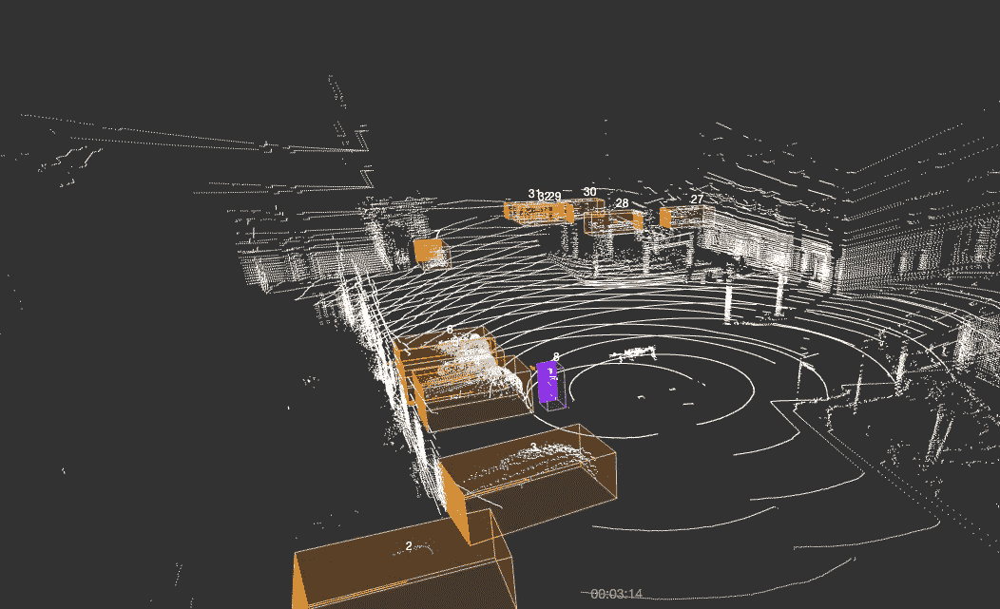

# 案例研究——三维点云中的对象检测标注

> 原文：<https://medium.com/nerd-for-tech/case-study-object-detection-annotation-in-3d-point-cloud-fbc20cba344e?source=collection_archive---------0----------------------->

三维点云中的 ByteBridge 对象检测

在人工智能自动驾驶领域，准确的环境感知和定位是在复杂的动态环境中可靠导航、信息决策和安全驾驶的关键。

这两项任务要求在真实环境中获取和处理高度准确和丰富的数据。为了获得这些数据，无人驾驶车辆或移动测量车辆通常配备有多个传感器，如激光雷达或相机。

激光雷达虽然采用光学原理，但并不依赖于光。可以 24 小时运转，大大增强了感知的适应性。目标的三维检测能力增加了检测的准确性，它可以捕捉静态和动态对象。

这里我们将分享一个 3D 点云中的障碍物检测标注项目。

# **注释指南**

## **标注类型:**

**①人类:**

行人:骑滑板车和平衡车的人被贴上行人的标签。人的标签分为成人、儿童、老人；职业的标签分为交警、送货员、快递员、工人；行人状态标签分为站、走、坐、蹲、卧。

骑自行车的人:摩托车手、自行车手和电动滑板手。

其他人:非真人，如雕塑、假人、卡通人物。

**(2)车辆:**

1.  轿车:SUV、面包车、皮卡车、常见的家庭乘用车。

2.公共汽车。

3.卡车:小型货车和大型货车。

4.工程车:洒水车、带机械手臂的工程车(消防车、挖掘机、其他带手臂的工程车)、垃圾车、油罐车、拖车、其他工程车等。

5.摩托车

6.自行车

7.电动滑板车

8.婴儿车

9.手推车

10.其他车辆

**(3)障碍:**

锥形障碍物、柱状障碍物、桶形障碍物、三角警示牌、石墩、施工警示牌、停车警示牌、道路隔离桩、水上安全护栏、其他障碍物。

**(4)动物:**

常见的动物，如猫、狗、鸡等。

**(5)相关物及附属物:**

与行人相关的东西:行李箱、椅子、垃圾桶。

车辆附件:卡车前门、相当于小型车的迷你门、小型车的门、卡车集装箱门、快运车门、客车门。

**(6)标注规范:**

*   儿童:身高明显比成人矮；没有自主行为能力的学龄前儿童；骑滑板车的孩子被贴上儿童标签；根据与周围成年人的对比，在无法区分的时候，就要贴上成年人的标签。
*   拄着拐杖的老人弯腰驼背是标签标准；如果贴标签的人不能辨别，这个人就被贴上成人标签。
*   交警的判断依据是是否穿荧光服。
*   障碍细分包括锥形障碍、柱状障碍、桶形障碍、三角形警示牌、石墩、施工警示牌、禁止停车标志。
*   当行人推着自行车/电动自行车/摩托车、婴儿车、手推车等时。，贴标签者需要添加人和车辆之间的关系。
*   需要添加行人与其物品之间的关联，例如，推垃圾桶、行李箱、椅子等的人。
*   打开的门需要单独贴上标签。车身内没有标注开门，需要标注车身和开门的关系。

## 标签要求

**(1)标注的范围**

可视区域内所有需要标注的物体，都是正面 150 米以内，其他视角 90 米以内。

通过点云的形状来判断物体。如果点云数量小于 3 点(不含 3 点)，则无需标注。

对于不确定的物体，不要去想象，如果物体按照前后帧还是不确定的，那么就没有必要去标注。

**(2)标签要求**

1.  总体要求

*   可区分的对象需要单独标记，而不是作为一个对象。
*   当点云完整而清晰时，该框应该包括对象的所有点。当点云不完整时，需要通过想象来完成物体的真实大小。
*   两轮/三轮车辆，一辆一辆摆放，清晰可见，也要一辆一辆贴上标签。如果它们在远处连在一起，就把它们标为一个物体。

2.特殊场景的要求

*   行人撑伞:对于一个撑伞的人，工作人员需要将伞和行人一起贴上标签。对于打伞的人，把雨伞和行人一起标签。如果伞外有人，单独标注。
*   行人的坐姿:箱子的高度要根据实际物体的高度来定。
*   人们上下车。当人还在自行车/电动滑板车上时，脚在地上，自行车/电动滑板车和人被分别标记为“人和自行车”；
*   骑自行车/电动滑板车的人，他们的脚不在地上，被称为骑自行车的人。
*   人从自行车/电动滑板车上下来后，双脚着地，与自行车/电动滑板车分开，他/她就被贴上了“人与自行车”的标签。
*   人完全下车后，双脚着地，与车分离(站姿)，人需要单独贴标签。
*   当人的身体有一部分在车上，因而没有完全与车分离时，人和车就应该在一起，贴上“车”的标签。

3.三维盒子

起重机吊臂应与车身分开贴标签。主要部分是车身，其余部分标注为起重机吊臂。方框不得重叠。

对于可弯曲的大型车辆，如拖车和卡车，应单独标记，一个用于拖车，一个用于拖车箱。如果不能分开，就把它们作为一个整体贴上标签。

4.无效数据

以下情况可视为无效数据，无需标注。

点云问题(杂乱/分散/参差不齐)。

停车场/训练场/其他非正常道路场景。

图像中的行人数量太多，太密集，无法进行注释。

## 结束

把你的数据标注任务外包给 [ByteBridge](https://tinyurl.com/ymfkndac) ，你可以更便宜更快的获得高质量的 ML 训练数据集！

*   无需信用卡的免费试用:您可以快速获得样品结果，检查输出，并直接向我们的项目经理反馈。
*   100%人工验证
*   透明标准定价:[有明确的定价](https://www.bytebridge.io/#/?module=price)(含人工成本)

## 为什么不试一试？