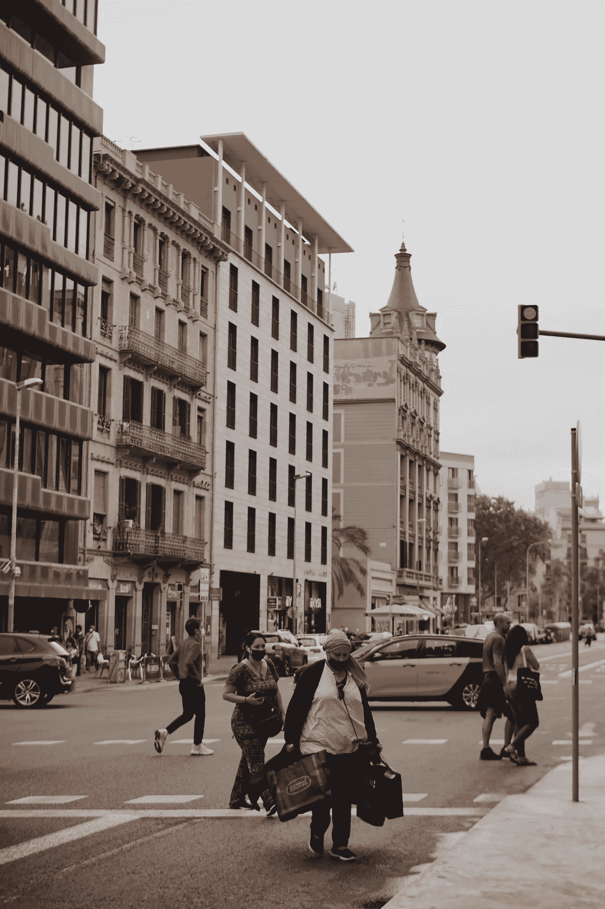
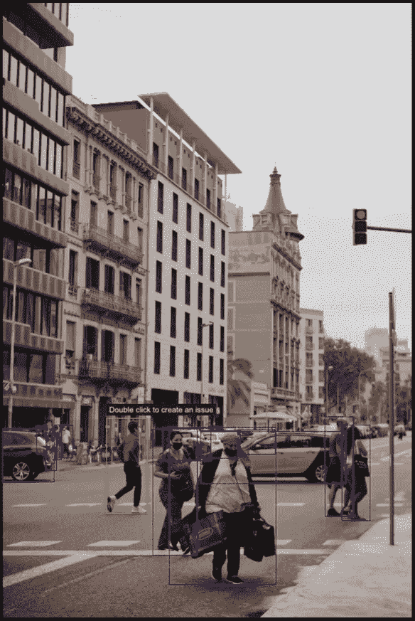
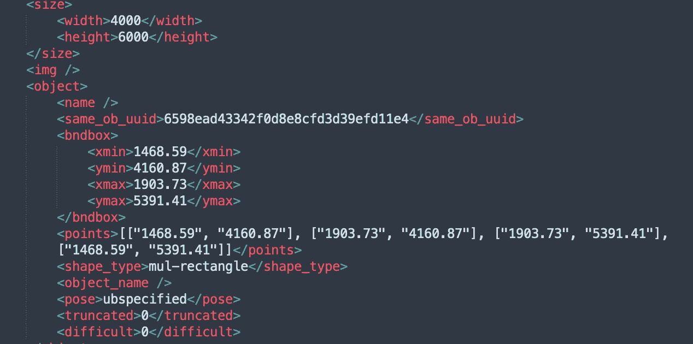

# 自动驾驶行业 2D 物体检测与标注案例研究

> 原文：<https://medium.com/nerd-for-tech/case-study-of-2d-object-detection-and-annotation-in-the-self-driving-industry-7f47cff52b07?source=collection_archive---------4----------------------->

在上一篇文章中，我们谈到了一个无人物流车的数据标注项目。

[2D 自动驾驶行业物体检测标签案例研究](https://bytebridge.medium.com/2d-object-detection-labeling-case-study-in-the-self-driving-industry-c0d59003e0e3)

现在我们继续看 2D 物体探测标记是如何用更多的项目指令来完成的。

## **5。标记目标**

(1)不可移动品类只需要在上路的时候贴上标签；图像中的所有其他障碍物都需要被标记，不管它们是否在路上。

(2)只标注像素尺寸不小于 15 * 15 的目标。

(3)只标注可见比例不小于 1/3 的物体。

注 1:盖下汽车应贴标签，无轮汽车也应根据车型贴标签，轮点不贴标签。

注 2:当车辆打开车门或牵引货物时，只在车身上贴标签，不包括货物、车门和后视镜。

注 4:不要在后视镜和车门(如果车门打开)上贴标签，只在车辆上贴标签。

## **6。连续帧标记和单帧标记**

对于 2D 视觉障碍注记，可以分为连续帧数据集注记和单帧数据集注记。

对于需要连续标注的数据集，有必要确保单个障碍的 ID 在整个数据集中保持唯一。

## **7。夜间注释规则**

(1)夜间的标注规则是基于白天的规则。

(2)列在给定障碍物类型中的物体按要求标记，列在遗漏类别中的物体标记为遗漏。

那些不能被确定为障碍的不需要被标记，那些没有被列在任何给定类型中的障碍被标记为未知。

(3)车模(车身)是障碍物是否需要贴标签的最终标识，灯光只是辅助参考。

(4)不要把模糊到无法确定的物体贴上障碍物的标签。

(5)障碍物被遮挡和被截断的部分应进行标注。

(6)忽略令人眩晕的光线，想象障碍物的完整尺寸。

注 1:对于由于雨、雪和其他原因而从湿相机获得的图像，无论图像质量如何，只要能够确定障碍物的类别，就按要求进行标记。

如果无法确定物体的类别，则将其标记为遗漏，但它必须在路上，如果根本无法识别，则不要标记它。

注 2:对于难以确定是否为障碍物的远处物体，如果在道路范围内，在能够识别其类别的情况下，按要求标注。如果无法识别它们的类别，则将其标记为未知。如果不在道路范围内，则标记为遗漏。

# 您可以手动配置和 ByteBridge 注释

## 只剩三步了

*   使用您的电子邮件登录
*   上传样本
*   告诉我们要贴什么标签:告诉我们最小标签尺寸和您需要的精度。

您可以将需求发送给我们，我们将处理配置工作。

那就轮到我们了。

演示和报价将在工作日不到 24 小时内准备就绪。

## 输出

字节桥 2D 对象检测注释

**JSON 输出**

字节桥 2D 对象检测注释 JSON

## 结束

将你的数据标注任务外包给[字节桥](https://tinyurl.com/rtpnmtus)，你可以更便宜更快的获得高质量的 ML 训练数据集！

*   无需信用卡的免费试用:您可以快速获得样品结果，检查输出，并直接向我们的项目经理反馈。
*   100%人工验证
*   透明标准定价:[有明确定价](https://www.bytebridge.io/#/?module=price)(含人工成本)

## 为什么不试一试？