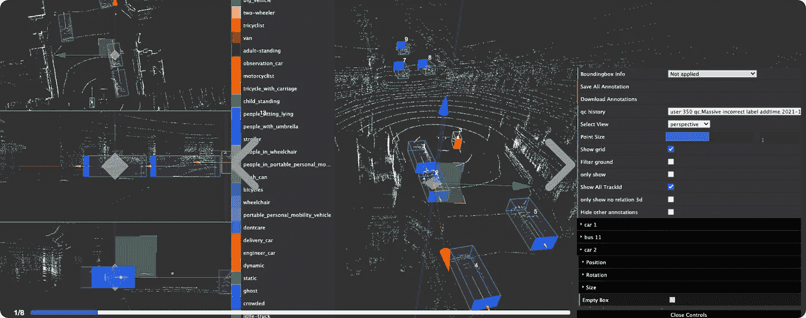
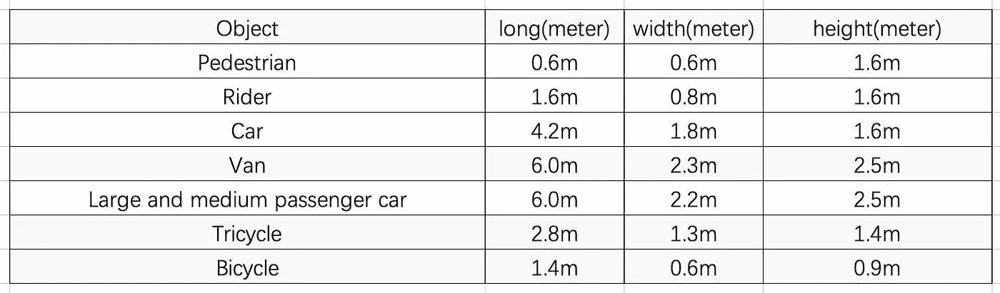
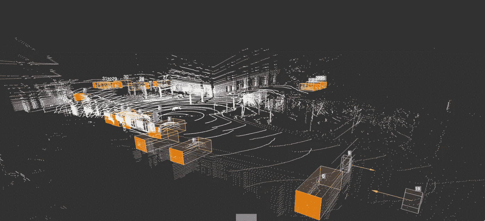
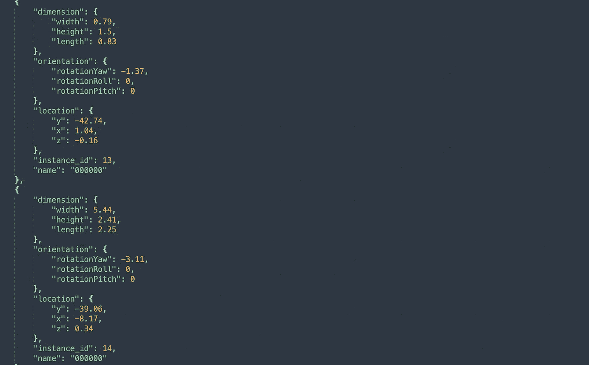

# 三维点云数据注记案例研究

> 原文：<https://medium.com/nerd-for-tech/case-study-of-data-annotation-with-3d-point-cloud-b7d25294f005?source=collection_archive---------0----------------------->

## 激光雷达注记

3D 点云标注用于训练 CV、无人驾驶等 AI 模型。

目前，主流的三维点云标注方法有两种。

**点云标注(连续帧):**

3D 点云连续帧标注在自动驾驶场景中应用最为广泛，对三维空间感知和多帧协同处理能力要求较高。

字节桥点云注记

**点云语义分割标注:**

同一类别中的对象以相同的颜色标记，准确识别行人、汽车和其他对象，并帮助车辆了解道路环境。

字节桥点云语义分割标注

现在让我们来看一个激光雷达点云注记项目。

## **项目基本情况**

**1。注释类别**

有四类。

大车:货车、公交车、工程车(包括消防车、救护车、罐车、垃圾清运车、叉车、吊车等。)、公交车等。

小型车:轿车、跑车、SUV(含越野车)、面包车、MPV、三轮车等。

人:行人，包括各种姿势的人。

某些交通工具上的人:骑摩托车、电动车或自行车的人。

注意:

*   对于骑自行车的人来说，人和自行车应该用两个相互重叠的盒子分别标记。
*   对于车辆上的人，比如站在卡车上，人和车辆都要一一标注。

**2。标签要求**

2.1 如果拖车正在转弯，不要标记 ego 车辆本身的点云以及拖车的点云。

2.2 标注范围:-120m≤x≤120m；-120 米≤y≤120 米

*   用不少于 5 个点云标记车辆
*   点云不少于三个的非车辆和行人

2.3 障碍物应精确装箱，无边界。

2.4 当物体的点云完整时，包围盒的大小应与物体的实际点云一致。

2.5 当点云不完整时，包围盒应与物体的实际尺寸一致。该框应该包括对象的所有点。并且盒子的底部边界应该满足地面的点云。

2.6 尺寸参数的值很重要

*   车辆参数应在标准尺寸内，不允许超过或小于标准参数(点云完整的障碍物除外)。
*   连续两帧中同一障碍物的尺寸误差范围:长 0.5m，宽 0.15m，高 0.15m；障碍物的参数值应该保持不变。
*   前两帧和前三帧允许增加对象的大小(前后数据应在 0.5m 长、0.15m 宽、0.15m 高范围内)，但之后的参数应趋于稳定)。

2.7 对于连续帧中的同一物体，需要保持物体大小不变；贴标机可以考虑复制前面帧中的边界框，以确保一致性。

**3。标注类别的估计点云大小**

**4。对点云盒子属性的要求**

4.1 对于每一个贴标机，每一帧中的一个对象需要保持唯一的 trackID 到最后，编号不重复。

4.2 前一帧和后一帧中的同一物体在数量、方向和类型上应保持一致。

4.3 在三维点云和相应的 2D 图像中，一个障碍物的 ID 应该相同。

## 您可以手动配置和 ByteBridge 注释

**输出**

字节桥三维点云数据注记

**JSON 输出**

ByteBridge 3D 点云数据 JSON 输出

## 结束

把你的数据标注任务外包给 [ByteBridge](https://tinyurl.com/ed5b2t72) ，你可以更便宜更快的获得高质量的 ML 训练数据集！

*   无需信用卡的免费试用:您可以快速获得样品结果，检查输出，并直接向我们的项目经理反馈。
*   100%人工验证
*   透明和标准定价:[有明确的定价](https://www.bytebridge.io/#/?module=price)(包含人工成本)

## 为什么不试一试？