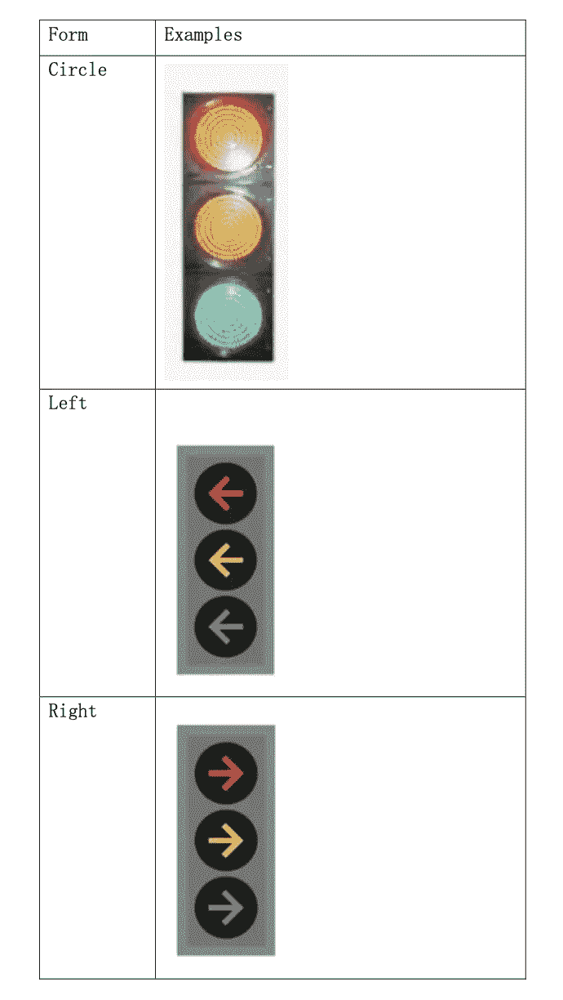
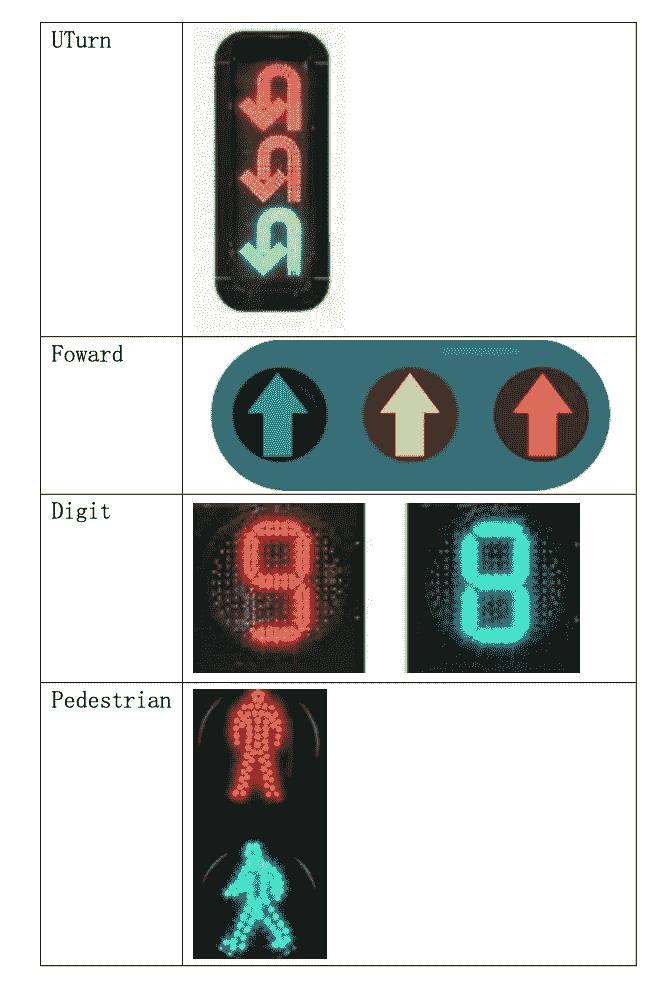
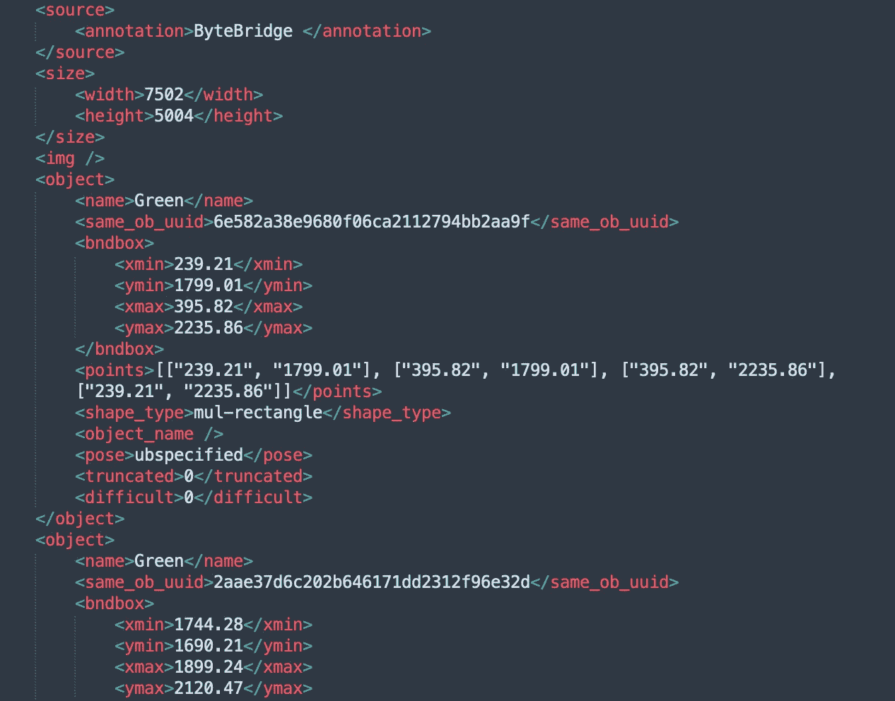

# 交通灯数据标注案例研究

> 原文：<https://medium.com/nerd-for-tech/case-study-of-traffic-light-data-annotation-b0d5ce8682ca?source=collection_archive---------1----------------------->

## “闯红灯”

一家自动驾驶公司进行了无人车测试。在测试过程中，无人驾驶车辆准确地识别了红灯，但系统忽略了该消息，车辆继续穿过路口。没有采取措施，所幸没有造成人员伤亡。在事件中，摄像头识别出红色信号灯，可能是因为处理器认为红灯是前面那辆车的尾灯。

天气、周围车辆尾灯等外界因素。，可能会干扰自动驾驶技术。能够理解交通信号并做出相应的反应，在自动驾驶感知和决策部门发挥着重要作用。前提是有不同场景、天气、类别的红绿灯训练数据。

我们来看一个红绿灯数据标注案例。

## **注释项目基本信息:**

**任务介绍**

对于行驶在道路上的 ego 车辆，它们依靠摄像头传感器来检测和识别红绿灯，需要标注红绿灯的位置和状态进行大规模的数据训练。

前视图中的所有交通灯、便携式交通灯、计时器、道路交通灯、闪烁警告灯、非车辆和交叉路口交通灯都应标有 2D 包围盒。

确保只标注前侧灯，不要标注后侧灯。

**贴标类别**

将交通标志分成不同的类别。具体类别如下所示:

**项目介绍**

1 项目类型:图像注释

2 图像数量:1000 K 以上

3 交货时间:2 个月

4 投放要求:标签低至 5 个像素，准确率不低于 99%。

5 标注动作:包围盒+分类

**基本贴标原则**

交通标志通常由多个子灯组成，甚至可以达到四个。每种光代表一种状态，包括颜色和形状。因此，我们需要给出关于位置和状态的信息，包括:

1 每个交通标志都应标有 2D 边框

2 状态信息标记有多类别描述，从上到下、从左到右显示工作灯的状态。

# 您可以手动配置和 ByteBridge 注释

## **输出**

字节桥交通灯数据注释

**JSON 输出**

字节桥红绿灯数据标注 JSON

## 结束

把你的数据标注任务外包给 [ByteBridge](https://tinyurl.com/muwfhtju) ，你可以更便宜更快的获得高质量的 ML 训练数据集！

*   无需信用卡的免费试用:您可以快速获得样品结果，检查输出，并直接向我们的项目经理反馈。
*   100%人工验证
*   透明和标准定价:[有明确的定价](https://www.bytebridge.io/#/?module=price)(包括人工成本)

## 为什么不试一试？