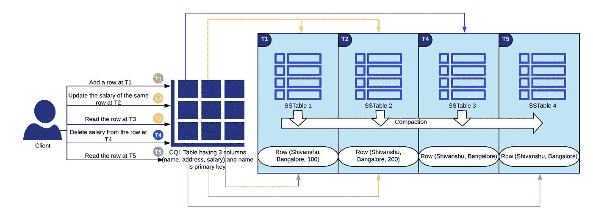
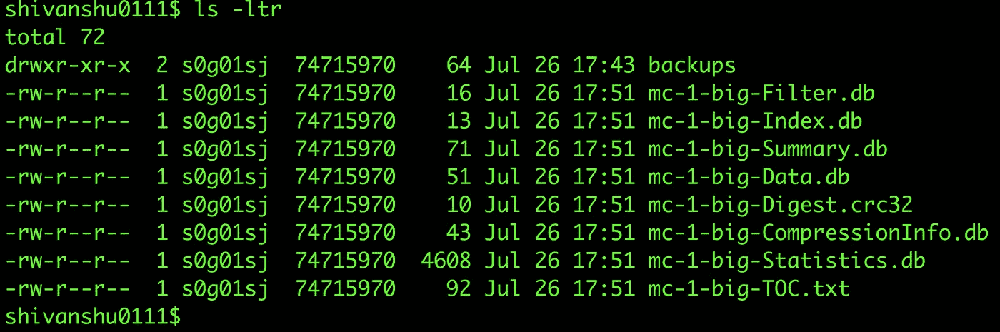
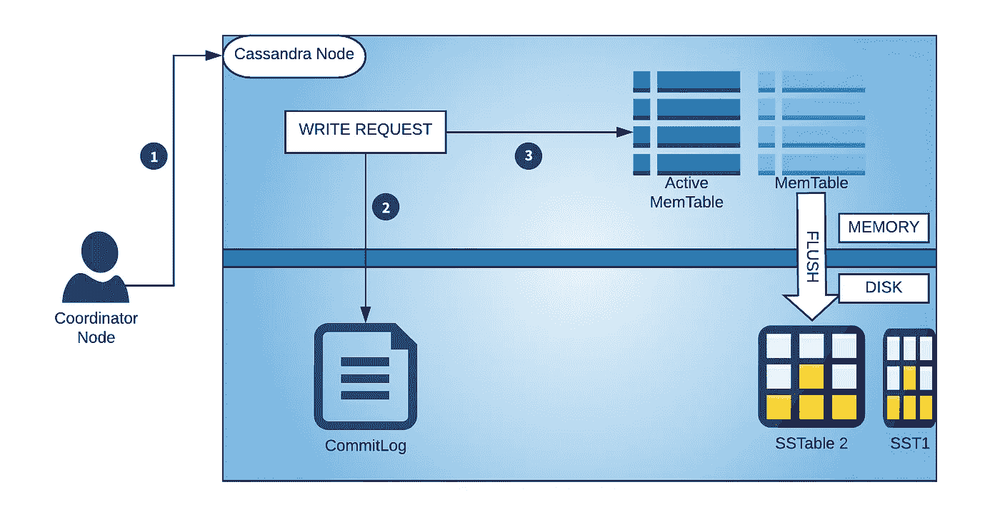
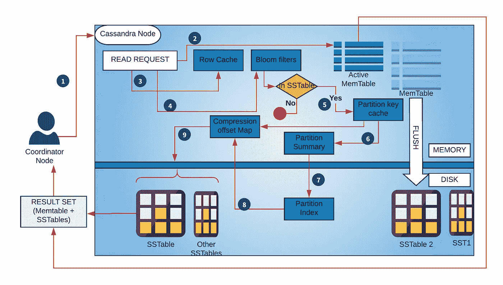

# Cassandra 内部

> 原文：<https://medium.com/nerd-for-tech/cassandra-internals-38e279c72c3e?source=collection_archive---------0----------------------->

在我之前的帖子中，我试图解释 [***如何在 Cassandra 中实现分页？***](/@shivanshugoyal0111/pagination-in-cassandra-b7e45ec2656a) 在这里，我们将看看如何在 Cassandra 中写入、读取、更新和删除数据。Cassandra 是一个水平可伸缩的 NoSQL 数据库。

在讨论 Cassandra 如何维护数据之前，我们首先需要了解一些基本术语:

1.  **CommitLog:** 这是 Cassandra 节点本地所有更改的仅附加日志。任何写入 Cassandra 的数据在写入 memtable 之前都将首先写入 commitlog。它有助于在任何节点出现故障时恢复数据。CommitLog 提供了数据更新操作的优化。Cassandra 不需要将每次更新都刷新到磁盘，而不用考虑万一失败时的数据丢失。你可能想知道 ***如果 Cassandra 必须只将更新写到磁盘，那么为什么不直接写到表呢？***commit log 针对写入进行了优化。与按排序顺序存储行的 SSTables 不同，CommitLog 按 Cassandra 处理更新的顺序存储更新。CommitLog 还将所有列族的**更改存储在一个文件**中，因此当磁盘同时接收多个列族的更新时，它不需要进行大量的搜索。
2.  **内存表:**内存表由 CQL 表维护。它有一个已配置的内存大小，达到该大小后，memtable 将被刷新到磁盘上一个新的 STable。Memtable 是一个**内存缓存**，内容存储为键/列。Memtable 数据按键排序。它也有助于 Cassandra 的读取操作。每个 CQL 表只有一个**活动的**内存表，其他的也可能存在，等待被刷新。
3.  **SSTable:** 它是一个不可变的数据文件，用来在磁盘上永久存储存储数据。每个 CQL 表有一个**活动**表。当一个 memtable 数据被刷新时，一个新的 STable 被创建。一个分区的数据可以跨多个表，一个表可以有多个分区的数据。排序字符串表是一个由键/值字符串对组成的文件，按键排序。一个表可以完全映射到内存中，这允许我们在不接触磁盘的情况下执行查找和扫描。
4.  **压缩:**一个 CQL 表数据是它的 memtable +它在磁盘上的所有 SSTables 的组合。为了有效地从 CQL 表中读取数据，需要将给定 CQL 表的所有表编译成一个表，这是通过一个称为**压缩**的过程完成的。这种压缩何时发生？有 3 种压缩方式: **a)大小分层:**这是 Cassandra 中默认的压缩方式。当您有大量插入、少量读取的工作负载时，最好使用这种策略。 **b) Level tiered:** 它最适合频繁更新现有行的读负载。 **c)时间窗口压缩:**它最适合时间序列数据和 TTL。

在时间 T5，压缩发生，删除表 1，2，3，并创建一个新的表(4)。它还通过减少查找表的数量来帮助 Cassandra 的读取路径。

5. **NTP:** 在这里讨论变得很重要。这是一个[网络协议](https://en.wikipedia.org/wiki/Network_Time_Protocol)用于机器之间的时钟同步。如果未启用，Cassandra 将无法识别行的最新数据。因此，压缩也不能正常工作。

## 详细表格

下面是 SSTable 的快照:

这是 CQL 表目录的快照。它位于 LOC _ TO _ CASS _ DATA/DATA/key space _ name/table _ name/。这些文件都不是可读的，除了 TOC.txt，它包含了 SSTable 的组件列表。

**a)filter . db:**filter 文件存储了行键 bloom filter。它存储在磁盘上，以便[布隆过滤器](https://en.wikipedia.org/wiki/Bloom_filter)在节点重启后激活。

**b) Index.db:** 索引文件包含 SSTable 索引，它将行键映射到数据文件中它们各自的偏移量。行键根据它们的标记按排序顺序存储。每个行键都与一个索引项相关联，该索引项包括其数据在数据文件中的存储位置。

**c) Summary.db:** 摘要文件包含 SSTable 索引的索引摘要和索引边界。指数摘要是根据表指数计算的。它根据索引文件中各自的位置，对相距 **index_interval** (默认 index_interval 为 128) 的行索引进行采样。索引边界包括表索引中的开始和结束行键。

d) Data.db: 这个文件包含实际的数据，所有的行内容都将保存在这里。

e) CompressionInfo.db: 该文件包含压缩元数据信息，包括块大小、压缩数据长度等。

**f) Statistics.db:** 该文件包含有关用于生成分区键的分区的信息、有关估计行键和估计列数的直方图、压缩数据与未压缩数据的比率、创建该表的所有表生成编号的列表等。

## Cassandra 写入路径

Cassandra 的写操作比传统的 RDBMS 数据库快得多。更快写入的原因是其存储引擎。Cassandra 使用**日志结构化合并(LSM)树**，而关系数据库使用 **B+树**数据结构来存储数据。Cassandra 不关心被修改的列的现有值，它完全跳过读取部分，在内存中创建一个记录，包括列和更新的值。然后，它在内存中对插入和更新进行分组，并在附加模式下每隔一段时间将数据顺序写入磁盘。每次刷新时，数据都被写入不可变文件(SSTable ),并且永远不会被覆盖。因此，由于它跳过了对长数据文件的扫描，并再次将数据添加到相同的长数据文件中，因此在 Cassandra 中写入所需的时间明显减少。

客户端与 Cassandra 集群中的一个节点(成为[协调器节点](https://docs.datastax.com/en/glossary/doc/glossary/gloss_coordinator_node.html))连接。协调器节点为数据识别正确的节点集(取决于 CL)。在被定向到特定节点后，数据被写入 commitLog(在磁盘上)，然后相同的数据按照分区键的排序顺序被添加到 memtable(在内存中)。在某个时刻(例如，memtable 已满)，Cassandra 将数据刷新到磁盘上一个新的 SSTable，memtable 和 commitLog 将被清除，以释放空间供重用。

节点内的 Cassandra 写入路径。Memtables 和 STables 仅属于目标 CQL 表。

**Cassandra 中的行更新是如何工作的？**

Cassandra 将每个新行视为一个 [upsert](https://docs.datastax.com/en/glossary/doc/glossary/gloss_upsert.html) :如果新行与现有行具有相同的主键，Cassandra 会将其作为对现有行的更新来处理。数据库中可能存在同一行的多个版本。这就是 Cassandra 在读取过程中执行另一轮比较的原因。当客户机请求具有特定主键的数据时，Cassandra 从一个或多个副本中检索该行的多个版本。具有最新时间戳的版本是返回给客户端的唯一版本(“**最后写入成功**”)。

**在 Cassandra 中，行删除是如何工作的？**

Cassandra 仅将每个删除的行视为 upsert。删除的行将被标记为逻辑删除。Tombstone 是行中的一个标记，表示一列被删除，当压缩发生时，它将从行中删除该列，如第二个图中所述。

## 卡珊德拉阅读路径

Cassandra 读取路径非常复杂，因为路径中包含更多的组件。Cassandra read 是活动 memtable 及其在磁盘上的所有表的结果。在我们进入读取路径之前，我们需要先了解它的所有组件。

1.  **Memtable:** 上面已经描述过了。
2.  **行缓存:**将频繁访问的行存储在缓存中，提高读取性能。行缓存大小是可配置的，要存储的行数也是可配置的。当缓存已满时，它使用 [LRU](https://en.wikipedia.org/wiki/Cache_replacement_policies#Least_recently_used_(LRU)) 回收策略从缓存中回收行。行缓存不是直写式的。如果对该行进行写入，则该行的缓存将失效，并且不会再次缓存，直到该行被读取。
3.  **Bloom Filter:** 用于识别表中是否有行。它存储在**完全脱离堆的内存**中，使用一个新的实现来减轻 JVM 中的垃圾收集压力。它肯定会告诉我们该行是否不存在于任何表中，但是它也会给出误报。
4.  **分区键缓存:**用于存储分区键。如果在缓存中找到分区键，它可以直接转到压缩偏移映射，在磁盘上找到包含数据的压缩块。分区键缓存的大小是可配置的，存储在键缓存中的分区键的数量也是可配置的。
5.  **分区摘要:**用于存储分区索引文件的索引(是实际数据索引的索引)。它驻留在内存中，以识别分区索引的块，从而进行高效读取。
6.  **分区索引:**用于存储所有分区键的索引。它驻留在**磁盘**上。一旦 Cassandra 从分区摘要中获得该块，它就在该块的分区索引中查找，以识别分区键的特定索引。
7.  **压缩偏移图:**用来存储数据在磁盘上的确切位置。它由 ***分区键缓存*** 或 ***分区索引使用。***

**现在，让我们看看读取路径:**

1.  读取 memtable，如果数据可用，则读取它并将其与表中的数据合并。
2.  读取行缓存(如果启用)，如果数据在那里，返回它，否则转到下一步。
3.  检查 bloom-filter，如果它说数据不存在，只返回 memtable 数据(如果找到的话)。如果它说，SSTable 中存在数据，则进入下一步。
4.  读取分区键缓存(如果启用)，如果在缓存中找到分区键，则读取缓存中找到的值的压缩偏移映射，以获得数据在磁盘上的确切位置。假设在缓存中找不到分区键，请转到下一步。
5.  读取分区摘要缓存，它告诉分区索引数据的索引。
6.  从分区摘要中读取偏移量，以找到磁盘上包含数据的压缩块。
7.  使用压缩偏移映射定位磁盘上的数据。
8.  从磁盘上的表中获取数据。

单个 Cassandra 节点中的 Cassandra 读取路径

与 Cassandra 合作时，需要记住以下几点:

1.  复制因子必须大于 1。 **3** 是生产集群的推荐射频。
2.  检查压缩、压缩、布隆过滤器和缓存设置，并根据您的要求进行配置。
3.  为群集设置一致性级别，可以根据使用情形在客户端为每次写入和读取设置一致性级别。
4.  确保容量应该是总可用容量的最大利用率的一半。

感谢阅读！