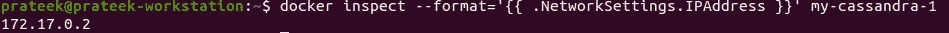
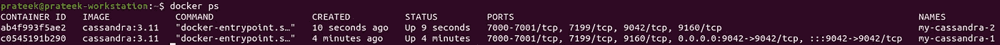
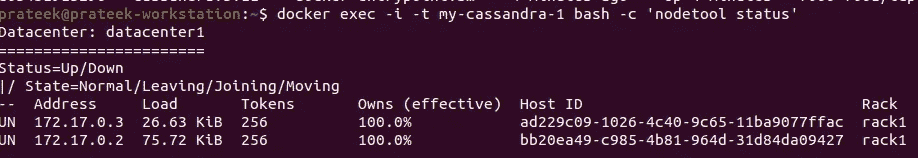

# 使用 docker 在单个主机上设置多节点

> 原文：<https://medium.com/nerd-for-tech/cassandra-multinode-setup-on-a-single-host-using-docker-fe3d8b844f52?source=collection_archive---------7----------------------->

这个帖子不是关于卡珊德拉数据库的细节。相反，它致力于如何使用 docker 在一台主机上启动 cassandra 的多节点设置。对于个人项目，让每个人都有多个主机系统来理解 NoSQL 多 DC 场景，这实在是不可行或负担不起的。

# 步伐

我假设您的系统中已经安装了 docker。

# 假设有一个新的开始

检查 docker 实例

# *创建第一个节点—暴露在端口 9042 上*

> *>*docker run-p 9042:9042—name my-Cassandra-1-m 2g-d Cassandra:3.11

# 检查 IP

使用上面的命令检查容器的 ip

> > docker inspect—format = ' { { . network settings . IP address } } ' my-Cassandra-1

# 创建另一个节点并链接到 prev 节点—暴露在端口 9043 上

> > docker run—name my-CASSANDRA-2-m 2g-d-e CASSANDRA _ SEEDS = " $(docker inspect—format = ' { { . network settings . IP address } } ' my-CASSANDRA-1)" CASSANDRA:3.11

# 检查 cassandra 节点状态

> > docker exec-I-t my-Cassandra-1 bash-c '节点工具状态'

# 通过客户端 cqlsh 使用 cassandra

> 通过客户端 cqlsh
> >docker run-it—link my-Cassandra-1—RM Cassandra:3.11 bash-c ' exec cqlsh<<IP>>'

在另一个 docker 容器中使用 cqlsh 客户端来处理数据库

就是这样。在一台主机上安装多节点就是这么简单。