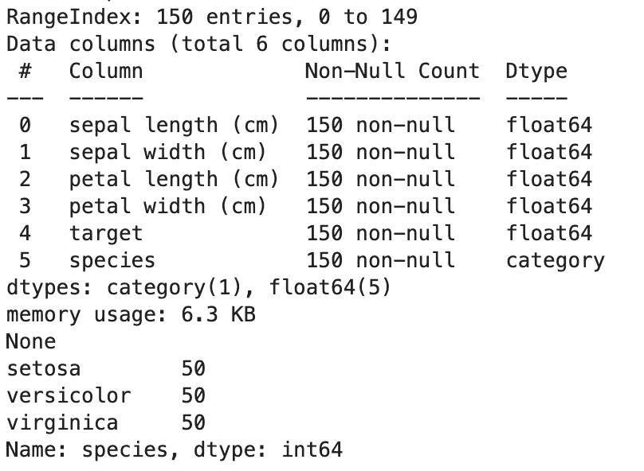
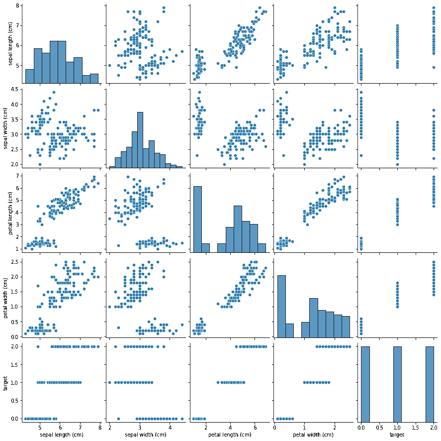
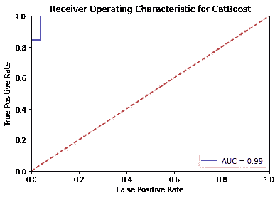
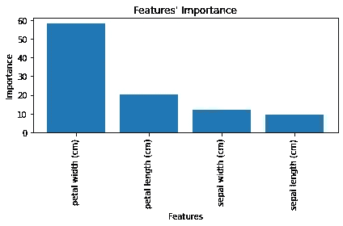
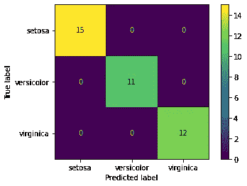
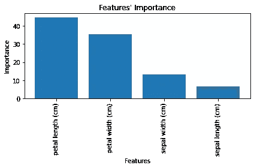
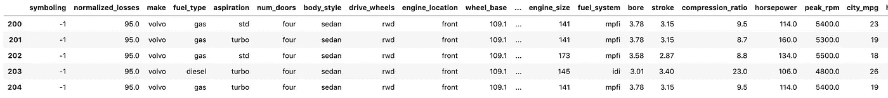
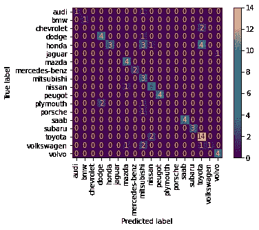
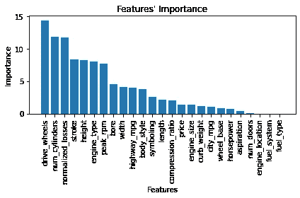

# CatBoost 快速入门— ML 分类

> 原文：<https://medium.com/nerd-for-tech/catboost-quickstart-ml-classification-f1d7fb70fea8?source=collection_archive---------0----------------------->

最近，我一直在利用 [CatBoost](https://catboost.ai/) Python 库来创建真正成功的分类模型。我想提供一些快速跟进指南，以掌握基本知识。

在本文中，我将描述三个使用 CatBoost 的例子，来制作:一个二元分类器；多项式分类器；最后是使用分类数据和数字数据的多项式分类器。

[Github 来源](https://github.com/sk-t3ch/catboost-quickstart)。查看 https://t3chflicks.org了解更多内容！

# 分类

统计模型可以从具有已知分类的电子邮件数据中导出。然后，这些模型可用于对新的观察结果进行分类，并且该过程可以自动化。分类问题的一个常见例子是识别*垃圾邮件*与*非垃圾邮件*电子邮件。这就是所谓的**二元分类**。电子邮件数据包括许多功能，如收件人和，可用于帮助识别它是这些分类中的一种。

# 决策树

决策树可用于创建分类模型:

> [维基百科](https://en.wikipedia.org/wiki/Decision_tree_learning):决策树**是一个**决策**支持工具，它使用类似**树**的**决策**及其可能结果的模型，包括偶然事件结果、资源成本和效用。这是显示只包含条件控制语句的算法的一种方式。**

这种技术虽然有用，但可以通过梯度增强变得更加精确:

> [维基百科](https://en.wikipedia.org/wiki/Gradient_boosting) : **梯度推进**是一种用于回归和分类问题的机器学习技术，它以弱预测模型的集合的形式产生预测模型，通常是决策树。

# CatBoost

[CatBoost](https://catboost.ai/) 是基于梯度推进决策树的开源算法。它支持数字、分类和文本特征。查看[文档](https://catboost.ai/docs/features/categorical-features.html#dataset-processing)。

> *代码随笔记本一起:*
> 
> [🔗Github 上的 CatBoost 快速入门笔记本📔](https://github.com/sk-t3ch/catboost-quickstart)

# #1 二元分类

在本节中，我们将在鸢尾植物数据集上创建一个二元分类器，该数据集包含三个物种，每个物种有四个参数(花瓣长度、花瓣宽度、萼片宽度、萼片长度)。

熊猫数据帧中的鸢尾花数据集，随后是物种的值计数

我们将使用 CatBoost 库创建一个二元分类模型，以区分*和*之间的差异。

## 获取数据

首先使用来自 [sklearn 库](https://scikit-learn.org/stable/user_guide.html)的虹膜数据集:

## 看着这些数据

使用[海运库](https://seaborn.pydata.org/introduction.html)，我们可以检查每个变量的配对图数据。Iris 数据集包含三个物种的相同数据点。通过观察，可以看到*物种*和*目标*的图表显示了相等的三等分。这是一个确定分类器的简单数据集。

## 训练模型

这里的分类问题是区分*海滨锦葵*和*非海滨锦葵的样品。*此类问题的模型参数需要使用 *LogLoss* 损失函数。

## 模型的结果

提取评估数据集的预测结果，并与真实值进行比较，生成以下图表:

ROC 图显示了这个小数据集的近乎完美的分数。

提取特征的相对重要性向我们表明，花瓣宽度比分类器中的任何其他特征重要两倍以上。

# #2 多项式分类器

现在我们可以区分一个*海滨锦葵*，我们将通过创建一个多项式分类器来区分多个物种。

## 训练模型

CatBoost 处理任何困难的工作，我们只需要更新损失函数来使用*多类:*

## 模型的结果

提取评估数据集的预测结果，并与真实值进行比较，生成以下图表:

这些结果的混淆矩阵表明该模型是完全准确的。

提取相对重要性，该图显示花瓣长度现在比分类器中的任何其他特征更重要。

# 具有分类特征的#3 多项式分类器

## 获取数据

另一个具有大量分类特征的数据集是来自 [UCL 机器学习](https://archive.ics.uci.edu/ml/index.php)的汽车数据集。

## 训练模型

现在的分类问题是区分不同的汽车品牌，例如*阿尔法罗密欧*。我们必须定义我们的分类特征，例如 CatBoost 参数中的*引擎位置*。

## 模型的结果

提取评估数据集的预测结果，并与真实值进行比较，生成以下图表:

混淆矩阵显示，这个模型是最准确的，约 74%的值正确预测。然而，对于这样一个小样本的数据，我们不能太确定。

从提取的特征重要性中得到的一个有趣的注意是，价格不能很好地预测汽车品牌。

# 参数调谐

CatBoost 声称有很好的默认值，我们已经看到它在两个不同的数据集上相当成功。为了最大限度地利用您的模型，您必须更改参数。我推荐看一下 [CatBoost 网站的说明。](https://catboost.ai/docs/concepts/parameter-tuning.html)

# 感谢阅读

我希望你喜欢这篇文章。如果你喜欢这种风格，就去看看[T3chFlicks.org](https://t3chflicks.org/)的更多科技教育内容吧( [YouTube](https://www.youtube.com/channel/UC0eSD-tdiJMI5GQTkMmZ-6w) 、 [Instagram](https://www.instagram.com/t3chflicks/) 、[脸书](https://www.facebook.com/t3chflicks)、 [Twitter](https://twitter.com/t3chflicks) )。