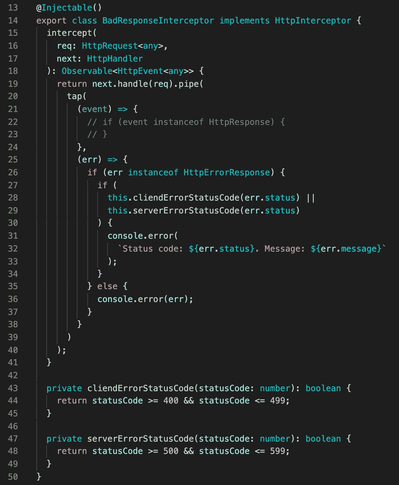
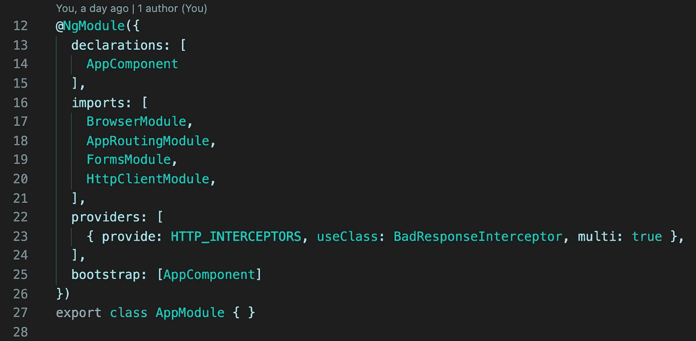

# 捕捉 Angular 中的每个请求错误

> 原文：<https://medium.com/nerd-for-tech/catch-every-request-error-in-angular-da6d76225da6?source=collection_archive---------1----------------------->

## HTTP 拦截器

angular 中的简单请求是这样的。您注入了一个 HTTP 客户端，订阅了 GET 或 POST 请求，当然，您还创建了一个错误处理程序。

一个简单的项目可能有 50-200 个请求订阅。想象一下，现在您需要记录请求中的每个错误。你怎么做到的？

嗯，您可以为每个错误处理程序添加一个新的日志逻辑。这个计划会花很多时间，但会成功的。该计划的问题是，当您进行新的请求订阅时，您需要在错误处理程序中放置一个日志记录逻辑。你可能会忘记做那件事。

相反，我们可以创建一个拦截器，通过检查它的状态代码来分析每个响应。

我们需要在提供者部分的主模块中添加这个拦截器。

从现在开始，我们所有的请求都将通过这个拦截器。

如果你需要仔细看看这个项目[，这里是链接](https://github.com/8Tesla8/bad-response-interceptor)。

*原载于 2022 年 1 月 12 日*[*【http://tomorrowmeannever.wordpress.com】*](https://tomorrowmeannever.wordpress.com/2022/01/12/catch-every-request-error-in-angular/)*。*