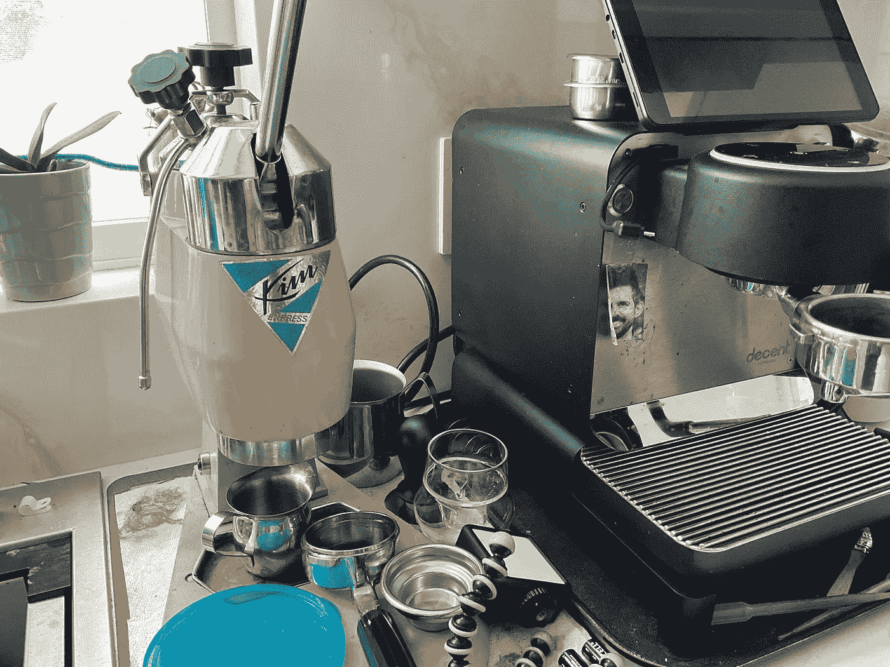
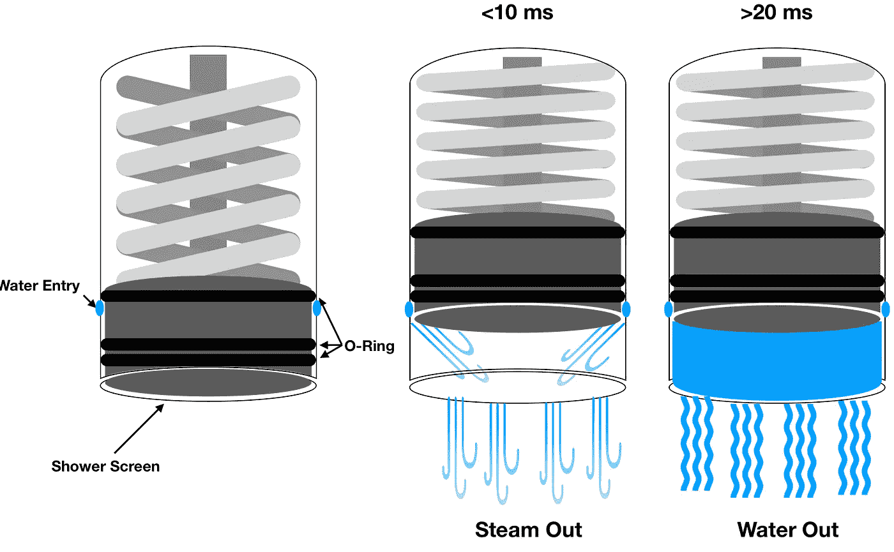
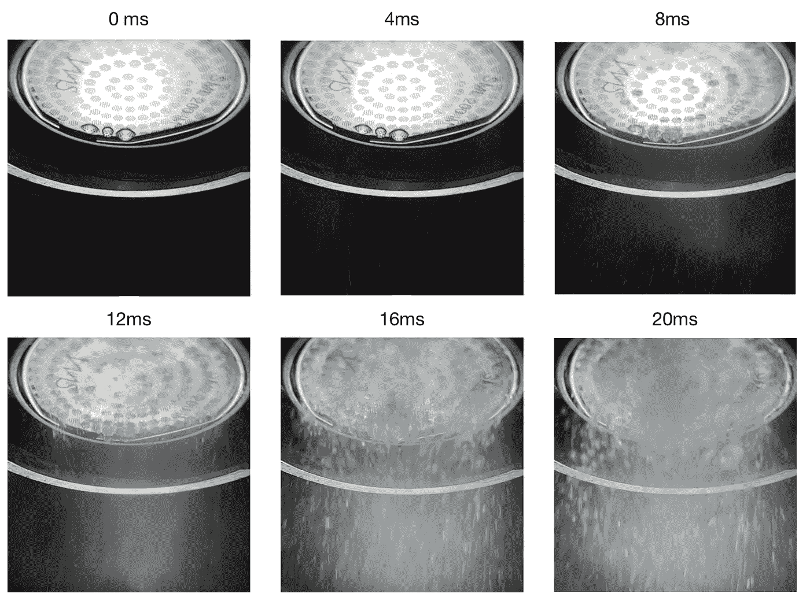
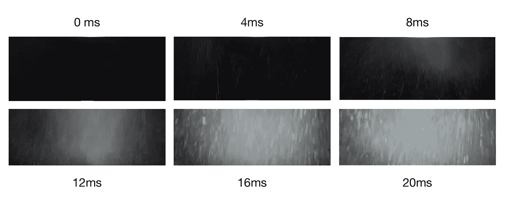
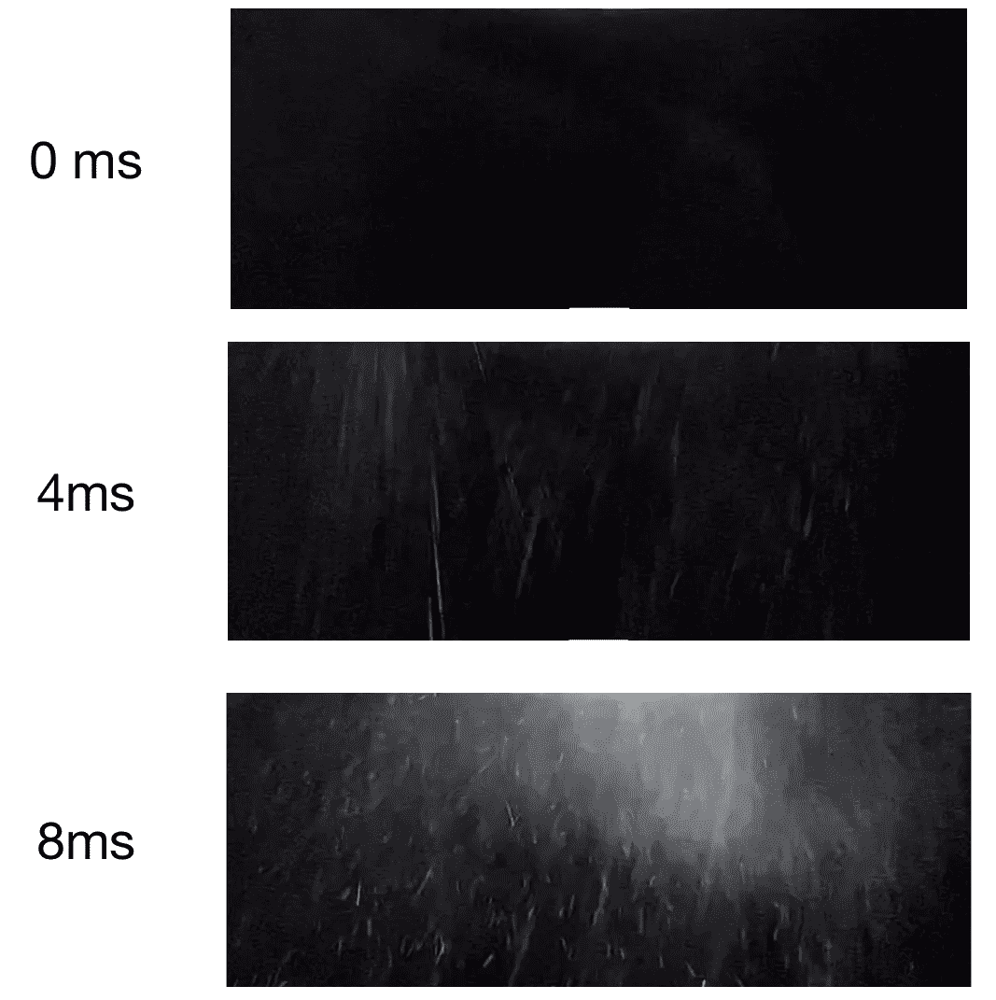

# 在浓缩咖啡中捕捉咖啡喷嚏

> 原文：<https://medium.com/nerd-for-tech/catching-the-coffee-sneeze-in-espresso-c6053ca55719?source=collection_archive---------2----------------------->

## 咖啡数据科学

## 请给我一张纸巾。

在比较了我那台像样的浓缩咖啡机和 Kim Express 之后，我开始想 Kim 是什么让这台机器如此独特。主要参数是水温，但机器设计中还有其他东西可以提供线索。

所有图片由作者提供

Kim 可以在比 DE 高 10°C 的水温下运行。金的最大范围是 123 摄氏度到 127 摄氏度，我发现[范围 116 摄氏度到 120 摄氏度](https://towardsdatascience.com/water-temperature-for-espresso-1abe656b54d3)是浓缩咖啡的最佳选择。

在这个温度下，当一个人开始击球时，水立即蒸发，直到冰球被加压。这使得咖啡在水流开始之前被蒸了一会儿。这是因为 Kim Express 作为杠杆机器的设计。

当杆被按下时(允许水进入腔室)，淋浴帘上方的腔室处于或低于 1 巴的压力。当水进入容器时，它首先变成蒸汽，直到容器被加压，并将蒸汽射入冰球，我发现这会导致[咖啡打喷嚏](/geekculture/the-coffee-sneeze-in-espresso-b759aeb8d825)。

一旦冰球被加压，金的主要优势是水温高。所以我想看看我是否能通过了解金的作用来复制这种作用。

# 打喷嚏有多快？

对于 DE，我可以使用 100 摄氏度以上的水，如果我使用足够慢的流速，它会在拍摄开始时大部分变成蒸汽。然后我想确定这对金来说发生得有多快。

我以 240 fps 或每 4 ms 左右 1 帧的速度拍摄了一些慢动作视频。根据这些视频，喷嚏持续 12 毫秒或 0.012 秒。

从这些画面中，我剪切了淋浴屏幕，这样你可以更好地看到水蒸气。

即使那样，也很难看清，所以我调整了对比度。

我目前正在以 0.2 毫升/秒的流量，在 10 巴的压力下，在最高机器水温(105 摄氏度)下进行 3 秒钟的实验。这是非常有趣的，因为这少量的蒸汽消除了典型的侧沟，这种侧沟导致了从过滤器底部看到的甜甜圈效应。

如果你愿意，可以在推特、 [YouTube](https://m.youtube.com/channel/UClgcmAtBMTmVVGANjtntXTw?source=post_page---------------------------) 和 [Instagram](https://www.instagram.com/espressofun/) 上关注我，我会在那里发布不同机器上的浓缩咖啡照片和浓缩咖啡相关的视频。你也可以在 [LinkedIn](https://www.linkedin.com/in/dr-robert-mckeon-aloe-01581595) 上找到我。也可以关注我在[中](https://towardsdatascience.com/@rmckeon/follow)和[订阅](https://rmckeon.medium.com/subscribe)。

# [我的进一步阅读](https://rmckeon.medium.com/story-collection-splash-page-e15025710347):

[我未来的书](https://www.kickstarter.com/projects/espressofun/engineering-better-espresso-data-driven-coffee)

[我的链接](https://rmckeon.medium.com/my-links-5de9eb69c26b?source=your_stories_page----------------------------------------)

[浓缩咖啡系列文章](https://rmckeon.medium.com/a-collection-of-espresso-articles-de8a3abf9917?postPublishedType=repub)

工作和学校故事集