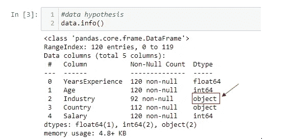
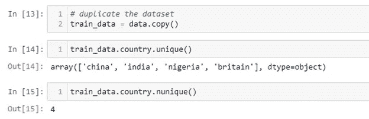
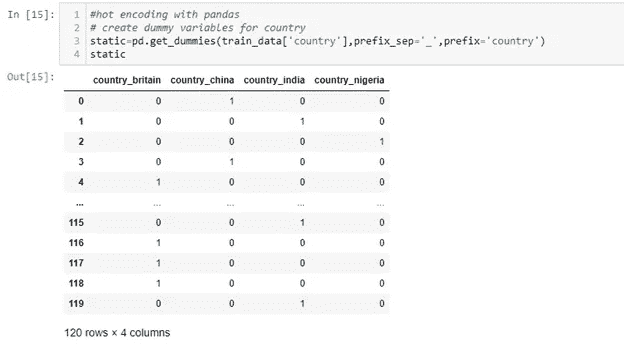
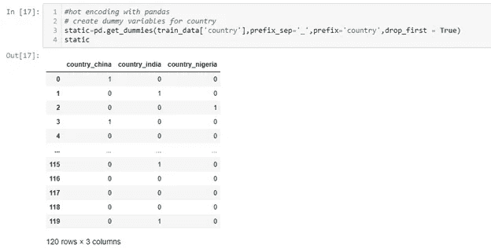
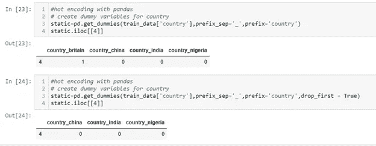
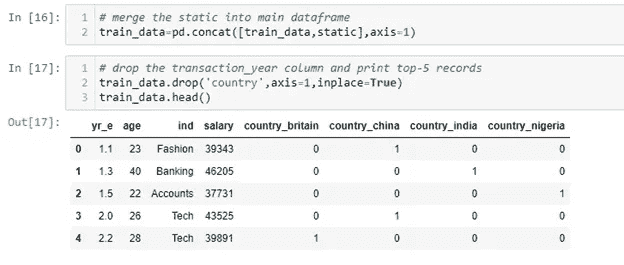
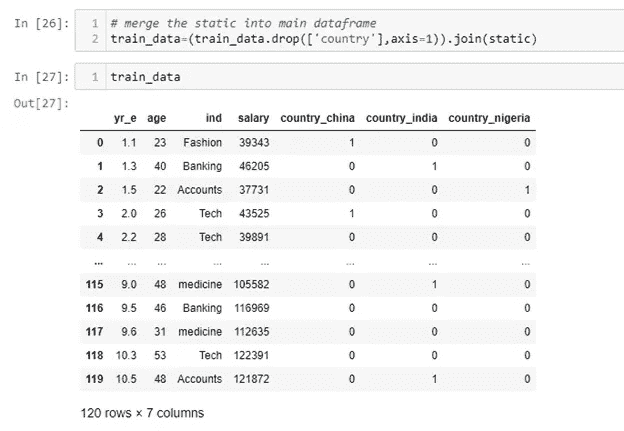

# 熊猫的分类编码:get_dummies

> 原文：<https://medium.com/nerd-for-tech/categorical-encoding-with-pandas-get-dummies-8feebc7d5e75?source=collection_archive---------7----------------------->

在这篇文章中，我们将看看一个非常强大而简单的熊猫分类编码技术。

简单来说，Pandas 是一个用于数据帧操作的计算库。

在数据处理管道的数据争论阶段，对分类变量进行编码非常重要，如果不是至关重要的话。这是因为机器学习模型是使用算法处理数字数据类型的数学模型，而神经网络也处理数字数据类型。

这就是为什么，我们需要编码方法将非数字数据转换成有意义的数字数据。为此我们来看看熊猫弄 _ 假人的方法。

get_dummies 是实现 hot 编码方法的最简单的方法之一，它有非常有用的参数，我们将提到其中最重要的参数。

您可以使用 get_dummies 在一行中执行热编码。

我们将在这个演示中使用一个工资数据集，在此下载。

这一数据科学流程的目标是根据其他特征预测个人的工资。我们将对这些数据使用线性回归，但这些数据还没有准备好用于机器学习模型。如果我们如何确定这一点，我们将使用 pandas info()方法对数据进行描述性查看。

Pandas 使用 object 数据类型来表示分类变量/列，因为有分类(非数字)列，我们需要转换它们。

为此，我们将实现 get_dummies。

get_dummies 所做的是，它为我们指定的每个目标列创建一个独热编码矩阵，但是标签编码呢，什么时候使用哪个用于哪个呢？

**我们应用 OHE(一个热编码):**

当标签编码中彼此接近的值对应于不接近的目标值时(非线性数据)。

当分类特征不是序数时(狗、猫、老鼠)。

**我们应用标签编码(Le)当:**

范畴特征是序数(Jr. kg，Sr. kg，小学，高中等)。

我们上车吧！

由于我们有两个分类列，我们需要分别对它们进行编码。

让我们从国家列开始:

首先，我们复制我们的数据，然后我们检查国家列中的唯一值

“country”列有 4 个唯一值，这意味着在应用 get_dummies()后我们将得到 4 列。

使用这种语法，我们可以将 get_dummies 应用于一列 dataframe

*static = PD . get _ dummies(train _ data[' country ']，prefix_sep='_ '，prefix='country')*

**static** =保存新数据帧的变量名

**train _ data[' country ']**=数据集中的目标分类列

**prefix_sep** =干净列名的前缀分隔符参数

**前缀** =新列的前缀值

正如你所看到的，在 get_dummies()之后我们得到了一个 4 列的数据帧，有 120 行。

我们可以看到列名是来自 train_data country 列的值。

唯一值用于形成新列，并使用 1 和 0 矩阵与其他值(现在的列)相关联。

【drop _ first = True 参数的虚拟对象

drop_first=True 参数的虚拟对象可用于删除第一列。这给我们留下了 3 列。通常这个参数的默认值是“假”，我们只是将其设置为“真”。让我们看看它是如何工作的。

*static = PD . get _ dummies(train _ data['国家']，prefix_sep='_ '，prefix= '国家'，drop_first = True)*

它删除 get_dummies()数据帧的第一列。“静态”列的第一列是 country_britain。如果国家是**英国**，所有列都是 0。当所有列都为 0 时，模型知道国家是英国。

看看下面的例子。

我们的原始数据帧 train_data 保持其形状。我们必须合并这些数据帧。

我们可以使用 join 或 concat 以两种方式合并它们。

**串联:**

我们将使用 concat 方法将 static 和 train_data 连接到一个数据帧中，然后删除“country”列，我们不再需要它，因为它不是数字。

我们通过声明 axis=1 来连接列，这将并排放置我们的数据帧。

消除垂直堆叠的误差，增加行并产生缺失的列和离群值。

**加入:**

我们可以使用 join 方法将它们合并到数据框中，但是我们应该像 concat 一样删除“country”列，因为它不是数字。

我们将通过声明 axis=1 来连接列，这将并排放置我们的数据帧。

所有列都是数字。我们的数据现在已经为模型准备好了。

**结论**

Pandas get_dummies 是一种令人惊叹的热编码技术，可以在建模之前对数据进行处理。这可以说是最简单的方法，它有许多参数，使我们的模型更可读，更平滑。