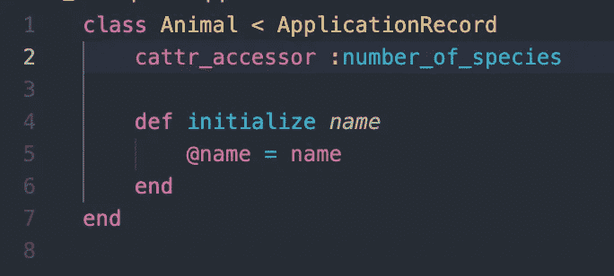
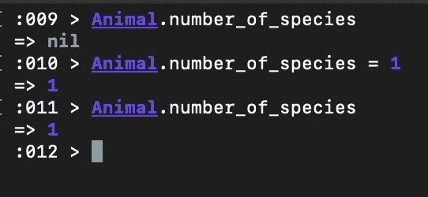
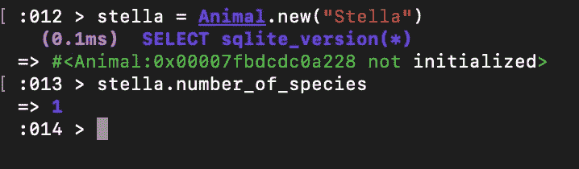
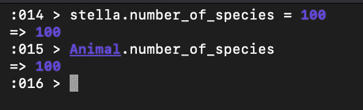
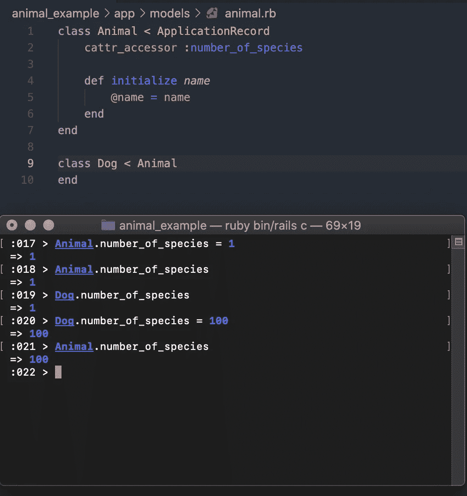

# Rails 中 cattr _ accessor vs class _ attribute

> 原文：<https://medium.com/nerd-for-tech/cattr-accessor-vs-class-attribute-in-rails-7aa8a7a0c258?source=collection_archive---------0----------------------->

照片由[内森·杜姆劳](https://unsplash.com/@nate_dumlao)通过[unsplash.com](https://unsplash.com/photos/ewGMqs2tmJI)拍摄

几周前，我偶然发现一些代码使用了一些我从未见过的 rails“魔法”。代码使用了一种叫做`cattr_accessor`的东西。我不确定这是什么，也不知道它是如何工作的，但我知道我想了解更多。

原来,`cattr_accessor`实际上只是类属性访问器的简称。在阅读这些类属性访问器时，我学到了另一种访问类属性的方法:`class_attribute`。如果你和我一样，你可能想知道为什么有两种不同的方法来访问类属性？

为了回答这个问题，我决定做一些研究，并写这篇文章来帮助巩固这种内在的学习，并希望帮助其他人理解这种差异。

# cattr _ 访问器

首先，让我们看看`cattr_accessor`及其工作原理。根据 [API Dock](https://apidock.com/rails/Class/cattr_accessor) 本，

> “为类属性定义类和实例访问器”。

*快速补充说明，* `*cattr_accessor*` *实际上只是* `*mattr_accessor*` *的别名，但是我更喜欢使用* `*cattr_accessor*` *，因为在我看来它作为一个类属性访问器更容易识别。使用时可用的选项列表可以在* [*这里*](https://apidock.com/rails/Module/mattr_accessor) *找到。*

太好了，但这意味着什么？我喜欢通过这样做来学习，让我给你看一个例子。

这是我建立的一个非常简单的类，叫做 Animal。动物可以有名字，动物类有属性`number_of_species`。`cattr_accessor`允许我们在类或实例级别获取和设置这个属性。下面是这些不同交互的例子。

获取和设置类级别的物种数量。

获取实例级别的物种数量。

在实例级别设置物种数量。

正如您所看到的，实例`Animal`和类`Animal`可以获取和设置相同的属性。很酷吧？我想是这样的，但是如果你在一个将被任何其他类继承的类中使用它，就有一个很大的警告，如下所示。

子类可以改变父类属性。

`number_of_species`类属性既可以由 Animal 类设置，也可以由 child Dog 类设置，但是没有显示任何一个实例设置它的能力。如果你想严格遵循 OOP 原则，那么你会想避免这一点，因为让孩子修改父类是一个大禁忌。

# 类别属性

如果你想避免上面的陷阱，我建议你使用`class_attribute`来代替。`class_attribute`允许这个属性被子类继承，但是当子类设置那个类属性时，它只为那个类设置，父类属性保持不变。

让我们用上面的同一个例子来看看这一点。

如果直接设置，class_attribute 允许继承的类有单独的类属性值。

利用`class_attribute`而不是`cattr_accessor`允许子类继承它们的父类属性，但是如果需要的话，在不改变它们的父类的情况下覆盖它们。

如果你在一个小项目中工作，或者在你的一个类中没有使用继承，或者由于某种原因需要一个子类来改变一个父类，那么`cattr_accessor`就是为你准备的。否则，我会推荐默认为`class_attribute`作为一种保守的方法，只有在必要时才重构为`cattr_accessor`。

希望现在您已经对这两个类属性访问器如何工作以及何时使用它们有了更好的了解。我很乐意在下面的评论中听到你们使用`cattr_accessor`多于`class_attribute`的次数。我想不出任何好的例子来说明什么时候这样更好，但是必须有一个用例，否则 rails 可能不会把它包含在他们的“魔法”中！