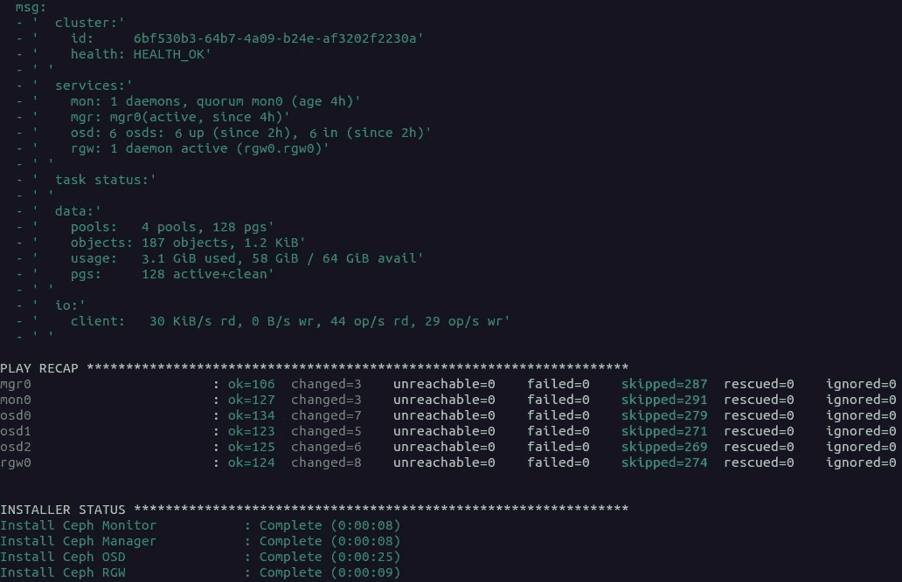

# Ceph-Ansible 部署和测试(第 1 部分)

> 原文：<https://medium.com/nerd-for-tech/ceph-ansible-deployment-testing-using-vagrant-8205a9f39f2d?source=collection_archive---------7----------------------->


# 什么是 Ceph，为什么是 Ceph？

简而言之，Ceph 是一个开源的软件定义存储(SDS)解决方案，用于从单个系统提供高度可扩展的基于对象、数据块和文件的存储。

Ceph 旨在成为一个多用途的分布式软件，更是一个“一站式解决方案”,以克服一般企业的数据中心架构的横向扩展观念。

Ceph 集群可以将这些基本节点以及更多节点组合在一起:

*   **监视器** (MON)维护集群节点状态图。
*   **管理器** (MGR)与监控器一起运行，守护进程&提供外部监控和管理接口。
*   **元数据服务器** (MDS)存储集群的元数据，主要用于基于文件的存储。
*   **对象存储设备** (OSD)，实际存储驱动器。

在使用 Red Hat 的 Ceph 存储时，我研究了许多可用于使用和部署 Ceph 的部署，主要用于测试目的。到目前为止，可用部署的列表相当大，包含 7 个不同的部署选项。

Ceph-Ansible 是当今最著名和最流行的部署之一。Ceph-Ansible 部署以其多功能性而闻名，可以轻松地更新和升级使用的集群。

在这个由两部分组成的演示中，我将重点介绍 Ceph-Ansible 部署方法，并演示我们如何使用 vagger & Virtualbox 作为提供者，轻松地执行各种日常任务，例如 Ceph 的主要组件配置。

在这个过程中，我将部署 Ceph-ansible (Nautilus)的上游版本，使用社区项目的 Github 存储库的稳定版本 4.0。

## 先决条件:

*   RHEL 8
*   流浪者 2.2
*   虚拟盒子 6.1
*   Ansible 2.9

> *在此过程中，下面提到的虚拟机部署了 1GB 内存。*

首先，将使用这些节点部署群集。

*   1 个月
*   3 个 OSD
*   2 名 rgw
*   1 MGRs

## 部署

```
$ git clone [https://github.com/ceph/ceph-ansible.git](https://github.com/ceph/ceph-ansible.git)
$ cd ceph-ansible
$ git checkout stable-4.0
```

在将社区存储库克隆到我们的主机上之后，创建一个“vagger _ variables _ yml”文件的副本，并更改以下内容:

```
$ cp vagrant_variables.yml.sample vagrant_variables.yml
$ cp site.yml.sample site.yml
$ vim vagrant_variables.yml
```

在本文的开始，我们想要部署上面提到的虚拟机。我们应该如下更新流浪者变量文件(不需要编辑任何其他的。):

```
mon_vms: 1 
osd_vms: 3 
mds_vms: 0 
rgw_vms: 1 
nfs_vms: 0 
grafana_server_vms: 0
rbd_mirror_vms: 0 
client_vms: 1 
iscsi_gw_vms: 0 
mgr_vms: 1
```

现在，我们的浮动变量文件已经根据我们的需求设置好了，我们可以通过编辑“groups_vars/all.yml”文件开始设置我们的 Ceph 配置，如下所示:

```
---
ceph_origin: repository
ceph_repository: community
ceph_stable_release: nautilus
public_network: "192.168.42.0/24"
cluster_network: "192.168.43.0/24"
monitor_interface: eth1
devices:
  - '/dev/sda'
  - '/dev/sdb'
dashboard_enabled: False
```

编辑完所需的文件后，从 ceph-ansible 文件夹中运行下一个命令来启动集群部署:

```
[root@RHEL ceph-ansible]# vagrant up --provision
```

这个配置为 OSD 的守护进程部署了一个带有 LVM 方法的 Ceph Nautilus 上游版本。如下图所示，该配置包含 3 个 OSD 虚拟机，每个虚拟机包含 2 个 OSD，因此它是一个 6 OSD Ceph 集群。另外，看看其他正在运行的服务，比如 Monitor(MON)、Manager(MGR)和 Rados Gateway (RGW)。



## 扩展 Ceph 集群容量

可以通过添加新的 OSD 服务器或者向现有的 OSD 服务器添加新的存储设备来实现集群容量的扩展。容量的扩展有两种方式，自动或手动。(在尝试以下操作之前，请确保添加额外的存储设备)

在我的测试集群上执行的手动或自动可用的案例。

要手动添加一个新的 OSD 存储守护进程，我们首先必须创建一个逻辑卷来寻址新的 OSD 守护进程。我们可以通过执行以下操作来实现这一点，从而生成一个物理卷:

```
**[vagrant@osd1 vagrant]$ vagrant ssh osd1**
**[vagrant@osd1 vagrant]$ su** 
**[root@osd1 vagrant]# pvs**
  PV         VG                                        Fmt  Attr PSize   PFree  
  /dev/sdb   ceph-51819e22-b1b9-4d6b-955b-22d9724569f1 lvm2 a--  <10.74g      0 
  /dev/sdc   ceph-c3307bd4-3b8b-4e40-8756-7cddfed1d34a lvm2 a--  <10.74g      0
**[root@osd1 vagrant]# parted /dev/sdd**
GNU Parted 3.1
Using /dev/sdd
Welcome to GNU Parted! Type 'help' to view a list of commands.
(parted) **mklabel **                                                         
New disk label type? **gpt**                                                  
(parted) **mkpart**                                                           
Partition name?  []? **ceph**                                                 
File system type?  [ext2]? **xfs**                                            
Start? **2048s**                                                              
End? **10.8GB**                                                               
(parted) **p**                                                                
Model: VBOX HARDDISK (scsi)
Disk /dev/sdd: 11.5GB
Sector size (logical/physical): 512B/512B
Partition Table: gpt
Disk Flags:Number  Start   End     Size    File system  Name  Flags
 1      1049kB  10.8GB  10.8GB               ceph
```

当物理卷存在时，我们可以开始创建一个卷组，然后创建一个逻辑卷，并添加 OSD 守护进程。

```
**[root@osd1 vagrant]# pvs**
  PV         VG                                        Fmt  Attr PSize   PFree  
  /dev/sdb   ceph-51819e22-b1b9-4d6b-955b-22d9724569f1 lvm2 a--  <10.74g      0 
  /dev/sdc   ceph-c3307bd4-3b8b-4e40-8756-7cddfed1d34a lvm2 a--  <10.74g      0 
  /dev/sdd1                                            lvm2 ---  <10.06g <10.06g
**[root@osd1 vagrant]# vgcreate ceph /dev/sdd1
**  Volume group "ceph" successfully created
**[root@osd1 vagrant]# vgs**
  VG                                        #PV #LV #SN Attr   VSize   VFree 
  ceph                                        1   0   0 wz--n-  10.05g 10.05g
  ceph-51819e22-b1b9-4d6b-955b-22d9724569f1   1   1   0 wz--n- <10.74g     0 
  ceph-c3307bd4-3b8b-4e40-8756-7cddfed1d34a   1   1   0 wz--n- <10.74g     0 
**[root@osd1 vagrant]# lvcreate -n ceph -L 10GB ceph**
  Rounding up size to full physical extent 10.05 GiB
  Logical volume "lvol0" created.
**[root@osd1 vagrant]# lvs**
  LV                                             VG                                        Attr       LSize   Pool Origin Data%  Meta%  Move Log Cpy%Sync Convert
ceph                                             ceph                                      -wi-a-----  10.05g                                                    
  osd-block-865339b0-91fb-47f1-8fe0-abe0c9682b68 ceph-51819e22-b1b9-4d6b-955b-22d9724569f1 -wi-ao---- <10.74g                                                    
  osd-block-b69b3062-fa9f-417e-bd62-2f6cc7f28bee ceph-c3307bd4-3b8b-4e40-8756-7cddfed1d34a -wi-ao---- <10.74g
```

既然我们已经在新设备上配置了一个逻辑卷，我们就可以开始使用下面的命令将 Ceph OSD 守护进程添加到我们的新机器中了:

```
**[root@osd1 vagrant]# ceph-volume lvm prepare --bluestore --data ceph/ceph**
**[root@osd1 vagrant]# ceph-volume lvm activate --all
[vagrant@mon0 ~]$ sudo ceph -s**
 cluster:
 id: 6bf530b3–64b7–4a09-b24e-af3202f2230a
 health: HEALTH_OK

 services:
 mon: 1 daemons, quorum mon0 (age 22m)
 mgr: mgr0(active, since 20m)
 osd: 7 osds: 7 up (since 20m), 6 in (since 20m)
 rgw: 1 daemon active (rgw0.rgw0) 

 data:
 pools: 4 pools, 128 pgs
 objects: 12 objects, 1.2 KiB
 usage: 6.0 GiB used, 58 GiB / 64 GiB avail
 pgs: 128 active+clean
```

正如我们所看到的，一个新的 OSD 使用手动方法成功启动并运行。

第二种自动方式是修改“groups_vars/all.yml”文件，并添加一个新行，该行带有一个破折号(-)，后跟存储设备位置路径，如下所示:

```
devices:
  - '/dev/sda'
  - '/dev/sdb'
  - '/dev/sdc'
```

修改完成后，转到 ceph-ansible 主文件夹，重新运行 site.yml ansible-playbook，使用 After 命令更新集群配置:

```
[razmab@RHEL ceph-ansible]$ vagrant provision
```

接下来，ssh 到 MON0 VM 并检查结果。

```
**[root@RHEL ceph-ansible]# vagrant ssh mon0**
**[vagrant@mon0 vagrant]$ su
[root@mon0 ~]$ sudo ceph -s
[vagrant@mon0 ~]$ sudo ceph -s**
  cluster:
    id:     6bf530b3-64b7-4a09-b24e-af3202f2230a
    health: HEALTH_OK

  services:
    mon: 1 daemons, quorum mon0 (age 7h)
    mgr: mgr0(active, since 6h)
    osd: 8 osds: 8 up (since 5h), 8 in (since 5h)
    rgw: 1 daemon active (rgw0.rgw0)

  task status:

  data:
    pools:   4 pools, 128 pgs
    objects: 187 objects, 1.2 KiB
    usage:   9.1 GiB used, 85 GiB / 94 GiB avail
    pgs:     128 active+clean
```

## 多个 RGW 的实例

现在让我们允许每个 RGW 服务器有 2 个 Rados 网关守护进程。这可以通过再次修改 groups_vars/all.site.yml 文件并添加下一个**粗体**行来完成。

RGW 的多实例可以为我们提供读/写工作负载性能的提升。在这里阅读更多。

> *该配置为每个 RGW 服务器设置了 2 个 RGW 守护进程实例，默认为 1 个。*

```
---
ceph_origin: repository
ceph_repository: community
ceph_stable_release: nautilus
public_network: "192.168.42.0/24"
cluster_network: "192.168.43.0/24"
monitor_interface: eth1
devices:
  - '/dev/sda'
  - '/dev/sdb'
  - '/dev/sdc'
dashboard_enabled: False
**radosgw_num_instances: 2**
```

完成上述更新后，再次运行 site.yml 行动手册，如前面所示，并查看结果:

```
**[vagrant@mon0 ~]$ sudo ceph -s**
  cluster:
    id:     6bf530b3-64b7-4a09-b24e-af3202f2230a
    health: HEALTH_OK

  services:
    mon: 1 daemons, quorum mon0 (age 7h)
    mgr: mgr0(active, since 6h)
    osd: 8 osds: 8 up (since 5h), 8 in (since 5h)
    rgw: 2 daemons active (rgw0.rgw0, rgw0.rgw1)

  task status:

  data:
    pools:   4 pools, 128 pgs
    objects: 187 objects, 1.2 KiB
    usage:   9.1 GiB used, 85 GiB / 94 GiB avail
    pgs:     128 active+clean
```

## 监视器守护进程增加

与 ceph-ansible 的大多数日常操作一样，添加一个 monitor 守护进程相对容易，并且可以使用一个简单的预先准备好的 ansible-playbook 自动完成。在我们的例子中，我们希望向 MGR 节点添加一个 MON 守护进程。我们将编辑浮动的 ansible 清单，并在“[mons]”行下添加管理器节点主机名(“mgr0”)。

```
**[root@RHEL ceph-ansible]# vim .vagrant/provisioners/ansible/inventory/vagrant_ansible_inventory** [mons]
mon0
**mgr0**[osds]
osd0
osd1
osd2[rgws]
rgw0[mgrs]
mgr0
```

添加主机名后，保存更改并运行“add-mon.yml”脚本，使用节点的私钥来应用更改。

```
**[root@RHEL ceph-ansible]#** ansible-playbook --private-key=~/.vagrant.d/insecure_private_key -u vagrant -i ~/Desktop/ceph-ansible/.vagrant/provisioners/ansible/inventory/vagrant_ansible_inventory infrastructure-playbooks/add-mon.yml -e mons
**[vagrant@mon0 ~]$ sudo ceph -s**
  cluster:
    id:     6bf530b3-64b7-4a09-b24e-af3202f2230a
    health: HEALTH_OK

  services:
    **mon: 2 daemons, quorum mon0,mgr0 (age 100s)**
    mgr: mgr0(active, since 79s)
    osd: 9 osds: 9 up (since 20s), 9 in (since 20h)
    rgw: 2 daemons active (rgw0.rgw0, rgw0.rgw1)

  task status:

  data:
    pools:   4 pools, 128 pgs
    objects: 219 objects, 1.2 KiB
    usage:   9.1 GiB used, 85 GiB / 94 GiB avail
    pgs:     128 active+clean
```

添加了一个新的 mon 守护程序，使集群中有 2 个 MON 和 2 个 RGW 守护程序，同时使其对于故障更加冗余。

## 结论

这是第一部分演示的部署和日常任务部分。第二部分将讨论和覆盖更多关于 Ceph 对象存储能力，使用 rados 网关，同时运行 HAProxy 负载均衡器并在后台保持活动，以防止集群的故障转移。