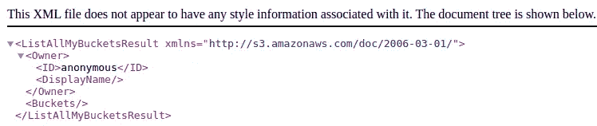
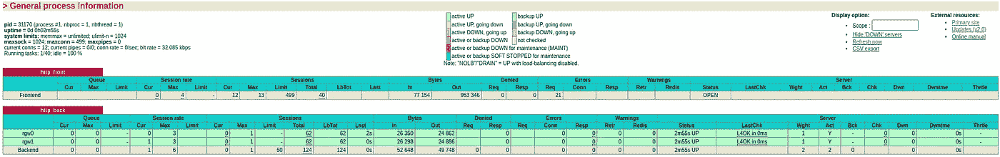
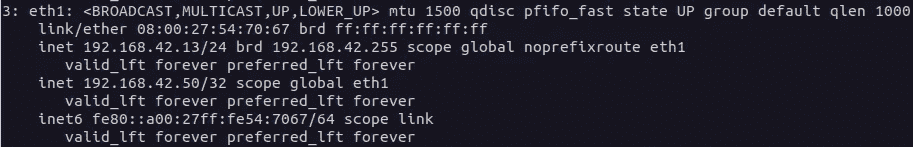
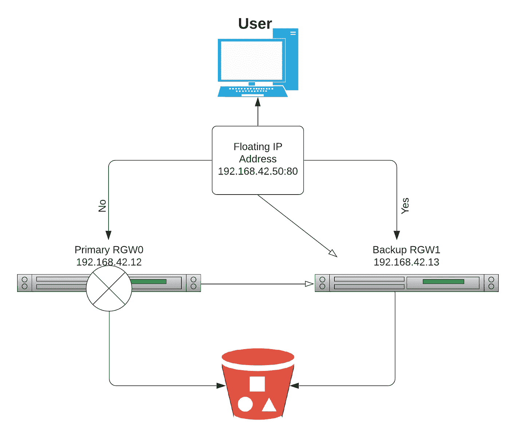
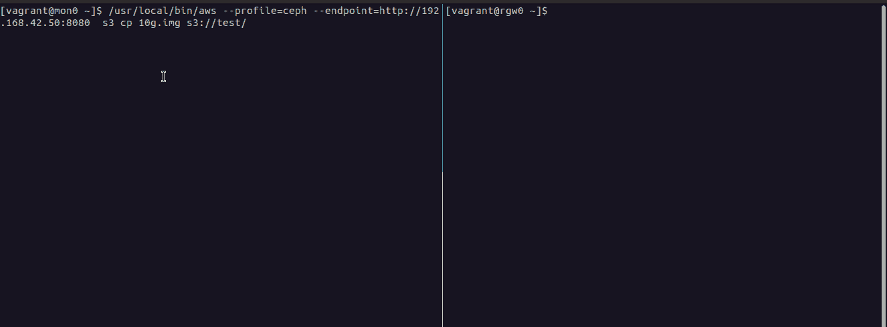

# Ceph-Ansible 部署和测试(第 2 部分)

> 原文：<https://medium.com/nerd-for-tech/ceph-ansible-deployment-testing-using-vagrant-part-2-342ef21d5e43?source=collection_archive---------14----------------------->

在这个[中级](https://razmaabari.medium.com/ceph-ansible-deployment-testing-using-vagrant-8205a9f39f2d)过程的第一部分(主要关注部署端)之后，今天将更详细地介绍 Ceph &的对象存储能力，使其保持高可用性以确保无故障。

我将首先深入研究 Ceph S3 用户创建，以及一些使用 AWS-CLI 解释器的基本 S3 命令。接下来，我们将使用诸如 HAProxy & Keepalived 之类的工具，让我们的 Ceph 集群尽可能地实现故障冗余。

请确保在第一部分采取的所有先前步骤都已执行，以确保程序顺利运行。

# 使用亚马逊 S3 的 Ceph 对象存储

首先，选择一个集群节点作为 Ceph 的 S3 对象存储的客户机。对于这个测试，我们将选择我们的 MON 节点。选择我们的客户端节点后，对其进行 ssh 并安装 AWS CLI 以连接到 S3。

> *AWS-CLI 安装可以使用亚马逊官方指令* [*这里*](https://docs.aws.amazon.com/cli/latest/userguide/install-linux.html) *来完成。*

```
**[vagrant@mon0 ~]$** sudo radosgw-admin user create --uid="razmab" --display-name="Raz S3User"
```

*   **razmab** 是要创建的用户的名称。
*   **S3User** 是用户显示名称。

```
{
    "user_id": "razmab",
    "display_name": "S3User",
    "email": "",
    "suspended": 0,
    "max_buckets": 1000,
    "subusers": [],
    "keys": [
        {
            "user": "razmab",
            "access_key": "AWXD2BYDQ6PGNJX1XKQL",
            "secret_key": "JoKUsq6Sh1PYBCP0WRgWxvh3hRfCiCqz9roDJCC8"
        }
    ],
    "swift_keys": [],
    "caps": [],
    "op_mask": "read, write, delete",
    "default_placement": "",
    "default_storage_class": "",
    "placement_tags": [],
    "bucket_quota": {
        "enabled": false,
        "check_on_raw": false,
        "max_size": -1,
        "max_size_kb": 0,
        "max_objects": -1
    },
    "user_quota": {
        "enabled": false,
        "check_on_raw": false,
        "max_size": -1,
        "max_size_kb": 0,
        "max_objects": -1
    },
    "temp_url_keys": [],
    "type": "rgw",
    "mfa_ids": []
}
```

注意*访问密钥*和*秘密密钥*。

```
"user": "razmab"
"access_key": "AWXD2BYDQ6PGNJX1XKQL"
"secret_key": "JoKUsq6Sh1PYBCP0WRgWxvh3hRfCiCqz9roDJCC8"
```

使用 AWS CLI 访问 Ceph 对象存储。

在开始使用 AWS CLI 工具与 AWS 服务交互之前，您需要通过运行 *AWS configure* 命令对其进行配置。

```
**[vagrant@mon0 ~]$** aws configure --profile=ceph
AWS Access Key ID [None]: AWXD2BYDQ6PGNJX1XKQL
AWS Secret Access Key [None]:
JoKUsq6Sh1PYBCP0WRgWxvh3hRfCiCqz9roDJCC8
Default region name [None]:
Default output format [None]: json
```

接下来，通过 ssh 连接到我们的一个 RGW 节点，检查 RGW 的 IP 地址和端口，(默认情况下应该是 8080。)与下一条命令:

```
**[vagrant@rgw0 ~]$ sudo netstat -plunt | grep -i rados**
tcp        0      0 192.168.42.12:8080      0.0.0.0:*               LISTEN      778/radosgw         
tcp        0      0 192.168.42.12:8081      0.0.0.0:*               LISTEN      779/radosgw
```

正如我们所看到的，我们的 RGW IP 地址和端口是 192.168.42.12:8080。请将此地址作为下一次 S3 测试的记录，并尝试访问此 URL，确保看到此网页:



192.168.42.12:8080 地址

很好，现在创建一个名为“test”的测试桶

```
**[vagrant@mon0 ~]$** aws --profile=ceph --endpoint=[http://192.168.42.12:8080](http://192.168.42.12:8080/) s3 mb s3://test
```

如果测试成功，您应该会收到以下输出:

```
make_bucket: test
```

查看现有的可用存储桶:

```
**[vagrant@mon0 ~]$** /home/vagrant/.local/lib/aws/bin/aws — endpoint [http://192.168.42.12:8080](http://192.168.42.12:8080/) s3api list-buckets
{
    "Owner": {
        "DisplayName": "S3User", 
        "ID": "razmab"
    }, 
    "Buckets": [
        {
            "CreationDate": "2021-02-28T12:59:26.508Z", 
            "Name": "test"
        }
    ]
}
```

要使用 AWS-CLI 命令进行更多的对象存储，请随意查看这个[页面](https://www.scaleway.com/en/docs/object-storage-with-aws-cli/)。

# HAProxy

为了使我们的 RGW 服务器具有高可用性负载均衡器，我们将在 Ceph 集群上安装一个 HAProxy 服务器。出于测试目的，RGW0 将充当 HAProxy 服务器。

首先将安装 wget，然后下载、解压并安装最新稳定版本的 HAProxy (2.3.5)。

```
**[vagrant@rgw0 ~]$** sudoyum install -y wget
**[vagrant@rgw0 ~]$** sudo yum install gcc pcre-devel tar make -y
**[vagrant@rgw0 ~]$** wget [http://www.haproxy.org/download/2.3/src/haproxy-2.3.5.tar.gz](http://www.haproxy.org/download/2.3/src/haproxy-2.3.5.tar.gz)
**[vagrant@rgw0 ~]$** tar -xzf haproxy-2.3.5.tar.gz **[vagrant@rgw0 ~]$** cd haproxy-2.3.5
**[vagrant@rgw0 ~]$** sudomake install
```

HAProxy 设置以及 HAProxy 记录和防火墙设置的配置。

```
**[vagrant@rgw0 ~]$** sudo mkdir -p /etc/haproxy
**[vagrant@rgw0 ~]$** sudo mkdir -p /var/lib/haproxy 
**[vagrant@rgw0 ~]$** sudo touch /var/lib/haproxy/stats
**[vagrant@rgw0 ~]$** sudo ln -s /usr/local/sbin/haproxy /usr/sbin/haproxy
**[vagrant@rgw0 ~]$** systemctl start haproxy ; systemctl enable haproxy
**[vagrant@rgw0 ~]$** sudo firewall-cmd --permanent --zone=public --add-service=http
**[vagrant@rgw0 ~]$** sudo firewall-cmd --permanent --zone=public --add-port=8181/tcp
**[vagrant@rgw0 ~]$** sudo firewall-cmd --reload
```

最后，由于我们希望针对高需求增加我们的 RGW 工作负载，所以更新 HAProxy 配置文件以实现第 4 层的负载平衡。当访问 RGW0 的 IP 地址 192.168.42.12:80 时,“循环”算法将流量平均分配给两台 RGW 服务器

> *确保更新用户、组名& IP 地址，以匹配您自己的设置环境。*

```
**[vagrant@rgw0 ~]$** sudosystemctl restart rsyslog.service 
**[vagrant@rgw0 ~]$** sudo vim /etc/haproxy/haproxy.cfg
global
   log /dev/log local0
   log /dev/log local1 notice
   chroot /var/lib/haproxy
   stats timeout 30s
   user vagrant
   group vagrant
   daemondefaults
   log global
   mode http
   option httplog
   option dontlognull
   timeout connect 5000
   timeout client 50000
   timeout server 50000
frontend http_front
   bind 192.168.42.12:80
   stats uri /haproxy/stats
   default_backend http_back
backend http_back
   balance roundrobin
   server rgw0 192.168.42.12:8080 check
   server rgw1 192.168.42.13:8080 check
```

启动并启用代理守护程序，并在防火墙设置中添加 HTTP 服务规则。

```
**[vagrant@rgw0 ~]$** systemctl start haproxy ; systemctl enable haproxy
**[vagrant@rgw0 ~]$** firewall-cmd --permanent --add-service=http
**[vagrant@rgw0 ~]$** firewall-cmd --reload
```

完成以上所有工作后，我们可以开始测试我们的负载均衡器，可以通过访问我们的 MON0 地址，然后访问端口 80 (192.168.42.12:80)来完成，我们应该会像前面一样看到我们的 RGW 网页，这意味着绑定正在工作。对于我们之前选择的“循环”算法，网络流量应该平均分配。

我们可以检查 HAProxy 统计数据，以了解有关 RGW 流量工作负载的更多信息，这可以通过我们的 MON0 的 IP 地址后跟“/haproxy？stats”，[http://192 . 168 . 42 . 12/ha proxy？统计数据](http://192.168.42.10/haproxy?stats)。



更多关于 HAProxy 的信息，点击[这里](https://www.haproxy.com/blog/the-four-essential-sections-of-an-haproxy-configuration/)。

# 保持存活

现在我们有了一个负载平衡器来平衡我们的 RGW 工作负载，我们希望确保我们的 RGW 服务是冗余的，并且对于故障是健壮的。这可以通过使用一项名为“Keepalived”的服务来实现，其目标是即使我们的一台 RGW 服务器由于某种原因停机，我们的服务也能保持正常运行。

首先，我们将在我们的两台 RGW 服务器上安装守护程序，以接收我们选择的浮动 IP(192 . 168 . 42 . 50:80)，因此每当我们想要访问我们的 S3 网页时，我们将首先被重定向到我们的主 RGW(0)。如果由于某种原因，RGW0 不可用，请求将被转发到我们的备份 RGW(1)服务器，以实现冗余。

```
**[vagrant@rgw0 ~]$** yum install -y keepalived
**[vagrant@rgw0 ~]$** echo "net.ipv4.ip_nonlocal_bind = 1" >> /etc/sysctl.conf
**[vagrant@rgw0 ~]$** sysctl -p 
net.ipv4.ip_nonlocal_bind = 1
**[vagrant@rgw0 ~]$** cd /etc/keepalived/
**[vagrant@rgw0 ~]$** vi keepalived.conf
vrrp_instance RGW {
    state MASTER # might not be necessary. This is on the Master LB node.
    [@main](http://twitter.com/main) interface eth1
    priority 100
    advert_int 1
    interface eth1
    virtual_router_id 50
    [@main](http://twitter.com/main) unicast_src_ip 192.168.42.12 80
    unicast_peer {
           192.168.42.13
           }
    authentication {
        auth_type PASS
        auth_pass 1111
    }
    virtual_ipaddress {
        192.168.42.50
    }
    track_script {
      chk_haproxy
    }
}
virtual_server 192.168.42.50 8080 eth1 { #populate correct interface
    delay_loop 6
    lb_algo wlc
    lb_kind dr
    persistence_timeout 600
    protocol TCP
    real_server 192.168.42.12 80 { # ip address of rgw2 on physical interface, haproxy listens here, rgw listens to localhost:8080 or similar
        weight 100
        TCP_CHECK { # perhaps change these to a HTTP/SSL GET?
            connect_timeout 3
        }
    }
    real_server 192.168.42.13 80 { # ip address of rgw3 on physical interface, haproxy listens here, rgw listens to localhost:8080 or similar
        weight 100
        TCP_CHECK { # perhaps change these to a HTTP/SSL GET?
            connect_timeout 3
        }
    }
}
```

启动并启用保持激活服务。此外，验证您是否有可用的原始和新浮动 IP 地址。

```
**[vagrant@rgw0 ~]$** systemctl start keepalived ; systemctl enable keepalived
**[vagrant@rgw0 ~]$** ip add
```


RGW0 IP

请为我们的第二台 RGW(1)服务器做同样的事情，但是将它添加到 keepalived.conf 文件中。

```
vrrp_instance RGW {
    state BACKUP # might not be necessary.
    priority 99
    advert_int 1
    interface eth1
    virtual_router_id 50
    unicast_src_ip 192.168.42.10 8080
    unicast_peer {
           192.168.42.10
           }
    authentication {
        auth_type PASS
        auth_pass 1111
    }
    virtual_ipaddress {
        192.168.42.50
    }
    track_script {
      chk_haproxy
    }
}
virtual_server 192.168.42.50 8080 eth1 { #populate correct interface
    delay_loop 6
    lb_algo wlc
    lb_kind dr
    persistence_timeout 600
    protocol TCP
    real_server 192.168.42.12 8080 { # ip address of rgw2 on physical interface, haproxy listens here, rgw listens to localhost:8080 or similar
        weight 100
        TCP_CHECK { # perhaps change these to a HTTP/SSL GET?
            connect_timeout 3
        }
    }
    real_server 192.168.42.13 8080 { # ip address of rgw3 on physical interface, haproxy listens here, rgw listens to localhost:8080 or similar
        weight 100
        TCP_CHECK { # perhaps change these to a HTTP/SSL GET?
            connect_timeout 3
       }
    }
}
```

启动并启用保持激活服务。此外，验证您是否有可用的原始和新浮动 IP 地址。

```
**[vagrant@rgw1 ~]$** systemctl start keepalived ; systemctl enable keepalived
**[vagrant@rgw1 ~]$** ip add
```



RGW1 IP

流程应该如下图所示。



让我们在终端上测试这个。出于这个测试目的，我将上传一个名为“10g.img”的文件到我们的 S3 存储桶，稍后，关闭一个 RGW(0) keepalived 守护进程来检查上传是否成功完成，没有中断。

```
**[vagrant@mon0 ~]$** /usr/local/bin/aws --profile=ceph --endpoint=[http://192.168.42.50:8080](http://192.168.42.50:8080/) s3 cp big_file s3://test/
**[vagrant@rgw0 ~]$** sudo systemctl stop keepalived.service
**[vagrant@mon0 ~]$** upload: ./big_file to s3://test/big_file
```

正如我们所看到的，文件上传并没有停止，而是延迟了几秒钟，直到 keepalived 切换到充当备份服务器的 RGW1。



失败测试

# 结论和最终想法

我们学习了如何使用 Ceph-Ansible 轻松部署 Ceph 集群，在部署前和部署后更改许多 ceph-ansible 部署参数，使用 RGW S3 存储，使用 HAProxy 和 Keepalived 作为负载平衡器，以及监控我们的 RGW 服务器进行故障转移等等…

我希望这个由两部分组成的 medium 过程为您提供了一些关于 Ceph 存储的见解，以及如何使用 Ceph 和其他工具实现高可用性，感谢观看。