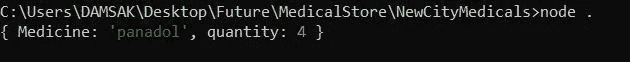
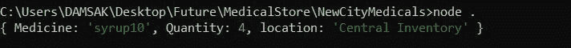

# 责任链设计模式

> 原文：<https://medium.com/nerd-for-tech/chain-of-responsibility-design-pattern-4efe8de4910d?source=collection_archive---------9----------------------->

# 定义

> 责任链模式是一种设计模式，它形成顺序连接的组件，消费者可以简单地将对象传递给第一个组件。然后，每个组件根据构建的序列处理该特定对象。

这种模式属于行为设计模式的范畴。简单地说，这种模式让应用程序沿着处理程序链传递请求。每个处理程序可以决定是处理请求，还是将请求传递给构造好的序列中的下一个处理程序。该模式主要用于将**松耦合**引入到应用程序中。它基本上是基于类型来分离特定请求的发送方和接收方。

# 使用

*   当程序以各种方式处理不同类型的请求，但顺序事先未知时。
*   当需要以特定的顺序执行几个处理程序时。
*   当处理程序序列在运行时改变时。

# 利弊

## 赞成的意见

*   控制请求处理顺序的可能性。
*   在不破坏现有代码的情况下，在应用程序中引入新的处理程序。
*   类的解耦(操作调用和执行。

## 骗局

*   可能有未处理的请求。
*   最终用户操纵应用程序的可能性。

# Javascript 环境下的责任链设计模式

让我们借助一个真实的例子来进一步理解这种模式。

# 用例

> “新城市医药”是一家位于斯里兰卡的著名连锁药店。这个连锁店每天向成千上万的用户提供医疗用品。他们的商店遍布全国各大城市。

**订单流程**

药剂师将首先在其前端库存中寻找特定的物品。如果商品不可用，搜索将继续到后面的库存。如果该商品在该位置不可用，搜索将被传递到位于每个区域的分销商仓库。下一个也是最后一个要看的地方是位于科伦坡的中央仓库。

**需求**:药房需要一个药剂师的应用程序，以便轻松找到特定药品的位置和数量。

> 注意:为了简单起见，我们将使用一个本地 JSON 文件作为数据库。

现在让我们尝试实现一个解决方案。

## 没有模式的初始实现

数据库—

药房—

索引文件—

输出—

图 1:没有模式的初始实现

在这个实现中，我们每次都需要传递库存位置。**搜索仅基于特定的库存**。这样效率不是很高。让我们实现责任链模式，并在可用序列中向前搜索相关库存。

## 责任链设计模式的实现

**步骤 01** :更改 index.js 类，通过整个库存。

索引文件—

**步骤 02:**

现在让我们实现一个名为 Storage 的新类。该类负责遍历数据集，找到项目并将其返回。

存储类—

## 要点

*   **search inventory(ItemName)**—遍历药品的实际数据集。
*   **。setNext()** —将下一个库存设置为下一个存储。
*   **。find()** —检查我们是否真的找到了它。如果有，将返回药品的详细信息。否则，它将返回一个字符串值，表示该药不可用。
*   **“else If(this.next)”**第 29 行—如果“this . next”可用，我们需要在下一个清单中再次循环。

**步骤 03 :**

现在我们可以实现药房类了。首先，我们将在 Storage 类的帮助下为每个库存创建变量。

药学课—

## 要点

*   **this . storage = front Inventory**—起点是前端库存。
*   然后，我们在“的帮助下执行链接。setNext()"方法。

## 输出

图 2:最终实现

## 过程

系统首先检查前面库存中的“糖浆 10”。那里没有。因此，应用程序移到后台清单并检查可用性。它在后面的库存中也没有。然后，系统再次移动到分配中心并检查。配送中心也没有“糖浆 10”。最后，应用程序检查中央库存中的药品。“糖浆 10”在那个地方有售。因此，应用程序返回可用性以及数量和可用位置。

现在我们可以看到，在责任链设计模式的帮助下，我们已经成功地实现了解决方案。药剂师，并输入他/她想要的药品，系统将生成该药品的可用性以及可用位置。

以下 URL 提供了上述实现的完整源代码。

 [## damsak/Krish-LP-培训

### 通过在 GitHub 上创建一个帐户，为 Damsak/Krish-LP-Training 开发做出贡献。

github.com](https://github.com/Damsak/Krish-LP-Training/tree/main/DesignPatterns/ChainOfResponsibilityDesignPatternPractical/NewCityMedicals) 

我使用了 Krishntha Dinesh 先生的以下播放列表来收集所需的信息。

# 参考

 [## 责任链模式

### 顾名思义，责任链模式为一个请求创建一个接收者对象链。这个…

www.tutorialspoint.com](https://www.tutorialspoint.com/design_pattern/chain_of_responsibility_pattern.htm)  [## 责任链

### 责任链是一种行为设计模式，允许您沿着处理程序链传递请求。根据……

重构大师](https://refactoring.guru/design-patterns/chain-of-responsibility)