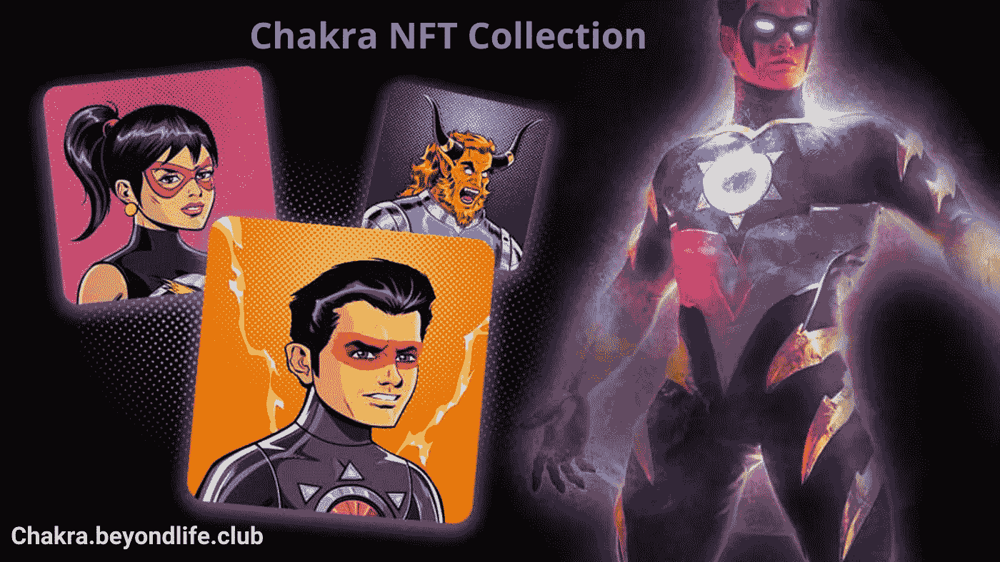

# 查克拉-无敌和七个查克拉权力 NFT 收藏

> 原文：<https://medium.com/nerd-for-tech/chakra-the-invincible-and-seven-chakra-powers-nft-collection-94d2bc42b43b?source=collection_archive---------0----------------------->

查克拉-无敌是这些天的趋势与伟大的 NFT 收集发布会。查克拉-无敌是由漫威创造者斯坦·李创造的最好的和有意义的超级英雄之一。

根据斯坦·李的说法，他创造了查克拉，将东方和西方的概念融合在一个超级英雄的故事中，他做得很漂亮。当你读到这一页的末尾时，你就会知道怎么做了。

**斯坦·李和他在查克拉-无敌号上的创造力**

无敌查克拉是唯一一个由斯坦·李和印度图形共同创作的印度超级英雄。斯坦·李将印度古老的能量脉轮与超能力完美地联系起来，并将一个弱小的男孩拉朱·拉伊变成了超级英雄。超级英雄拥有基于身体 7 个能量轮的 7 种超能力。罗刹脉轮保护他，视觉脉轮帮助他让他的套装出现和消失，声音脉轮帮助他找到真相，等等。他也可以借助根轮飞行。让我们在这篇文章中详细地看到所有的脉轮和他的力量。

斯坦·李将两种截然不同的想法完美地结合在一起，这真是太迷人了。

**七轮力量**

在冥想中，他们使用查克拉这个词(在梵语中是轮子的意思)。脉轮是身体能量集中的点。疏通它们，调节能量流，维持身体健康。看看 [**斯坦·李如何将每个脉轮与无敌脉轮**](https://chakra.beyondlife.club/?fsz=home) 相关联。

**根脉轮**

允许拉朱喷出黄色火焰并飞行。在吠陀中，根脉轮负责生命。

**罗刹脉轮**

罗刹的意思是保护。顾名思义，当 Raju 呼喊 Raksha chakra activate 时，他在自己周围形成了一个保护盾，可以保护他免受任何不良力量的伤害

**太阳脉轮**

这个脉轮允许他从手中射出能量冲击波。这有助于他在眨眼之间消灭他的敌人。

**心轮**

这个脉轮给予治疗和刀枪不入的力量。只有拥有清晰的头脑和同情心，它才能被激活。

**声音脉轮**

声音脉轮给予第六感来了解真相。这给脉轮一种了解真相的特殊力量。他能发现他面前的人是否对他撒谎。

**视觉脉轮**

这个脉轮负责控制幻象和套装的力量。查克拉穿的那套衣服是贴在身上的，他不能脱下来。这是因为一些纳米技术会将宇航服永久地附着在他的身体上。所以他使用了视觉查克拉的力量，让衣服随时出现和消失。但是原本这套衣服会附在他身上。

**顶轮**

皇冠脉轮是最强大的脉轮，它给予意识的力量。在整个故事中，查克拉只使用这种能力一次。当他依附在这件衣服上时，他就获得了这种能力。他瞥见了等待着他的危险的未来。

**七个脉轮的力量 NFTs**

[**查克拉 NFT 系列**](https://chakra.beyondlife.club/?fsz=home) 有一些基于这 7 种查克拉力量的特殊非功能性疗法。这包括 7 个独特的 3D 动画，展示了查克拉的 7 种力量。人们可以通过参加 7 场不同的 1/1 拍卖来拥有这 7 场拍卖中的任何一场，拍卖将在斯坦·李诞辰 99 周年纪念日举行。这是整个收藏中罕见的 NFTs。这是因为它是基于成熟版本的查克拉-无敌。早在 2012 年和 2013 年初，儿童版的《无敌查克拉》就以续集电影的形式发行。斯坦在去世前就开始创作真人版的电影，这是他最想做的事情。

7 场拍卖的获胜者将获得一幅罕见的限量版《无敌查克拉》石版画，这是斯坦·李多年前亲笔签名的。

**总结**

这些斯坦·李的特别创作将很快被拍卖，粉丝们已经准备好购买限量版的收藏品。这是对所有斯坦迷的款待。你可以在 Beyondlife.club 官方网站或 orange comet 网站上探索 NFT 的特别收藏。