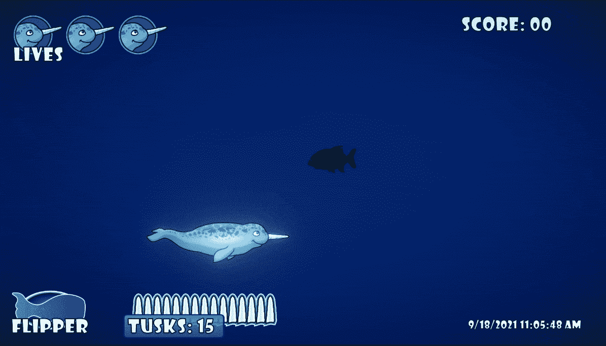

# 挑战:创造一个聪明的敌人类型

> 原文：<https://medium.com/nerd-for-tech/challenge-create-a-smart-enemy-type-7222646e81f4?source=collection_archive---------5----------------------->

我在这篇文章中的目标是创造一种敌人类型，当它在玩家身后时会向玩家开火。

在进入代码工作之前，我制作了一个快速的新的*抛射物*供敌人发射。CorelDraw 有一个方便的*星形* **工具**，可以让你决定在星形中需要多少个点和段。这是我结束的地方。