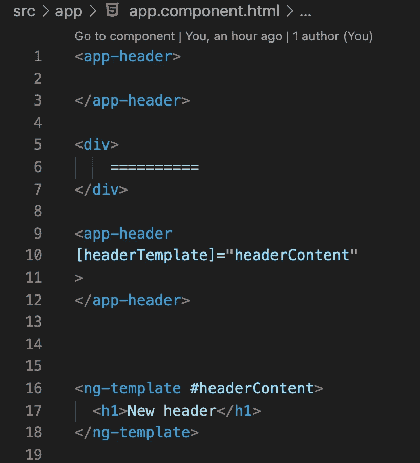

# 从外部更改组件内容。

> 原文：<https://medium.com/nerd-for-tech/change-component-content-from-outside-e6dc8382b3bb?source=collection_archive---------17----------------------->

## 角度模板

如果我们可以创建一个组件并在其中放入任何内容，那会怎么样？这要怎么做？我们创建主组件(骨架)，在不改变主组件的情况下改变内部内容。这种方法给了我们很多好处。

在 angular 中，这个特性调用模板。我们将使用三个项目:ng-template、ng-container 和 ngTemplateOutlet。

让我们举一个小例子，我们将讨论所有这些项目。

首先，我们创建一个标题。Ng-container 是我们将看到 Ng 模板的地方。NgTemplateOutlet 是 ng-template 项目上的一个链接。如果我们没有传递 headerTemplate，我们将看到一个默认模板。

在 app 组件中，我们使用两个版本的 header 组件。第一个使用默认的模板，对于第二个，我们有一个在 header 组件中传递的模板。

因此，我们拥有内容不同的相同组件。

如果你需要仔细看看这个项目，这里有链接。

*原载于 2021 年 8 月 1 日*[*【http://tomorrowmeannever.wordpress.com】*](https://tomorrowmeannever.wordpress.com/2021/08/01/1665/)*。*