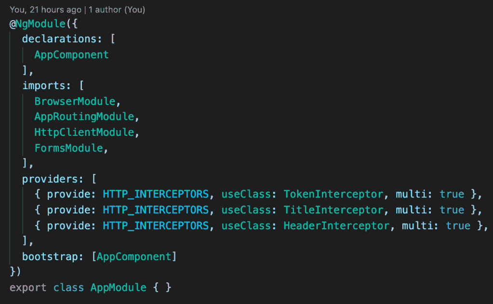
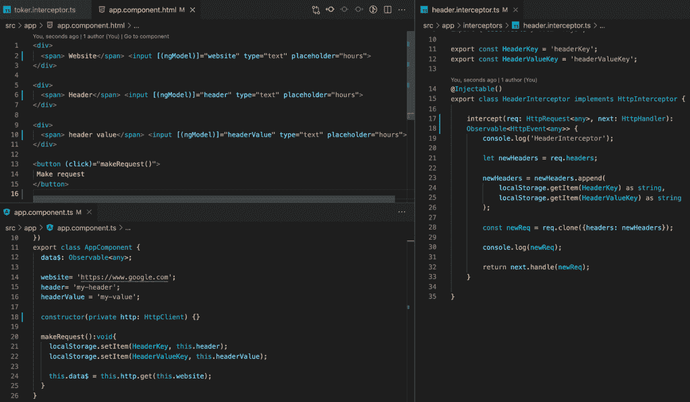
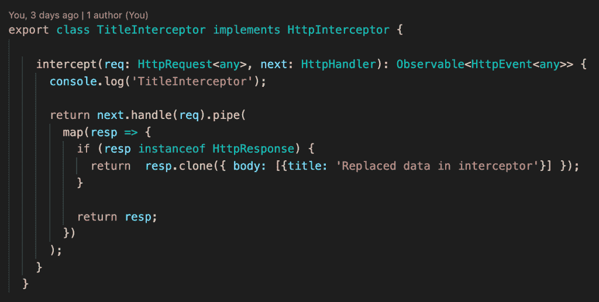
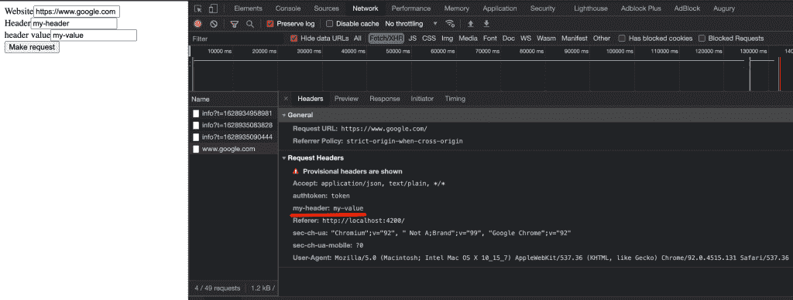

# 更改应用程序中的每个请求或响应。

> 原文：<https://medium.com/nerd-for-tech/change-every-request-or-response-in-your-application-69bee5922064?source=collection_archive---------2----------------------->

## 有角度的 HTTP 拦截器。

有时我们可能需要在请求中添加信息，或者改变响应的格式，或者只是记录我们所有的请求。我们如何做到这一点？

我们可以创建一个基础服务，将逻辑放在那里，然后使用继承。但是 angular 有一个很好的解决这类问题的方法。它调用拦截器。拦截器拦截应用程序中的每一个请求，让我们能够更改请求/响应或者只是进行调试。

让我们创建一个 HTTP 拦截器。我们的类必须用方法 intercept 实现一个接口 HttpInterceptor，并且我们需要在模块提供者部分添加这个服务。如果我们想要使用几个不同的拦截器，我们设置参数' multi': true。

我们可以根据我们的要求制作完全可定制的标题。为此，我们需要创建一个简单的表单。我们将表单的值存储在拦截器的本地存储中，我们将在它的值中设置新的头。

如果我们需要处理响应，我们需要使用 rxjs 库中的管道操作符。

因此，所有 HTTP 请求和响应都被拦截。

如果你需要仔细看看这个项目，这里有链接。

*原载于 2021 年 8 月 14 日*[*【http://tomorrowmeannever.wordpress.com】*](https://tomorrowmeannever.wordpress.com/2021/08/14/change-every-request-or-response-in-your-application-angular-http-interceptors/)*。*