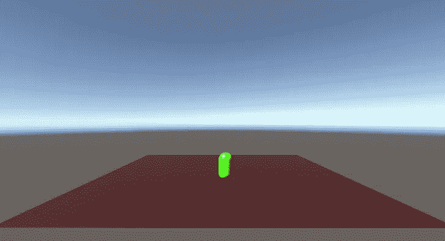
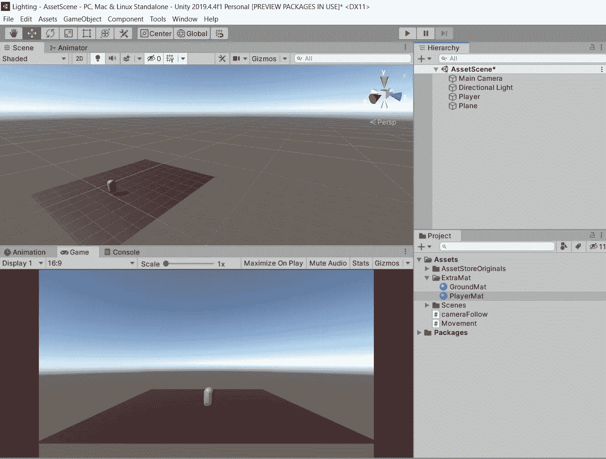
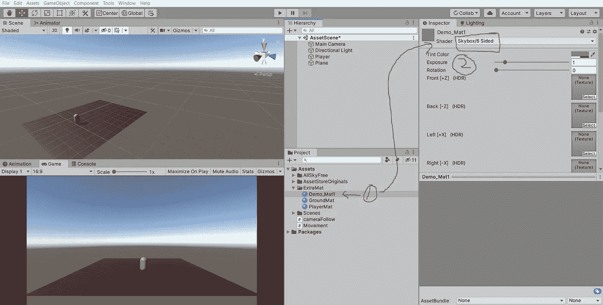
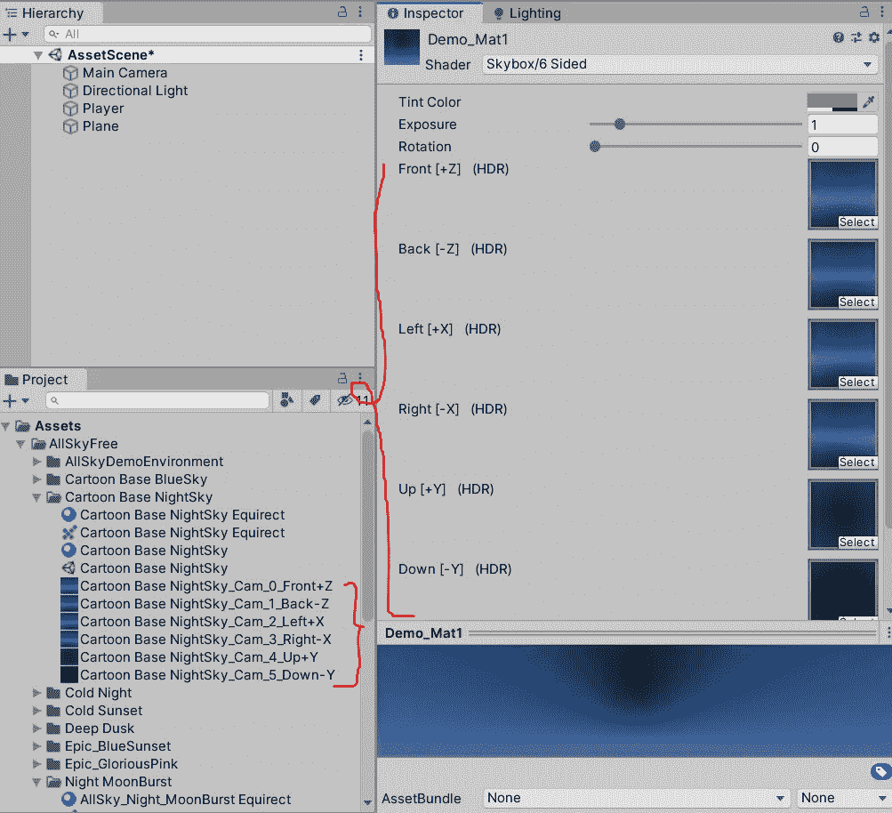
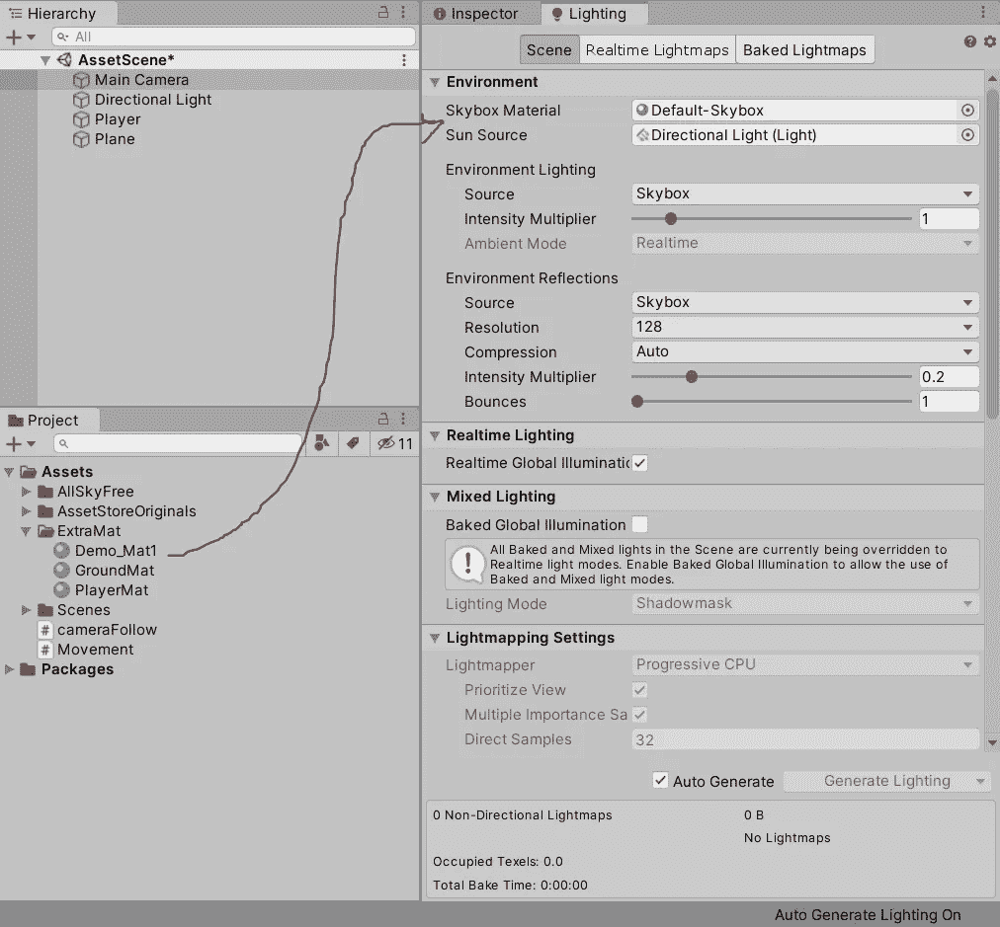
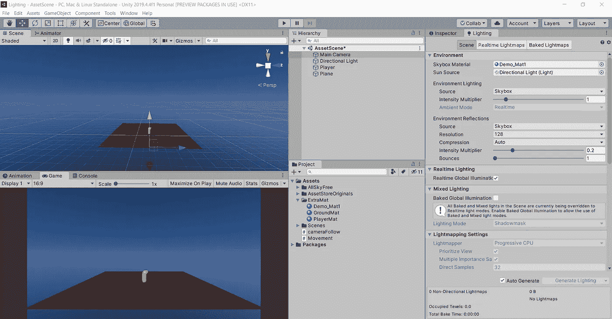
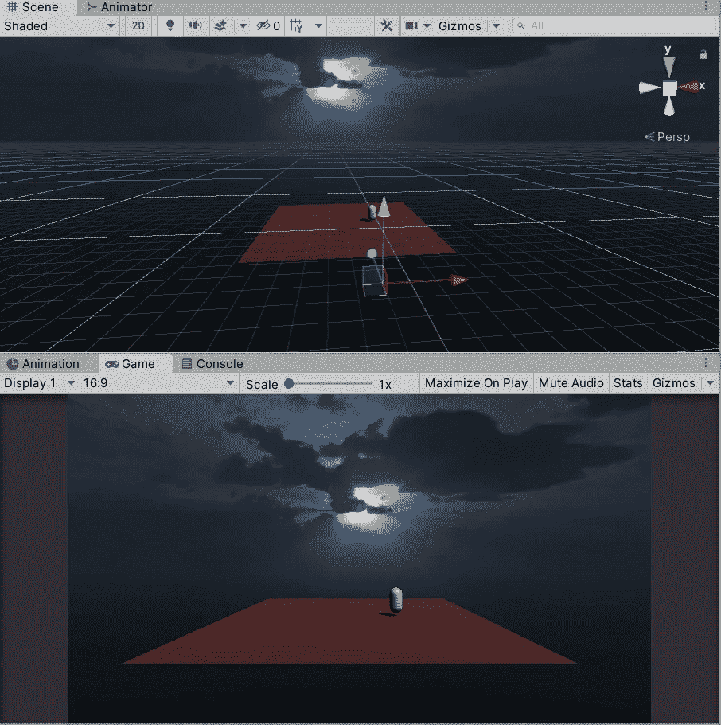
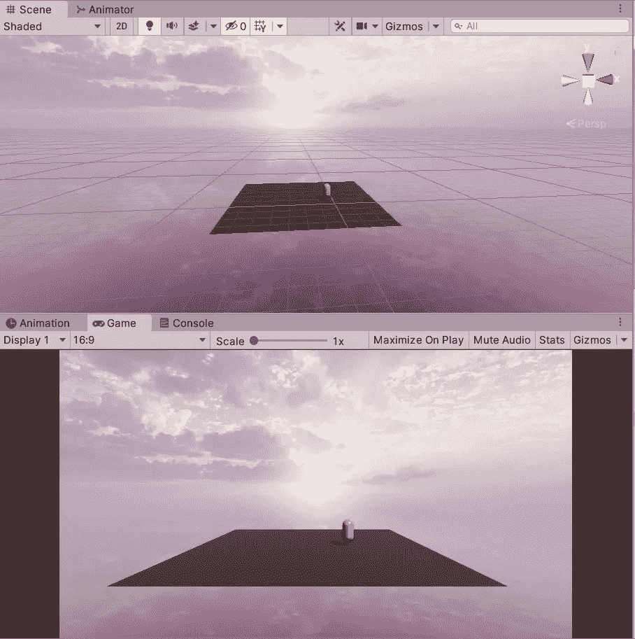

# 只需 3 个简单的步骤就可以改变 Unity 中的机顶盒

> 原文：<https://medium.com/nerd-for-tech/change-the-skybox-in-unity-in-just-3-simple-steps-afe537369c1a?source=collection_archive---------0----------------------->

本文演示了如何将 Unity 中常见的天空改变为自定义环境。

一致

本练习使用 6 边立方体着色器中的 skybox。上面的材料默认是我们在上面看到的。这只是一个创造一种新材料并将其应用到 skybox 立方体上的问题。

请沿着这组步骤，改变天空将是轻而易举的事。

1.  在资源中创建一个材质，并将其着色器更改为 6 面天空框。

2.请在您想要用作天空的资产中准备好图像文件。这些图像可以是任意选择的:将每个图像文件放入检查器的相关位置。

一致

3.图像就位后，转到“照明管理器”窗口，将默认的 skybox 更改为您刚刚创建的新材质。

一致

应该是这样的:)

以下是一些 skybox 材料的最终结果，供您参考。

一致

一致

一致

要使用不同的机顶盒图像，您可以在 Unity store 上免费使用该资产。

 [## AllSky Free - 10 Sky / Skybox 套装| 2D 天空| Unity Asset Store

### 使用 rpgwhitelock 的 AllSky Free - 10 Sky / Skybox Set 资产提升您的工作流程。浏览更多 2D 纹理

assetstore.unity.com](https://assetstore.unity.com/packages/2d/textures-materials/sky/allsky-free-10-sky-skybox-set-146014) 

非常感谢