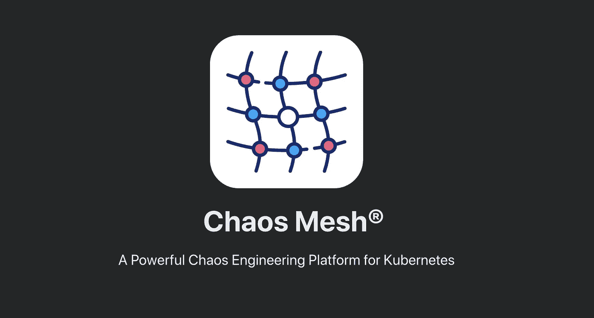
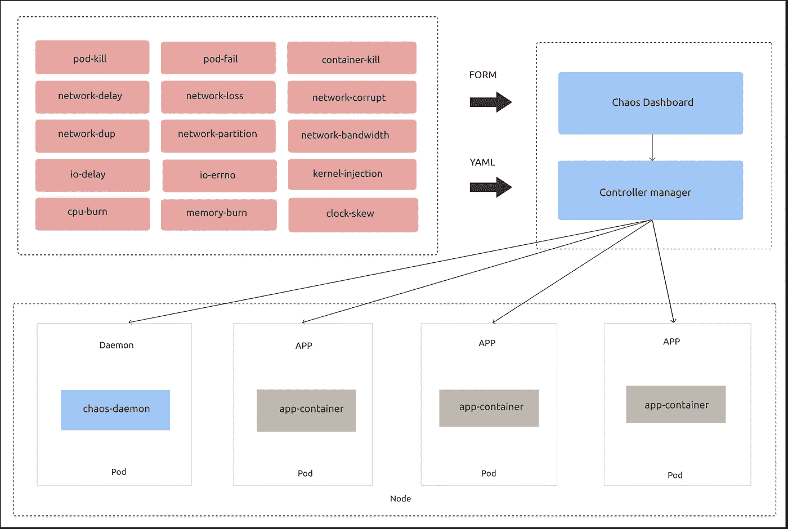
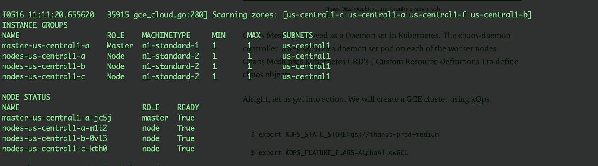
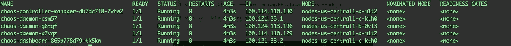
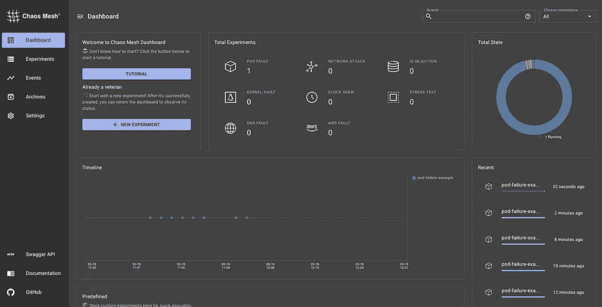
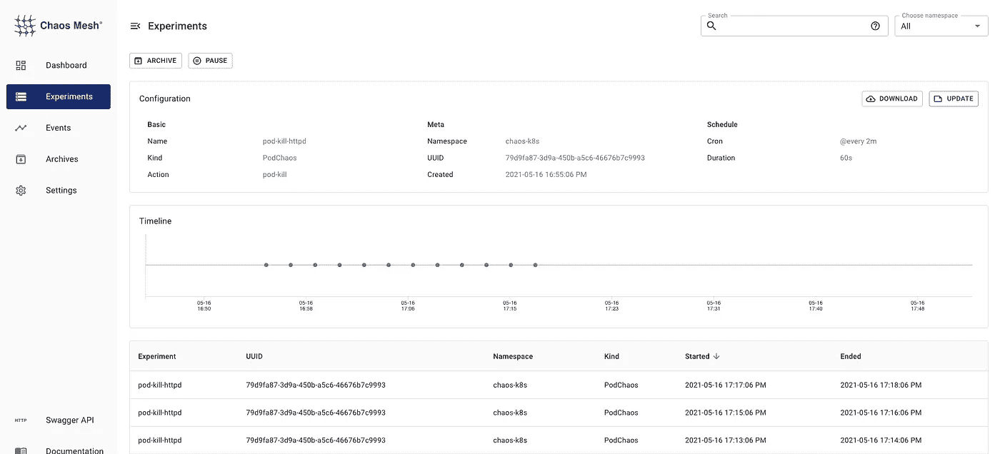
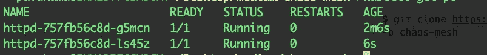
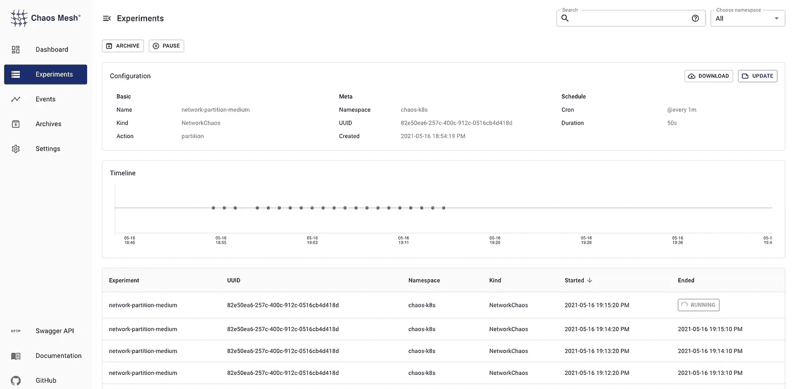
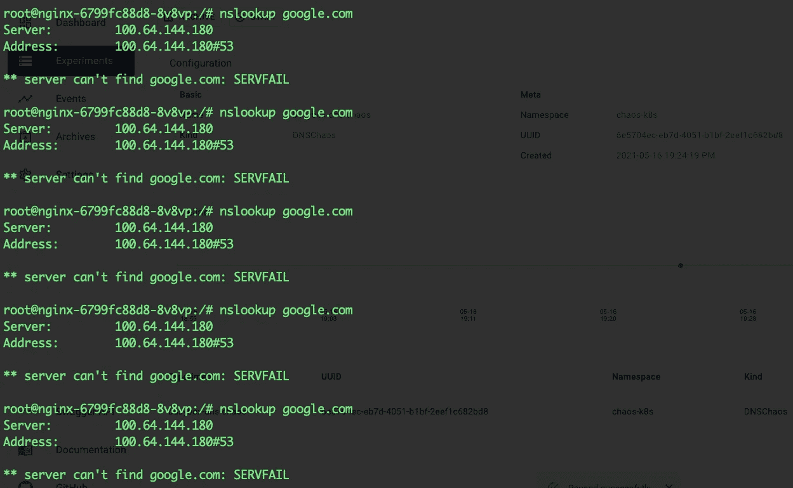
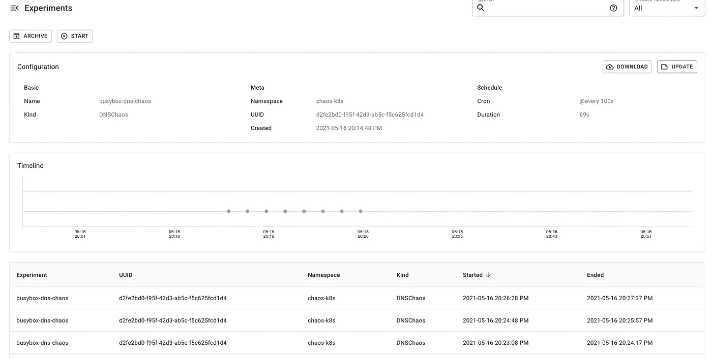

# 基于混沌网格的 Kubernetes 混沌工程

> 原文：<https://medium.com/nerd-for-tech/chaos-engineering-in-kubernetes-using-chaos-mesh-431c1587ef0a?source=collection_archive---------2----------------------->

基于混沌网格的 Kubernetes 混沌工程

随着您的应用程序被迁移到云中，架构变得非常复杂。对于云中如此复杂的应用程序架构，很难预测故障。应用程序中的任何此类故障都可能导致贵公司损失惨重。这些持续的不可预测的停机可能会损害公司的声誉，也可能会失去客户。公司必须探索一种方法来预测此类停机，而不是在下次停机时修复它们。混沌工程来拯救我们了。混沌工程是一种在故障导致停机之前识别故障的训练有素的方法。通过这种方法，我们故意破坏应用程序，以了解它们对失败的反应。这将帮助我们建立弹性系统。这是一个非常好的方法。Kubernetes 生态系统中有这样的东西吗？是的，混沌网在这里帮助我们。混沌网格是一个云原生的混沌工程平台，在 Kubernetes 环境中编排混沌。它可以直接部署到 Kubernetes 集群，不需要任何特殊的依赖。混沌网格是一个 CNCF 沙盒项目，最近获得了巨大的人气。



图片来源:[混沌网](https://chaos-mesh.org/)

# 整个故事是关于什么的？(TLDR)

1.  理解混沌网格的架构和概念。
2.  在 Kubernetes 集群上运行混沌实验。

# 先决条件

1.  Kubernetes 集群(可以是本地、AKS、EKS、GKE、Kind)。
2.  头盔，已安装 kubectl。

# 故事资源

1.  GitHub 链接:【https://github.com/pavan-kumar-99/medium-manifests 
2.  GitHub 分支:[混沌网](https://github.com/pavan-kumar-99/medium-manifests/tree/chaos-mesh)

**混沌网格的组件**

混沌网格由以下组件组成

a)混沌算子:这是混沌网格的核心组件。

b)混沌仪表板:这是一个用于设计、监控和管理混沌实验的 Web 用户界面。

**混沌网的架构**



混沌网状架构。演职员表[混沌网](https://chaos-mesh.org/)

混沌网格作为守护进程集部署在 Kubernetes 中。chaos-daemon 控制器作为 daemon set pod 部署在每个 worker 节点上。混沌网格使用库伯内特 CRD 的(自定义资源定义)来定义混沌对象。

好吧，让我们开始行动吧。我们将使用 kOps 创建一个 GCE 集群。

```
$ export KOPS_STATE_STORE=gs://thanos-prod-medium$ export KOPS_FEATURE_FLAGS=AlphaAllowGCE$ kops create cluster \--node-count 1 \--zones us-central1-a,us-central1-b,us-central1-c \--master-zones us-central1-a \--container-runtime docker \medium.k8s.local$ kops update cluster --name medium.k8s.local --yes --admin$ kops validate cluster --wait=10m
```



kOps 集群已验证

现在让我们在我们的 Kubernetes 集群中安装混沌网格 [***头盔 char***](https://github.com/chaos-mesh/chaos-mesh/tree/master/helm/chaos-mesh) **t** 。

```
$ helm repo add chaos-mesh [https://charts.chaos-mesh.org](https://charts.chaos-mesh.org)$ helm repo update$ helm install chaos-mesh chaos-mesh/chaos-mesh --namespace=chaos-testing --create-namespace --set dashboard.create=true
```



混沌网格

现在，您应该可以找到所有创建的混沌网格组件，以及运行在每个工作节点上的混沌守护进程。混沌网格还创建了一个仪表板来可视化和管理所有的混沌实验。仪表板看起来会像这样。



混沌网格仪表板

啊，是的，我明白了！！仪表板看起来很酷，对吧？没有任何进一步的原因，让我们开始创建混沌实验。库伯内特有各种各样的混沌实验。让我们全部检查一下...

**PodChaos 实验**

a) pod-failure:它将错误注入到 pod 中，并将导致 pod 创建暂时失败。选定的窗格在特定时间段内将不可用。

> b)杀死荚果:杀死被选中的荚果，并不断重启/重生荚果。

c)杀死容器:杀死目标舱中指定的容器。

**网络混沌实验**

> a)网络分区:这阻止了两个 pod 之间的通信。

b)网络仿真:操作涵盖常规网络故障，如网络延迟、复制、丢失和损坏。

**应激混沌实验**

a)内存压力:这将持续增加虚拟内存的压力。

b) CPU 压力:这种压力会持续使 CPU 不堪重负。

**时间混沌实验**

TimeChaos 用于修改`clock_gettime`的返回值

**IOChaos 实验**

IOChaos 允许您模拟文件系统故障，比如 IO 延迟和读/写错误。

**KernelChaos 实验**

导致底层主机上的内核混乱。尽管它针对特定的 pod，但可能会影响其他 pod 的性能。强烈建议不要在生产中运行它。

**dnschaus 实验**

> a) DNSChaos:这允许您在发送请求后模拟错误的 DNS 响应，如 DNS 错误或随机的 IP 地址。

**AWSChaos 实验**

这有助于将故障注入 AWS 实例，如 ec2-stop、ec2-restart、detach-volume。

考虑到本文的长度，我们将挑选几个混沌实验并在这里介绍它们。但是，如果你想让我介绍任何其他的实验，请随意评论。

创建用于测试的资源。

我们将创建几个示例部署来进行现场测试。

```
$ kubectl create ns chaos-k8s $ kubectl config set-context --current --namespace=chaos-k8s$ kubectl create deploy httpd --image=httpd --replicas=2 $ kubectl expose deploy --port=80 $ kubectl create deploy nginx --image=nginx --replicas=2
```

**PodChaos: Pod-Kill 实验**

在应用之前，让我们先了解一下 yaml 文件。

1.  **规格**:吊舱混乱
    的规格**动作:**要应用的吊舱混乱的种类。这可能是豆荚杀死(或)豆荚失败(或)容器杀死。
    **模式:**定义了混沌的模式。一个表示一次一个副本，所有表示所有副本，一个值表示固定百分比。
    持续时间:每次混沌实验的持续时间。
    **selector . label selectors:**指定混沌注入的目标吊舱。
    **调度器:**定义了混沌实验运行时间的调度规则。

```
$ git clone [https://github.com/pavan-kumar-99/medium-manifests](https://github.com/pavan-kumar-99/medium-manifests) \
-b chaos-mesh$ cd medium-manifests $ kubectl apply -f pod-kill.yaml 
```

一旦应用了 pod-kill 清单，您应该可以在混沌仪表盘中看到它们。在实验选项卡中。它还包含上次执行时间。



杀荚实验



豆荚被杀死了。一次一个人

我们现在看到豆荚被我们的混乱守护进程杀死了。这些豆荚每两分钟就会被杀死一个。

**网络混乱:网络分区示例**

现在，我们已经创建了 2 个部署。

1.  httpd 部署。
2.  nginx 部署。

我们已经在 ClusterIP 类型的服务上公开了 httpd 部署。我们现在将尝试从 nginx 部署中访问 httpd 服务。在应用网络混乱之前，让我们检查一下这是否有效。

```
$ pod=$(kubectl get po -l app=nginx -o \     jsonpath='{.items[0].metadata.name}')$ kubectl exec $pod -it -- /bin/sh -c "curl httpd"<html><body><h1>It works!</h1></body></html>
```

我们现在应该看到通信没有任何中断。现在让我们应用网络混沌实验。

这个混沌实验将阻塞所有从标签为“app: nginx”的吊舱到所有标签为“app:httpd”的吊舱的通信，持续 50 秒。

```
$ kubectl apply -f network_chaos_partition.yaml$ kubectl exec $pod -it -- /bin/sh -c "curl httpd"curl: (7) Failed to connect to httpd port 80: Connection timed out
```

您现在应该看到请求正在超时。



网络混沌的 Pod 实验

**DNSChaos 实验**

现在让我们先睹为快。

1.  **规格**:DNSChaos
    规格**动作:**要应用的 DNSChaos 种类。它可能是错误的(或)随机的。发送 DNS 请求时抛出错误。发送 DNS 请求时随机发送一个 IP。
    **模式:**域名对 DNSChaos
    **selector . label selectors:**指定混沌注入的目标 pod。

```
$ pod=$(kubectl get po -l app=nginx -o \     jsonpath='{.items[0].metadata.name}')$ kubectl exec -it $pod -- /bin/sh -c "apt-get update -y && \
 apt-get install dnsutils -y" $ kubectl apply -f dns_chaos.yaml $ kubectl exec -it $pod -- /bin/sh -c "nslookup google.com"**Server:  100.64.144.180
Address: 100.64.144.180#53****** server can't find google.com: SERVFAIL****command terminated with exit code 1**
```



DNS 混沌实验



DNS 混乱仪表板

## 打扫

好了，现在让我们删除整个集群。

> **kops 删除集群 medium.k8s.local —是**

# 结论

至此，我们已经理解了混沌工程将如何被用于构建弹性系统。混沌网格通过允许我们在 Kubernetes 中实现混沌工程来帮助我们实现这种训练有素的方法。如有任何新想法或问题，请随时联系我。另外，欢迎在评论区发表你的想法。

直到下次……..

# 被推荐的

[](/nerd-for-tech/deep-dive-into-thanos-part-i-f72ecba39f76) [## 深入灭霸——第一部分

### 使用灭霸和普罗米修斯操作员监控 Kubernetes 的工作负载

medium.com](/nerd-for-tech/deep-dive-into-thanos-part-i-f72ecba39f76) [](/nerd-for-tech/deep-dive-into-thanos-part-ii-8f48b8bba132) [## 深入灭霸——第二部分

### 使用灭霸和普罗米修斯操作员监控 Kubernetes 的工作负载

medium.com](/nerd-for-tech/deep-dive-into-thanos-part-ii-8f48b8bba132) [](https://www.techmanyu.com/kubernetes-security-with-kube-bench-and-kube-hunter-6765bf44ebc6) [## Kubernetes 安全与 Kube-bench 和 Kube-hunter

### 使用 Kube-bench 和 Kube-hunter 在 Kubernetes 集群中进行安全检查

www.techmanyu.com](https://www.techmanyu.com/kubernetes-security-with-kube-bench-and-kube-hunter-6765bf44ebc6) [](https://www.techmanyu.com/creating-self-hosted-github-runners-in-a-kubernetes-cluster-fd05560de34a) [## 在 Kubernetes 集群中创建自托管 GitHub 运行程序

### 在您自己的 Kubernetes 集群上运行 GitHub 操作

www.techmanyu.com](https://www.techmanyu.com/creating-self-hosted-github-runners-in-a-kubernetes-cluster-fd05560de34a)