# Unity 中的角色控制器

> 原文：<https://medium.com/nerd-for-tech/character-controller-in-unity-9f9c7cb19240?source=collection_archive---------4----------------------->

现在我已经开始了一个新项目，是时候为我的玩家开发角色控制器了。

首先，向播放器添加角色控制器组件。

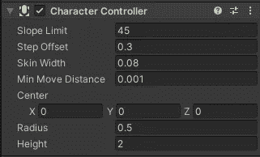

现在创建一个新的播放器脚本，并将其附加到播放器上。

**运动**

对于角色控制器，你需要速度、跳跃高度和重力的变量。您还需要角色控制器的变量和一个保存玩家 y 轴值的变量。

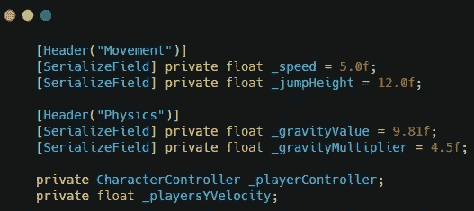

注意:我将在后面解释这两个重力变量

在 start 方法中设置你的角色控制器变量。

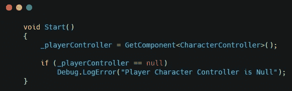

创建一个处理玩家移动的方法，并在 update 方法中调用这个方法，以使您的代码更容易阅读，更有条理。

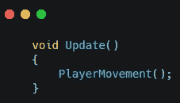

在移动方法中，创建变量来保存玩家的水平和垂直输入。然后，您将创建一个向量 3 来存储玩家的位置，然后创建另一个向量 3 来存储玩家的速度。

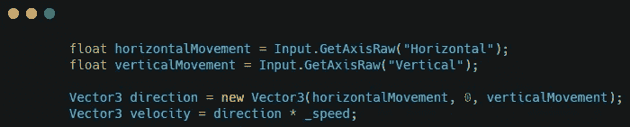

调用角色控制器的 Move 方法，你将让玩家移动。

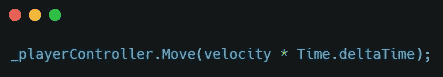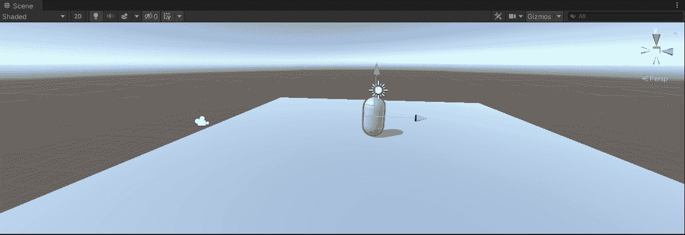

**重力**

现在是施加重力的时候了。

要获得重力变量，请将重力值乘以 Time.deltaTime 和重力乘数。我发现这给了玩家一个很好的跳跃感觉，通过用 Time.deltaTime 平滑它，然后乘以重力乘数来控制玩家下落的速度。

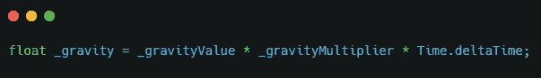

示例:

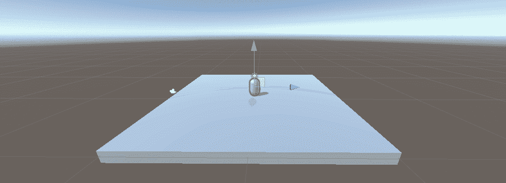

重力乘数是 1

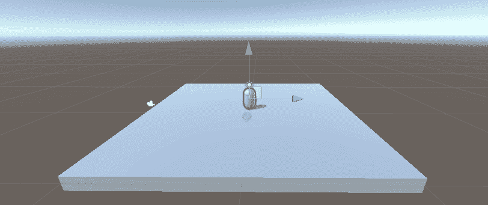

重力乘数是 4.5

使用 if 语句检查播放器是否接地。如果玩家没有被固定，从玩家的 y 速度中减去重力。

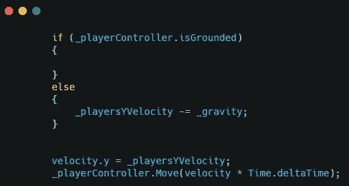

这将对玩家施加重力。

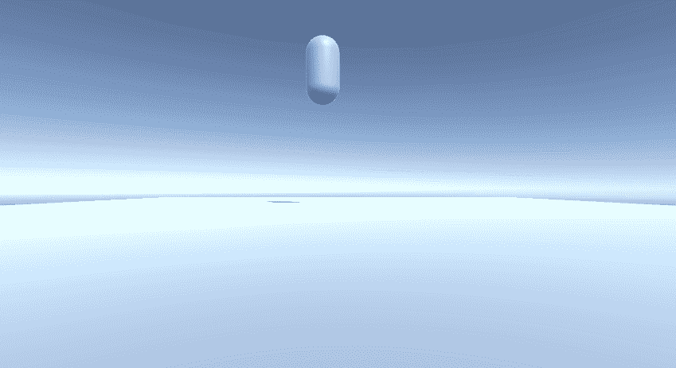

**跳跃**

加跳很简单。

如果玩家被禁足并按下空格键，则将玩家的 y 值设置为跳跃高度。

这将允许玩家跳跃。

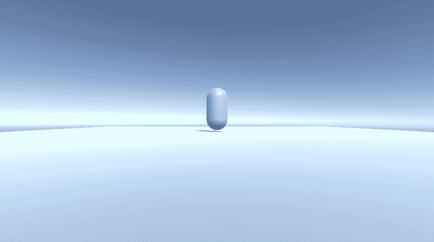