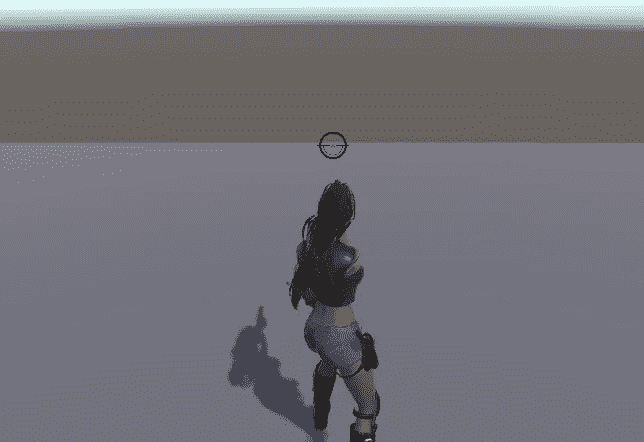
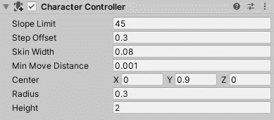
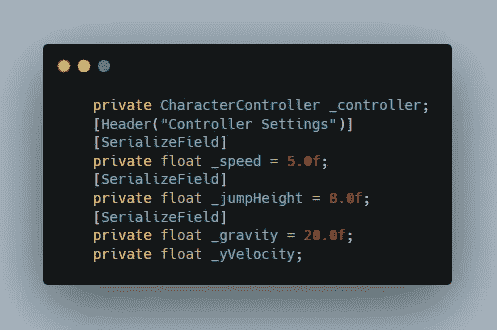
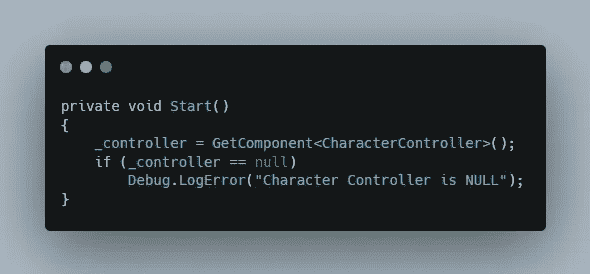
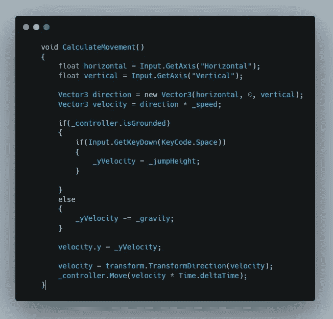
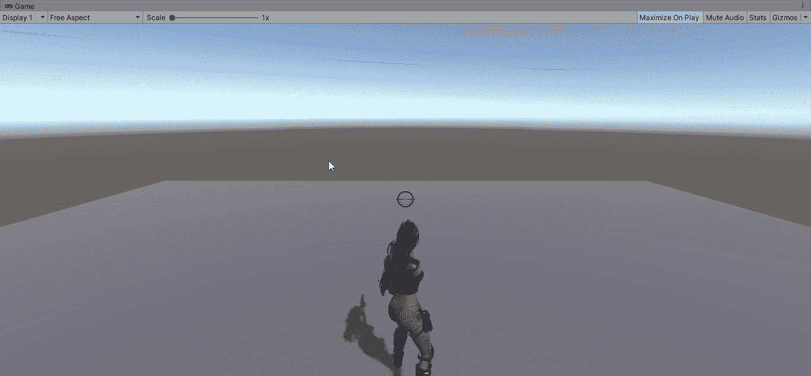

# 使用角色控制器移动角色

> 原文：<https://medium.com/nerd-for-tech/character-movement-with-character-controller-6893d6f05337?source=collection_archive---------9----------------------->

第三人称僵尸射手

**目标:**允许玩家使用角色控制器移动

首先给玩家添加一个角色控制器组件，并移除它的碰撞器。

现在为角色控制器创建一个参考变量，为玩家运动的速度、跳跃高度、重力和 yVelocity 创建一个浮动变量。

将引用分配给 start 函数中创建的角色控制器变量。

现在创建一个新的函数来存储玩家的行为。在它里面创建两个浮点变量，分别存储水平移动和垂直移动值。

然后创建一个方向向量，并创建其速度，这是方向乘以速度。

然后检查播放器是否接地，然后检查是否按下了空格键。如果为真，则将跳跃高度值存储到 yVelocity，如果玩家没有被固定，则通过用 yVelocity 减去重力值来应用重力。

用 yVelocity 改变原始速度向量中的 y 轴，以便玩家根据逻辑跳跃、下落。

现在将速度从局部空间转换到世界空间，并通过角色控制器移动玩家。

这是最终的结果。