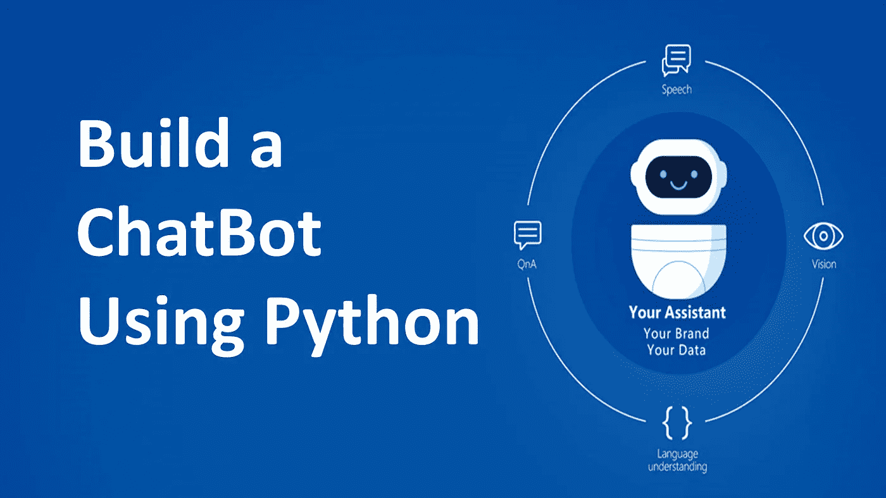
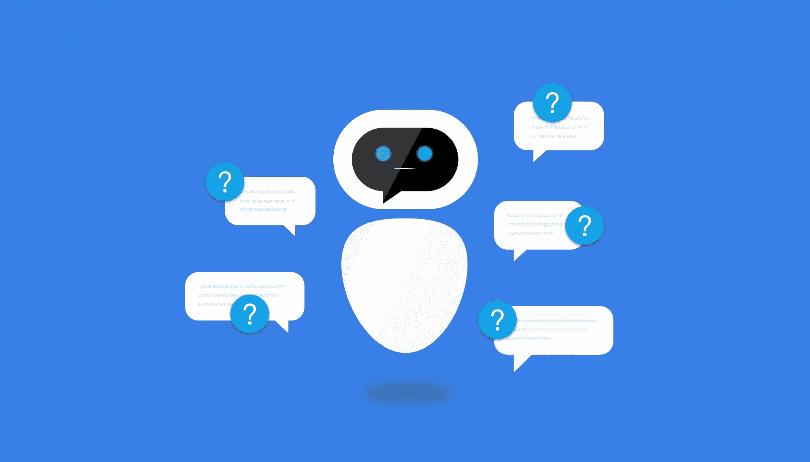

# 15 分钟使用 Python 的聊天机器人！

> 原文：<https://medium.com/nerd-for-tech/chatbot-in-15mins-using-python-88b13b75f4af?source=collection_archive---------10----------------------->

我们可以将聊天机器人定义为基于人工智能的模拟人类对话的计算机程序。他们解释用户的意图，处理他们的请求，然后给他们及时相关的答案。你可能经常在浏览时遇到他们，他们会弹出来并主动帮助你。如今，几乎所有的公司都使用聊天机器人，因为它们可以减少客户服务时间，而且全天候可用。

***你一定在想，“聊天机器人？大不了！一定很难。”***

好吧，好吧，好吧，这并不困难。 ***遵循这 5 个步骤和 Tada！你的聊天机器人准备好了。***

*第一步:安装 chatterbot 库。*

*第二步:从 chatterbot 模块导入所需的类。*

第三步:创建你的机器人。

第四步:训练你的机器人。

第五步:与你的机器人交流。

学分:I2 教程

## 让我们开始创建我们的聊天机器人。

> **第一步:安装聊天机器人库**

有两种方法可以通过你系统的终端/外壳窗口或者通过 Google colab(如果你正在使用的话)。

**语法:**

**> > pip 安装聊天机器人**

**> > pip 安装聊天机器人 _ 文集**

***注:*** *1。如果您使用的是 google colab 之外的其他 python 终端，并在交互式 shell 上直接键入这些内容，您可能会出现错误，因此请记住打开您的终端/命令提示符/shell，首先键入上述语法，然后打开您的 python IDE/终端。*

*2。也可以直接从 GitHub 安装 ChatterBot 的最新开发版本。为此，您必须编写并执行以下命令*:

[pip 安装 git+git://github . com/gunthercox/chatter bot . git @ master](https://github.com/gunthercox/ChatterBot)

> 第二步:从 chatterbot 模块导入类。

**语法:**

**> >从聊天机器人导入聊天机器人**

**> >从 chatterbot.trainers 导入 ListTrainer**

学分:elnfochips

> 第三步:创建你的机器人。

所以现在让我们为聊天机器人创建一个实例，并命名为！

有两种方法可以做到-

**语法:**

**>>bot = ChatBot(' Lilly ')**

或者

**>>bot = ChatBot(name = ' Lily ')**

现在，我们用逻辑适配器创建 bot 对象。

**语法:**

**>>bot = ChatBot(' Lily '，logic _ adapters =[' chatter bot . logic . best match '，' chatter bot . logic . mathematical evaluation '，' chatter bot . logic . timelogicadapters '])**

命令“logic_adapters”表示用于训练聊天机器人的适配器列表。“chatter bot . logic . mathematical evaluation”帮助机器人解决数学问题，“chatterbot.logic.BestMatch”帮助它从已经提供的响应列表中选择最佳匹配。TimeLogicAdapter **识别询问当前时间问题的语句**。如果检测到匹配的问题，则返回包含当前时间的响应。

> **第四步:用一些数据训练你的机器人。**

这里有一个我用来训练我的机器人的训练数据集的例子。

**语法:**

**>>trainer = list trainer(bot)**

trainer.train(['嗨'，'嘿'，'你好吗？'，‘我很好。“你呢，”，‘你叫什么名字？我的名字是劳拉！，‘我能帮你什么吗？' '请详细说明，您的关注'，'好的谢谢'，'没问题！祝你愉快！])

> 第五步:和你的聊天机器人交流。

耶！我们差不多完成了。

要与机器人交互，请使用 get_response()函数。这里有一个小例子，你可以相应地与 bot 进行通信。

**语法:**

**>>print(bot . get _ response(' Hi ')**

嘿

**>>print(bot . get _ response('你好吗？'))**

我很好。你呢？

**> >打印(bot.get_response("你叫什么名字？"))**

我的名字是劳拉！

这就是你自己的聊天机器人！

鸣谢:博客拉萨尔

重要的是我们要明白，我们创造的聊天机器人可能不知道我们所有问题的答案，因为它的训练是有限的。

为了进一步训练我们的聊天机器人，我们可以使用现有的语料库数据或使用我们自己的数据。这里有一个例子，说明我们如何使用聊天机器人本身提供的语料库数据。

**语法:**

**> >从 chatterbot.trainers 导入 chatterbotporustrainer**

**>>corpus _ trainer = chatterbotcorpstrainer(my _ bot)**

**>>corpus _ trainer . train(' chatter bot . corpus . English ')**

这就是我们如何用 Python 创建聊天机器人:)。

放心平吧，总有改进的余地；).

*作者:*R·P·帕维他。