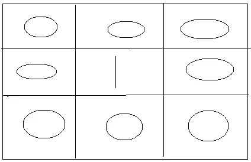

# 检查障碍游戏板中可用路径的数量— JavaScript

> 原文：<https://medium.com/nerd-for-tech/check-for-number-of-available-paths-in-an-obstaclegame-board-javascript-949680737258?source=collection_archive---------2----------------------->

嗨，伙计们，这些类型的问题在编码能力测试和其他类型的编程测试中非常流行。考虑一个场景，我们有一张带网格的纸，我们只允许某人进入标有“0”的单元格。如果你在途中发现“1”，那就是一个障碍。当这样做时，有各种各样的方法，但在这里我将讨论使用动态规划的最佳解决方案。



游戏板

这里我们应该考虑的事情如下:

*   我们需要一步一步地到达网格右下角的单元格
*   我们每走一步都要做出选择，选择是:向右走还是向下走！
*   在这条路上有些地方我们踩不到
*   我们需要知道有多少种独特的方式可以到达终点！

所以我们将使用如下方法，

*   开始逐行遍历给定的游戏棋盘 2D 矩阵，并填充其中的值。
*   对于第一行和第一列，如果没有发现障碍物，则将值设置为 1。
*   对于第一行和第一列，如果发现障碍，则开始填充 0，直到该特定行或列中的最后一个索引。
*   现在从第二行第二列开始遍历(例如:board[ 1 ][ 1 ])。
*   如果发现一个障碍，在特定的格子上设置 0(例如:棋盘[ i ][ j ])，否则在棋盘[ i ][ j ]上设置上下值之和。
*   返回 2D 矩阵的最后一个值。

该解决方案的 JavaScript 代码如下。

```
function uniquePathsWithObstacles(board) {
    let r = board.length;
    let c = board[0].length;

    if (board[0][0] != 0) return 0;

    board[0][0] = 1;

    for (let j = 1; j < c; j++) {
        if (board[0][j] == 0) {
            board[0][j] = board[0][j - 1];
        } else {
            board[0][j] = 0;
        }
    }

    for (let i = 1; i < r; i++) {
        if (board[i][0] == 0) {
            board[i][0] = board[i - 1][0];
        } else {
            board[i][0] = 0;
        }
    }

    for (let i = 1; i < r; i++) {
        for (let j = 1; j < c; j++) {
            if (board[i][j] == 0) {
                board[i][j] = board[i - 1][j] + board[i][j - 1];
            } else {
                board[i][j] = 0;
            }
        }
    }

    return board[r-1][c-1];
}

let ***board*** = [[0, 0, 0], [0, 1, 0], [0, 1, 0]];

***console***.log(uniquePathsWithObstacles(***board***));
```

将该文件保存为 game-board.js，然后使用以下命令运行该程序。

```
node game-***board***.js
```

快乐的编码伙计们！！！