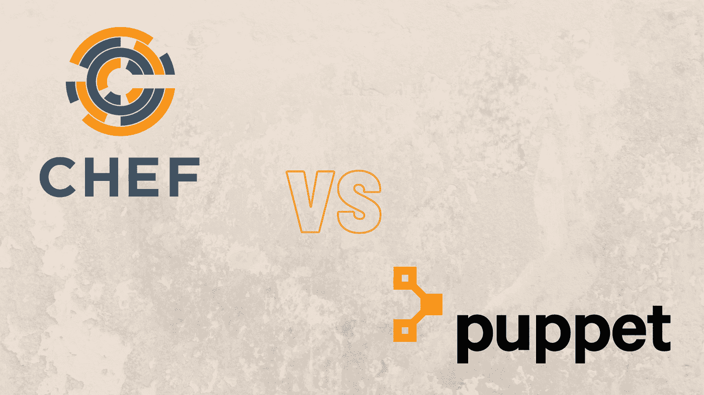

# 厨师大战木偶:你需要知道的一切

> 原文：<https://medium.com/nerd-for-tech/chef-vs-puppet-everything-you-need-to-know-c5001f53b1b1?source=collection_archive---------24----------------------->

谈到开源系统管理工具，有数百种选择。但是我们想通过比较两个顶级工具——厨师和木偶——来让你的生活更轻松。我们还将了解它们的优点、缺点和相似之处。

**目录**

1.  厨师是什么？
2.  什么是木偶？
3.  厨师和木偶有什么共同点？
4.  厨师的利与弊
5.  木偶的利弊
6.  最后的想法

# 厨师是什么？

Chef 是一个开源自动化平台，允许您将基础架构转换为一组代码。Chef 的美妙之处在于它适用于大多数环境，无论是云环境、本地环境还是混合环境。这里有个有趣的原因，为什么叫大厨。它将系统任务转换成食谱和食谱。这些烹饪书和食谱可以在以后每天运行更多的系统任务。因此，这个开源应用程序被称为 Chef。

Chef 在许多不同的平台上运行。我们在下面列出了其中的一些。

*   微软 Azure
*   谷歌云平台
*   OpenStack
*   IBM Bluemix
*   思科 IO
*   关系
*   亚马逊网络服务
*   VMware
*   Rackspace

Chef 允许您自动化整个网络的配置、部署和管理过程。该应用不特定于任何确定的基础设施规模，并且可以应用于各种各样的基础设施。

# 什么是木偶？

Puppet 是一个开源系统管理工具。它类似于 Chef，主要用于集中和自动化配置管理。它构成了自己的声明性语言。这有助于描述系统配置。

像 Chef 一样，Puppet 也在许多平台上得到支持，包括-

*   红帽企业版 Linux
*   SUSE Linux
*   人的本质
*   一种男式软呢帽
*   微软视窗 7、8、10
*   macOS 10.12 和 10.13
*   Arch Linux
*   Gentoo Linux
*   Oracle Solaris 版本
*   FreeBSD
*   OpenBSD
*   AIX(6.1 以上的所有版本)

Puppet 主要用于管理 Unix 和 Windows 等系统的配置。然而，随着演进，开发人员开始扩展对许多其他平台的支持，如上面的列表所示。

Puppet 中的所有信息都存储在“puppet manifests”中。然后，它使用名为 Facter 的实用程序发现所有这些信息。一旦 Facter 发现了这些清单中的所有信息，就会将其编译到一个特定于系统的目录中，其中包含所有系统及其相应的资源。但是说到底，Puppet 是一个模型驱动的软件，可以用非常有限的编程知识来使用。

# 厨师和木偶有什么共同点？

以下是厨师和木偶的一些相似之处-

## 它们是高度可扩展的

Chef 和 Puppet 都可以处理大量数据和基础架构，而不会崩溃。作为开发人员，您所需要做的就是向它提供需要配置的 IP 地址和主机名。一旦你为这两个平台提供了这些重要的数据，它就会像一个充满电的时钟一样运行。

## 有自己的 DSL

DSL 代表特定领域语言。说到配置语言，Chef 和 Puppet 都有自己的一套语言。对于 Chef，您有 Ruby DSL，而对于 Puppet，您有 Puppet DSL。这两种语言都很难学，但是一些编程和开发的基础知识可以让它变得容易。

## 它们是可互操作的

Chef 和 Puppet 都是可互操作的，可以跨多个平台使用。这包括著名的 Linux 和 Unix。Chef 和 Puppet 都可以在像 Windows 这样的平台上配置。

## 设置非常相似

Chef 和 Puppet 都运行在主客户端架构上。在这种设置中，服务器在主机上运行，而客户机作为代理在所有客户机上运行。使用 Chef，您有一个名为“工作站”的组件，它将处理所有的配置和管理。然而，使用 Puppet，您需要完成代理主认证。

## 管理厨师和木偶很相似

主厨和木偶都在拉式配置上工作。这意味着所有从节点都会自动从主服务器或中央服务器获取它们的配置。你只需要给他们节点的地址，剩下的就交给他们了。

# 厨师的利与弊

## 赞成的意见

*   这是一种代码驱动的方法，提供了更大的灵活性。
*   随着时间的推移，它提供了对配置的更多控制。
*   它有一个专用的“刀”工具来帮助您安装
*   该平台有大量的配置集合
*   厨师也有大量的模块食谱
*   因为它以 GIT 为中心，所以它提供了一组强大的版本控制供您使用

## 骗局

*   如果你不精通 Ruby，学习 Chef 可能是一个挑战
*   Chef 不支持推送功能
*   厨师不是木偶那么简单
*   随着时间的推移，这种复杂性会导致大型代码库的形成。

# 木偶的利与弊

## 赞成的意见

*   Puppet 有一个名为 Puppet labs 的成熟社区
*   初始设置和安装很容易
*   Pupper 提供了系统管理工具领域中最好的 Web UI 之一
*   默认情况下，Puppet 还具有强大的报告功能。
*   Puppet 提供的界面在设计和功能上都很成熟
*   Puppet 可以在市面上的大多数操作系统上运行。

## 骗局

*   它有一个模型驱动的方法，提供较少的控制。
*   Puppet 是基于 Ruby 的，你需要熟悉它
*   当你读到这篇文章时，Ruby 之前的版本中对 Puppet 版本的支持正在被召回
*   傀儡代码库可以很快变大
*   对于新加入团队的员工来说，代码库可能很难理解。

# 最后的想法

合适的工具取决于您组织的目标和需求。如果你是一家拥有相当新团队的小企业，Chef 是你的最佳选择。然而，如果你是一个有固定团队的大型企业，Puppet 是你最好的选择。

*原载于*[*https://www . partech . nl*](https://www.partech.nl/nl/publicaties/2021/05/chef-vs-puppet)*。*