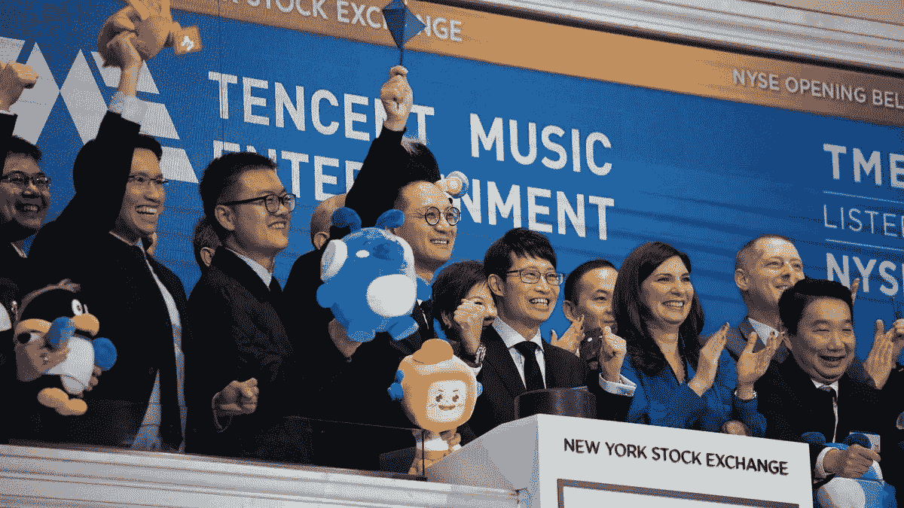
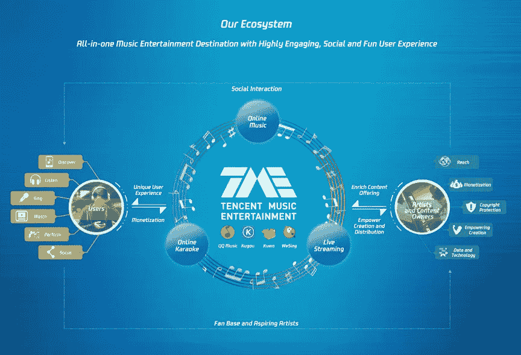
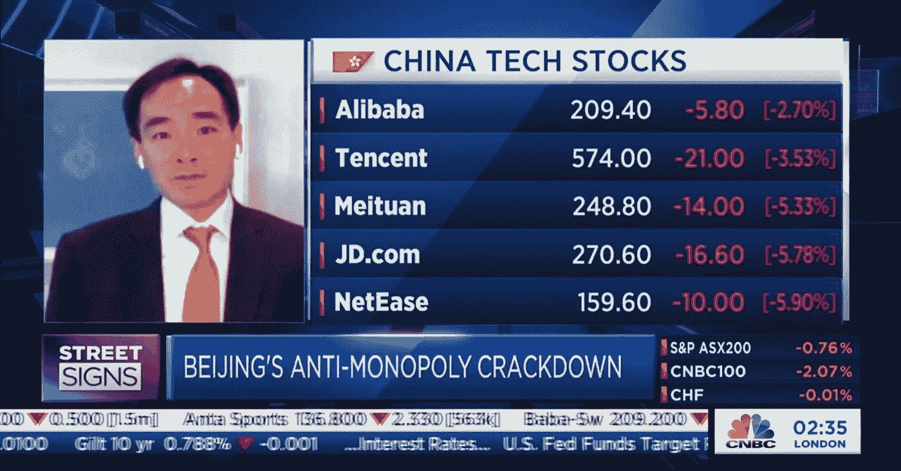
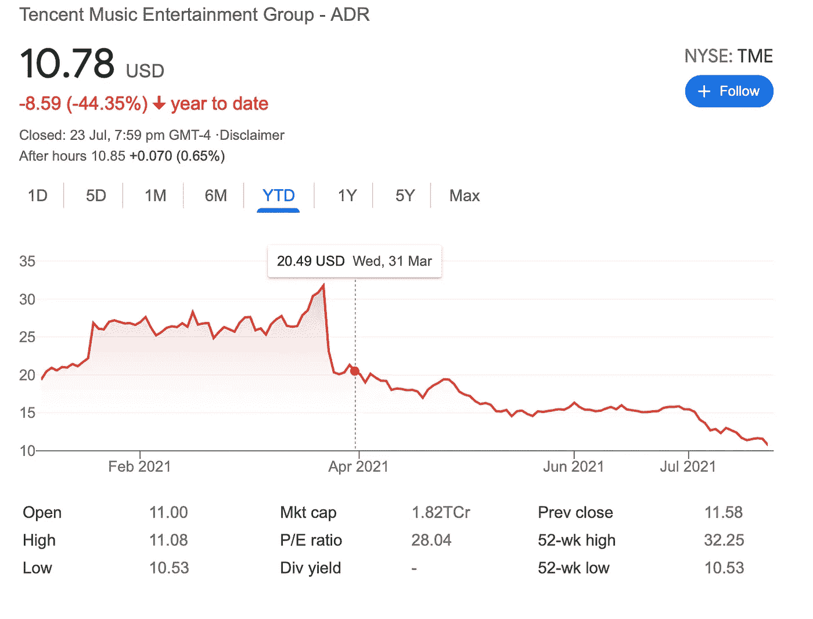

# 🇨🇳China 打击腾讯音乐

> 原文：<https://medium.com/nerd-for-tech/china-cracks-down-on-tencent-music-21de4c61c82d?source=collection_archive---------22----------------------->

我们写了一份关于音乐及其背后的商业和技术的每日时事通讯。如果您想直接在收件箱中获得它，现在就订阅吧！

大家周一快乐！

在中国政府打击科技创业公司的又一个案例中，腾讯音乐娱乐集团(TME)因反竞争行为被❌勒令放弃独家音乐许可权并处以罚款

为什么这样

中国官方监管机构**国家市场监督管理总局(SAMR**)**对该公司处以 50 万元人民币(77141 美元)**的罚款，理由是其在 2016 年收购**中国音乐集团**时存在违规行为。

收购完成后，**腾讯拥有超过 80%的独家音乐库资源**，这使该公司比竞争对手更有优势，因为它能够与版权所有者达成更多独家交易📝

# 但腾讯音乐到底是什么？🤔

腾讯音乐成立于 2016 年，在腾讯收购中国音乐后成立，控制着中国音乐行业的大部分，提供以下核心产品:

**🎵QQ 音乐**

与 Spotify 合作的免费音乐流媒体服务，面向千禧一代和 Z 世代，拥有超过 1.2 亿订户。

**🎧酷狗**

酷果由中国音乐集团公司于 2004 年成立，后被腾讯收购，是中国最受欢迎的音乐流媒体应用程序，占据 28%的市场份额，拥有超过 4.5 亿用户。

**👶🏻酷我**

想想酷果，但是 DJ 混音和儿童音乐的特定流派。

**🎤威辛**

中国最大的在线音乐卡拉 ok 应用程序，在印度尼西亚、泰国和马来西亚等其他东亚国家都有业务。

**📲终极音乐**

一个 B2B 生态系统，提供服务使各种智能设备和汽车制造商能够开发内置音乐播放器。

他们的目标是将音乐融入一切。

基本上，如果中国有音乐，腾讯可能会分一杯羹🤑

以下是他们整个生态系统的快照👇🏻

它于 2018 年在纽约证券交易所上市，被誉为少数几家真正盈利的音乐流媒体公司之一，最近宣布 2021 年第一季度盈利 1.4 亿美元。

举例来说，Spotify 在 2020 年损失了 8.1 亿美元，相当于每天 220 万美元。 [(来源)](https://www.musicbusinessworldwide.com/spotify-lost-the-equivalent-of-2-2m-every-day-in-2020-as-it-spent-over-1bn-on-sales-and-marketing-for-the-first-time/)

凭借高消费的中产阶级人口和超过 80%的中国市场份额，腾讯证明了音乐流媒体模式并没有失去一切，如果你有幸像他们一样享受垄断，肯定会赚钱。

这似乎已经引起了监管机构的注意，作为对中国科技初创公司更广泛打击的一部分，中国最大的科技股市值蒸发了超过 8000 亿美元**，监管机构担心这些公司的垄断行为👇🏻**

# 那么，TME 的下一步是什么？

根据最新的公告，**腾讯及其附属公司必须在 30 天内放弃独家音乐权利，并停止要求版权所有者给予该公司比其竞争对手更好的待遇。**

根据声明，腾讯必须在三年内每年向 SAMR 报告其进展，反垄断监管机构将依法严格监督其实施。

TME 的股东们无疑表现出了胆怯，因为甚至在这一宣布之前，该股已经从 30 美元/股的高点下跌了 44%。

看看这个故事如何发展会很有趣。

当涉及到中国政府时，你真的不能说什么，对吗？🤷‍♂️

如果你喜欢这篇来自 [Incentify](https://incentify.substack.com) *的时事通讯，为什么不与你喜欢的人分享呢？*

*注:关注我们的 insta gram***和* [*推特*](https://twitter.com/clubincentify) *了解更多关于音乐和文化的内容，现在！**

**原载于*[*https://incentify.substack.com*](https://incentify.substack.com/p/china-cracks-down-on-tencent-music)*。**