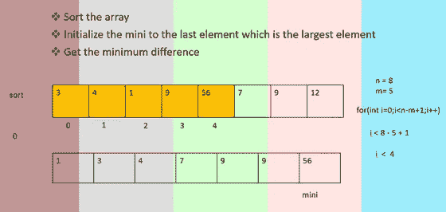

# 巧克力配送问题

> 原文：<https://medium.com/nerd-for-tech/chocolate-distribution-problem-39a0e90a5244?source=collection_archive---------13----------------------->

数组

**问题陈述:**

给定一个大小为 **N** 的正整数数组 **A[ ]** ，其中每个值代表一包巧克力的数量。每包可以有不同数量的巧克力。有 **M** 名学生，任务是在 **M** 名学生中分发巧克力包，这样:
1。每个学生得到**正好**一个包。
2。给学生的最大巧克力数量和最小巧克力数量之间的差异是最小的。

[https://practice . geeks forgeeks . org/problems/chocolate-distribution-problem 3825/1](https://practice.geeksforgeeks.org/problems/chocolate-distribution-problem3825/1)

这里，他们给出了数组的大小、数组元素和学生人数作为输入，如下所示:

1.n =数组的大小

2.a[] =数组

3.m =学生人数

数组元素代表一包巧克力的数量。

我们需要找到:

大小为 m 的子阵列中最大和最小元素之间的最小差值。

达成解决方案的步骤:

1.  **排序:**

我们首先使用内置排序函数对给定的数组进行排序，而不是找到所有可能的子数组。(为了优化代码)

sort(arr，arr+n)；

**2。分配最后一个值:**

然后我们将声明一个变量，比如说“mini”，我们将最后一个数组索引的值赋给它，它将是数组中最大的值，因为我们已经对数组进行了排序。

mini = arr[n-1] (n 是数组的大小)

**3。循环直到找到答案:**

现在，我们要找到实际的答案，它是子阵列的最大值和最小值之间的最小差值。

**for(int I = 0；I<n-m+1；i++)**

在上面的行中，n 代表数组的大小，m 代表子数组的大小(学生的数量)。

而通过这个表达式，“I

For instance , say n = 8 and m= 5 and n-m-1=4 :

From the above diagram, you can see that from the given index, it loops until the next 5 elements which is nothing but the size of subarray.And as i becomes 1, then it’ll loop until 5th index and so on.

Now, here we can’t take i≤m since the index value of first element keeps changing.

**dif = arr[I+m-1]-arr[I]**

在这里，我们找到了突出显示的子数组的第一个元素和最后一个元素之间的差异。arr[i+m-1]表示高亮子数组的最后一个索引，在我们的例子中是 4，arr[i]是索引值为 0 的第一个值。

**if(dif<mini)
{
mini = dif；
}**

通过使用上面的 if 语句，我们得到了循环中子数组的第一个和最后一个元素之间的最小差异。

最后一步就是返回给定的答案。

时间复杂度:O(nlogn)