# 激活功能:选择最适合您网络的功能

> 原文：<https://medium.com/nerd-for-tech/choose-the-best-activation-function-for-your-network-f46154bd9541?source=collection_archive---------4----------------------->

## 在您可以选择的各种激活功能中，哪一个最适合您的型号？

激活函数是神经网络最关键的部分；他们可以创造或破坏一个模型。本文总结了所有可用的激活功能及其优缺点和用例。你可以以此为参考，找到最适合你的，并在其他地方读到更多。

要了解更多关于神经网络以及激活如何适应更大的事物计划，请查看我以前的文章，[第一部分](/nerd-for-tech/a-neural-network-is-just-a-glorified-math-equation-a13b3b220abb)和[第二部分](/nerd-for-tech/four-topics-to-learn-neural-networks-faster-a261220d9234)。

# 什么是激活函数？

简单来说，激活函数是一种引入人工神经网络的函数，用于**帮助网络学习输入数据中的复杂模式。**标准化输入数据是激活功能的重要作用之一。任何一个数据点都不应该仅仅因为它有一个数值上有意义的值而得到更多的偏爱。它接收初级神经元的输出信号，并将其转换为一种形式，用作下一个神经元的输入。

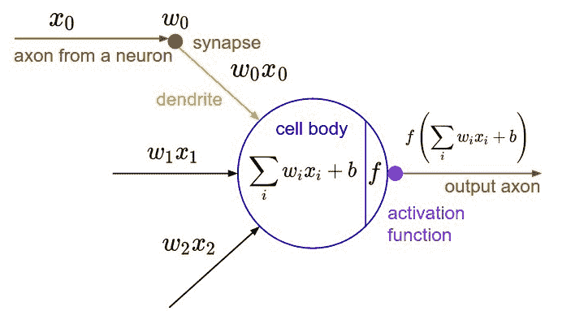

神经元中的激活功能

一般来说，你的神经网络包含两种激活功能。第一个是隐藏层中的激活功能，第二个是输出层中的激活功能。每一层通常具有相同的激活函数，并且对于网络中不同的隐藏层可以有多个激活函数。

# 激活函数的理想性质

激活函数应该具有一些特征，没有这些特征，网络的准确性或速度可能会受到影响。我在这里主要解释一下。

## 可微的

神经网络使用梯度下降进行学习，使用梯度下降进行学习要求函数可微。如果一个函数是不可微的，那么它不能用作激活函数。

## 消失梯度问题

顾名思义，消失梯度是指在神经网络中加入更多具有特定激活函数的层时，损失函数趋近于 0，使得网络难以训练。这意味着，随着层的不断增加，反向传播(神经网络的学习阶段)中的后半部分层没有足够的数据来学习，因此无论数据集有多好，网络都将达到最高精度的瓶颈。

现在很明显，我们应该避免使用任何具有消失梯度问题的函数。

## 零中心的

如果一个函数是以零为中心的，它可以灵活地向两个方向移动，并且比范围在 0 到无穷大之间的函数更好地捕捉数据的本质。

## 计算费用

我们的网络可能有成千上万个密集连接的节点，导致执行数百万次计算。如果该计算在计算上是昂贵的，我们的网络将学习缓慢并需要高计算能力。因此，激活函数在计算上应该是廉价的。

# 激活功能的类型

## 二元阶跃函数

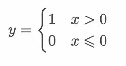

阶跃函数

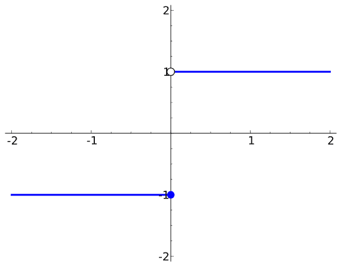

来源:维基媒体|阶梯函数

二元阶跃函数顾名思义；如果 x 值大于 0，则 y 为 1；否则，0。 ***二元阶跃函数是最早用于神经网络*** 的激活函数之一。

虽然这个函数有一个很大的问题，但是如果 x 值是 3 或 3，00，000，那么输出总是 1。类似地，任何小于零的数字都被转换为零。这使得学习变得困难。在输入函数之前，很难说这个值是多少。如果我们不知道*离期望值有多近*或*多远*，优化者就很难调整权重。

## 线性函数

来源:维基媒体|线性函数

线性函数是另一种较早使用但很少再使用的激活函数。线性函数很难拟合非线性函数，这是我们在大多数神经网络问题中普遍遇到的问题。

## 非线性函数

非线性函数是不能用直线来表示的函数。非线性函数的最好例子是正弦函数。非线性函数可以提供关于数据的粒度信息，并对数据进行归一化处理。

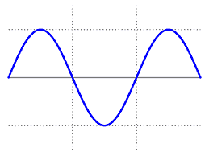

来源:维基媒体|非线性函数

目前，由于上述各种优点，所有的神经网络都使用非线性激活函数。因此，在本文中，我们将只讨论不同的非线性激活函数。

# 非线性函数的类型

## 1.Sigmoid 函数

函数公式和图表如下。

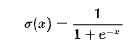

Sigmoid 函数方程

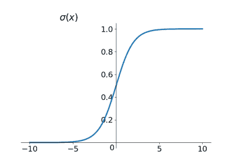

Sigmoid 函数图

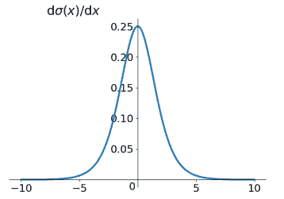

Sigmoid 函数微分图

这个函数被添加到列表中只是为了完善。现在很少用了。

**优点:**

*   平滑渐变，防止输出值“跳跃”。
*   输出值介于 0 和 1 之间，使每个神经元的输出正常化。
*   精确预测，即非常接近 1 或 0。

**缺点:**

*   倾向于梯度消失
*   功能输出不以零为中心
*   幂运算相对耗时，即计算量大。

## 2.Tanh 函数

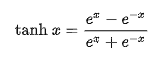

双曲正切方程

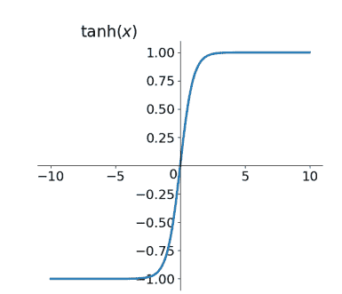

正切图

添加这个函数也只是为了完善。双曲正切函数。

***双曲正切函数和 sigmoid 函数的曲线非常相似。*** 让我们对比一下它们。首先，当输入较大或较小时，输出几乎是平滑的，梯度适中，这不利于权重更新。输出间隔是区别它们的地方。

它比乙状结肠稍微好一点，因为它是以零为中心的，但它仍然有另外两个缺点，这两个缺点大于优点。

## 3.ReLU 函数

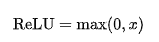

ReLU 函数方程

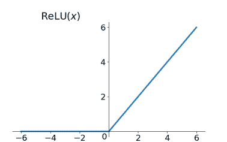

ReLU 函数图

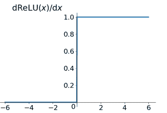

ReLU 函数微分图

ReLU 除了 0 后的偏差几乎是线性的。

**优点:**

*   当输入为正时，存在 ***无梯度消失问题*** 。
*   **的计算速度要快得多。**ReLU 函数只有线性关系。无论是向前还是向后，都比乙状结肠和 tanh 快很多。(sigmoid 和 tanh 需要计算指数，会比较慢。)

**缺点:**

*   当输入为负时，ReLU 完全无效，这意味着如果输入负值，ReLU 将会死亡。在这种方法中，正向传播过程中没有问题。有些地方敏感，有些地方不敏感。然而，如果您在反向传播过程中提供一个负值**，梯度**将完全为零**，这与 sigmoid 和 tanh 函数的问题相同。**
*   **我们发现 ReLU 函数的输出不是 0 就是一个正整数，这表明它不是一个以 0 为中心的函数。**

## **4.泄漏 ReLU 函数**

**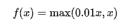**

**泄漏 ReLU 方程**

****

**泄漏 ReLU 函数图。这里，a = 0.01**

**人们建议将 ReLU 的前半部分设置为 **0.01x，而不是 0** ，以修复死的 ReLU 问题。另一个简单的概念是基于参数的方法，参数 ReLU: f(x)= max(alpha x，x)，其中 alpha 通过反向传播学习。原则上，漏 ReLU 具有 ReLU 的所有优点，加上死 ReLU 不会有任何困难，但是在实践中，*漏 ReLU 总是比 ReLU 好，这一点还有待证明。***

## **5.ELU(指数线性单位)函数**

**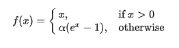**

**ELU 函数方程**

**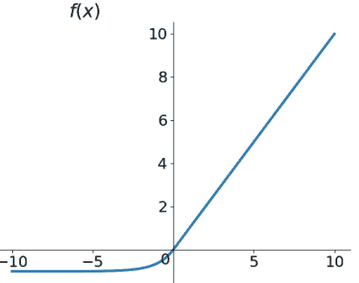**

**ELU 函数图**

**ELU 也是 ReLU 问题的解决方案。ELU 拥有 ReLU 的所有优势，以及:**

*   **没有死 ReLU 问题。**
*   **输出的平均值接近 0(以零为中心)。**

**一个小缺点是它需要更多的处理能力。同样，理论上讲，泄漏的 ReLU 优于 ReLU，但目前在实践中没有强有力的证据证明 eLU 总是优于 ReLU。**

## **6.参数 Relu**

**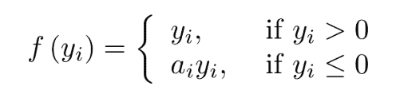**

**普雷路方程**

**上面，yᵢ是第 I 个通道上的任何输入，零中心负斜率，一个可学习的参数。与 eLU 相比，PReLU 略胜一筹，因为它的计算量不是很大。**

****

**预卢函数图**

> **如果 aᵢ=0，f 变成了 ReLU**
> 
> **如果 aᵢ>0，f 变成泄漏的 ReLU**
> 
> **如果 aᵢ是一个可学习的参数，f 变成 PReLU**

## **7.Softmax**

**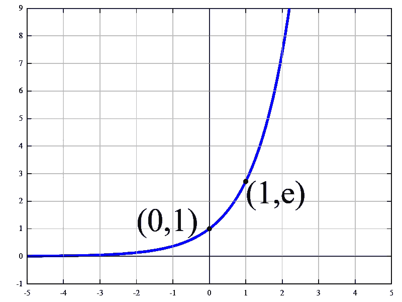**

**来源:维基百科| Softmax 函数图**

**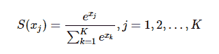**

**Softmax 函数**

**这个公式可能会让你有点害怕，但它只是一种复杂的方式来表示一个输入的 ***平均值的 e*** 次方。其中 e ≈ 2.71828。**

**从图中可以清楚地看到，将任何东西提升到 e 次方，我们得到的是一个以零为中心的角度值。这有助于强调结果的正确性。**

**这些值的平均值有助于标准化结果值，使其介于 0 和 1 之间。**

## **8.Swish(自门控)功能**

**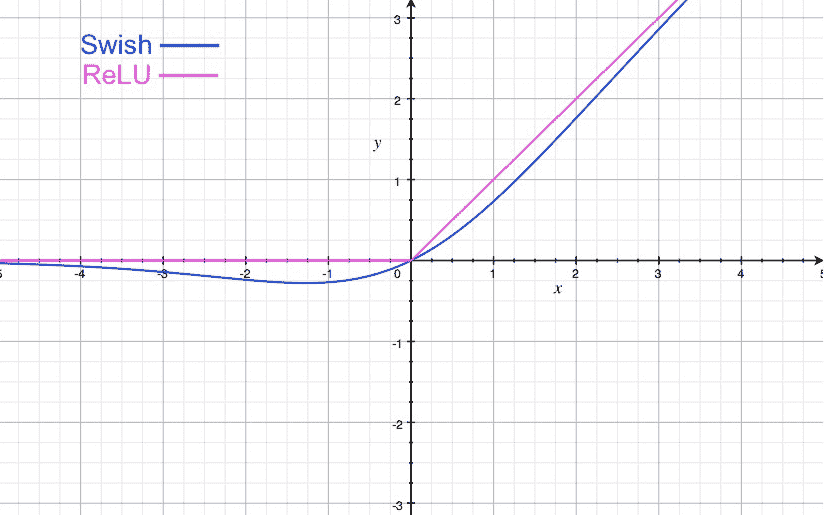**

**Swish 函数图**

****y = x * sigmoid (x)****

**Swish 的设计受到 LSTMs 中使用 sigmoid 函数和高速公路网络门控的影响。为了简化门控过程，我们使用相同的门控值，称为自门控。**

**自门控的优点是只需要一个标量输入，而传统门控需要几个标量输入。这个特性允许像 Swish 这样的自门控激活函数容易地替代接受单个标量作为输入的激活函数(像 ReLU ),而不影响隐藏容量或参数数量。**

## **9.最大输出**

**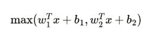**

**最大输出函数方程**

**最大输出激活是概括 ReLU 和泄漏 ReLU 功能的功能。Maxout 可以考虑为深度学习网络增加一个激活函数层，一个参数 k，与 ReLU、sigmoid 等层相比，这个层的独特之处在于增加了 k 个神经元，然后输出最高的激活值。**

## **10.Softplus**

**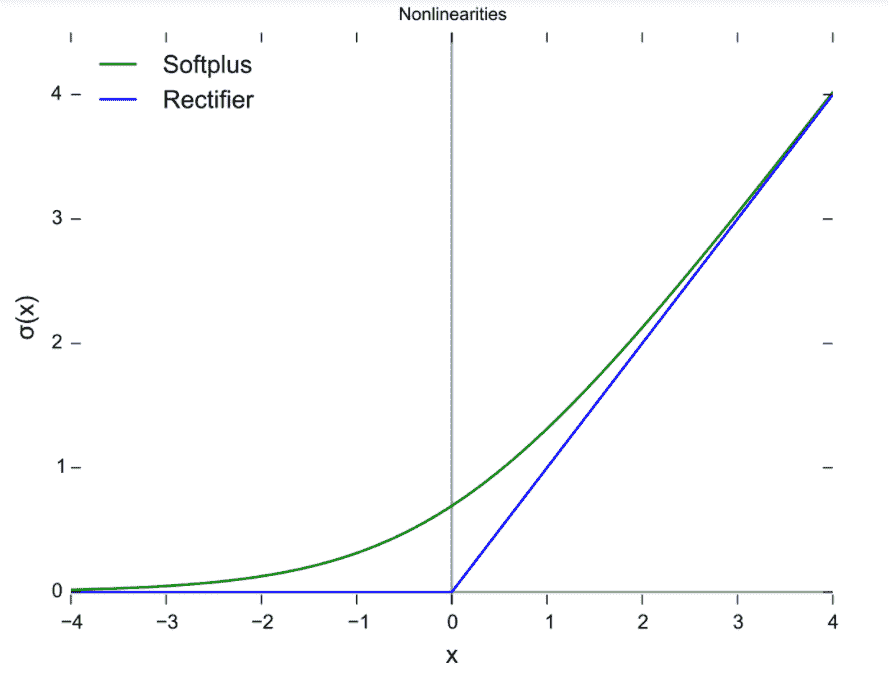**

**与 ReLU 相比的 Softplus 函数图**

**softplus 函数和 ReLU 函数类似，但是比较平滑。是像 ReLU 一样的单方面打压。接受范围广(0，+ inf)。**

# **推荐用法**

**Sigmoid 和 tanh 函数目前很少使用，因为它们的消失梯度问题。因此，我们应该避免它们。ReLU 及其类型可以在您的模型中开始使用，然后如果我们没有得到想要的结果，我们可以选择其他函数。**

**Softmax 通常用于输出层，对接收到的输出进行归一化，并找出*如何接近*原始值以及接近多少。**

# **结论**

**有许多激活功能可供选择，我希望这篇文章可以帮助您跳过所有的废话，让您清楚地了解为您的网络使用哪个功能。**

**TLDR:如果有疑问，在隐藏层使用 ReLU 函数，在输出层使用 softmax 函数，以防分类问题。**

**一定要让我知道你想让我接下来写什么。下次见，快乐学习！**