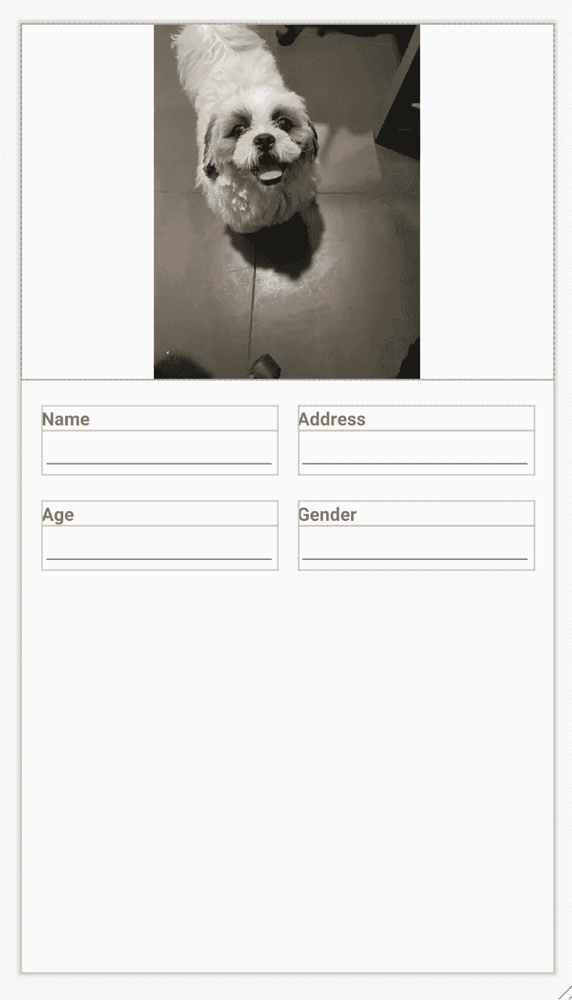
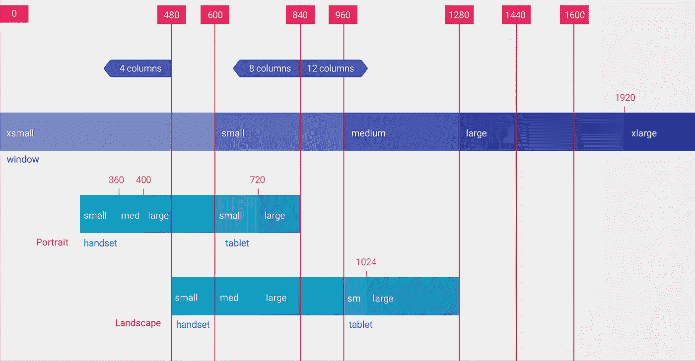
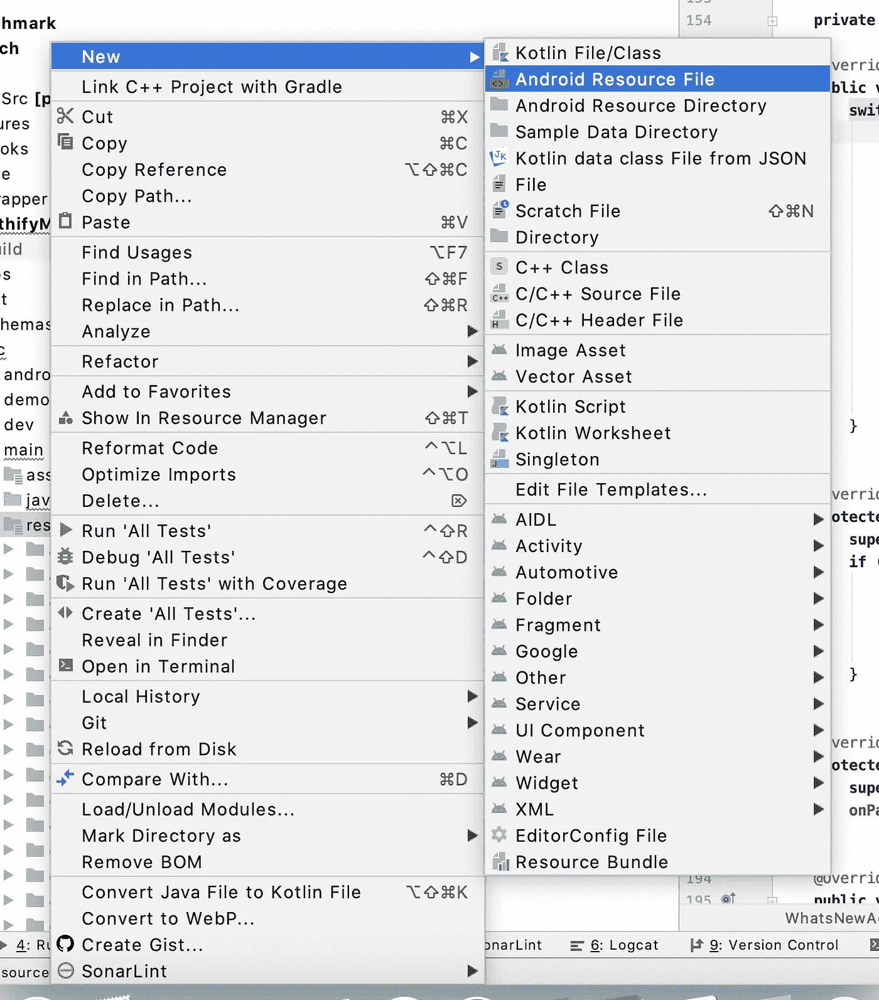
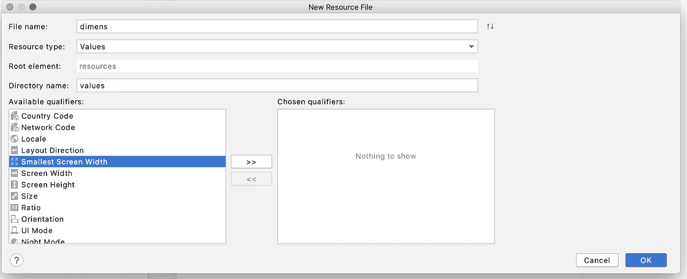
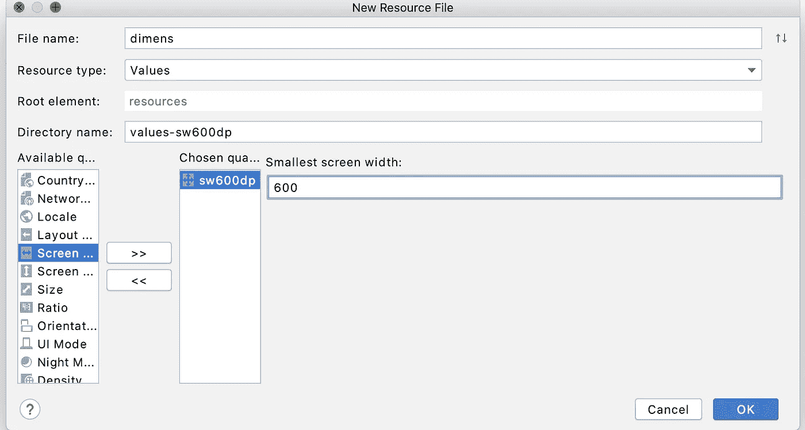
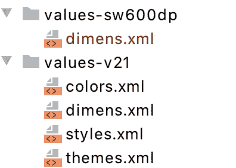

# 设计 android 应用时选择最佳布局

> 原文：<https://medium.com/nerd-for-tech/choosing-the-best-layout-while-designing-your-android-application-560ba2a7f0d4?source=collection_archive---------0----------------------->


[图片来源](https://unsplash.com/@halacious)

*为我们的应用程序 UI 选择正确的布局并不总是那么容易。错误的根布局会导致复杂的层次结构，从而降低渲染阶段的性能。*

许多开发人员，尤其是初学者，经常会做出错误的选择，因为他们不知道不同布局的特点。在这个系列文章中，我试图涵盖不同布局的优缺点，这样你就可以根据你的需要选择最好的。

在上一篇文章中，我们讨论了约束布局如何减少布局的嵌套。

[](/@karishma.agr1996/linear-layout-v-s-constraint-layout-6b64e7a08ed7) [## 线性布局 V/S 约束布局

### 在本文中，我们将讨论线性布局和约束布局的基本可行性，线性布局和约束布局的优点

medium.com](/@karishma.agr1996/linear-layout-v-s-constraint-layout-6b64e7a08ed7) 

在本节中，我们将讨论如何不使用约束布局。

```
*<?*xml version="1.0" encoding="utf-8"*?>* <androidx.constraintlayout.widget.ConstraintLayout xmlns:android="http://schemas.android.com/apk/res/android"
    xmlns:app="http://schemas.android.com/apk/res-auto"
    android:layout_width="match_parent"
    android:layout_height="match_parent"> <ImageView
        android:id="@+id/profile_pic"
        android:layout_width="0dp"
        android:layout_height="0dp"
        android:scaleType="fitCenter"
        android:src="@drawable/dog"
        app:layout_constraintDimensionRatio="1.5:1"
        app:layout_constraintEnd_toEndOf="parent"
        app:layout_constraintStart_toStartOf="parent"
        app:layout_constraintTop_toTopOf="parent" /> <TextView
        android:id="@+id/textView1"
        android:layout_width="0dp"
        android:layout_height="wrap_content"
        android:layout_marginLeft="16dp"
        android:layout_marginTop="20dp"
        android:layout_marginRight="8dp"
        android:text="Name"
        android:textStyle="bold"
        app:layout_constraintEnd_toStartOf="@id/textView2"
        app:layout_constraintStart_toStartOf="parent"
        app:layout_constraintTop_toBottomOf="@id/profile_pic" /> <EditText
        android:layout_width="0dp"
        android:layout_height="wrap_content"
        android:padding="5dp"
        app:layout_constraintEnd_toEndOf="@id/textView1"
        app:layout_constraintStart_toStartOf="@id/textView1"
        app:layout_constraintTop_toBottomOf="@id/textView1" /> <TextView
        android:id="@+id/textView2"
        android:layout_width="0dp"
        android:layout_height="wrap_content"
        android:layout_marginLeft="8dp"
        android:layout_marginTop="20dp"
        android:layout_marginRight="16dp"
        android:text="Address"
        android:textStyle="bold"
        app:layout_constraintEnd_toEndOf="parent"
        app:layout_constraintStart_toEndOf="@id/textView1"
        app:layout_constraintTop_toBottomOf="@id/profile_pic" /> <EditText
        android:id="@+id/edt_address"
        android:layout_width="0dp"
        android:layout_height="wrap_content"
        android:padding="5dp"
        app:layout_constraintEnd_toEndOf="@id/textView2"
        app:layout_constraintStart_toStartOf="@id/textView2"
        app:layout_constraintTop_toBottomOf="@id/textView2" /> <TextView
        android:id="@+id/textView3"
        android:layout_width="0dp"
        android:layout_height="wrap_content"
        android:layout_marginLeft="16dp"
        android:layout_marginTop="20dp"
        android:layout_marginRight="8dp"
        android:text="Age"
        android:textStyle="bold"
        app:layout_constraintEnd_toStartOf="@id/textView4"
        app:layout_constraintStart_toStartOf="parent"
        app:layout_constraintTop_toBottomOf="@id/edt_address" /> <EditText
        android:layout_width="0dp"
        android:layout_height="wrap_content"
        android:padding="5dp"
        app:layout_constraintEnd_toEndOf="@id/textView3"
        app:layout_constraintStart_toStartOf="@id/textView3"
        app:layout_constraintTop_toBottomOf="@id/textView3" /> <TextView
        android:id="@+id/textView4"
        android:layout_width="0dp"
        android:layout_height="wrap_content"
        android:layout_marginLeft="8dp"
        android:layout_marginTop="20dp"
        android:layout_marginRight="16dp"
        android:text="Gender"
        android:textStyle="bold"
        app:layout_constraintEnd_toEndOf="parent"
        app:layout_constraintStart_toEndOf="@id/textView3"
        app:layout_constraintTop_toBottomOf="@id/edt_address" /> <EditText
        android:layout_width="0dp"
        android:layout_height="wrap_content"
        android:padding="5dp"
        app:layout_constraintEnd_toEndOf="@id/textView4"
        app:layout_constraintStart_toStartOf="@id/textView4"
        app:layout_constraintTop_toBottomOf="@id/textView4" /></androidx.constraintlayout.widget.ConstraintLayout>
```



示例用户界面

对于这样的布局，我们正在显示用户的基本信息和个人资料图片。

**ImageView** :为了渲染一张图片，我们使用高度和宽度作为 **0dp** 并将其与父视图对齐，然后使用`**app:layout_constraintDimensionRatio**` 属性提供图片相对于父视图的比率。
那么当我们使用
`**app:layout_constraintDimensionRatio**` 而不是使用 dimen 属性时会发生什么呢？假设如果你想让你的 UI 兼容所有具有不同高度和宽度的相同布局文件的设备，那么 dimension ratio 属性可以帮助你计算设备的完整宽度和高度，并以该比例呈现给定的图像。
例如，我们对图像视图采用 1:1.5 的比例。

以下是给定屏幕的图像大小:
**1080*2160** =宽度【1080】，高度【2160/1.5】
**1200 * 1920**=宽度【1200】，高度【1920/1.5】

所以这个属性有助于多设备支持 ui 实现。

**那么有什么问题呢？** 因为使用这个属性，视图的计算发生在调用 onCreateView()方法的动态时间。这是一个缓慢的渲染过程。在线性布局中，您已经为您的视图提供了尺寸值，但在约束布局中，由于比率属性，当您在设备中安装应用程序并打开相应的活动时，它首先会计算完整的设备大小，然后与给定的父视图对齐，然后找到视图的比率，然后渲染它们，这需要太多时间。所以它调用 draw 类的 onMeasure()方法比 LinearLayout 多十倍。

有时我们希望根据特定的需求显示或隐藏特定的视图，比如显示给定的卡片或隐藏它。在这种情况下，约束布局再次计算完整视图，然后分割并渲染它。这意味着它将花费更多的时间来渲染，这将使用户界面变慢 10 倍。
屏幕渲染时间应以**毫秒**为单位，否则屏幕上会显示滞后。

**有什么解决办法？** 当您想在运行时使用视图的可见性时，最好的选择是使用静态 dimen 值，而不是线性布局的 ratio 或 weight 属性。现在的问题是静态值如何支持多设备。在 android 中，我们可以根据设备大小创建多个 dimen 文件。

**以下是其他最小宽度值与典型屏幕尺寸的对应关系:**

*   320dp:典型的手机屏幕(240x320 ldpi，320x480 mdpi，480x800 hdpi 等)。
*   480dp:手机大屏~ 5”(480 x800 mdpi)。
*   600dp:一款 7 英寸的平板电脑(600x1024 mdpi)。
*   720 DP:10 英寸平板电脑(720x1280 mdpi、800x1280 mdpi 等)。

下图提供了不同屏幕 dp 宽度通常如何对应不同屏幕尺寸和方向的更详细视图。



您可以使用以下步骤在 android studio 中创建多个 dimen 大小的文件:

**第一步**:右键 res 文件夹- >新建- > Android 资源文件



**第二步**:



在文件名提供尺寸，选择最小屏幕宽度从左边的框，点击航空它将移动到右边的框，现在提供屏幕尺寸。如你所知，我们有 320、480、600、720P 的屏幕尺寸，这些都是基本尺寸，你也可以选择更小或更大的屏幕尺寸。



创建后，它在 res 文件夹中看起来会像这样。

```
<resources><dimen name="activity_horizontal_margin">64dp</dimen>
</resources>
```

在 diff diff dimen 文件中，使用相同的键提供 diff 值。并在布局中将其用作`@dimen/**activity_horizontal_margin.**` 当您将应用程序安装到您的设备中时，它将根据屏幕大小选择 dimen 文件。

希望这些信息对你有帮助。如果您有任何疑问或反馈，请回信。总是乐意帮忙。