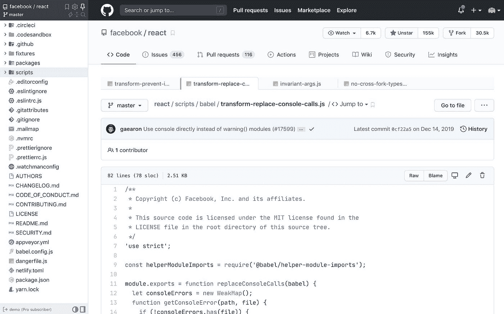
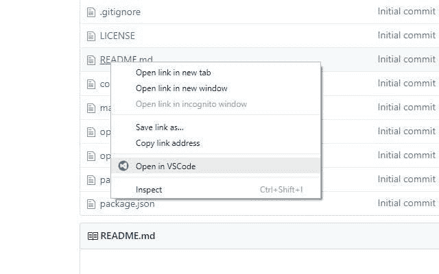
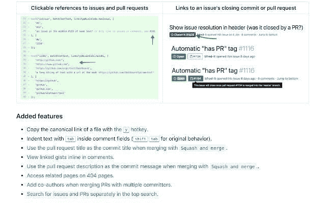
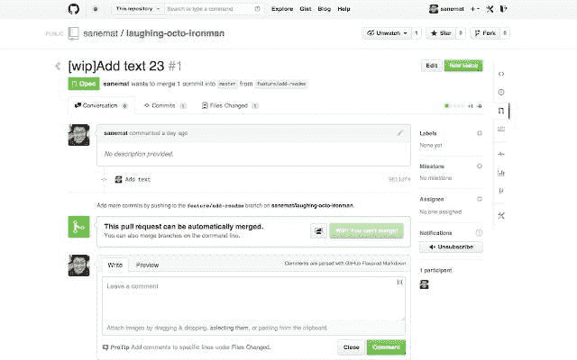
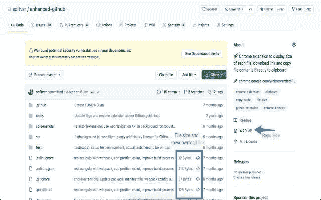
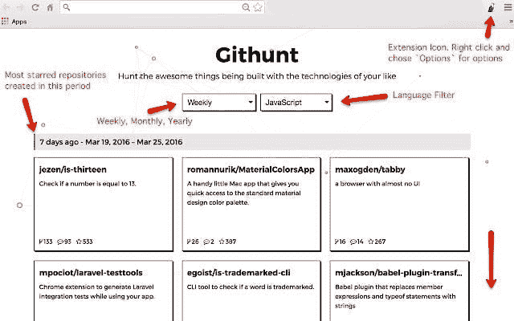
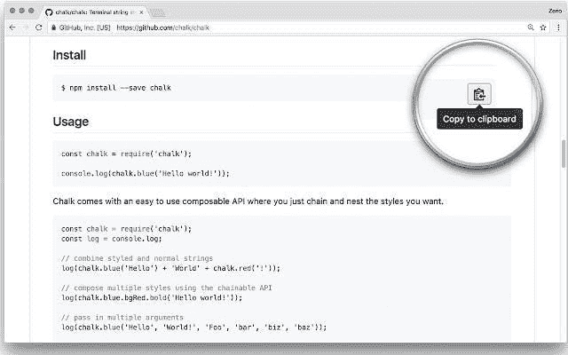

# 增强 GITHUB 体验的 Chrome 扩展

> 原文：<https://medium.com/nerd-for-tech/chrome-extensions-to-enhance-your-github-experience-9e4ef2c98bfb?source=collection_archive---------17----------------------->

Github Chrome 扩展

作为一名开发人员，我们每天都在使用 GitHub，它已经是一个很棒的工具了，但是如果我们可以通过一些 chrome 扩展让它变得更好呢！

让我们来看看其中的一些🔽

# 1.八叉树

它通过以下特性增强了 GitHub 代码审查和探索:

*   类似 IDE 的代码树
*   文件夹和文件搜索
*   问题和拉请求书签
*   支持私有存储库

我很喜欢这个扩展！它允许您浏览具有树状结构的存储库的文件和文件夹。

⭐ [Github 回购](https://github.com/ovity/octotree) | [Chrome 扩展](https://chrome.google.com/webstore/detail/octotree-github-code-tree/bkhaagjahfmjljalopjnoealnfndnagc)

# 2.在 VS 代码中打开

它在 VSCode 中打开任何 Github 存储库的源代码链接。也与 Gitlab 合作。

> *💡* **提示**:如果你想直接用 VSCode 视图打开 Github 中的整个库，而不是单个文件，只需在 GitHub 后加 1s 即可。例子:[github.com/user/somerepository](http://github.com/user/somerepository)->github1s.com/user/somerepository。

⭐ [Github 回购](https://github.com/aberonni/open-in-vscode/) | [Chrome 扩展](https://chrome.google.com/webstore/detail/open-in-vscode/pfakkjlkpobjeghlgipljkjmbgcanpji)

# 3.精制 GitHub

它简化了 GitHub 界面，也增加了有用的功能，例如:

*   添加反应头像，显示谁对评论做出了反应
*   添加一键式合并冲突修复程序
*   添加一个按钮来恢复对 PR 中文件的所有更改

⭐ [Github 回购](https://github.com/sindresorhus/refined-github) | [Chrome 扩展](https://chrome.google.com/webstore/detail/refined-github/hlepfoohegkhhmjieoechaddaejaokhf)

# 4.不合并-在制品

当下列任一情况为真时，禁用“合并提取请求”按钮:

*   标题包含“[wip]”(不区分大小写)
*   任何任务仍未完成
*   任何提交消息都保留前缀“squash！”或者“修复！”

⭐[github repo](https://github.com/sanemat/do-not-merge-wip-for-github)|[chrome 扩展](https://chrome.google.com/webstore/detail/do-not-merge-wip-for-gith/nimelepbpejjlbmoobocpfnjhihnpked)

# 5.增强型 GitHub

它在 GitHub 网站上提供了有用的功能:

*   显示回购规模
*   显示每个活动分支的每个文件大小
*   显示每个文件的下载链接
*   将文件内容直接复制到剪贴板
*   下载文件，同时查看其内容。

⭐ [Github 回购](https://github.com/softvar/enhanced-github) | [Chrome 扩展](https://chrome.google.com/webstore/detail/enhanced-github/anlikcnbgdeidpacdbdljnabclhahhmd)

# 6.吉特亨特

它可以让你在任何时候搜索 GitHub 上最受欢迎的项目。当你想探索一周/一月/一年中最有趋势的回购时，这非常有用。

⭐ [Github 回购](https://github.com/kamranahmedse/githunt) | [镀铬扩展](https://chrome.google.com/webstore/detail/githunt/khpcnaokfebphakjgdgpinmglconplhp)

# 7.代码副本

它可以让你将 GitHub 上任何文件的文本复制到你的剪贴板上。除了 Github，它还致力于:

*   堆栈溢出
*   MDN
*   中等
*   npm
*   要点

⭐[github repo](https://github.com/zenorocha/codecopy)|[chrome 扩展](https://chrome.google.com/webstore/detail/codecopy/fkbfebkcoelajmhanocgppanfoojcdmg)

# 包扎👋

就这样，我们来到了列表的末尾！如果你知道另一个我没有包括但你觉得有用的扩展，请在下面的评论中分享😀

我希望你喜欢这篇文章，并发现它是有帮助的。

感谢阅读:)

***“喜欢你读的书吗？?"*你可以表示一些支持**💙给我买些咖啡，☕

