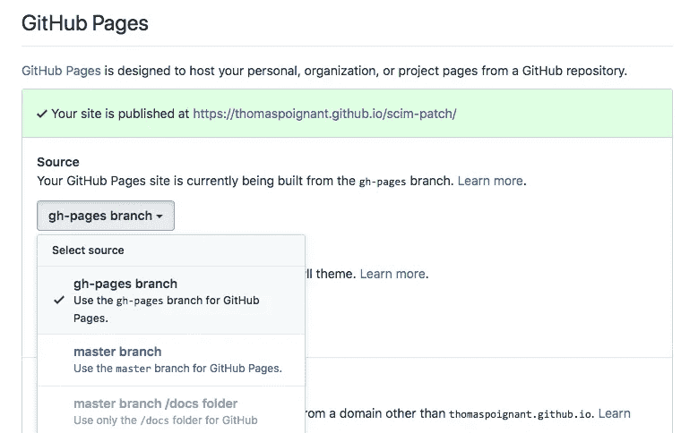
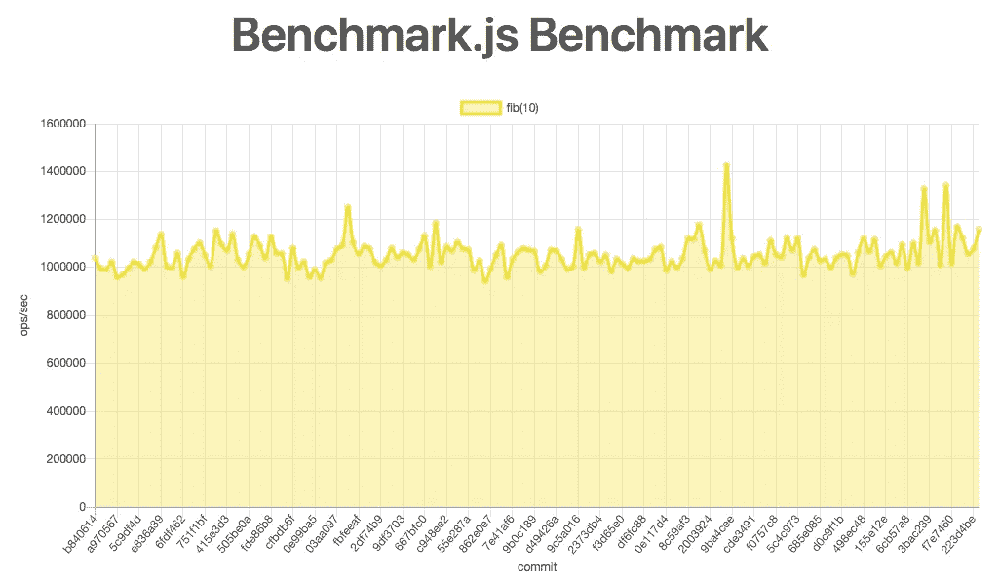
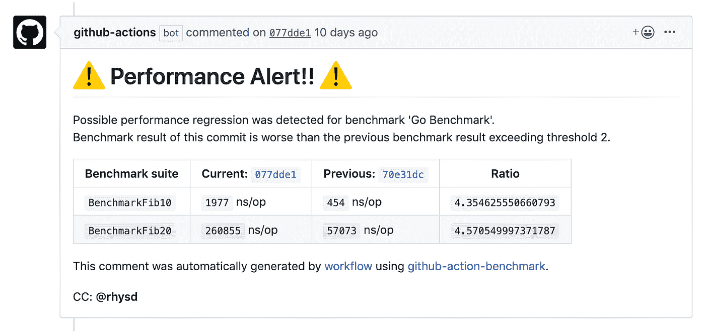

# CI:用 github 动作构建性能测试

> 原文：<https://medium.com/nerd-for-tech/ci-build-performance-testing-with-github-action-e6b227097c83?source=collection_archive---------0----------------------->


如果 **DevOps** 和 **CI/CD** 已经在你的公司完全采用，我相信你已经有一些自动化测试，但是你测试你的**性能**吗？如果没有，您应该考虑在您的发布系列中添加性能测试。

我将展示我如何使用 **GitHub action** 在我的一个 npm 库上测试性能。它提供了检查您是否有性能退化的工具。

# 编写性能测试

可以想象，第一件事就是写性能测试。
因为我在这个库上使用了 typescript，所以我使用了 [**benchmarkjs**](https://benchmarkjs.com/) 框架来编写它。

一个基本的性能测试将如下所示:

```
**import** Benchmark = **require**('benchmark');**const** suite = **new** Benchmark.Suite;
**suite**
    .**add**('some test case', () => {
        *// here call the code you want to test.*
    })
    .**on**('cycle', event => {
        *// Output benchmark result by converting benchmark result to string*
        **console.log(String(event.target));**
    })
    .**run**();
```

如果您没有使用 Typescript/Javascript，请注意 GitHub 动作与以下内容兼容:

*   `[cargo bench](https://doc.rust-lang.org/cargo/commands/cargo-bench.html)`对于 Rust 项目
*   `go test -bench`对于 Go 项目
*   用于 JavaScript/TypeScript 项目的 [benchmark.js](https://benchmarkjs.com/)
*   [py test-用](https://pypi.org/project/pytest-benchmark/) [pytest](https://pypi.org/project/pytest/) 对 Python 项目进行基准测试
*   用于 C++项目的谷歌基准框架
*   对于 C++项目来说

## 为什么要使用基准库

因为在代码中实现它总是一个噩梦，所以这些库运行相同的代码 X 次，以确保在最后有更多相关的统计数据。

# 设置您的 GitHub 操作

GitHub 动作是**连续基准**，在 [GitHub 动作市场](https://github.com/marketplace/actions/continuous-benchmark)有售。

**这个 GitHub 有什么作用？**

1.  它运行您的性能测试
2.  它将结果存储在您的 gh 页面中。
3.  它将其与最后的结果进行比较。
4.  如果达到了性能阈值，它会对您的提交进行注释。

## 1.创建您的`gh-pages`分公司

首先，如果您还没有为 GitHub 页面创建分支，那么您需要为它创建一个分支。这用于显示您的仪表板。

```
*# Create a local branch*
$ **git checkout --orphan gh-pages**
*# Push it to create a remote branch*
$ **git push origin gh-pages:gh-pages**
```

不要忘记在这个分支上激活这个项目的 GitHub 页面。为此，你应该去你的项目设置。



## 2.创建 GitHub 个人访问令牌

您应该[创建 GitHub 个人访问令牌](https://help.github.com/en/github/authenticating-to-github/creating-a-personal-access-token-for-the-command-line)和作用域`repo`，我们用它来推动`gh-pages`分支。

当它被展示的时候不要忘记拷贝它😉。

## 3.创建您的工作流程

在你的项目中创建一个文件`.github/workflow/benchmark.yml`。

该文件应该包含如下内容:

```
name: Benchmark
**on:
  push:
    branches:
      - master**

jobs:
  benchmark:
    name: Check performance regeression.
    runs-on: ubuntu-latest
    steps:
      - uses: actions/checkout@v2
      - uses: actions/setup-node@v1
      - name: Run benchmark
 **run: npm install && npm run bench | tee output.txt**
      - name: Store benchmark result
        uses: rhysd/github-action-benchmark@v1
        with:
          name: Benchmark.js Benchmark
          tool: 'benchmarkjs'
          output-file-path: output.txtgithub-token: ${{ secrets.PERSONAL_GITHUB_TOKEN }}
          auto-push: true**alert-threshold: '130%'**
          comment-on-alert: true
          fail-on-alert: true
 **alert-comment-cc-users: '@thomaspoignant'**
```

**该文件中的重要内容有:**

*   `**on**`部分，如你所见，我们只检查了`master`分公司的绩效。我们这样做是为了在最后有一个可理解的图，如果我们在多个 branch/pull 请求上这样做，结果将是混乱的。
*   `**run**` part 是执行工作台并将结果输出到文件中的命令。
*   `**alert-threshold**` **，**这是在性能下降时评论您提交的阈值。
*   `**alert-comment-cc-users**` **，**每次有 commit 上的注释，它也会 ping 这个用户。

## 4.它看起来怎么样

第一次工作流运行后，您将在`https://you.github.io/repo/dev/bench` [上获得第一个结果，如下图](https://rhysd.github.io/github-action-benchmark/dev/bench/)。



如果达到阈值，您将在提交中直接看到一条注释，如下所示:



# 结论

我使用这个系统来检测库的性能问题，以测试基本的算法回归。但是您可以使用它来调用 HTTP 端点，或者执行您想要测试和监控的更复杂的逻辑。

尽可能多地添加性能测试。这将有助于你和你的团队拥有一个更好的产品，并且在一个版本发布后能快速检测出某个东西是否花费了比平常更长的时间。