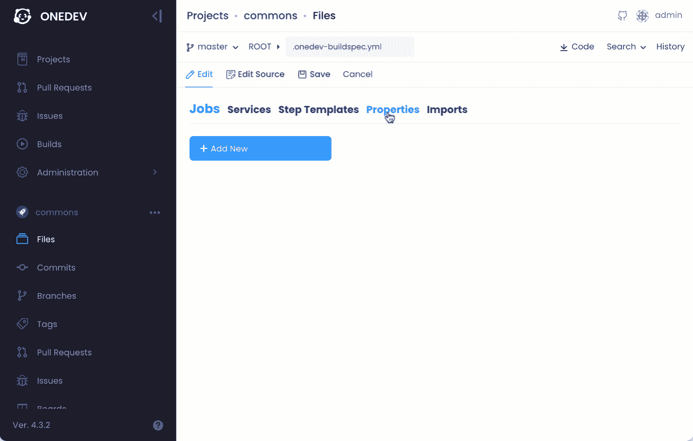
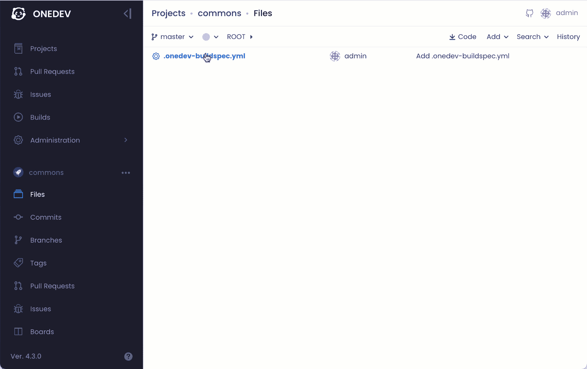
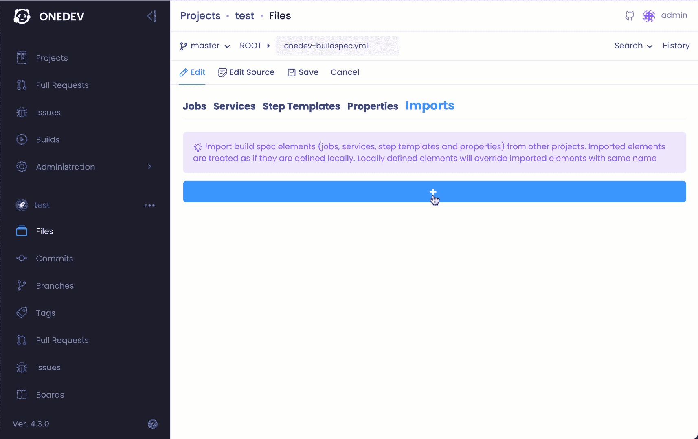
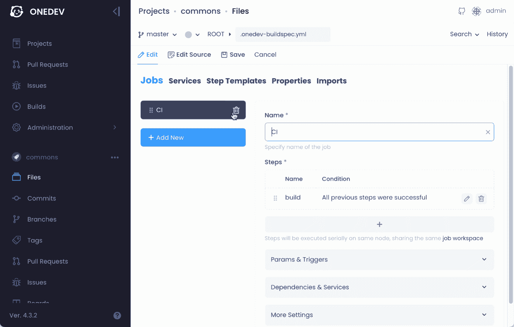
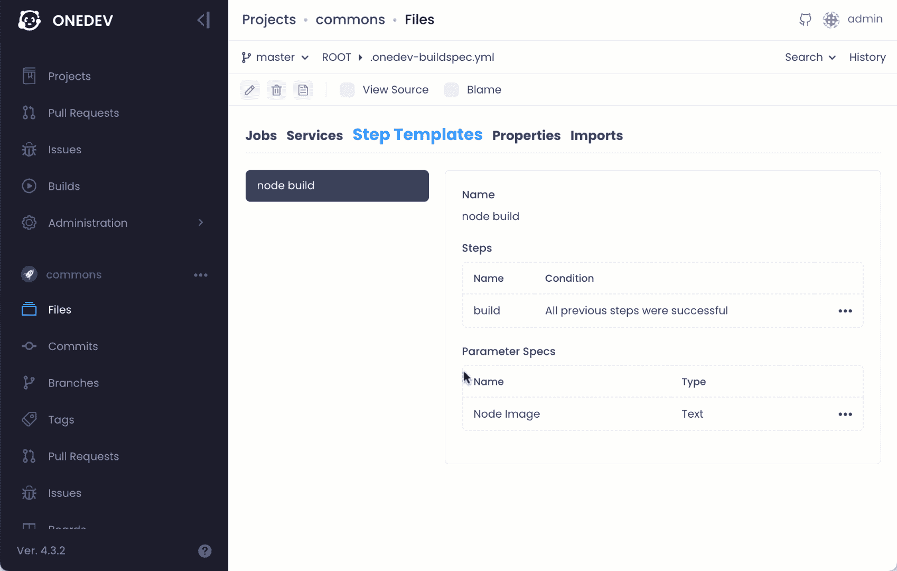
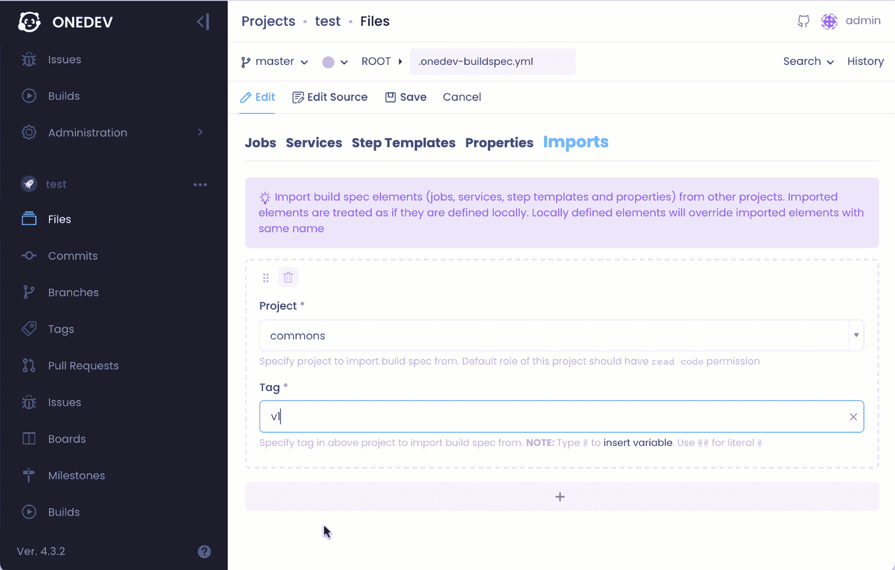

# OneDev 中的 CI/CD 配置重用

> 原文：<https://medium.com/nerd-for-tech/ci-cd-configuration-reuse-in-onedev-c8110b709614?source=collection_archive---------8----------------------->


为许多项目维护 CI/CD 配置可能是复杂且具有挑战性的。为了减少开销， [OneDev 4.3](https://github.com/theonedev/onedev/releases) 增加了在单独的项目中定义公共 CI/CD 构建块并在其他项目中使用/定制它们的机制。

CI/CD 配置通过构建规范在 OneDev 中维护。当定义一个项目构建规范时，现在可以从其他项目中导入构建规范。导入的构建规范中包含的对象(作业、服务、步骤模板和属性)被视为在本地定义，只是导入的对象会被同名的本地对象覆盖。在多次导入的情况下，后面导入的对象将覆盖同名的前面导入的对象。

通过这种导入和覆盖机制，您可以在单独的构建规范中维护通用的作业/服务/步骤模板，并在需要定制的地方使用属性占位符。当这个构建规范被导入到其他构建规范中时，用户可以有选择地覆盖这些属性，以获得不同项目的不同行为。

让我们通过一个例子来看看它是如何工作的:

1.  在 Linux 或 Mac 中使用以下命令启动 OneDev(该命令用于演示目的，日常使用请遵循[安装指南](https://code.onedev.io/onedev/manual/~files/main/pages/installation-guide.md)):

```
docker run -it --rm -v /var/run/docker.sock:/var/run/docker.sock -v $(pwd)/onedev:/opt/onedev -p 6610:6610 -p 6611:6611 1dev/server
```

2.打开浏览器访问 [http://localhost:6610](http://localhost:6610) 完成设置。添加一个项目，比如说 *commons* ，并设置它的构建规范如下:



这里我们定义一个普通的 *CI* 作业，运行一个步骤，image 被指定为属性 *nodeImage* 的值。如果需要，其他项目可以导入此构建规范并覆盖属性以使用不同的节点映像。该作业还定义了一个触发器，当有新的提交并且属性*适用的项目*被定义为排除*公共项目*时，该触发器将自动触发构建。

3.现在我们有了共同的 CI 工作。为了在其他项目中重用它，我们需要添加一个标签。为了简单起见，我们还配置了项目的默认角色，以便系统中的每个人都有权限阅读代码。



4.让我们继续添加一个测试项目，并设置它的构建规范来导入和使用作业:



这里我们覆盖属性 *nodeImage* 来使用 *node:14.16-buster* 。保存构建规范，导入的作业将自动运行以打印预期的节点版本。

除了覆盖属性来定制导入的对象，我们还可以使用参数来定制通用的步骤模板。现在让我们用这种方法来练习:

1.  继续编辑我们的 *commons* 项目的构建规范，如下所示:



在这里，我们删除先前定义的对象，并添加一个步骤模板来完成这项工作。该模板定义了一个参数来动态地从调用者那里获取图像名称

2.为我们新版本的构建规范添加一个新标签，比如 *v2*



3.编辑*测试*项目的构建规范以导入新版本，添加 CI 作业以使用导入的 step 模板，并将参数*节点映像*指定为*节点:14.16-buster*



保存构建规范以查看自动运行的作业，从而打印预期的节点版本

感谢阅读！