# 使用 Bitbucket 管道和 Gradle Play Publisher 的 Android CI/CD

> 原文：<https://medium.com/nerd-for-tech/ci-cd-for-android-using-bitbucket-pipelines-and-gradle-play-publisher-f00d6047ecb5?source=collection_archive---------1----------------------->


# 前言:科特林构建文件

本文中的所有 gradle 文件都是用 Groovy 编写的。如果您使用 Kotlin 构建文件(build.gradle.kts)，请查看我的示例项目:[https://github.com/1gravity/Android-TichuCounter](https://github.com/1gravity/Android-TichuCounter)。它使用的是最新版本的 AGP (Android Gradle 插件):7.0.0-beta01。

# 动机

构建、测试、部署和发布 Android 应用程序的方法有很多。

你可以手动操作**。
在 Android Studio 中创建一个签名的 APK 或捆绑包，将其上传到 Google Play，并通过不同的测试途径推广到生产，这并不困难，也不耗时。我做了很多年。我认为自动化节省的时间无法弥补建立工作管道的努力。我错了。自动化不仅节省了时间，还使流程更加可靠，更不容易出错(人为错误),并鼓励更频繁地部署/发布。总的来说，开发周期加快了，不仅仅是 bug 修复，还有特性发布。当功能可以通过简单的 pr/merge 推向客户时，为什么要等到捆绑一个大版本呢？**

**可以用 [**浪子**](https://fastlane.tools/) 。我对我的大多数应用程序都是这样做的。输入`fastlane build_deploy`并自动构建、签名并发布到 Google Play 非常方便。如果您是团队中唯一的开发人员，这可能已经足够好了。对于团队来说，有一些主要问题:**

1.  **浪子需要安装在每台构建机器上。如果有多个开发人员或者使用多台计算机进行开发，您需要多次设置和维护它。在我看来，浪子的文档不是很好，尤其是在 Linux 上的设置不是很直接(耗时)。拥有多台构建机器也会影响构建的可重复性，浪子依赖关系(Ruby libs)的差异会导致不同的结果。**
2.  **签名和部署需要签名/上传密钥和 Google Play API 密钥。应该尽可能少的人能接触到那些钥匙。每次有权限使用密钥的员工离开公司时，都可以创建新的密钥(前提是上传密钥用于签署应用程序)，但这肯定不是一个理想的过程。**
3.  **我的需求之一是在合并时开始构建过程。浪子不是实现这一目标的工具，除非它与其他工具相结合，引导我们…**

**可以用 [**詹金斯**](https://www.jenkins.io/) 。
詹金斯是一个伟大的工具。它非常灵活，我们成功地使用它(结合 Rundeck)来构建微服务后端并将其部署到 AWS 托管的 Docker/Kubernetes 环境中。我们还有一个专门的 DevOps 团队来维护它。如果您不想托管自己的 CI/CD 基础架构，并且没有专家负责安装和配置，那么 Jenkins 可能不是合适的工具。**

**您可以使用 **<在此处插入您的 SAAS CI/CD 解决方案>。** 有许多基于云的 CI/CD 解决方案，例如 [CircleCI](https://circleci.com/) 、 [Travis CI](https://www.travis-ci.com/) 或 [TeamCity](https://www.jetbrains.com/teamcity/) 等等。我确信它们都很棒，并且与您首选的 Git 提供商相集成，但这是另一个需要集成的工具(虽然 Bitbucket Pipeline 显然已经紧密集成)，它们似乎是我的需求的大锤，这些需求是:**

## ****要求****

*   ****合并到特定分支时触发**(在我的例子中是 master)**
*   **运行**单元测试**(我也有 ui 测试，但是它们还不是管道的一部分)**
*   **如果检测到错误，运行 **lint** 并使构建失败**
*   **将应用程序的免费和付费版本捆绑在一起**
*   ****签署**app**
*   **自动增加**内部版本号****
*   **如果需要，上传应用程序**元数据**(发行说明、描述、屏幕截图)**
*   ****将**app 部署到**内部测试轨道****
*   ****手动推广**由 app flavor 从内测轨道到生产轨道(我的情况是免费/付费)**
*   ****秘密**(签名密钥、Google Play API 密钥、密码)不能被访问回购的开发者取回**

**原来 [Bitbucket](https://bitbucket.org/) 和 [Gradle Play Publisher](https://github.com/Triple-T/gradle-play-publisher) 是我实现这一切所需要的工具。让我们看看怎么做。**

# **概观**

**设置管道有四个步骤:**

1.  **我们需要通过编程访问 Google Play 来发布和推广应用程序(并管理元数据)->我们需要一个用于 **Google Play 开发者 API** 的 API 密匙。**
2.  **我们需要配置 **Gradle build** 来使用从环境变量中读取签名信息的签名配置。**
3.  **我们需要配置 **Gradle Play Publisher** 插件来与 Google Play 交互(上传、发布应用和管理元数据)。**
4.  **我们需要配置**位桶管道**来将所有的东西联系在一起。管道配置定义触发器(在合并时)、构建步骤(Gradle)、部署步骤(Gradle Play Publisher)并注入环境变量(机密、构建号)。**

# **Google Play 开发者 API**

**官方文档详细解释了所有步骤:[https://developers . Google . com/Android-publisher/getting _ started](https://developers.google.com/android-publisher/getting_started)。**

## ****TL；TLTR(太长；懒得看):****

*   **以帐户所有者的身份进入您的 [Google Play 开发者控制台](https://play.google.com/console/developers)，打开 [*API 访问*](https://play.google.com/console/api-access) 页面:**

****

*   **接受服务条款(如果尚未接受)**
*   **如果您还没有创建一个新的 Google Cloud 项目，请创建一个新的 Google Cloud 项目(否则请链接一个现有的项目)。**
*   **在*服务账户*下，点击*“创建新服务账户”*，打开指向谷歌云平台的链接:**

**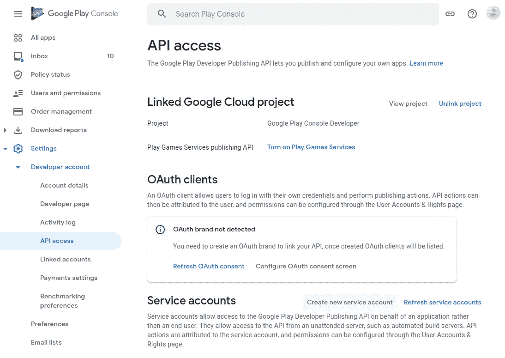****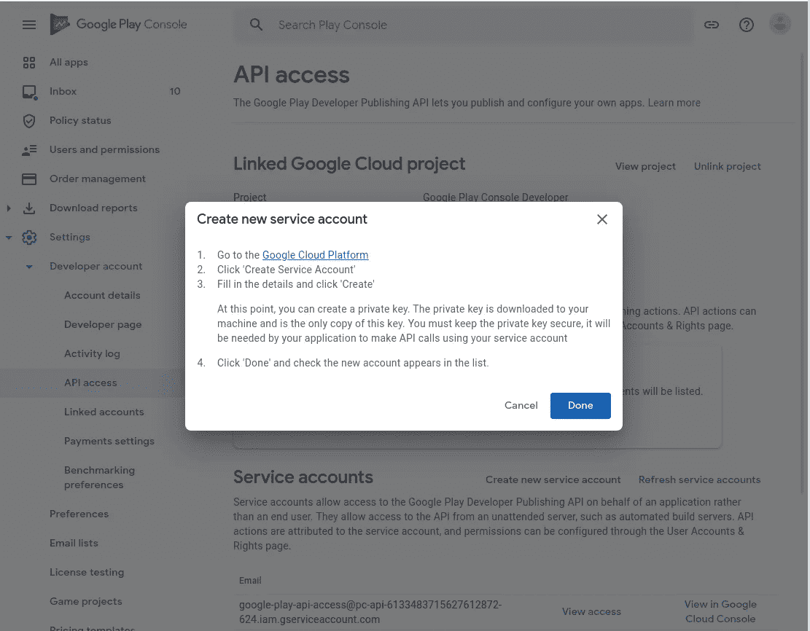**

*   **在谷歌云平台点击*“创建服务账户”*:**

**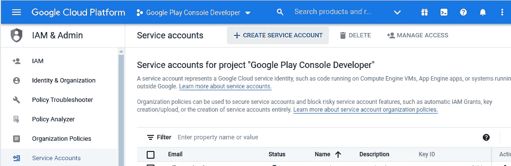**

*   **点击*“创建”*按钮之前，选择一个有意义的名称和描述:**

****

*   **账户需要角色*“服务账户用户】*:**

**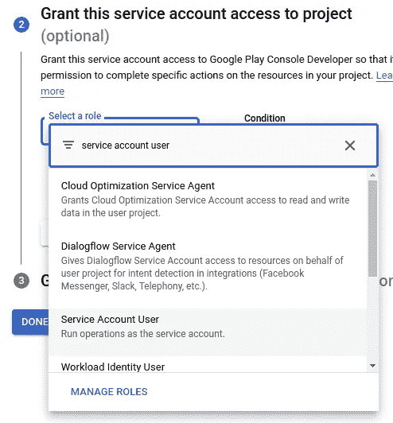**

*   **您不需要授予用户访问新服务帐户的权限，Google Cloud 会自动添加具有正确权限的所需用户(Google Play 服务和您自己的用户)，因此只需点击*“完成】*:**

**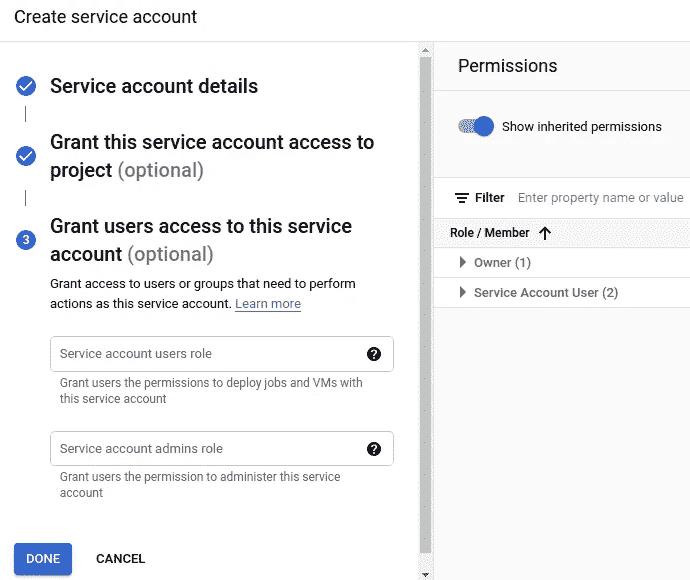**

*   **接下来，您需要为该帐户创建一个 API 密钥。
    打开操作菜单(三个点)，选择*“管理密钥”*:**

****

*   **在*“添加密钥”*下选择*“创建新密钥”*:**

**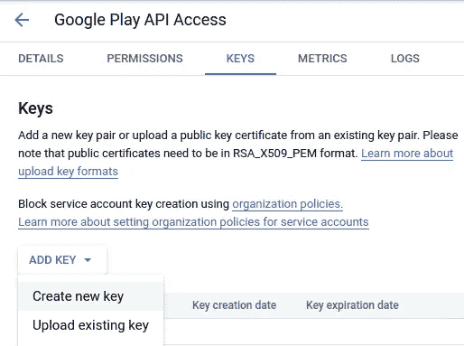**

*   **创建一个 JSON 密钥:**

**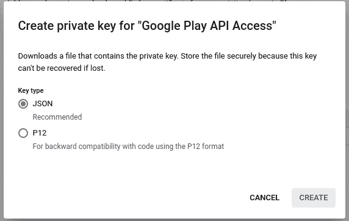**

*   **点击*“创建”*按钮后，密钥文件将被下载到您的电脑上。我建议重命名该文件，使其目的更加明显:**

****

*   **现在，您已经在 Google 云平台中完成了，您可以返回到 Google Play 控制台(到 API 访问屏幕)。新创建的账户应该出现在*“服务账户”*下(点击*“刷新服务账户”*按钮)。点击*“授权访问”*:**

**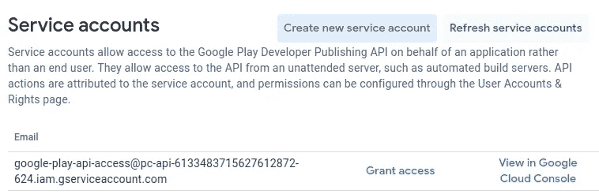**

*   **点击*“添加应用程序”*，选择您想要使用此服务帐户管理的所有应用程序:**

**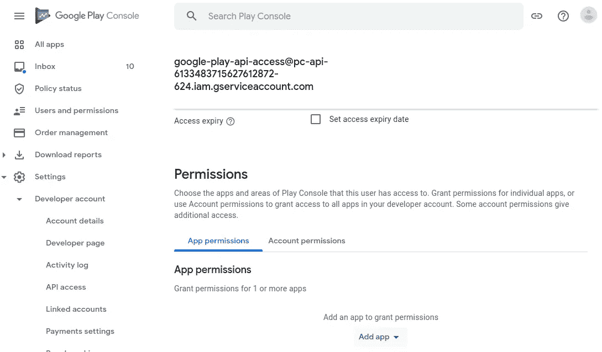**

*   **已经正确设置了帐户权限，因此服务可以管理所有与发布相关的活动(创建发布，包括发布到生产、元数据管理等。).**
*   **点击*“邀请用户”*，大功告成。
    我们稍后将使用 Gradle Play Publisher 插件来验证 API 密钥设置。**

# **Gradle Build**

**Gradle build 需要配置成包含一个[签名配置](https://developer.android.com/studio/publish/app-signing)，它从环境变量(或者您的 *~/中的 gradle.properties 文件)中读取秘密。gradle 文件夹*。如果你已经有了，那么你可以跳过这一章。**

**假设您在 Google Play 中有一个已发布的应用程序，并且您可以访问密钥库和包括密码在内的签名密钥(或上传密钥)。**

**对于本地构建，密钥库的位置、密钥库密码、密钥别名和密钥密码将在您的 *~/中配置。gradle/gradle.properties* 文件。**

**如果你没有 *~/。gradle/gradle.properties* 文件，请创建一个并添加这四个参数(粗体部分需要进行配置以适应您的设置):**

```
KEYSTORE_FILE=/**path to the keystore file**/**playstore.keystore**
KEYSTORE_PASSWORD=**keystore password**
KEY_ALIAS=**key alias**
KEY_PASSWORD=**key password**
```

**注意:不要使用~作为您的主目录，而是使用绝对路径。~在 shell 上下文中工作，但不能与 Gradle、Gradle Play Publisher 和 Bitbucket Pipeline 一起使用。**

**在应用的 gradle.build 文件中创建签名配置:**

```
**signingConfigs {
    release {
        storeFile file(KEYSTORE_FILE)
        storePassword KEYSTORE_PASSWORD
        keyAlias KEY_ALIAS
        keyPassword KEY_PASSWORD
    }
}**
```

**将签名配置添加到生成类型:**

```
buildTypes **{** debug **{
**        // debug build type configuration ...
 **}** release **{** // release build type configuration ... **signingConfig signingConfigs.release**
 **}
}**
```

**如果签名配置是正确的，那么下面的命令应该运行并在您的*构建/输出/捆绑包*文件夹中创建一个或多个 aab 文件**

```
./gradlew bundleRelease
```

## **内部版本号**

**其中一个要求是内部版本号/版本代码的自动递增。我们将使用 Bitbucket 的*$*[*bit bucket _ BUILD _ NUMBER*](https://bitbucket.org/blog/bitbucket-pipelines-can-count-builds-numbered)*来设置一个定义版本代码的环境变量。为了处理这个环境变量，将您的 *build.gradle* 文件从:***

```
*versionCode **124***
```

***收件人:***

```
*versionCode project.hasProperty('BUILD_NUMBER') ? project['BUILD_NUMBER'].toInteger() : **124***
```

***最后但同样重要的是，我们需要为*$*[*bit bucket _ BUILD _ NUMBER*](https://bitbucket.org/blog/bitbucket-pipelines-can-count-builds-numbered)设置初始值，因为它需要高于最后使用的版本代码。请按照这篇文章来做:*[https://support . atlassian . com/bit bucket-cloud/docs/set-a-new-value-for-the-pipelines-build-number/](https://support.atlassian.com/bitbucket-cloud/docs/set-a-new-value-for-the-pipelines-build-number/)****

# ****格雷尔戏剧出版商****

****虽然我们现在能够构建应用程序并创建签名捆绑包(或 apk)，但我们仍然需要配置 [Gradle Play Publisher](https://github.com/Triple-T/gradle-play-publisher) 将签名应用程序发布到 Google Play(并管理元数据，如屏幕截图、描述等。).****

****我们也可以在这方面使用浪子，但我不建议走那条路(去过那里，做过)。相信我就好；-)****

****设置 Gradle Play Publisher 插件很容易(参见 https://github.com/Triple-T/gradle-play-publisher):****

*   ****将类路径添加到项目的 *build.gradle* 文件中:****

```
**buildscript {
    repositories {
 **maven { url 'https://oss.sonatype.org/content/repositories/snapshots' 
        }**    }
    dependencies {
 **classpath 'com.github.triplet.gradle:play-publisher:3.4.0-agp7.0'**    }
}**
```

*   ****将插件添加到应用程序的 *build.gradle* 文件中:****

```
**plugins **{** id 'com.android.application'
    **id 'com.github.triplet.play' version '3.3.0'
**    // other plugins...
**}****
```

*   ****向应用程序的 *build.gradle* 文件添加一个配置块(在 android 块之后):****

```
**android { ... }**play {
    serviceAccountCredentials = file(GOOGLE_PLAY_API_KEY)
}****
```

****您会注意到 *GOOGLE_PLAY_API_KEY* 参数。它是对我们在为服务帐户设置密钥时得到的 api 密钥文件的引用->*Google-play-API-key . JSON*。该参数需要在 *~/中定义。gradle/gradle.properties* 文件(类似于签名配置参数):****

```
**GOOGLE_PLAY_API_KEY=/**path to the api key file/google-play-api-key.json****
```

****如果一切设置正确，以下命令从应用程序的根目录运行时将下载应用程序的元数据:****

```
**./gradlew bootstrap**
```

# ****比特桶流水线****

****要开始使用 Bitbucket 管道并创建您的第一个管道，请阅读这篇精彩的文章:****

****[](https://www.rockandnull.com/android-continuous-integration-bitbucket/) [## 在 1 分钟内为 Bitbucket 设置 Android 持续集成(CI)

### 持续集成(CI)是团队成员每次提交代码时自动构建和测试代码的过程。

www.rockandnull.com](https://www.rockandnull.com/android-continuous-integration-bitbucket/) 

阅读完那篇文章后，你现在应该在你的应用程序的根目录下有一个***bit bucket-pipelines . yml***文件。

我们现在想要的是创建这个特定的管道:

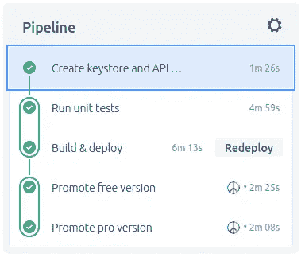

它由五个步骤组成(每个步骤运行一个单独的 Docker 容器):

1.  创建秘密文件(密钥库和 API 密钥文件)并使其对管道可用
2.  运行单元测试
3.  构建应用捆绑包，并将其部署到内部测试轨道
4.  将应用程序的免费版本提升到生产轨道(手动步骤)
5.  将应用程序的专业/付费版本提升到生产轨道(手动步骤)

## 1.创建秘密文件

签名密钥(keystore + key)和 Google Play API 密钥都不应该添加到 repo 中，否则每个具有 repo 访问权限的开发人员都可以读取它们。

Bitbucket 能够定义存储库变量。默认情况下，它们是加密的，普通用户无法读取，只有脚本可以读取。我们将使用这个特性来定义我们的构建/发布脚本需要的五个参数:

*   *KEYSTORE_FILE*
*   *密钥库 _ 密码*
*   *KEY_ALIAS*
*   *密钥 _ 密码*
*   *GOOGLE_PLAY_API_KEY*

很容易为 *KEYSTORE_PASSWORD、KEY_ALIAS* 和 *KEY_PASSWORD* 定义三个值，因为它们只是文本值。为此，进入*“储存库设置”*，向下滚动至*“储存库变量”*。用正确的值输入所有三个变量:

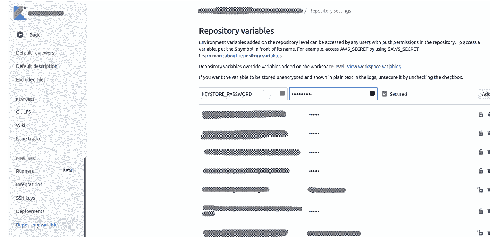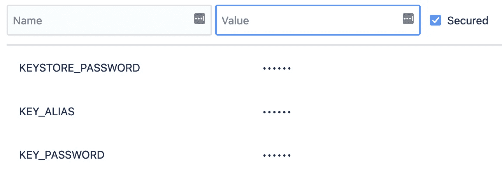

为了将 *KEYSTORE_FILE 和 GOOGLE_PLAY_API_KEY* 存储在存储库变量中，我们用 base64 编码这些文件。构建管道将解码文本并重新创建原始文件。

运行以下命令对这两个文件进行编码:

```
base64 google-play-api-key.json
base64 playstore.keystore
```

复制 base64 字符串并在 Bitbucket 中创建存储库变量。这些字符串看起来应该有点像这样(尽管要长得多):*ymfzzty 0 ig dvb 2 dszs 1 wbgf 5 lwfwas 1 rzxkuannvbg = =*

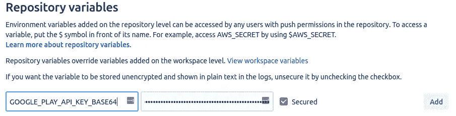

我还创建了两个变量 *KEYSTORE_FILE* 和 *GOOGLE_PLAY_API_KEY* 来定义用于解码的秘密的文件名:

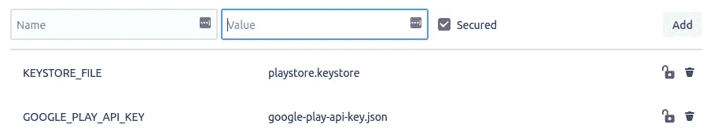

现在我们准备在*bit bucket-pipelines . yml*文件中定义实际管道的第一步。

```
image: androidsdk/android-30

pipelines:
  branches:
    master:
      - step:
          name: Create keystore and API key
          script:
            *# create the keystore file and the google play api key file* - mkdir keys
            - echo $KEYSTORE_FILE_BASE64 | base64 --decode > keys/$KEYSTORE_FILE
            - echo $GOOGLE_PLAY_API_KEY_BASE64 | base64 --decode > keys/$GOOGLE_PLAY_API_KEY
          artifacts:
            - keys/**
```

*   我们使用 **androidsdk/android-30** 作为 Docker 镜像。该映像拥有构建 API 30 应用程序的所有工具，因此无需“手动”安装构建工具和编写代码来接受许可证。
*   在我们的例子中，我们希望在提交时构建主分支，因此

```
branches:
    master:
```

*   这就是如何从存储库变量中提取密钥存储文件和 api 密钥文件:

创建新目录:

```
mkdir keys
```

解码密钥库文件并将其写入*。/keys/$ KEYSTORE _ FILE*(*$ KEYSTORE _ FILE _ BASE64*是 BASE64 编码的密钥库文件， *$KEYSTORE_FILE* 是要在 Docker 容器中创建的密钥库文件的名称)。

```
echo $KEYSTORE_FILE_BASE64 | base64 --decode > keys/$KEYSTORE_FILE
```

解码 api 密钥文件并写入*。/keys/$ GOOGLE _ PLAY _ API _ KEY*(*$*GOOGLE _ PLAY _ API _ KEY _ BASE64 是 BASE64 编码的 API 密钥文件， *$* GOOGLE_PLAY_API_KEY 是要在 Docker 容器中创建的 API 密钥文件的名称)。

```
echo $GOOGLE_PLAY_API_KEY_BASE64 | base64 --decode > keys/$GOOGLE_PLAY_API_KEY
```

artifacts 标签定义了哪些文件被保留，哪些文件可以被后续的管道步骤访问。在这种情况下，我们希望保留两个关键文件:

```
artifacts:
            - keys/**
```

## 2.运行单元测试

在本地运行时，Gradle 从 *~/中读取构建参数。gradle/gradle.properties* 文件。当在构建管道中运行时，我们需要将参数作为环境变量传递，如下所示:

```
./gradlew -PKEYSTORE_FILE=../keys/$KEYSTORE_FILE
          -PKEYSTORE_PASSWORD=$KEYSTORE_PASSWORD
          -PKEY_ALIAS=$KEY_ALIAS
          -PKEY_PASSWORD=$KEY_PASSWORD
          -PGOOGLE_PLAY_API_KEY=../keys/$GOOGLE_PLAY_API_KEY
          test
```

*密钥存储文件*为 Gradle 创建一个名为*密钥存储文件*和值为*的参数../keys/$KEYSTORE_FILE* ，其中$ *KEYSTORE_FILE* 引用了我们之前定义的存储库变量(翻译为*../keys/playstore.keystore)* 。

把所有东西放在一起，我们得到这一步:

```
step:
    name: Run unit tests
    caches:
      - gradle
    script:
      - export GRADLE_OPTS='-XX:+UseG1GC -XX:MaxGCPauseMillis=1000 -Dorg.gradle.jvmargs="-Xmx2048m -XX:MaxPermSize=1024m -XX:ReservedCodeCacheSize=440m -XX:+UseCompressedOops -XX:+HeapDumpOnOutOfMemoryError -Dfile.encoding=UTF-8" -Dorg.gradle.parallel=false -Dorg.gradle.daemon=false -Dorg.gradle.configureondemand=true'
      - "./gradlew -PKEYSTORE_FILE=../keys/$KEYSTORE_FILE
                   -PKEYSTORE_PASSWORD=$KEYSTORE_PASSWORD
                   -PKEY_ALIAS=$KEY_ALIAS
                   -PKEY_PASSWORD=$KEY_PASSWORD
                   -PGOOGLE_PLAY_API_KEY=../keys/$GOOGLE_PLAY_API_KEY
                   test"
    artifacts:
      - app/build/outputs/**
      - app/build/reports/**
```

梯度选项是可选的。最令人感兴趣的是 org.gradle.daemon 选项。它可以防止脚本在运行多个 Gradle 任务时失败(例如，通过执行。/gradlew …干净的测试)。由于某种原因，Gradle 守护进程在第一个任务完成后被终止，第二个任务失败

```
Gradle build daemon disappeared unexpectedly (it may have been killed or may have crashed)
```

我肯定有更好的解决方案，但目前 org.gradle.daemon 对我来说已经足够好了。

## 3.构建和部署包

通过正确配置 Gradle Play Publisher 插件，构建应用程序并将其部署到 Google Play 非常简单。任务 *publishFreeReleaseBundle* 和 *publishProReleaseBundle* (带有免费和专业版的应用程序)将完成所有繁重的工作。流水线步骤是:

```
- step:
    name: Build & deploy
    caches:
      - gradle
    script:
- export GRADLE_OPTS='-XX:+UseG1GC -XX:MaxGCPauseMillis=1000 -Dorg.gradle.jvmargs="-Xmx2048m -XX:MaxPermSize=1024m -XX:ReservedCodeCacheSize=440m -XX:+UseCompressedOops -XX:+HeapDumpOnOutOfMemoryError -Dfile.encoding=UTF-8" -Dorg.gradle.parallel=false -Dorg.gradle.daemon=false -Dorg.gradle.configureondemand=true'
      - "./gradlew -PKEYSTORE_FILE=../keys/$KEYSTORE_FILE
                   -PKEYSTORE_PASSWORD=$KEYSTORE_PASSWORD
                   -PKEY_ALIAS=$KEY_ALIAS
                   -PKEY_PASSWORD=$KEY_PASSWORD
                   -PGOOGLE_PLAY_API_KEY=../keys/$GOOGLE_PLAY_API_KEY
                   -PBUILD_NUMBER=$BITBUCKET_BUILD_NUMBER
                   clean :app:publishFreeReleaseBundle :app:publishProReleaseBundle"
    artifacts:
      - app/build/outputs/
```

*   我们传入*-PBUILD _ NUMBER = $ bit bucket _ BUILD _ NUMBER*来设置应用的*版本代码*
*   默认情况下，插件发布到内部测试轨道，使用- *轨道*参数发布到不同的轨道(内部、alpha、beta、生产)

## 4.提升到生产

最后这些步骤同样简单:

```
- parallel:
    - step:
        name: Promote free version
        caches:
          - gradle
        trigger: manual
        script:
- export GRADLE_OPTS='-XX:+UseG1GC -XX:MaxGCPauseMillis=1000 -Dorg.gradle.jvmargs="-Xmx2048m -XX:MaxPermSize=1024m -XX:ReservedCodeCacheSize=440m -XX:+UseCompressedOops -XX:+HeapDumpOnOutOfMemoryError -Dfile.encoding=UTF-8" -Dorg.gradle.parallel=false -Dorg.gradle.daemon=false -Dorg.gradle.configureondemand=true'
          - "./gradlew -PKEYSTORE_FILE=../keys/$KEYSTORE_FILE
                   -PKEYSTORE_PASSWORD=$KEYSTORE_PASSWORD
                   -PKEY_ALIAS=$KEY_ALIAS
                   -PKEY_PASSWORD=$KEY_PASSWORD
                   -PGOOGLE_PLAY_API_KEY=../keys/$GOOGLE_PLAY_API_KEY
                   -PBUILD_NUMBER=$BITBUCKET_BUILD_NUMBER
                        promoteFreeReleaseArtifact --from-track internal --promote-track production --release-status completed"
    - step:
        name: Promote pro version
        caches:
          - gradle
        trigger: manual
        script:
- export GRADLE_OPTS='-XX:+UseG1GC -XX:MaxGCPauseMillis=1000 -Dorg.gradle.jvmargs="-Xmx2048m -XX:MaxPermSize=1024m -XX:ReservedCodeCacheSize=440m -XX:+UseCompressedOops -XX:+HeapDumpOnOutOfMemoryError -Dfile.encoding=UTF-8" -Dorg.gradle.parallel=false -Dorg.gradle.daemon=false -Dorg.gradle.configureondemand=true'
          - "./gradlew -PKEYSTORE_FILE=../keys/$KEYSTORE_FILE
                   -PKEYSTORE_PASSWORD=$KEYSTORE_PASSWORD
                   -PKEY_ALIAS=$KEY_ALIAS
                   -PKEY_PASSWORD=$KEY_PASSWORD
                   -PGOOGLE_PLAY_API_KEY=../keys/$GOOGLE_PLAY_API_KEY
                   -PBUILD_NUMBER=$BITBUCKET_BUILD_NUMBER
                        promoteProReleaseArtifact --from-track internal --promote-track production --release-status inProgress --user-fraction .5"
```

这为所有用户将免费版本从内部测试阶段提升到生产阶段:

```
promoteFreeReleaseArtifact --from-track internal --promote-track production --release-status completed
```

这使得 50%的用户将专业版从内部测试阶段提升到生产阶段(分阶段推广):

```
promoteProReleaseArtifact --from-track internal --promote-track production --release-status inProgress --user-fraction .5
```

我们定义手动触发

```
trigger: manual
```

因此管道需要人工干预来运行这些步骤。如果您希望自动部署到生产跟踪，只需移除手动触发器。我更喜欢在点击发布按钮之前至少做一个快速的冒烟测试。

下面是完整的**bit bucket-pipelines . yml**文件供参考:[https://gist . github . com/1 gravity/d5a 160094 e 5408 fbff 8 f 54 c 27 b 6 c 9 e5c](https://gist.github.com/1gravity/d5a160094e5408fbff8f54c27b6c9e5c)。

编码快乐！****