# 使用 GitHub Actions 和 Gradle Play Publisher 的 Android CI/CD

> 原文：<https://medium.com/nerd-for-tech/ci-cd-for-android-using-github-actions-and-gradle-play-publisher-448bd8e42774?source=collection_archive---------1----------------------->


去年我发表了一篇关于使用 BitBucket 管道和 Gradle Play Publisher 的文章。本文解释了如何使用 [GitHub Actions](https://github.com/features/actions) 做同样的事情，有两个主要区别(除了它使用 GitHub 而不是 BitBucket):

*   我将使用用 Kotlin(不是 Groovy)编写的 gradle 文件
*   我还将解释如何在 [Play app Signing](https://play.google.com/console/about/keymanagement/) 中注册 App

完整的代码样本可以在我的一个演示应用程序中找到:[https://github.com/1gravity/Android-ColorPicker](https://github.com/1gravity/Android-ColorPicker)。

# 概观

设置管道有五个步骤:

1.  我们需要编程访问 Google Play 来发布和推广应用程序(并管理元数据)->我们需要一个用于 **Google Play 开发者 API** 的 API 密钥。
2.  该应用需要在[游戏签约](https://play.google.com/console/about/keymanagement/)中注册
3.  我们需要配置 **Gradle build** 来使用从环境变量中读取签名信息的签名配置。
4.  我们需要配置 **Gradle Play Publisher** 插件来与 Google Play 交互(上传、发布应用和管理元数据)。
5.  我们需要配置一个 **GitHub 动作**来将所有的事情联系在一起。

# 步骤 1: Google Play 开发者 API

官方文档详细解释了所有步骤:[https://developers . Google . com/Android-publisher/getting _ started](https://developers.google.com/android-publisher/getting_started)。这里有一个总结:

*   以帐户所有者的身份进入您的 [Google Play 开发者控制台](https://play.google.com/console/developers)，打开 [*API 访问*](https://play.google.com/console/api-access) 页面:

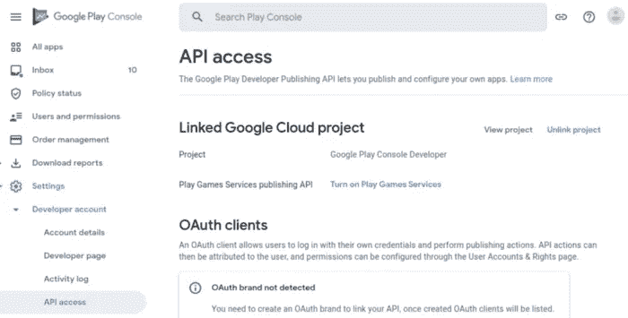

*   接受服务条款(如果尚未接受)
*   如果您还没有创建一个新的 Google Cloud 项目，请创建一个新的 Google Cloud 项目(否则请链接一个现有的项目)。
*   在“*服务账户”*下，点击*“创建新服务账户”*，打开谷歌云平台链接:

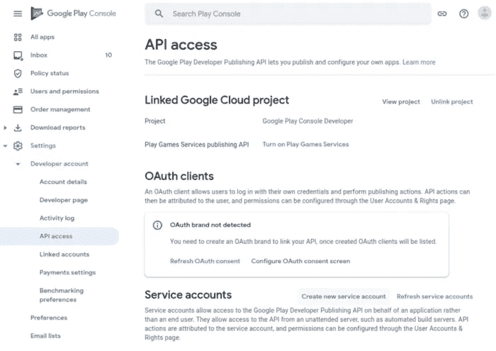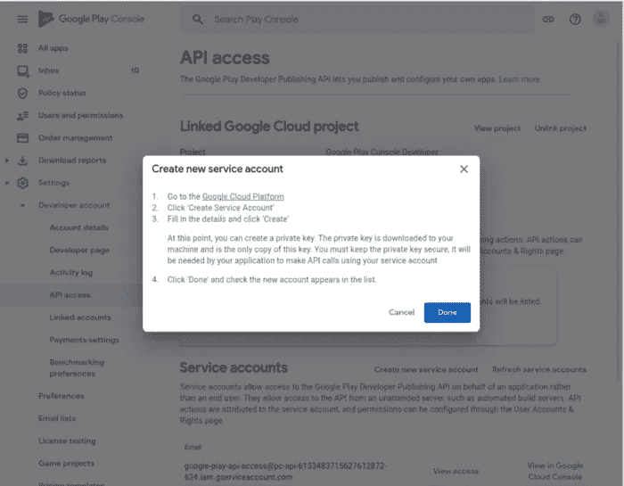

*   在谷歌云平台中点击*“创建服务账户”*:

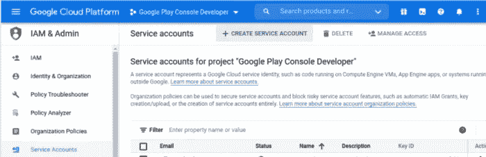

*   点击*“创建”*按钮之前，选择一个有意义的名称和描述:

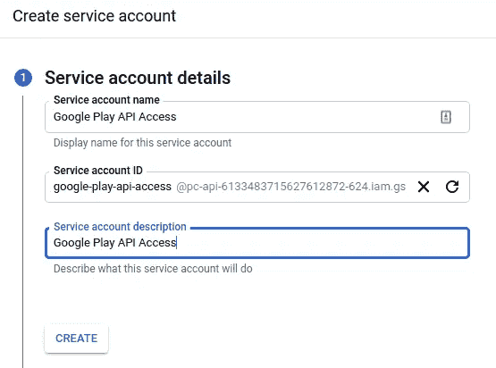

*   账户需要角色*“服务账户用户”*:


*   您不需要授予用户访问新服务帐户的权限，Google Cloud 会自动添加具有正确权限的所需用户(Google Play 服务和您自己的用户)，因此只需点击*“完成”*:


*   接下来，您需要为该帐户创建一个 API 密钥。
    打开动作菜单(三个点)，选择*“管理密钥”*:

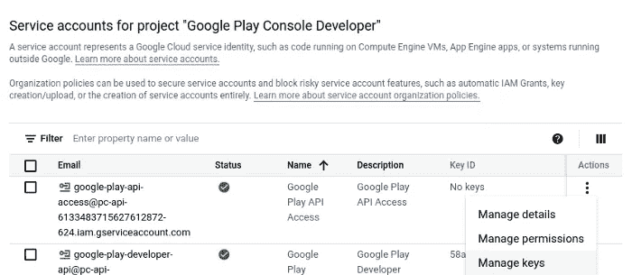

*   在*“添加密钥”*下选择*“创建新密钥”*:


*   创建一个 JSON 密钥:


*   点击*“创建”*按钮后，密钥文件将被下载到您的计算机上。我建议重命名该文件，使其目的更加明显:

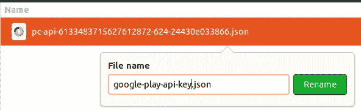

*   现在，您已经在 Google 云平台中完成了，您可以返回到 Google Play 控制台(到 API 访问屏幕)。新创建的账户应该出现在*“服务账户”*下(点击*“刷新服务账户”*按钮)。点击*“授权访问”*:

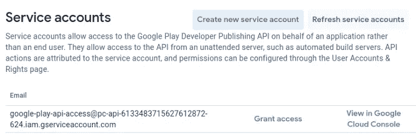

*   点击*“添加应用”*并选择您想要使用此服务帐户管理的所有应用:

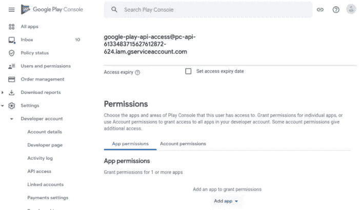

*   已经正确设置了帐户权限，因此服务可以管理所有与发布相关的活动(创建发布，包括发布到生产、元数据管理等。).
*   点击*“邀请用户”*就大功告成了。
    我们稍后将使用 Gradle Play Publisher 插件来验证 API 密钥设置。

# 步骤 2:启用播放应用签名

如果你最近刚刚发布了一个应用，它很可能已经注册了 Play App Signing(在这种情况下，你可以跳过本章并转到步骤 3)，否则你需要遵循这里解释的步骤:[https://developer . Android . com/studio/publish/App-Signing # enroll](https://developer.android.com/studio/publish/app-signing#enroll)。

我将解释我已经在 Google Play 上发布的一个应用程序的过程。首先，您在 Google Play 控制台中打开“ *App integrity* ”页面(在“ *Setup* ”下):

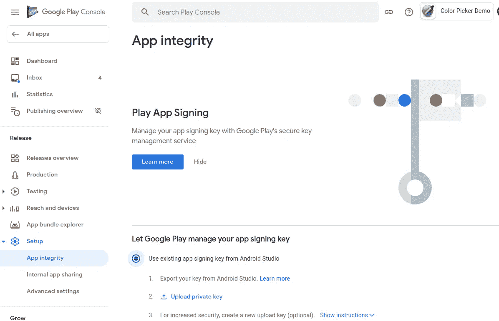

选择选项“*使用来自 Android Studio* 的现有应用签名密钥”。在继续之前，打开 Android Studio 并导出密钥，方法是转到“*构建/生成签名捆绑包/APK* ”，然后选择“ *Android 应用捆绑包*”选项:

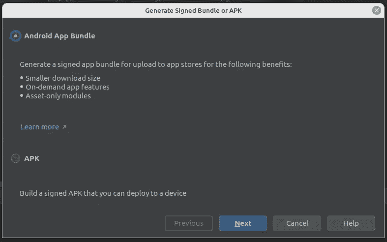

点击“*下一步*，确保“*导出加密密钥，用于在 Google Play 应用签名中注册已发布的应用*”:

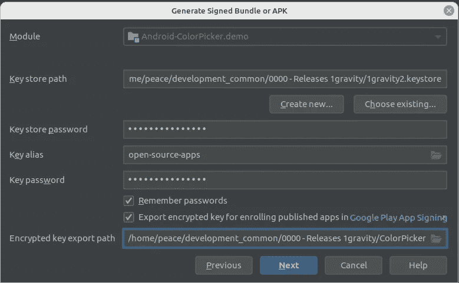

在下一个屏幕上，选择“*发布*”作为构建变体(因此它用发布键签名)，然后单击“*完成*”:

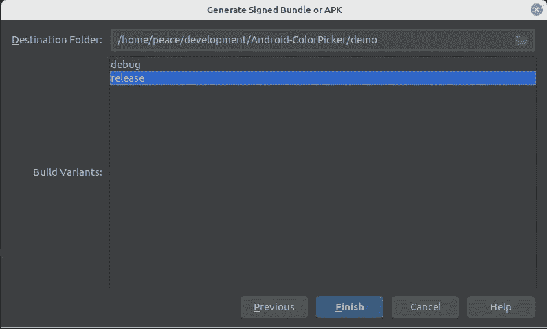

现在回到 Google Play 控制台，点击“*上传私钥*”链接，上传您在上一步中导出的密钥:

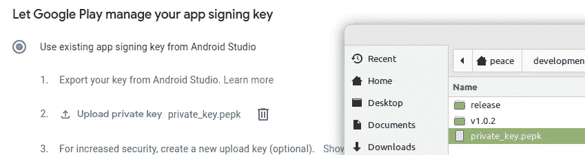

*接受*条款:

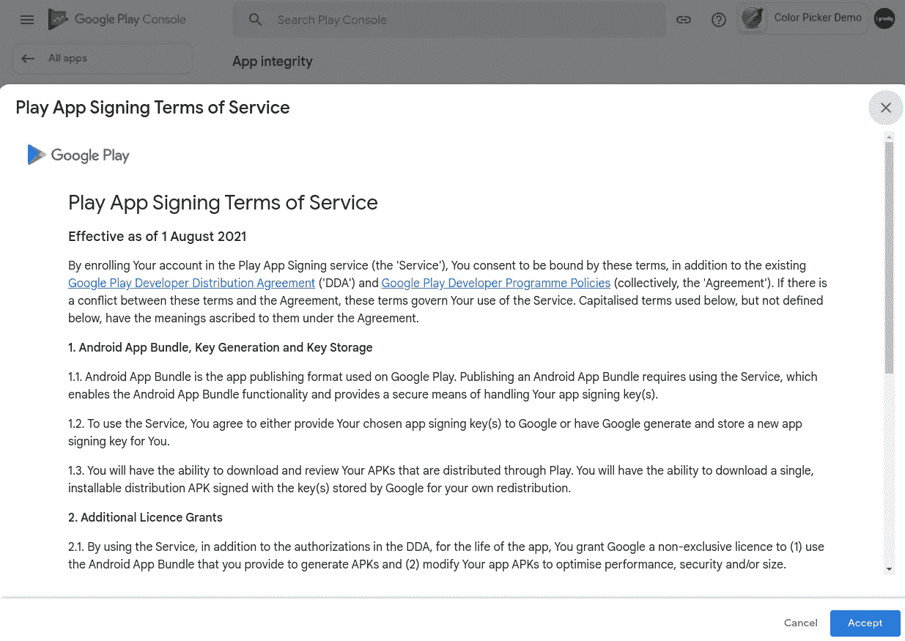

您现在应该会看到这样一个页面:

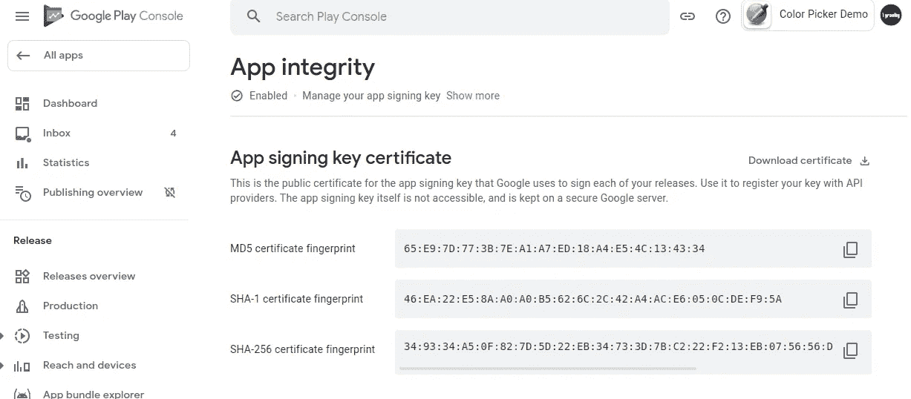

# 第三步:梯度构建

Gradle build 需要配置成包含一个[签名配置](https://developer.android.com/studio/publish/app-signing)，它从环境变量(或者您的 *~/中的`gradle.properties`文件)中读取秘密。gradle 文件夹*)。如果你已经有一个，那么你可以跳过这一章。

假设您在 Google Play 中有一个已发布的应用程序，并且您有权访问密钥库和包括密码在内的签名密钥(或上传密钥)(否则您将无法完成上一步)。

对于本地构建，密钥库的位置、密钥库密码、密钥别名和密钥密码将在您的`~/.gradle/gradle.properties`文件中配置。

如果您没有`~/.gradle/gradle.properties`文件，请创建一个并添加以下四个参数(粗体部分需要根据您的设置进行配置):

```
KEYSTORE_FILE=/**path to the keystore file**/**playstore.keystore**
KEYSTORE_PASSWORD=**keystore password**
KEY_ALIAS=**key alias**
KEY_PASSWORD=**key password**
```

注意:不要使用~作为您的主目录，而是使用绝对路径。~在 shell 上下文中工作，但不能与 Gradle 和 Gradle Play Publisher 一起使用。

在应用的`gradle.build.kts`文件中创建签名配置:

```
create("release") **{** storeFile = file(*project*.property("KEYSTORE_FILE").*toString*())
    storePassword = *project*.property("KEYSTORE_PASSWORD").*toString*()
    keyAlias = *project*.property("KEY_ALIAS").*toString*()
    keyPassword = *project*.property("KEY_PASSWORD").*toString*()
**}**
```

将签名配置添加到生成类型:

```
buildTypes **{
**    getByName("debug") {
        // more stuff here
        signingConfig = signingConfigs.getByName(*name*)
    }

getByName("release") **{
**        // more stuff here
        signingConfig = signingConfigs.getByName(*name*)
    }
}
```

如果签名配置是正确的，那么下面的命令应该运行并在您的*构建/输出/捆绑包*文件夹中创建一个或多个 aab 文件

```
./gradlew bundle
```

# 版本代码

应用程序的版本代码需要随着新版本的增加而增加(参见[https://developer.android.com/studio/publish/versioning](https://developer.android.com/studio/publish/versioning))。因为没有简单的方法来定义自动递增的版本号，所以我们将使用从 UTC 时间戳派生的版本代码(参见步骤 5)。在 app 的`*gradle.build.kts*`中的*替换为:*

```
versionCode = 124
```

使用:

```
versionCode = *project*.*properties*["BUILD_NUMBER"]
    ?.toString()?.*toInt*()?.minus(1643952714)
    ?: 124
```

这将读取版本代码作为一个属性，并减去 1643952714 (1643952714 = Fri，2022 年 2 月 4 日 5:31:54 AM GMT)，以确保版本代码不会很快达到最大值 21000000000(从现在起大约 14 年后，2100000000 = Fri，2036 年 7 月 18 日 1:20:00 PM GMT)。如果没有参数传入(本地构建)，它将在 Elvis 操作符？:.

# 第四步:格雷迪扮演出版商

我们现在能够构建应用程序并创建签名捆绑包(或 apk ),但我们仍然需要配置 [Gradle Play Publisher](https://github.com/Triple-T/gradle-play-publisher) 将签名应用程序发布到 Google Play。

我们也可以使用[浪子](https://fastlane.tools/)来做这件事，但是我不推荐走那条路(去过那里，做过那件事)。相信我这一次…

安装 Gradle Play Publisher 插件很简单(参见[https://github.com/Triple-T/gradle-play-publisher](https://github.com/Triple-T/gradle-play-publisher)):

*   将插件添加到应用程序的`gradle.build.kts`文件中:

```
plugins {
    id("com.android.application")
 **id("com.github.triplet.play") version "3.7.0"**    // other plugins
}
```

*   将配置块添加到应用程序的`gradle.build.kts`(在 android 块之后):

```
***play* {
    val apiKeyFile = *project*.property("googlePlayApiKey").*toString*()
    serviceAccountCredentials.set(file(apiKeyFile))
    track.set("internal")
}**
```

您会注意到“*Google playapikey”*参数。它是对我们在为服务帐户设置密钥时得到的 api 密钥文件的引用->*Google-play-API-key . JSON*。该参数需要在`~/.gradle/gradle.properties`中定义(类似签约配置参数):

```
googlePlayApiKey=/some-path/google-play-api-key.json
```

如果一切设置正确，当从应用程序的根目录运行以下命令时，将下载应用程序的元数据:

```
./gradlew bootstrapListing
```

# 步骤 5: GitHub 操作

## 仓库机密

首先，我们需要配置作为参数传递给 Gradle build 的秘密:

*   *GOOGLE_PLAY_API_KEY*
*   *密钥库 _ 文件*
*   *密钥库 _ 密码*
*   *KEY_ALIAS*
*   *钥匙 _ 密码*

很容易为 *KEYSTORE_PASSWORD、KEY_ALIAS* 和 *KEY_PASSWORD* 定义三个值，因为它们只是文本值。为此，进入*“存储库设置”*，选择*“机密/操作”*。用正确的值输入所有三个变量:

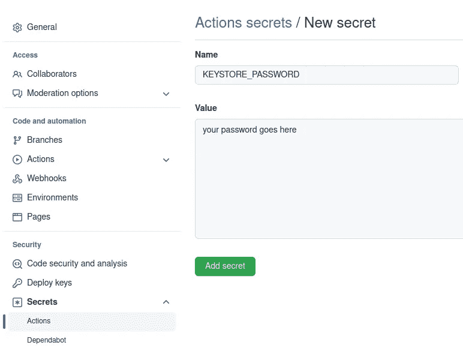

为了将 *KEYSTORE_FILE 和 GOOGLE_PLAY_API_KEY* 存储为存储库秘密变量，我们对文件进行了 base64 编码。构建管道将对其进行解码并重新创建原始文件(见下文)。

运行以下命令对这两个文件进行编码:

```
base64 google-play-api-key.json > google-play-api-key.json.base64
base64 playstore.keystore > playstore.keystore.base64
```

复制 base64 字符串并在 GitHub 中创建存储库机密。您现在应该有这样的东西:

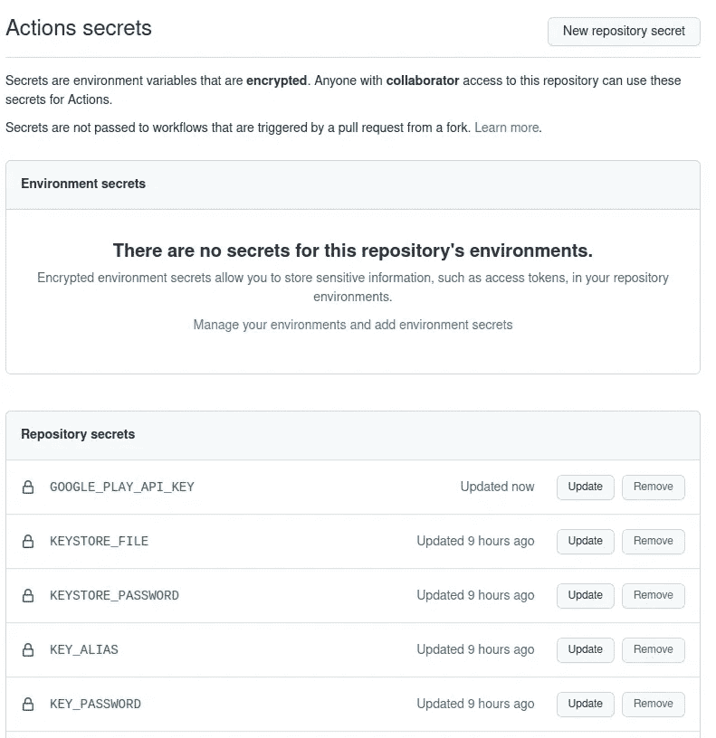

## GitHub 操作

我们有了秘密，现在是时候创建 GitHub 操作了。首先创建一个目录`.github/workflows`和文件`publish_google_play.yml:`

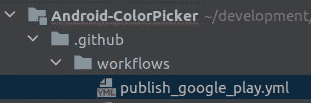

你可以在我的一个演示应用[这里](https://github.com/1gravity/Android-ColorPicker/blob/master/.github/workflows/publish_google_play.yml)找到一个完整的例子，因为你可以在这里阅读关于 GitHub 动作[的基础知识，我不会解释所有的细节，而是专注于发布过程的细节。](https://docs.github.com/en/actions)

**内部版本号**:我们上面提到过我们想要创建一个基于时间戳的版本代码，这就是我们的做法:

```
*# Create a build number based on timestamp / UTC time* - name: set release date
  run: |
    echo "BUILD_NUMBER=$(date +"%s")" >> ${GITHUB_ENV}
```

这定义了一个环境变量`BUILD_NUMBER`，并将时间戳(UTC)赋值。

由于我们的 Gradle 构建将文件路径/名称作为参数，因此需要从秘密中提取出**密钥库文件**并将其写入文件。我们将使用这个动作为这个:【https://github.com/timheuer/base64-to-file[。](https://github.com/timheuer/base64-to-file)

```
*# Decode the keystore file containing the signing key* - name: Decode Keystore
  id: decode_keystore
  uses: timheuer/base64-to-file@v1.1
  with:
    fileDir: './secrets'
    fileName: 'my.keystore'
    encodedString: ${{ secrets.KEYSTORE_FILE }}
```

Google Play API 密钥文件的提取方式相同:

```
*# Decode the Google Play api key file* - name: Decode Google Play API key
  id: decode_api_key
  uses: timheuer/base64-to-file@v1.1
  with:
    fileDir: './secrets'
    fileName: 'google-play-api-key.json'
    encodedString: ${{ secrets.GOOGLE_PLAY_API_KEY }}
```

现在剩下要做的就是用正确的参数调用 Gradle:

```
*# Build bundle and publish to Google Play* - name: Build & publish to Google Play
  run: ./gradlew
    -PBUILD_NUMBER="${{ env.BUILD_NUMBER }}"
    -PgooglePlayApiKey="../${{ steps.decode_api_key.outputs.filePath }}"
    -PKEYSTORE_FILE="../${{ steps.decode_keystore.outputs.filePath }}"
    -PKEYSTORE_PASSWORD=${{ secrets.KEYSTORE_PASSWORD }}
    -PKEY_ALIAS=${{ secrets.KEY_ALIAS }}
    -PKEY_PASSWORD=${{ secrets.KEY_PASSWORD }}
    publishBundle --max-workers 1
```

就是这样。享受快乐编码！