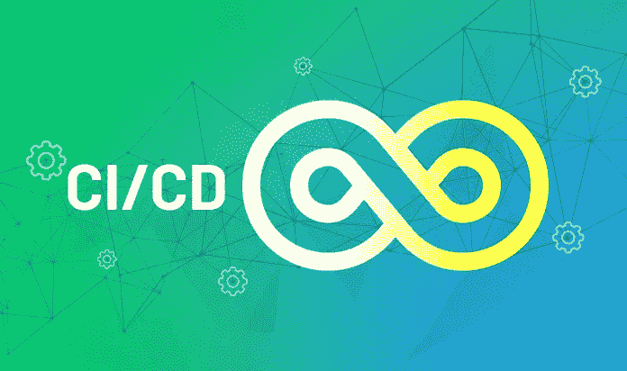

# CI/CD:将您的想法应用到生产中

> 原文：<https://medium.com/nerd-for-tech/ci-cd-implement-your-ideas-into-production-ee9f18303d8b?source=collection_archive---------16----------------------->

*我们利用 Kubernetes 实施 CI/CD 的案例研究。*

*与 Kubernetes 合作的 CI/CD*

迭代代码的连续构建、测试和交付提高了软件开发生命周期(SDLC)的速度，即当开发人员编写代码时，它被自动部署到相应的环境中，使他们能够自己测试功能，并将构建提交给测试团队进行详细测试。值得注意的是，随着一个新版本的出现，整个过程重复出现。

持续软件开发包括三个主要步骤，即从源代码到产品:

持续集成

持续部署(CD)

连续交付(CD)

包括构建、打包、测试和将经验证的代码部署到适当的环境中在内的各种步骤的编排定义了 CI/CD 管道。CI/CD 管道的系统布局为团队提供了将他们的想法带入生产的更广泛的理解。CI/CD 管道通常由环境、测试、人员、服务和结果驱动。DevOps 团队的主要目标是在其开发环境中自动化 CI/CD。

自动化 CI/CD 中使用的软件包括:

Gitlab

詹金斯

码头工人

舵

舵柄

索纳库贝

安克雷

# 连续累计

代码库中的多次代码变更、额外的新特性和每日迭代，以及脚本的创建，对于代码的不间断自动构建和打包被称为*持续集成*。对于不同的系统，打包过程是不同的，例如，为 JAVA 构建生成一个 JAR 文件，然后将其部署为 docker 映像。这些脚本确保了最小的错误，并且测试阶段确定了对每个应用程序的指导方针和标准的严格检查。

CI 最吸引人的部分是将新思想集成到应用程序中的成就。此外，CI 努力通过集成测试和单元测试使它的构建可重复、一致、无错误和可伸缩。然而，在 CI 过程中会面临一些挑战，比如 CI 平台的过载，这可以通过战略性地应用测试套件来避免。

# 持续部署

连续部署涉及到代码的安装和分发，并且关注于以最小的阻力将包放到所需环境中的自动化路径。换句话说，连续部署确保了从 CI 到适当环境的自动部署。现代技术，如 Kubernetes，可能只有一个分隔环境的名称空间。

# 连续交货

连续部署和连续交付的区别在于，随着连续代码的变更，在连续交付中部署是手动进行的，而在连续部署中部署是完全自动化的。构成 CD 管道的组件包括版本控制系统、CI 系统、存储 docker 映像的 docker 注册表和 Kubernetes 集群。所有上述组件的自动化确保了平稳和无缝的交付。

# Kubernetes 中的 CI/CD

Kubernetes 以其效率和广泛的利用而闻名，例如在云世界中部署应用程序、调度批处理作业、处理工作负载和其他部署。Kubernetes 的主要使用案例是其运行 CI/CD 管道的能力。

在涉及不同团队或应用程序的管道中集成各种元素可能会令人苦恼。然而，当代的 CI/CD 工具已经出现，增强了管道的灵活性和坚固性。不同应用程序的一个例子是具有无服务器部分的应用程序。在这种情况下，需要较长时间的工作负载被部署到 Kubernetes，然后将无服务器部分部署到云提供商。Jenkins、Spinnaker、Drone 和 GoCD 是 Kubernetes 使用的一些 CI/CD 平台。

# 用于 CI/CD 用例的 Kubernetes

Jenkins 在这个项目中使用，因为它被广泛使用，并以其可扩展性和庞大的生态系统而闻名。JenkinsX 是使用 Kubernetes 时推荐使用的官方插件，因为它有一些特殊的特性，比如自动化 CI/CD、GitOps 和预览环境。在 Kubernetes 上安装 JenkinsX 之前，需要保持以下安装顺序:

Helm 的安装:Kubernetes 的包管理器

安装舵柄，以确保舵的平稳运行

通过运行 inspect 命令检查部署的配置值

仔细检查，然后安装 JenkinsX

*下面总结了一个使用 Kubernetes 描述堆栈部署流程的实时项目。*

**标记构建**

当代码准备好进行部署时，它会使用特定的格式进行标记。类似于 stag-frontend-x.x.x .在 Gitlab 中设置了一个 push 事件，它触发了一个 Jenkins 作业。Jenkins 服务器读取 Git 存储库根目录下的“Jenkinsfile ”,并遵循其中的指令。

**詹金斯的工作**

“Jenkinsfile”是用 Groovy 语言编写的，它指导应用程序的构建、测试、docker、发布和交付。在将代码打包到 docker 映像之前，依赖项是使用 Jenkinsfile 提取的。

实时项目及其图像所涉及的步骤如下所述:

*   标签的标识。例如，如果标记以 stag-x.x.x 开始，那么部署将是到登台环境，而标记 prod-x.x.x 包含它自己的一组指令。当不符合格式时，Jenkins 作业结束。
*   现在，在开源项目 *SonarQube* 的帮助下，代码将接受静态代码分析，该项目检查代码中潜在的错误和糟糕的编码实践。
*   docker 映像将在成功的代码质量检查之后构建。
*   另一个名为 Anchore 的开源项目用于分析 docker 图像。Anchore 评估安全性、合规性和执行检查。
*   docker 映像随后被推送到弹性容器注册中心(ECR)
*   这个项目中使用的部署工具是 *Helm chart* ，因为它管理最复杂的 Kubernetes 应用程序。具体来说，这个项目采用了*舵图*的*伞图*版本，它包括一个有多个子图的根图。在部署期间，需要更新子图表应用程序的标签/版本以及根图表“requirements.yaml”文件中的相应版本。所有这些过程都是通过 Jenkins 文件中的 Groovy 脚本来处理的。
*   最后，使用带有容器编排器的“Helm Package Manager”启动部署。
*   部署之后，清理超过两周的 docker 映像

在 Kubernetes 上部署 CI/CD

# 在 Kubernetes 上大规模运行 CI/CD

为了使 Kubernetes 上的 CIC/CD 大规模发挥作用，需要记住的一些要点如下:

Kubernetes 发行版的偏好，如托管 Kubernetes 解决方案

Docker 注册表和包管理的首选项，如 Helm

利用集成流，例如 ChatOps 和 GitOps

此外，通过定制所需的 Kubernetes 操作员，可以实现许多自动化优势。作为 Kubernetes 的初学者，可以从任务开始，比如集成 CI/CD 管道。