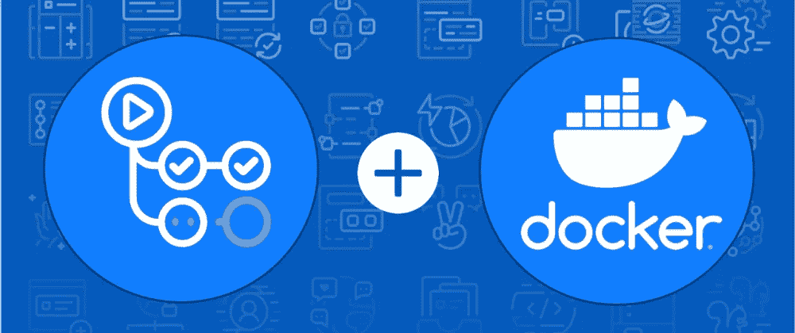
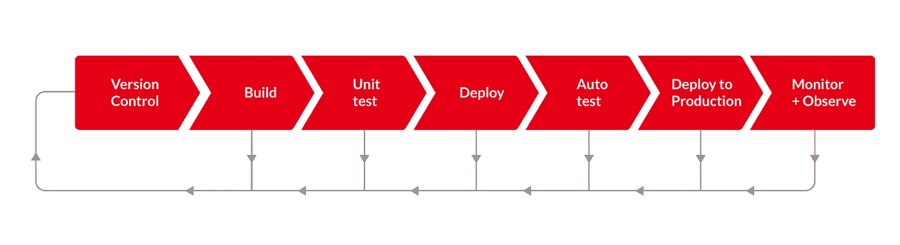
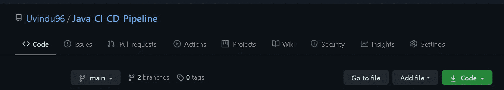
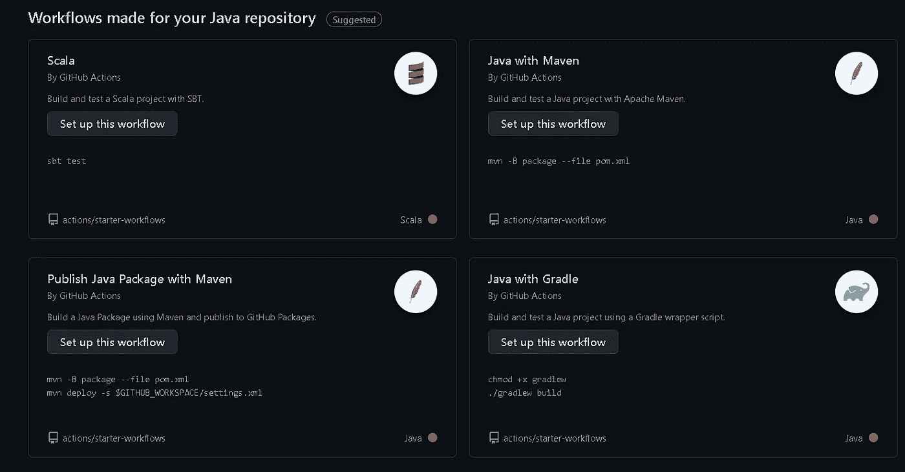
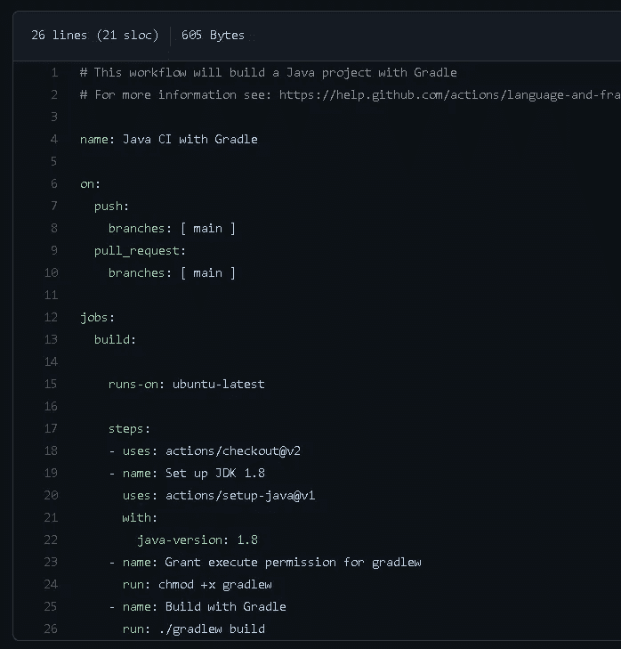
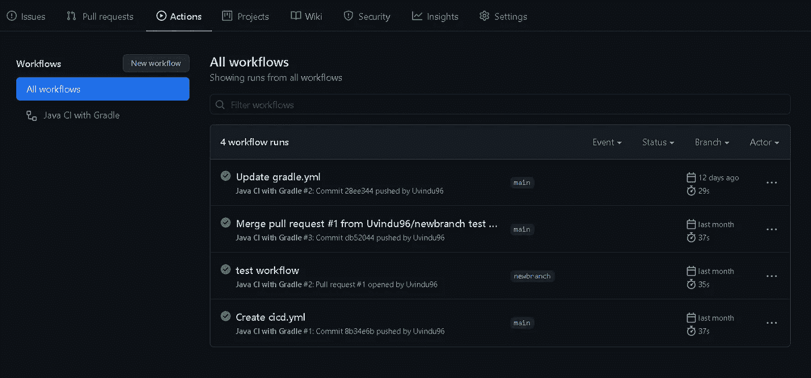
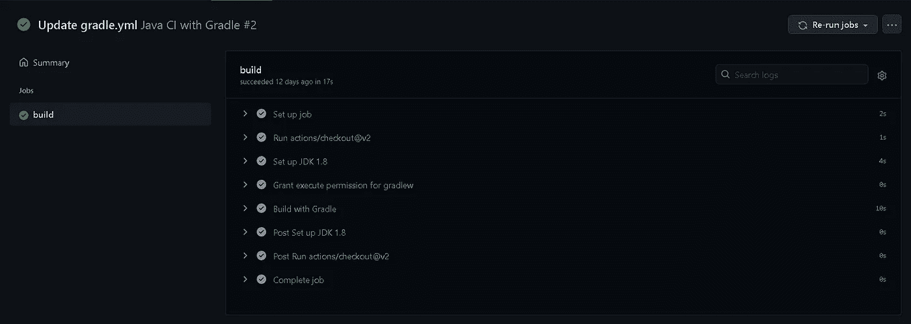

# 使用 GitHub 操作的 Docker 的 CI/CD 管道

> 原文：<https://medium.com/nerd-for-tech/ci-cd-pipeline-with-docker-using-github-actions-c364803b6bc2?source=collection_archive---------4----------------------->



> 几年前，Github 发布了 Github Actions，这对开发者来说是一个非常有用的工具。现在最大的问题是 Github 动作会降低现代 DevOps 操作的复杂性吗？答案就在这篇文章里。

在本文中，我们将重点关注…

1.  什么是 GitHub 动作？
2.  什么是开发人员工作流程？
3.  GitHub 事件和动作。
4.  具有 GitHub 操作的 CI/CD 管道。

# 什么是 GitHub 动作？

如今，开发人员不得不考虑的不仅仅是写代码。开发人员必须编写他们的代码，构建工件，测试这些工件，并将这些工件部署到测试环境中。你可以认为“这是很大的工作量..!"是的，这是 GitHub action 真正开始发光的地方。简而言之，GitHub 动作用于自动化软件开发工作流程。基本上，GitHub actions 是 CI/CD 平台，可以帮助开发人员自动化他们的工作流程。因此，我们最好看一下这些开发人员工作流是什么？

# 什么是开发人员工作流程？

就像我之前说的，开发人员花了很多时间在代码管理、代码测试、部署等方面。说到 GitHub，有许多组织任务正在进行。一个项目既有贡献者也有用户。用户产生了新的问题，开发人员或贡献者需要检查并解决这个问题。解决问题后，新版本的代码可用，并且正在为新版本的代码创建拉请求。这样，新版本的代码可以用于软件的下一个版本。有了这些，就有了可以与这些任务等同的主要任务。



上图显示了合并新版本软件后需要完成的最常见的工作流程。开发人员需要测试新版本的代码，构建软件并将其部署到生产环境中。对于一个小项目，你可以说没有很多工作需要做，但当项目开始增长时，问题就来了，更多的用户将与项目相关联，更多的贡献者将加入，所以这使得整个过程难以管理。所以你可以理解，当项目变得更大时，与项目相关的组织任务也变得复杂。因此，作为一名开发人员，你不需要花时间管理与项目相关的组织任务，你需要尽可能地自动化这些事情。这将允许开发人员更加专注于他们的代码。

# GitHub 事件和动作

到目前为止，我们已经讨论了什么是 GitHub 动作，什么是开发人员工作流。现在我们可以看看 GitHub 事件和动作是如何协同工作的。当存储库中发生某些事情时，您可以设置自动操作作为对这些事件的响应。这些事件专门命名为 **GitHub 事件，**创建新问题，新的拉取请求，贡献者加入所有这些事情都可以被识别为 GitHub 事件。触发动作的过程非常简单。首先，您监听某个特定事件被触发，然后根据该事件自动启动某个操作。

# 具有 GitHub 操作的 CI/CD 管道

每个人想到的第一个问题是，我们需要 GitHub 做什么？，我们已经有很多像 Jenkins 这样的 CI/CD 工具。答案是，如果你在 GitHub 中有你的代码，你不需要任何第三方工具来管理你的 CI/CD 过程。GitHub Actions 是 GitHub 用户的内置工具。使用 GitHub 操作设置 CI/CD 管道也非常容易。这也使得与其他技术的集成变得容易。

现在，让我们看看如何为您的应用程序使用 docker 设置 CI/CD 管道。在这个例子中，我们使用了一个基于 java 的应用程序。在我们开始演示之前，您需要有一个 GitHub 库来设置您的 CI/CD 管道。我创建了一个名为 Java-CI-CD-pipeline 的存储库。



您可以看到在您的 Git 存储库中有一个名为“Actions”的选项卡。单击该选项卡，您可以看到您可以开始自动化自己的工作流程。现在，我将把我的 java 应用程序发布到我刚刚创建的 Git 存储库中。使用“git push”命令，您可以发布您的更改。

要创建 GitHub 操作，请点击“操作”选项卡，然后您会看到一个工作流模板列表。在这个例子中，我将向您展示如何为您的应用程序创建一个简单的持续集成工作流。因此，您可以使用其中一个匹配的工作流模板来创建 GitHub 操作。在本例中，我使用的是 java Gradle 应用程序，因此根据应用程序类型，我必须为我的项目选择 Java with Gradle workflow。



选择工作流类型后。yml 类型文件将被创建在您的 GitHub 库的。/工作流目录。



这是我在回购中创建的文件。在这个文件中，push 和 pull 指的是通用的 git push 命令和 pull 操作，所以如果任何一种操作被触发，它将启动。刚刚创建的 yml 文件。在此文件中，作业是指将在工作流中执行的一组操作。

在上面的代码示例中，定义了“name”标记来添加工作流名称。在 steps 标签下，“uses”属性用于设置预定义的动作，比如 checkout。因此，像这样使用“使用”属性，您可以设置任何这样的行动。“运行”属性是指运行命令行命令。因此，让我们来看看我们的工作流将如何执行。

设置好这个文件后，将文件提交到您的代码中。接下来，对您的本地代码添加一些更改，并将其推送到您刚刚启用了 GitHub 操作的 git 存储库。完成后，转到 GitHub actions 部分，您将能够在 git commit 消息下看到已执行的工作流。在我的例子中，我将 git 提交添加为“Update gradle.yml”



单击工作流，您将能够看到您在工作流中定义的作业的执行情况。



好酷..！现在我们已经有了 GitHub 操作的基本设置，现在让我们看看如何将 Docker 集成到其中。

## 将 Docker 集成到工作流程中

在这一步中，我们将使用 GitHub actions 为我们的应用程序构建并发布一个 docker 映像。首先，您需要在 docker hub 帐户中有一个 docker 存储库。创建存储库后，将以下代码示例添加到您的工作流 yaml 文件中。

```
steps:
  - uses: actions/checkout@v2
    name: Check out code

  - uses: mr-smithers-excellent/docker-build-push@v5
    name: Build & push Docker image
    with:
      image: repo/image
      tags: v1, latest
      registry: registry-url.io
      dockerfile: Dockerfile.ci
      username: ${{ secrets.DOCKER_USERNAME }}
      password: ${{ secrets.DOCKER_PASSWORD }}
```

添加 docker 配置所需的详细信息。对于这段代码中的用户名和密码，它指的是一个秘密，所以你可以做的是，你可以使用 GitHub secrets 添加一个秘密。在您的存储库中，转到设置部分，在底部您可以找到秘密选项卡，在那里您可以添加用户名和密码的两个秘密。请注意，在运行工作流之前，您需要将 docker 文件添加到工作目录中。之后，将变更推送到存储库。现在，您将能够看到您的 docker 工作流也在运行。