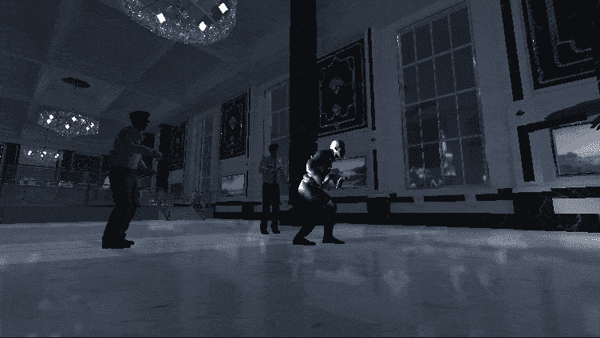
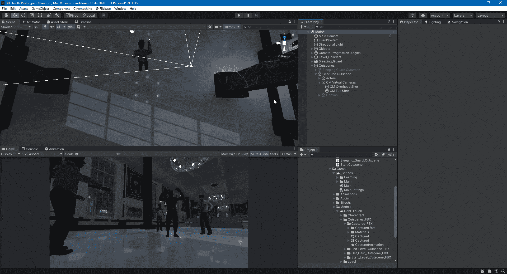
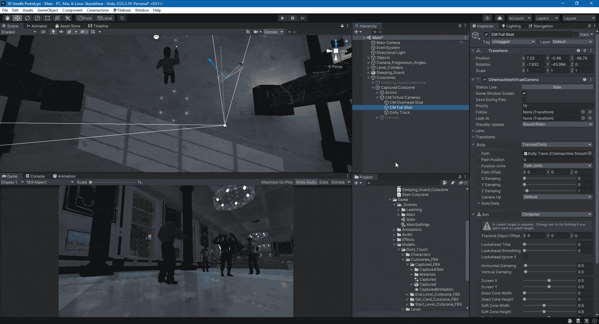
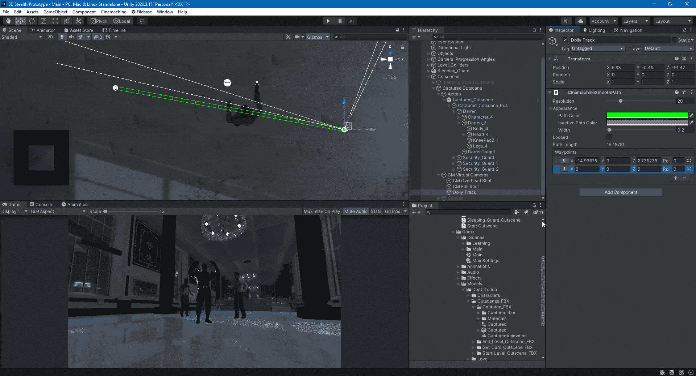
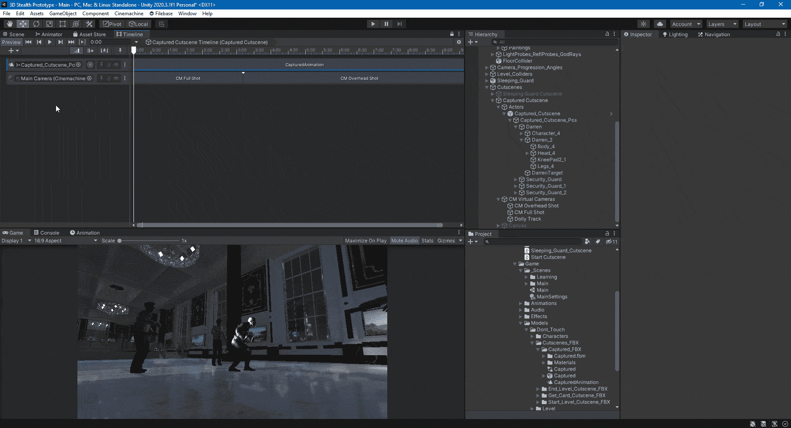

# 统一电影放映小车轨道

> 原文：<https://medium.com/nerd-for-tech/cinemachine-dolly-track-in-unity-a7bac3246b35?source=collection_archive---------10----------------------->

本文将展示如何在 Cinemachine for Unity 中使用 Dolly 轨道。在前一篇文章中，我们使用 Cinemachine 为过场动画设置了不同的镜头。我们可以使用几个虚拟相机来实现我们想要的外观，但这不会像小车轨道那样平滑。

首先，我们从 Cinemachine 创建一个小车轨道，并删除它附带的虚拟摄像机，因为我们已经设置了一个。然后，我们改变虚拟摄像机，使用一个跟踪小车来移动身体。

接下来，我们将让虚拟摄像机看一下目标。我们这样做是为了让主角一直在小车轨道上。

移动轨迹使用航路点来创建相机将沿其移动的路径。

一旦设置了移动轨迹的路径点，就该沿着路径设置虚拟相机的动画了。

