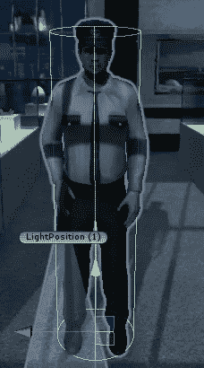
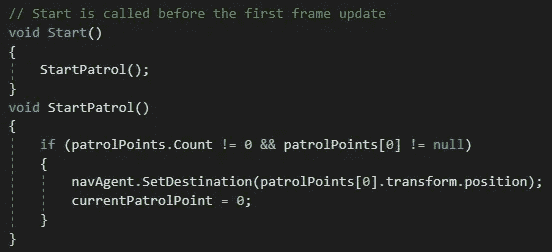
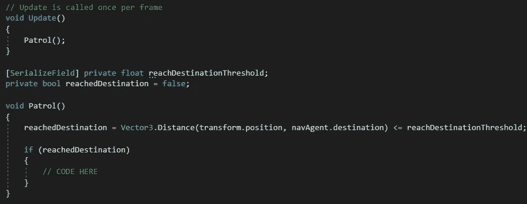
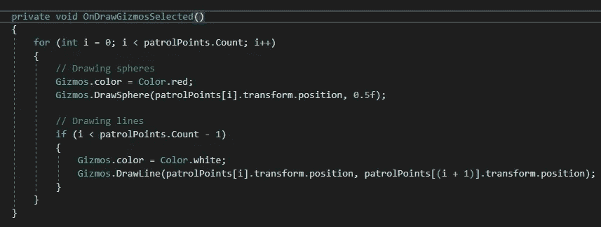
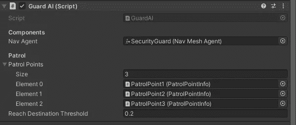
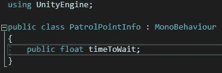
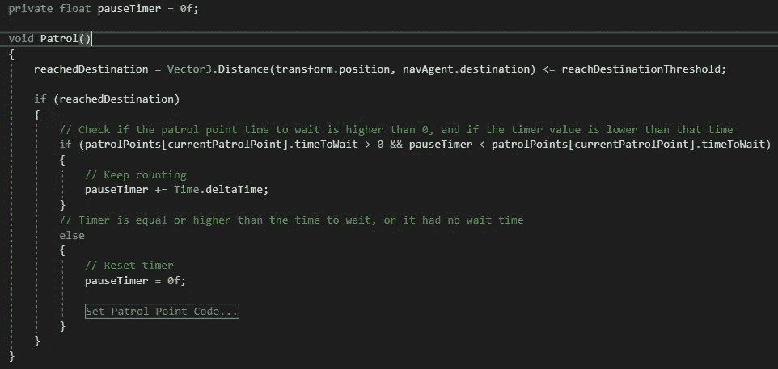
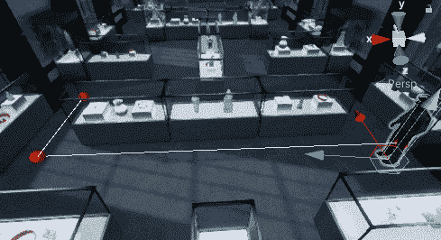

# 电影隐形项目——模块化巡逻航路点

> 原文：<https://medium.com/nerd-for-tech/cinematic-stealth-project-modular-patrol-waypoints-9-ac767b49618b?source=collection_archive---------24----------------------->

## 是时候分析一下警卫的巡逻模式了！

对于电子游戏中的敌人来说，巡逻模式是很常见的，从一个地方移动到另一个地方，寻找玩家。很明显，一个潜行游戏总是会有讨厌的敌人在周围巡逻。

所以，我实现了模块化巡逻路点，这将允许我轻松地创建新的巡逻路径和行为。让我给你演示一下这是如何工作的:

# 场景设置

您将需要一个带有导航网格代理组件的游戏对象，以及各种将充当您的巡逻路点的空游戏对象。这真的是你需要继续下去。

这个守卫将是我将执行巡逻行为的测试对象

# 代码设置

创建一个新的脚本，包括 **UnityEngine。AI** 库，并声明一个新的 **NavMeshAgent** 变量。

巡逻行为将需要参考警卫将遵循的每个路点，为此，我创建了一个**列表**变量(使用**系统)。Collections.Generic** )和一个 **int** 变量来跟踪当前选择的航路点。然而，这个列表并不包含游戏对象或变换引用，它只接受具有我命名为 **PatrolPointInfo** 的特定脚本的游戏对象。

让我们暂时忘记这个脚本。

一旦游戏开始，人工智能应该开始向第一个巡逻点移动。我们还将检查巡视路线点列表是否不为空，以及第一个巡视点参考是否已在检查器中分配。

巡逻行为将通过代理和目的地位置之间的距离小于或等于距离阈值来不断检查代理是否已经到达其目的地。

对于这个例子，巡逻路径将不是循环的，相反，AI 将在到达路径的起点或终点后来回移动。

作为奖励，我们应该能够看到我们的路点。在 OnDrawGizmos 方法中，我们将滚动每个点，并为我们的路点和它们之间的线创建一个球体。

就是这样！我们有一个很好的模块化巡逻路径，我们可以修改，甚至在运行时！

# PatrolPointInfo 脚本呢？

会有一些巡逻点，你希望对它们有更多的控制。也许，你想让代理停在某个点上，或者看向某个特定的方向。

这就是这个脚本发挥作用的地方，帮助你增加巡逻行为的复杂性，同时保持它的模块化。我将添加一个额外的功能，允许我为每个航点指定一个空闲时间，代理将在这段时间内保持不变。

这个脚本非常简单，更像是一个数据容器。将此脚本添加到您的路点，并在编辑器中设置等待时间。

对于我们的主脚本，只需用计时器检查等待时间就足够了，只需最少的努力就可以完成这项工作。

# 结果

