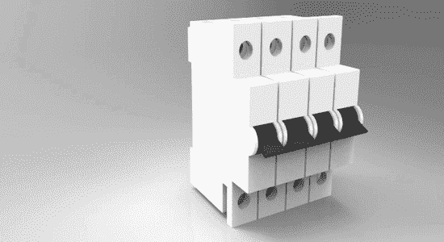
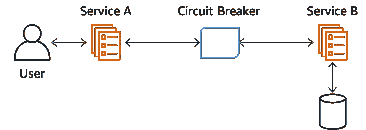
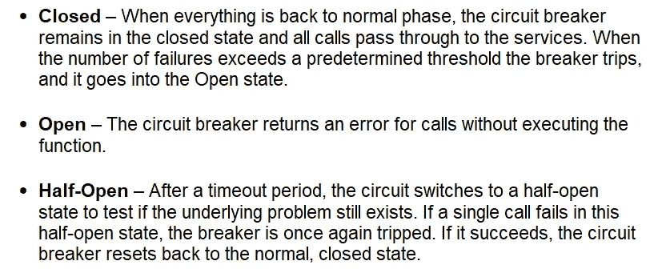
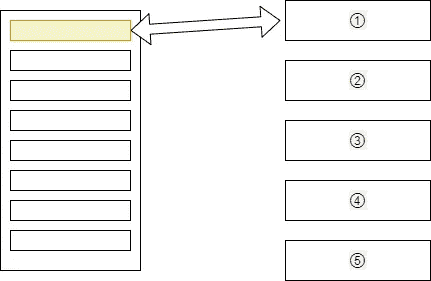
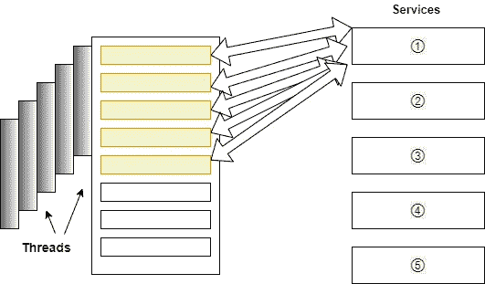
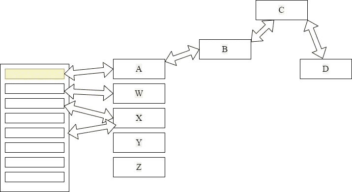
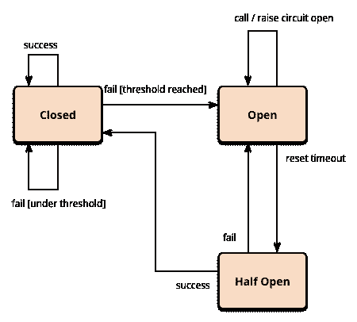
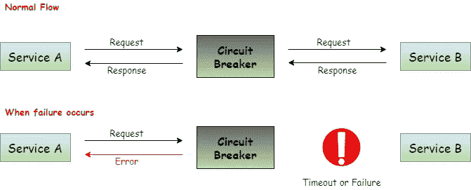

# 断路器设计模式🔩

> 原文：<https://medium.com/nerd-for-tech/circuit-breaker-design-pattern-ce6378f5a929?source=collection_archive---------13----------------------->

(微服务设计模式— **第 2 部分**)



如果你的房子是用电供电的，那么你可以找一个断路器。因此，当你从主电网获得电力时，电力总是通过断路器来提供。如果主电网以异常的方式运行，或者如果额外的电力试图到来，那么断路器将关闭，房屋的内部电力系统将受到保护。所以这个场景很像“断路器设计模式”。

# 为什么我们需要断路器设计模式？🧐

在分布式系统中，有许多服务相互交互。所以服务宕机的可能性很高。因此，最好在发送请求时知道服务的状态。

# 断路器设计模式

> “断路器背后的基本思想非常简单。您将受保护的函数调用包装在断路器对象中，断路器对象监视故障。一旦故障达到某个阈值，断路器就会跳闸，对断路器的所有进一步调用都会返回一个错误，而根本不会进行受保护的调用。”—马丁·福勒



ref:[https://docs . AWS . Amazon . com/whites/latest/modern-application-development-on-AWS/circuit-breaker . html](https://docs.aws.amazon.com/whitepapers/latest/modern-application-development-on-aws/circuit-breaker.html)

正如我们上面讨论的，如果特定的服务停止，我们使用断路器设计模式来停止发送或处理请求。假设一个消费者发送一个从多个服务获取数据的请求。在这些服务中，有一个服务由于特定原因而关闭。因此，你将不得不面对两个问题:

由于▪️消费者对羽绒没有足够的了解，所以会向其发送继续该项特定服务的请求。

▪️系统和网络资源会因性能低下而疲惫不堪。

✔️所以，为了摆脱这些，我们可以使用**断路器设计模式**。

📍通常，每当我们谈到服务的可用性时，我们都会说 99.999%有保证。考虑下面的计算。

```
**24 hours per day and 365 days per year = 8760 hours per year
8760 * 60 = 525600 minutes per year
99.99% uptime means, the accepted failure chance = 0.001%
525600 * 0.001% = 5.256 minutes****Therefore one service can down for 5.256 minutes per year**
```

✹:如果这是单片架构，这似乎没问题，但如果这发生在微服务架构中，就不好了。因为如果我们有 100 项服务，那么每年将花费 8.78 小时`**(5.256*100)/60 = 8.78 hours)**`。因此，这是不可接受的。

✹在断路器设计模式中有三种状态，即**闭合、断开、**和**半开**。



ref:[https://www . cars 24 . com/blog/hy strix-how-to-handle-cascading-failures-in-micro service/](https://www.cars24.com/blog/hystrix-how-to-handle-cascading-failures-in-microservices/)

## **如果服务中断会发生什么情况**🙄

▪️:让我们通过下面的例子来理解它，

▪️假设有 5 种不同服务。现在，在收到请求后，服务器分配一个线程来调用特定的服务。(如下图 1 所示)



图 1

▪️:现在服务 **①** 有点延迟。所以线程在等待。

▪️:如果只有一个线程在等待特定的服务，那就好了。但是，如果这个服务是高要求服务🧐呢？如果是这样，那么它将获得更多的请求，线程将在队列中等待和阻塞。(如下图 2 所示)



图 2

▪️:所以尽管服务恢复了，你的网络服务器永远不会恢复，因为当它处理队列时，越来越多的请求进来了。这种情况将导致破坏您的服务，从而导致级联故障。

# 连锁故障

让我们通过下面的例子来理解这一点:



️Here，a 服务调用 b，b 调用 c，c 调用 D (W，x，y，z 是其他服务)。如果服务 D 未能及时响应，那么服务 C 将不得不等待，因此当 C 等待时，服务 B 也必须等待，当 B 等待时，服务 A 也必须等待。这叫做**连锁故障**。

▪️:所以，无论如何，如果你的服务失败，你的服务将会离线。

## 级联失效不好吗？

▪️是的！因为级联故障可能导致的主要问题是它会使整个应用程序或系统停机。

## 如何克服？

▪️，让我们以同样的场景为例。现在您已经定义了一个阈值，服务 A 应该在 200 毫秒内做出响应。

▪️:根据断路器模式，如果请求数量(75%的请求)达到上限(即 150 到 200 之间)，这意味着服务正在缓慢失败。

▪️如果出现的次数超过服务的最大阈值(200 毫秒)，代理将识别服务不再响应。

▪️:所以，它将回退下一个访问服务 a 的请求，这意味着它会中断代理和服务 a 之间的连接。(现在，代理不会转到服务 a，所以它不会再等待)

## 这里是什么断路器？

▪️假设有 30 秒暂停。并且每个请求都试图命中服务 A，而不考虑它的失败。因此，来自消费者的所有请求都将等待 30 秒并失败。同样在 30 秒的时间内，消耗 A 的剩余请求将在等待队列中等待。

▪️因此，如果它失败**超过给定阈值**，断路器将不会尝试触发服务 a，并且它将回退消费者，告知“服务 a 不可用”。

📝注意:当响应时间恢复到正常阈值时，断路器将再次闭合，新的流量将通过。



参赛:https://martinfowler.com/bliki/CircuitBreaker.html

## 这是否意味着我们不能满足某些消费者的要求？🙄

**是的😰**因为，如果它让它们去服务哪一个停机了，整个系统都会失灵。

# 摘要😎



📝通过使用断路器设计模式，我们可以以一种优雅的方式控制故障。断路器模式不会让用户等待内部服务故障，为用户提供了更好的用户体验。

# 参考

[用断路器模式保护你的服务](https://www.youtube.com/watch?v=mw8W-RpvCu0&list=PLD-mYtebG3X9HaZ1T39-aF4ghEtWy9-v3&index=6)

[https://martinfowler.com/bliki/CircuitBreaker.html](https://martinfowler.com/bliki/CircuitBreaker.html)

[https://www . edu reka . co/blog/micro services-design-patterns # circuit breaker](https://www.edureka.co/blog/microservices-design-patterns#CircuitBreaker)

[https://docs . AWS . Amazon . com/white papers/latest/modern-application-development-on-AWS/circuit-breaker . htm](https://docs.aws.amazon.com/whitepapers/latest/modern-application-development-on-aws/circuit-breaker.html)

[https://micro services . io/patterns/reliability/circuit-breaker . htm](https://microservices.io/patterns/reliability/circuit-breaker.html)

[https://docs . Microsoft . com/en-us/dot net/architecture/microservice/implement-resilient-applications/implement-circuit-breaker-pattern](https://docs.microsoft.com/en-us/dotnet/architecture/microservices/implement-resilient-applications/implement-circuit-breaker-pattern)