# 微服务中的断路器设计模式

> 原文：<https://medium.com/nerd-for-tech/circuit-breaker-design-pattern-in-microservices-5746eeddba63?source=collection_archive---------12----------------------->

✷断路器不仅仅是一种设计模式。这非常接近于可持续的模式。

✷Circuit 断路器模式有助于您保持您的服务没有死亡或保持良好的健康您的服务。(快速失败)

# 为什么这很重要，❗️❓

在传统系统中，我们不知道其他服务会如何中断。所以每个服务都有责任生存。换句话说，开发人员负责保持服务的活力。

这不仅适用于微服务，而且这在微服务中非常重要，因为我们有多个由不同团队以不同方式维护的服务。

# 现实生活中断路器的一个例子

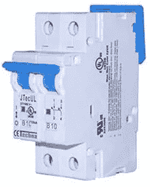

如果你家是用电的，那肯定有断路器。

你从主电网获得电力，但它来自断路器。如果你的主电网表现异常，或者如果雷击导致电网上的额外电力，它将打破断路器，它将关闭。这样，你家的内部线路就会得到保护。

如果我们以之前的例子为例，

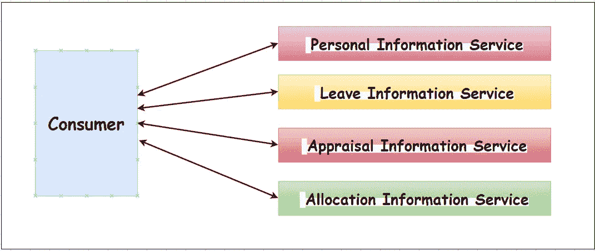

●当您有多个服务时，这些服务调用多个后端的可能性很高。您可以创建一个类似聚合器的模式来调用这些服务。

●在考虑可用性时，通常保证服务 99.999%正常运行。

如果你做一些简单的数学来理解这一点。

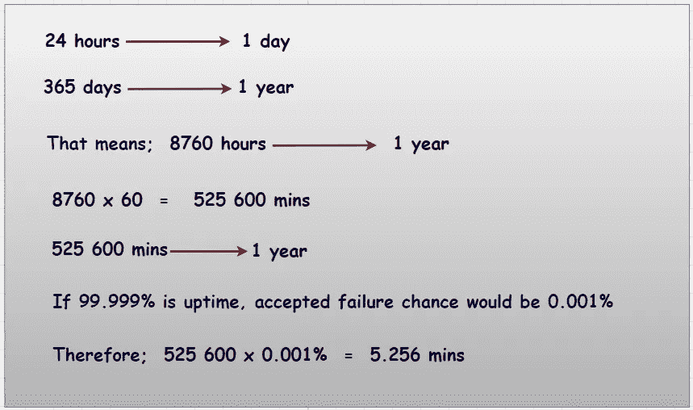

因此，一项服务每年只能停机 5.256 分钟。

这在单芯片应用中很好。但是说到微服务架构，你有多种服务。假设您有 100 项服务。

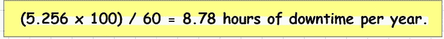

这可能是不可接受的，这就是为什么我们需要注意保护服务。

# 断路器的状态

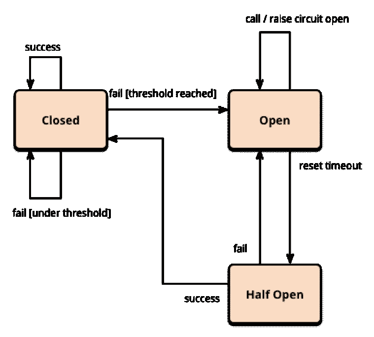

参赛:https://images.app.goo.gl/RmCoFoHV5nauQgfh7

断路器有三种状态，即:

1.  **闭合:**断路器处于闭合状态，一切正常时，将所有呼叫转接到远程服务。当故障次数超过规定的阈值时，断路器跳闸，同时进入断开状态。
2.  **打开:**不执行函数，返回调用错误。
3.  **半开:**电路在超时一段时间后切换到半开状态，测试潜在问题是否仍然存在。在这种半开状态下，如果单个呼叫失败，断路器将再次跳闸。如果成功，断路器复位回到正常，即“**闭合**状态。

# 导致服务中断

## 场景 1

让我们假设您有 5 个不同的服务，一个 web 服务器调用它，并使用聚合器模式(链式模式或并行模式)实现。现在你会得到请求。这意味着，服务器已经分配了一个线程来调用该服务。但是现在，服务有点延迟，线程等待或者超时。一个线程等待是没问题的，但是如果它是一个高需求服务，并且如果它不断收到越来越多的请求，那么池中的线程必须一个接一个地等待。

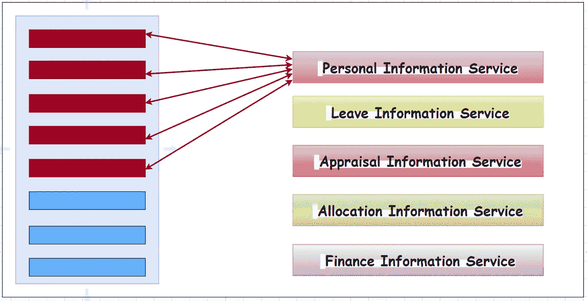

假设您有 100 个线程，现在可能有 98 个线程被占用。其他两个线程可能用于其他服务。所以此刻所有的线程都被占用或阻塞了。

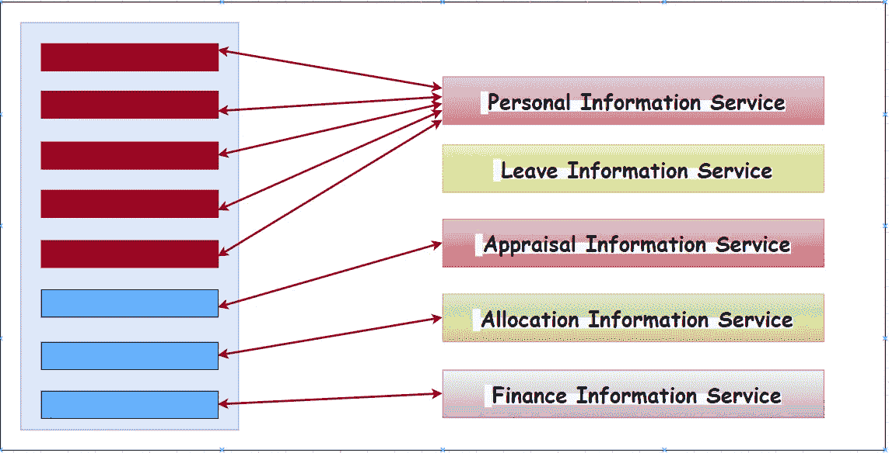

在这种情况下，到达您的服务的剩余请求将被阻塞或排队。假设有 100 个线程，其中 50 个在一个队列中。不知何故，这个失败的服务被恢复了。但是，web 服务器仍然试图处理队列中等待的所有请求。结果，您的 web 服务器或代理将永远无法恢复，因为尽管它处理队列，但请求不会停止到来。这种类型的场景会扼杀你的服务。

## 场景 2

假设有这样一种情况。

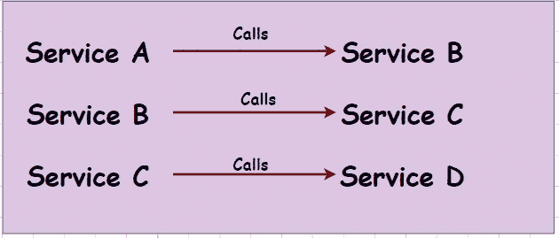

同时，你还有 W，X，Y，Z 等服务。如果服务 D 未能及时响应，服务 C 将等待。因此，服务 B 也会等待。这意味着，服务 A 也将等待。这可能会导致级联故障。

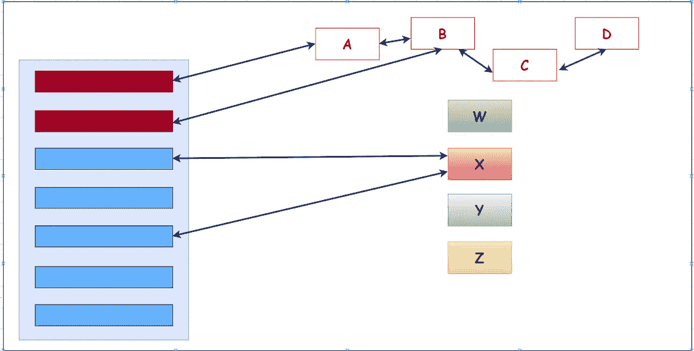

✹:无论如何，如果你失败了，服务就会离线，这是不可接受的。

现在，我们需要找到一种方法来保持这些功能正常运行。

让我们以同样的场景为例:4 个后端服务&调用这些服务的代理或模式

让我们为此确定门槛。

断路器模式在某种程度上起作用；

🔸如果 75%的请求达到了阈值上限，服务就会发现这是一个缓慢失败的过程。如果发生次数超过 200 毫秒，这意味着您为该服务指定的最大阈值超过了次数，它将认为该服务不再响应。下一个访问服务 A 的请求将回切。它会中断您的代理和服务 A 之间的连接。然后，代理不会转到服务 A，这意味着它不会等待。

## 当服务处于良好响应时间时

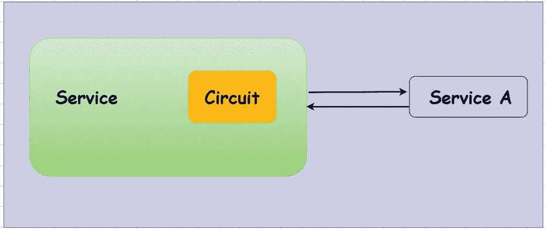

**为什么需要实现中间的某个东西而不是直接去服务，看它是否失败？**

✹，假设你有一个 30 秒的暂停。如果每个请求都试图访问服务 A，而不考虑它是否失败，那么来自消费者的所有请求都将等待 30 秒。30 秒超时结束后，这些将失效。

但是在这 30 秒的时间里，剩余的使用服务 A 的请求将试图到达服务 A，这些请求也将在队列中等待。

# 什么样的断路器模式？

✹如果一个服务的失败次数超过了给定的阈值，它将根本不会尝试去命中那个特定的服务。它将回退并通知消费者该服务不可用。

# 它将如何连接回来？

✹，同时，它向该特定服务发送 ping 请求/默认请求。(不时地)当这个响应时间回到正常阈值时，它将再次打开电路。下一个到达消费者服务的请求将直接到达服务。

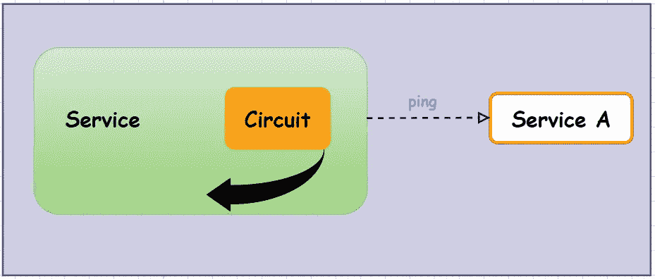

✹:不再有队列，因为在失败期间，所有使用特定服务的请求都被返回，并带有一条错误消息。所以，不会有排队。当服务恢复时，它将为新的流量开放。

✹:虽然某些用户请求失败了，但是如果我们使用这种方法，整个系统不会失败。如果我们让所有的消费者请求，而没有任何一个请求失败，那么整个系统将会失败，服务后面将会有一个巨大的队列。即使服务启动了，这些队列也会使用特定的服务，并最终无法处理它们。因此，使用这种方法时，某些请求会失败一段时间。一旦失败的服务恢复，剩余的服务将得到服务。这就是这种设计模式背后的原则。

# 参考

 [## 断路器模式- DZone 微服务

### 软件系统对运行在不同进程中的软件进行远程调用，通常是在跨…

dzone.com](https://dzone.com/articles/circuit-breaker-pattern)