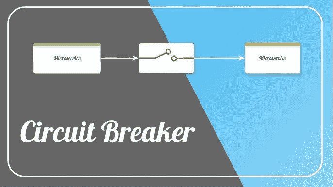
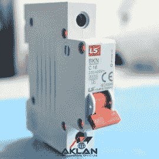
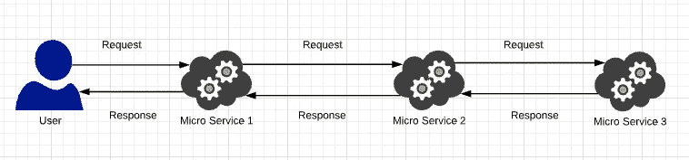
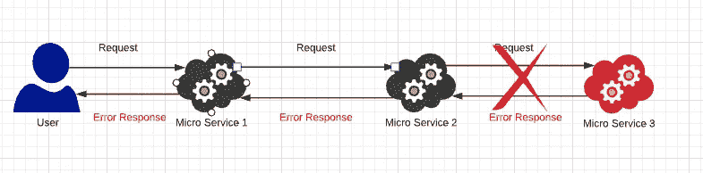
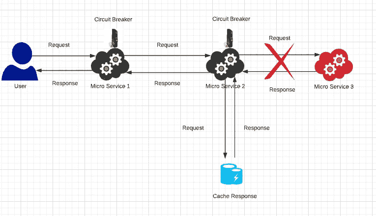
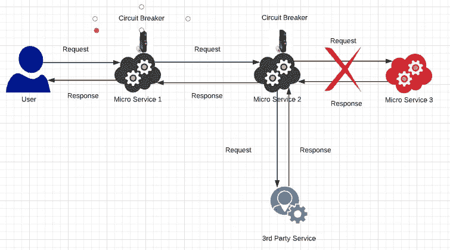
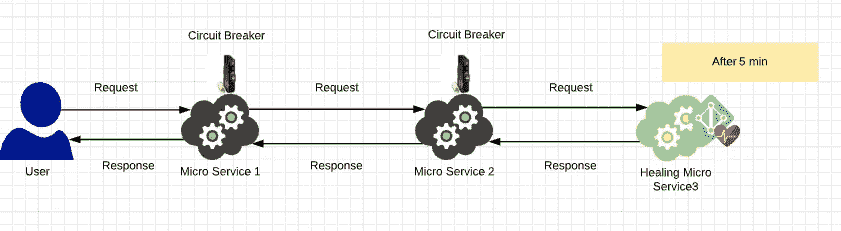
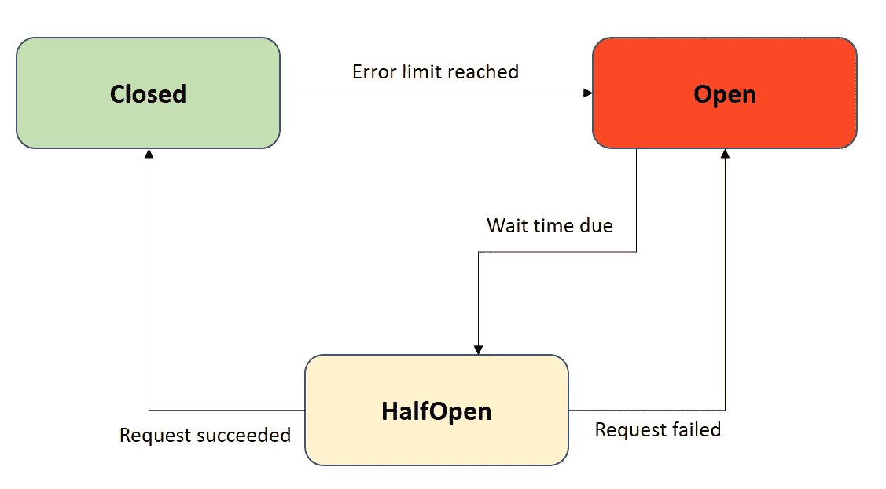

# 断路器模式——微服务架构

> 原文：<https://medium.com/nerd-for-tech/circuit-breaker-pattern-microservice-architecture-4c6b1a06f3f3?source=collection_archive---------2----------------------->

在这个教程中，我们来学习一下**断路器**。断路是一种**软件设计模式**，主要用于一个服务影响其他服务的情况。如果你有一些电子或电气工程的基础知识，你肯定听说过断路或 [**MCB 开关**](https://uk.rs-online.com/web/generalDisplay.html?id=ideas-and-advice/mcb-guide#:~:text=An%20MCB%20is%20an%20automatically,electrical%20faults%20and%20equipment%20failure.) **(微型断路器)**。

这基本上是一个电子开关，用来保护我们的家用电器。当电路出现异常时，它会自动切换以保护整个电路。这种断路概念类似于我们在软件世界中使用的概念，在软件世界中，服务实际上与许多其他服务进行交互。我们举个例子，了解一下到底是什么。

假设有 3 个微服务，这 3 个微服务相互交互**同步**。当请求到达**微服务 1** 时，**微服务 1** 正在调用**微服务 2** ，**微服务 2** 正在调用**微服务 3** 。如果所有服务都可用，我们肯定会得到从**微服务 3** 到**微服务 2** 和**微服务 1** 的响应。所以这是一条快乐的路。但是可能有一些服务不可用。并非所有的服务都是可用的。

## 如果微服务 3 宕机会怎么样？

该请求将到达**微服务 1** 和**微服务 2** ，当到达**微服务 3** 时，它将返回一个错误。现在，**微服务 2** 将收到一个错误，**微服务 2** 向**微服务 1** 响应一个错误，我们将得到一个**错误响应**。这并不好，因为我们不想发回错误。我们需要用更好的方式处理它。问题可能会更多。如果**微服务 2** 有一个机制来重试几次，以获得来自**微服务 3** 的成功响应，会发生什么情况。假设**微服务 2** 中有 5 次重试机制。现在，当请求到达**微服务 2** 时，现在**微服务 2** 调用**微服务 3** ，但是**微服务 3** 运行不正常或者出现故障，我们正在恢复错误。假设 **MicroServic3** 负载过重，这就是为什么我们得到了 **500 错误**并且它不能处理新的到来的请求。现在，**微服务 2** 继续重试**微服务 3** 5 次，我们从**微服务 3** 得到更多错误。所以应该有更好的方法来处理这些事情。

## 你如何让事情变得更好？

让我们给这个加一个**断路器**。假设我们在每个微服务中都实现了一个断路器。断路器有三种方式帮助电路正常工作。

**缓存响应**

当请求到达**微服务 1** 时，它到达**微服务 2** ，然后它调用**微服务 3** 。现在，**微服务 2** 知道**微服务 3** 行为不正常。现在**微服务 2** 中的断路器知道我们刚刚调用的服务返回一个错误。它实际上知道哪个服务失败了多少次。所以它知道**微服务 3** 只是返回一个错误。断路器假定返回一个缓存响应来返回缓存响应。这意味着，每当我们从服务收到一些错误，我们应该得到一个响应，我们实际上可以配置断路器返回缓存的响应。此缓存响应是我们在上次或服务失败之前收到的成功响应。所以现在，当服务失败时，我们实际上可以取回缓存的响应。现在用户可以接收带有**缓存响应**的 **200 成功响应**。

**回退机制**

实际上，我们可以将调用从**微服务 2** 重定向到与**微服务 3** 类似的其他服务，而不是返回缓存响应。现在，与**微服务 3** 服务一样，我们可以从第三方服务获得成功响应，而不会出现任何错误。因此，当实际服务失败时，我们可以回退到不同的替代服务。

**愈合机制**

这里，当请求到来时，微服务断路器保持**微服务 3** 的失败次数。在给定的失败次数后，我们可以告诉**微服务 2** 上的断路器，而不是所有**微服务 3** 。先别管这个**微服务 3** 了。让它愈合一段时间。我们还可以配置时间。此后，任何对**微服务 2** 的请求都不会调用**微服务 3** ，直到定义的时间间隔结束。现在我们可以使用**缓存响应或回退机制返回响应。**现在我们可以断开**微服务 3** 让它恢复。

**怎么才能恢复？**

*   如果队列中有任何未决的请求，它可以处理并结束。
*   它可以被关闭并部署一个新实例，或者被配置为启动一个新实例。

## **超时后会发生什么？**

在一定的超时之后，**微服务 2** 将调用**微服务 3** 并检查响应如何。如果它仍然失败**，微服务 2** 将返回缓存响应或采用回退机制。如果请求成功，那么**微服务 2** 缓存成功响应并将响应返回给**微服务 1** 并保持流程正确。

## 电路图

*   **闭合** —当一切正常时，断路器保持闭合状态，所有呼叫都转到服务。当故障数量超过预定阈值时，断路器跳闸，并进入断开状态。
*   **打开** —断路器返回呼叫错误，不执行该功能。
*   **半开** —超时后，电路切换至半开状态，以测试潜在问题是否仍然存在。如果在这种半开状态下单个呼叫失败，断路器将再次跳闸。如果成功，断路器复位回到正常闭合状态。

如果一切正常，我们就处于**关闭状态**。如果**微服务 3** 现在出现故障，则电路与微服务 3 断开，并进入**打开状态**并开始返回缓存响应。延迟一段时间后，它再次调用**微服务 3** 并进入**半开状态**，这意味着它实际上检查**微服务 3** 是否返回成功响应。如果它返回成功响应，我们可以进入**关闭状态**，或者如果它仍然返回错误，我们可以进入打开状态。这是断路器的完整电路图。

我想你已经了解了**断路器设计模式**的基本知识。下节课再见。

谢谢大家！