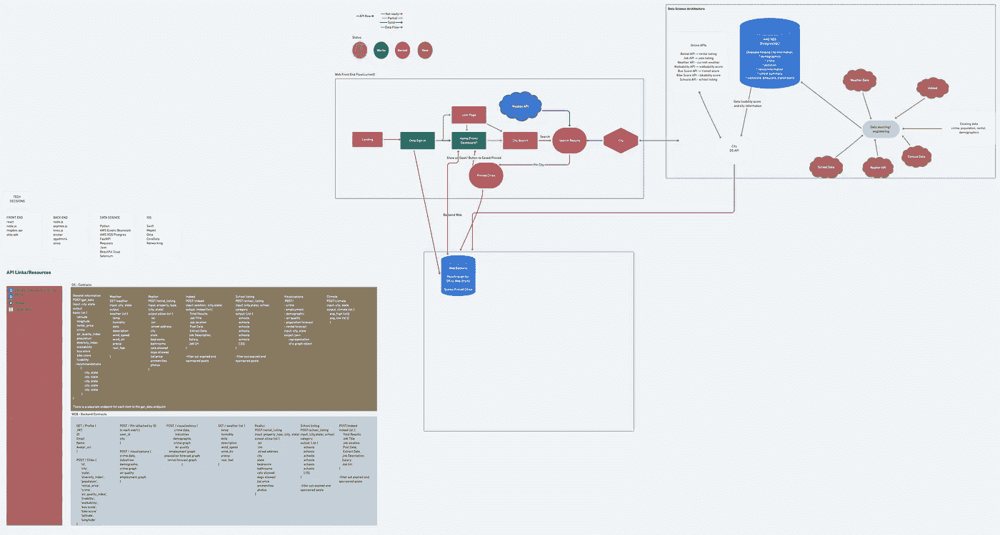
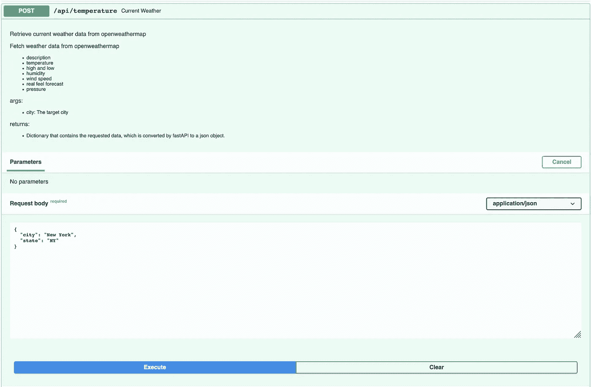
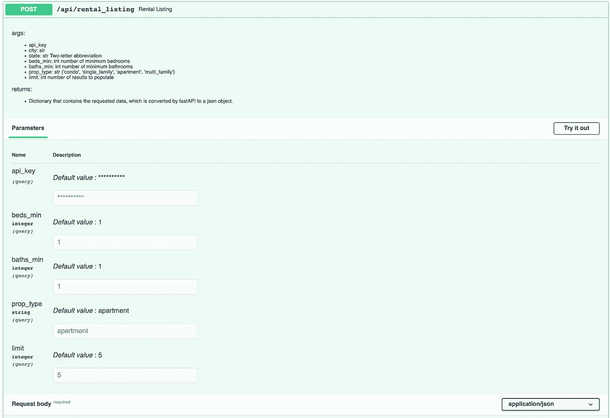
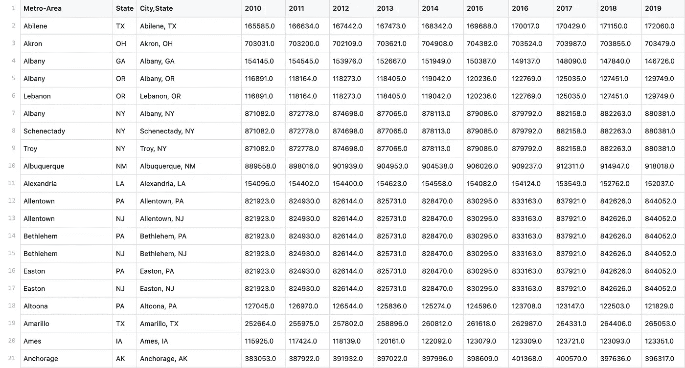
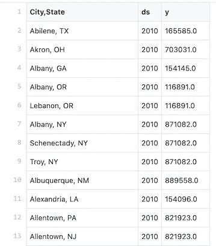
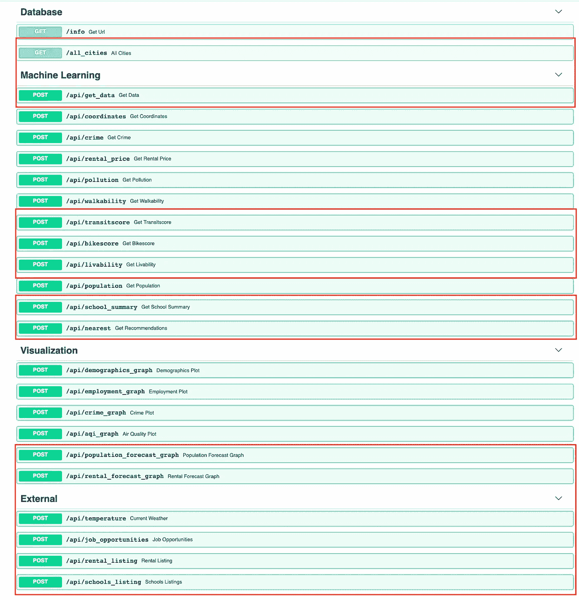
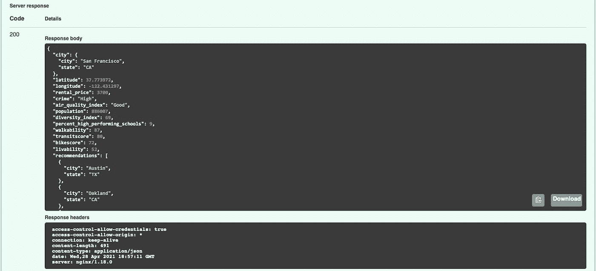
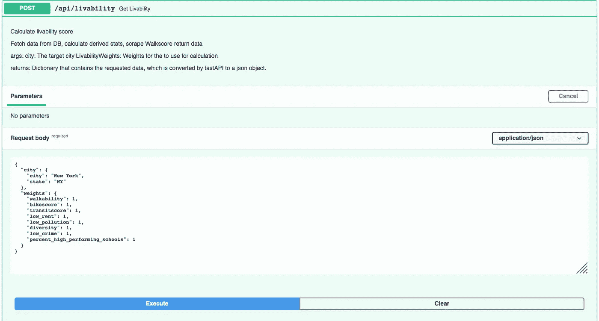
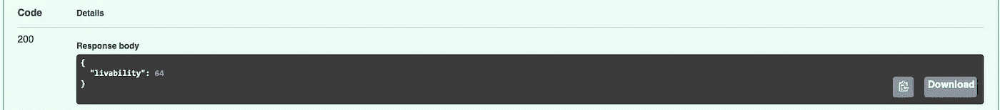

# 城市尖塔

> 原文：<https://medium.com/nerd-for-tech/cityspire-bf0d400ca370?source=collection_archive---------15----------------------->

— **传奇仍在继续。**

**TLDR:** 在接下来的 8 周多的时间里(兼职)，我继续与一个(不同的)跨职能团队合作开发 CitySpire 应用程序。数据科学团队收集和清理数据，执行数据分析和功能工程，添加新功能，使用机器学习来创建预测模型并获得建议。使用 FastAPI 部署这些新特性来创建端点，最后将这个应用程序部署到 Amazon Web Services (AWS)上。AWS Elastic Beanstalk 托管我们的 API，数据存储在 AWS 关系数据库服务中，特别是 Postgres。虽然对许多人来说，他们是在另一个团队继承的代码基础上构建的，但这实际上是我的[前一个团队的工作](https://github.com/Lambda-School-Labs/labspt15-cityspire-g-ds)。不幸的是，这对我来说并不意味着一帆风顺，一路上有很多学习、斗争和挫折。

乔纳森·罗杰在 [Unsplash](https://unsplash.com/s/photos/cityscape?utm_source=unsplash&utm_medium=referral&utm_content=creditCopyText) 上的照片

# 简介:

- *对 CitySpire 的改进*

在我之前的文章中，我谈到了帮助用户找到新的家乡城市的应用程序 CitySpire。CitySpire 的目标是成为用户接收最准确城市信息的一站式资源。该应用程序分析来自城市的数据，如人口、生活成本、租赁率、犯罪率、公园(步行得分)以及许多其他社会和经济因素，这些因素对于决定某人想住在哪里很重要。

**问题:**虽然应用程序的当前表单给出了许多关于城市的一般信息。它提供了诸如租金中位数、犯罪率、步行得分、多样性等信息，以及对类似城市的建议。潜在用户要做出如此重大的改变生活的决定，还需要更多的信息。信息，如学校，如果他们与孩子一起搬迁，未来的租金，人口增长或下降，以及其他两个非常重要的因素，出租物业的可用性和就业机会。

**解决方案:**city spire 2.0 应用程序通过以简单的格式为您提供数据驱动的推荐，让您不再为寻找理想的城市而烦恼。

制约因素:我和我的团队正在赶时间。我们必须快速适应现有的代码库，并集成利益相关者的[特性规范](https://www.notion.so/CitySpire-9134a15c1cc3481e87f8d121f7ef3843)。

数据科学团队不得不寻找数据源(网络搜集、获取 API 密钥、公共记录等。)为用户提供必要的信息。我们必须更新当前的建议(机器学习模型)和宜居性模型，以包括新的数据点。我们还负责创建租金、人口和天气预测。所有这些数据必须以前端可用的格式返回，并且可以连接到后端。

对数据没有那么多的清理和争论。这一次我们进行了相当多的网络数据提取，或者说数据搜集，从不同的网站提取数据。这是另一个很大的限制，因为我们的团队没有很多网络抓取的经验。

# **策划:**

**系统架构:**

这方面的规划首先侧重于了解现有 CitySpire 应用程序的功能。从涉众的规范中实现了哪些特性？当前哪些功能需要调整？需要实现哪些新功能？

因为我是前一个团队的成员，所以我对布局非常熟悉。在查看和测试了当前的规范之后，我们仔细阅读了产品文档以构建系统架构。

CitySpire 队的系统架构

**实施:**

有几个新特性需要实现，所以我们卷起袖子开始工作。我们使用 [Trello](https://trello.com/b/LpH3VjbS/labspt17-cityspire-a) 来概述用户故事并创建卡片来保持我们的进度，这样我们就可以在最后期限[发布特性](https://www.notion.so/CitySpire-9134a15c1cc3481e87f8d121f7ef3843)。

# 启动并运行:

有了之前使用 AWS 技术堆栈和 FastAPI 的经验，我能够在第一个周末启动并运行应用程序。这允许后端快速连接到数据科学 API。

# FastAPI:

FastAPI 是一个现代的高性能 web 框架，用于基于标准 Python 类型提示用 Python 构建 API。

开始时，只需运行以下三个命令:

1.  `pipenv install -- dev`
2.  `pipenv shell`
3.  `uvicorn app.main:app --reload`

上面的步骤是这样工作的，它安装应用程序运行所需的包，然后进入 shell，最后，最后一个命令部署 FastAPI 应用程序。

# AWS RDS Postgres:

为了在本地与 FastAPI 连接，我们需要建立一个数据库来存储以前的数据以及我们需要包含在 city spire 2.0 版本中的新数据点。

什么是 AWS RDS？Amazon 关系数据库服务是由 Amazon Web Services 提供的分布式关系数据库服务。它是一个运行在“云中”的 web 服务，旨在简化应用程序中使用的关系数据库的设置、操作和伸缩。(维基百科)我们只是选择了 PostgresSQL 风格。

在本地开发的时候，我用 [python-dotenv](https://pypi.org/project/python-dotenv/) 加载了一个`.env`文件。(`.env`文件在`.gitignore`中列出。)这确保了我的用户名和密码受到保护。部署时，我们使用弹性 Beanstalk 控制台来配置环境变量。

# AWS 弹性豆茎:

在确保可以在本地部署之后，我们使用 AWS Elastic Beanstalk 部署了我们的应用程序。

AWS Elastic Beanstalk 是一个易于使用的服务，用于部署和扩展 web 应用程序和服务。您只需上传您的代码，Elastic Beanstalk 就会自动处理部署，从容量供应、负载平衡、自动扩展到应用健康监控。

使用`awsebcli`，我们能够运行以下命令，并且我们已经开始工作了！

1.  `eb init --platform docker CHOOSE-YOUR-NAME --region us-east-1`
2.  `eb create --region us-east-1 CHOOSE-YOUR-NAME`
3.  `eb open`

然后在进行更改时，我们必须使用 git 提交这些更改，然后运行`eb deploy`和`eb open`来重新部署应用程序的更改。

我们配置了其他环境变量，比如 API 键和数据库 URL，以确保我们的应用程序能够正常运行。

包括数据库名称和 URL、API 密钥以及应用程序所需的其他环境属性。

在 Elastic Beanstalk 上部署我们的 API 允许后端开发人员连接到数据，然后将数据传输到前端，允许用户与之交互。

# **成功了！**

这是我们成功部署后的样子。

CitySpire 1.0 的端点

# 数据:

**API 键:**

产品规范中的一些新功能不需要大量收集和处理数据。两个新端点的数据需要从其他网站进行 API 调用。

使用 API 键，我能够格式化租赁列表和当前天气端点。

当前天气端点—返回所选城市的当前天气

租赁 API——用户输入床位、浴室的数量，以及他们想要查看的房源数量

**网页抓取:**

其他功能不容易获得。有一个功能无疑拓展了我们的能力，那就是在网上搜集优秀学校的数据并呈现给我们的用户。不幸的是，当时该网站没有公开的 API。这是我第一次涉足网络抓取。

为了访问这些数据，我使用 [Selenium](https://selenium-python.readthedocs.io/) 和 [Beautiful Soup](https://www.crummy.com/software/BeautifulSoup/bs4/doc/) 创建了一个 schools csv。这些是使用这两个库所必需的包:这两个库都有很好的文档，在这个过程中很有帮助。

1.  `pipenv install bs4`
2.  `pipenv install requests`
3.  `pipenv install selenium`
4.  Selenium 需要一个 [web 驱动](https://selenium-python.readthedocs.io/installation.html)(它自动化的浏览器)。

当前的 CitySpire 应用程序拥有 374 个城市的数据。我创建了一个 csv 格式的城市基于伟大的学校的格式(州/城市)，以提取学校信息。

使用城市列表电子表格和州缩写字典来生成这个新格式的城市列表

这是我用来获取各个城市的学校信息的代码。

要了解这个过程的更多信息，你可以在这里阅读我的文章。

**型号:**

产品规范中的另一个特性是为人口、租金和天气数据创建预测。

我为人口数据创建了一个预测模型。利用来自人口普查局的 10 年历史人口数据，我创建了一个模型来预测未来 10 年的人口增长。这个模型是用 FB Prophet 创建的。这对我来说是一个新的库，所以我很兴奋地钻研了文档并尝试了一下。

Prophet 是一个基于加法模型预测时间序列数据的过程。它最适用于具有强烈季节效应的时间序列和几个季节的历史数据。Prophet 的输入总是一个包含两列的 data frame:`ds`和`y`。`ds`(日戳)栏应该是熊猫期望的格式。`y`栏必须是数字，代表我们希望预测的测量值。

我使用了以下代码:

要更改我的已清理 csv:

人口 _ 已清理. csv

对此:

人口 _ 熔体. csv

然后，我按照城市名对 csv 进行分组，并将`ds`列改为熊猫日期时间格式。

以值和城市名作为关键字的分组 csv 字典代码

然后，我创建了一个循环，遍历字典中的每一项，并将 Prophet 模型应用于未来 10 年的预测值，并创建了一个 prediction.csv。

先知模型

先知是非常强大的。当我尝试为实时预测创建 pickled 模型时，该模型非常大(22 GB)。这可能是因为它对季节性非常敏感。先知在这种情况下绝对是一把宽剑。下一次，我会使用线性回归模型，因为数据没有考虑季节/假期的变化。

最后一个模型是人口预测的可视化，用户可以看到他们想要的城市的预计人口增长。

加利福尼亚州旧金山 10 年人口预测

# API 端点:

我们能够实现涉众规范中概述的大多数特性。

红色轮廓是新的和更新的端点

**更新:**

`/api/get_data` —此终点已更新，以反映新的和更新的数据点。`get_data`现在除了`walkability`还有`transitscore`和`bikescore`。还有一个`percent_high_performing_schools.`它有一个更新的`livability score`和`recommendations`。

`/api/nearest` —该终点也进行了更新，以反映新的数字数据点(自行车和交通分数，以及学校数据)。

`/api/livability` —更新存活率分数以包括`transitscore`、`bikescore`和`percent_high_performing_schools`

更新宜居性得分计算——权重可由用户调整

宜居性得分

**新:**

`/all_cities` —列出数据库中的所有城市

`/api/transitscore` —从 walkscore.com 获取总线分数

`/api/bikescore` —从 walkscore.com 获得自行车成绩

`/api/school_summary` —创建从 greatschools.org 搜集的学校信息摘要

`/api/population_forecast_graph` —使用 Prophet 创建 10 年人口预测

`/api/rental_forecast_graph` —使用过去 5 年的平视显示器租赁价格数据，为单间到三间卧室的租赁创建 10 年租赁预测。

`/api/temperature` —从 openweather.org 获取当前天气

`/api/job_opportunities` —用户可以使用 indeed.com 的数据查询目标城市的职位信息

`/api/rental_listing` —从 realtor.com 返回租赁列表

`/api/schools_listing` —根据学校类别(学前教育、小学、初中和高中)返回目标城市的学校列表

# 最终想法:

这个项目是一次很有启发性的经历。“在工作中”学习，探索新的图书馆和技术是令人兴奋的。在跨职能团队中工作，强调书面和口头沟通的重要性。作为一名专业人士，这个机会拓展了我的视野，我将珍惜所提供的合作和建设性反馈。

**需要改进的地方:**

DS 团队努力实现了上述功能，但总有改进的空间。

一些可能的后续步骤是:

*   创建一个自然语言过程推荐系统，用户可以在其中设置标准并接收基于他们的查询的结果。

已经收集了许多信息，但没有得到充分利用，例如:

*   利用收入和贫困水平等社会经济因素
*   与此相关的主要行业和工资

可以包括但不限于以下信息:

*   这个城市的人们做什么消遣，是博物馆还是餐馆？
*   这座城市以什么而闻名，比如特定的文化或历史遗迹？

这种应用的可能性是无限的。

# 团队概述:

我在一个远程跨职能团队工作了 8 周(兼职),担任 API 工程师、数据科学家和机器学习工程师，以构建 CitySpire。

城市尖塔 A 队

我所在的团队有五名 web 开发人员、四名数据科学家、三名 iOS 开发人员和我们的团队项目负责人。在这 8 周的时间里，我们变成了一个由五名 web 开发人员、三名数据科学家(我是其中之一)、一名 iOS 开发人员和我们团队项目负责人组成的团队。幸运的是，那些留下的人努力工作来实现利益相关者的愿景。

**角色:** API 工程师，数据科学家，机器学习工程师，数据可视化

**DS Tech 栈:** Python，FastAPI，AWS RDS Postgres，AWS 弹性豆茎，美汤

**时间表:** 8 周(兼职)

我们的最终产品可以在这里找到。

# **演示:**

CItySpire 2.0 API 演示和 DS 架构

# 闪电对话:

在 8 周结束时，我展示了测试驱动开发，这是我可以添加到我的数据科学工具箱中的有价值的工具之一。

关于测试驱动开发的闪电谈话

# 链接:

**数据来源:**

*   租赁列表—[https://www.realtor.com/](https://www.realtor.com/)
*   租赁数据—[https://www.huduser.gov/](https://www.huduser.gov/portal/datasets/50per.html)
*   天气信息—[https://home.openweathermap.org/](https://home.openweathermap.org/)
*   学校列表—[https://www.greatschools.org](https://www.greatschools.org)
*   公交得分和自行车得分—[https://www.walkscore.com/](https://www.walkscore.com/)