# 分类器的冲突

> 原文：<https://medium.com/nerd-for-tech/clash-of-the-heavyweight-ml-classifiers-72489c02d2bd?source=collection_archive---------13----------------------->

约翰·瓦尔特·班茨在 [Unsplash](https://unsplash.com/s/photos/boxing?utm_source=unsplash&utm_medium=referral&utm_content=creditCopyText) 上拍摄的照片

# 锦标赛

本文旨在比较用于分类任务的各种 ML 算法&为读者提供样例代码来调优和运行大多数流行的分类算法。本文提供了对所选算法的快速介绍，但并不试图深入探究它们背后的数学或科学。为此，网上有一些免费和付费的资源。我试着在适用的地方链接一些好的算法博客/参考资料。

**测试数据:**下面的代码用于创建 1000 个样本测试数据，包含 20 个特征，其中 15 个是信息性的，5 个是冗余的。这些数据用于对各种分类算法进行基准测试。

**评分方法:**我们使用了交叉验证分数来比较各种模型在训练数据上的表现。读者可以在 scikit-learn 文档[的](https://scikit-learn.org/stable/modules/generated/sklearn.model_selection.cross_val_score.html)处找到交叉验证的详细参考，在处可以找到准确度分数的参考。

[Ploty](https://plotly.com/) 和[袖扣](https://github.com/santosjorge/cufflinks)库用于创建情节。

# 重量级竞争者

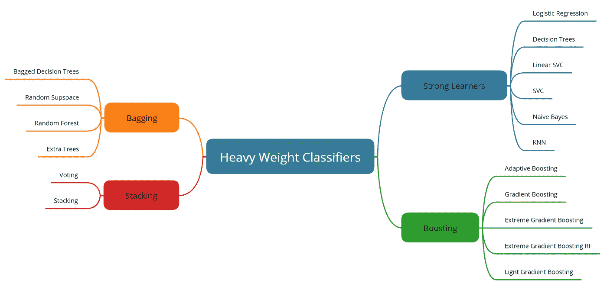

分类器冲突的类别和竞争者

分类算法分为四类，每一类都有多种算法。

*   学习能力强的人
*   制袋材料
*   助推
*   堆垛

我用了每个类别的一些常用算法进行比较，如上图所示。锦标赛分为几轮，我们首先比较该类别中所有算法的性能，最后比较排名前 5 位的算法。**我们的目标并不是要为一个算法加冕**冠军，而是给读者一个关于算法如何比较的通用指南，以及一个在现实世界问题中开始使用它们的好地方。

 [## 分类器

### Abhimanyu Yadav 的公共思维图。在 www.mindmeister.com 免费创建你自己的合作思维导图

嗯. tt](https://mm.tt/1929737603?t=1Ehmg2pESz) 

嵌入式思维导图参考了每种算法的优秀学习资源。

在对算法进行相互比较之前，我们还对算法运行了大量的**超参数调整**,因此对其性能的信心很高。使用 GridSearch 进行模型初始化和超参数调优的代码可供参考。Scikit-learn 参考 GridSearchCV 可以在[这里](https://scikit-learn.org/stable/modules/generated/sklearn.model_selection.GridSearchCV.html)找到。

30 倍交叉验证增加了在训练和测试数据之间获得相似结果的可能性。

# 比赛

## 第一轮:强有力的学习者

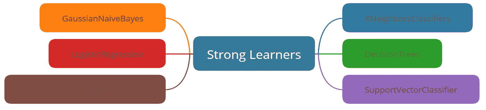

用于分类的强学习算法的例子

下面的代码用于初始化和调整各种强学习模型进行比较。

下面的代码用于创建图表，以比较交叉验证得分和训练数据的准确性得分。

## 第一轮结果

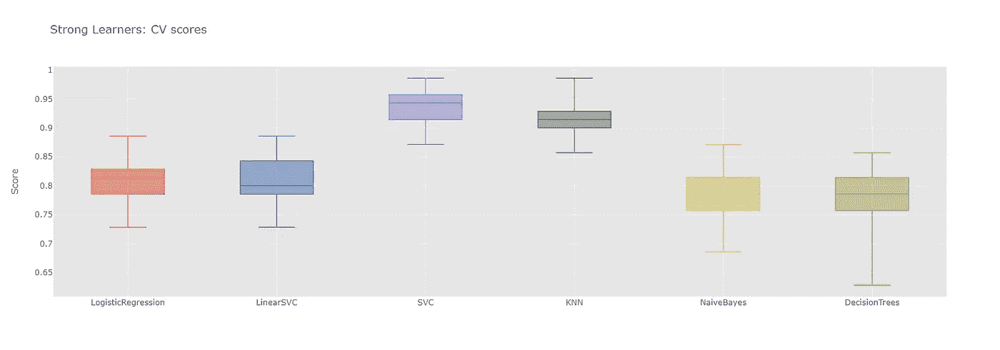

惠普调优强学习者的交叉验证分数比较

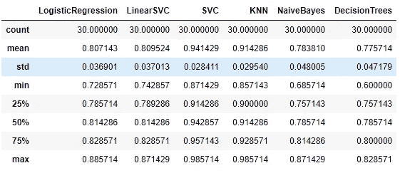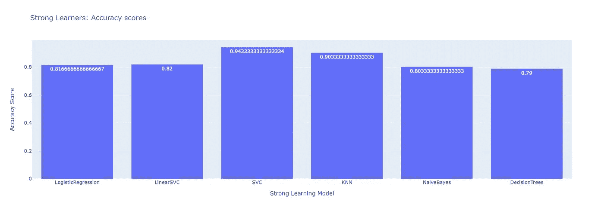

HP 调优的强学习者准确性分数的比较

非线性支持向量分类器在验证数据上以 94.14%的平均 cv 分数、2.84 %的窄标准差和 87.14%的最低分数胜过这里的所有算法。紧随其后的是 KNN 分类器，平均 cv 值为 91.42%，窄标准差为 2.95%，最低得分为 85.71%。在测试数据上复制了相同的性能，其中 SVC 算法得分为 94.33%，KNN 算法得分为 90.33%。看起来很难打败 SVC 算法。

## 第二轮:打包算法

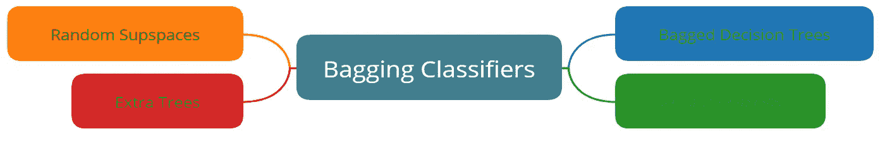

基于巴金的分类算法的例子

下面的代码用于初始化和调整各种 bagging 集成学习模型进行比较。

下面的代码用于创建图表，以比较交叉验证得分和训练数据的准确性得分。

## 第 2 轮结果

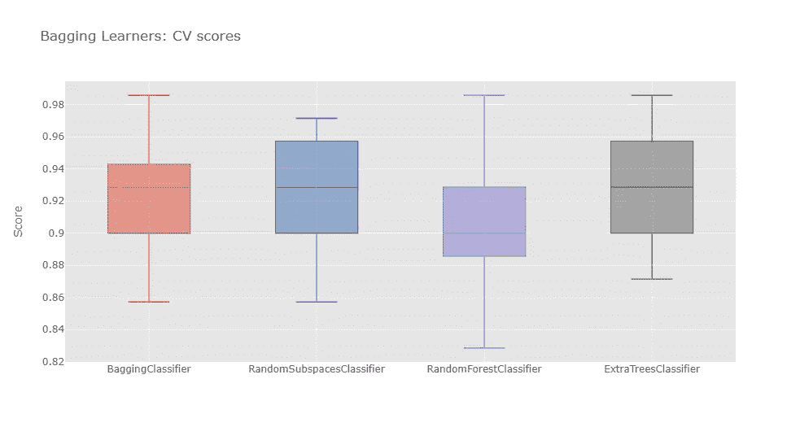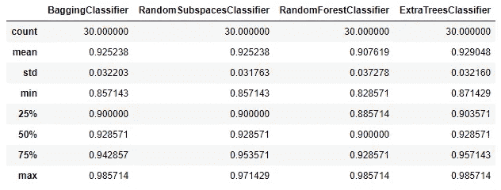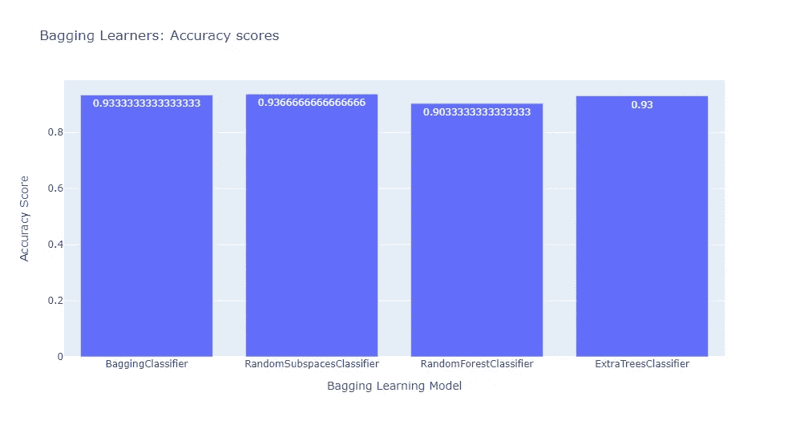

bagging 分类器、随机子空间分类器和额外树分类器都表现得非常接近，平均 cv 分数分别为 92.52%、92.52%和 92.90%。性病评分也非常接近~ 3.2%。随机子空间分类器在测试数据上稍微优于其他算法，其中它得到 93.67%的准确度分数，而其他两个算法得到 93.3%的分数。在这里很难选出一个明确的赢家，但由于额外树分类算法的最低分数以及 25、50 和 75 个百分点高于其他两个百分点，我们可以说它的表现稍微比其他算法更稳定一些。

## 第三轮:助推算法

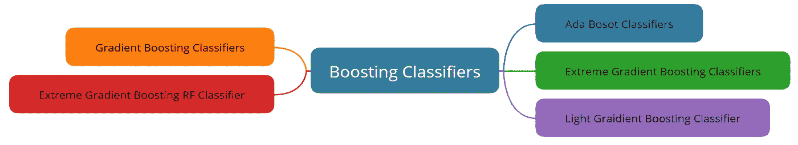

下面的代码用于初始化和调整各种 Boosting 学习模型进行比较。

下面的代码用于创建图表，以比较交叉验证得分和训练数据的准确性得分。

## 第三轮结果

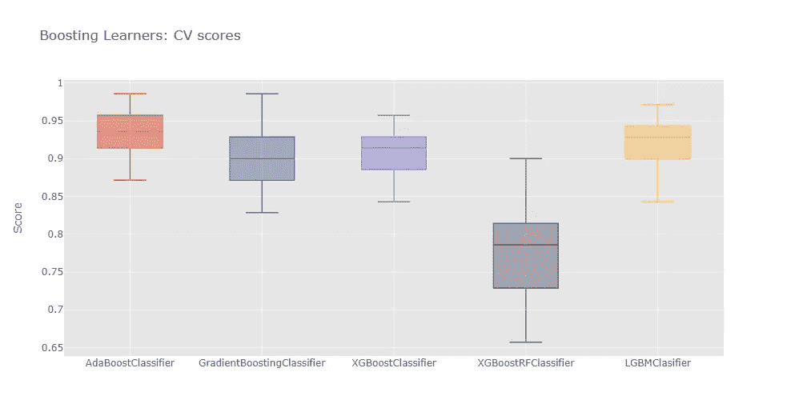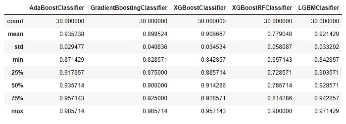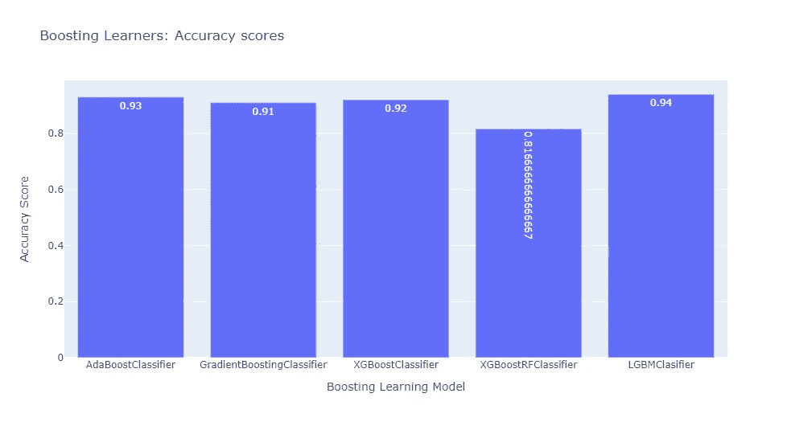

AdaBoost 分类器的性能略好于 lgbm 分类器，平均 cv 值为 93.52%，而 lgbm 分类器为 92.14%。与 LGBM 分类器的 3.3%相比，它的标准差也较低，为 2.9%。然而，与 AdaBoost 分类器的 93%相比，LGBM 分类器在测试数据上获得了 94%的稍好结果。XGBoost 分类器在测试数据上表现更好，准确率为 92%，远好于平均 cv 分数 90.67%。

## 第 4 轮:堆叠算法

下面的代码用于初始化和调整各种堆叠集成学习模型以进行比较，并创建图表以比较交叉验证分数和训练数据的准确度分数。

## 第 4 轮结果

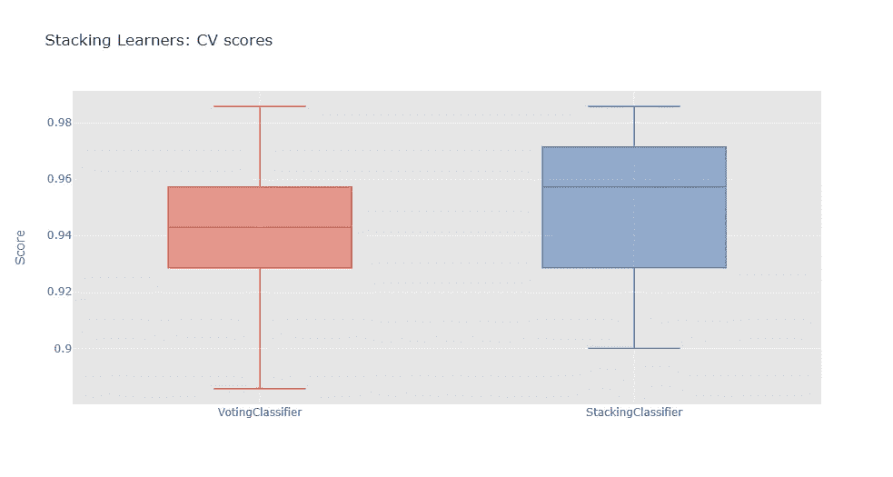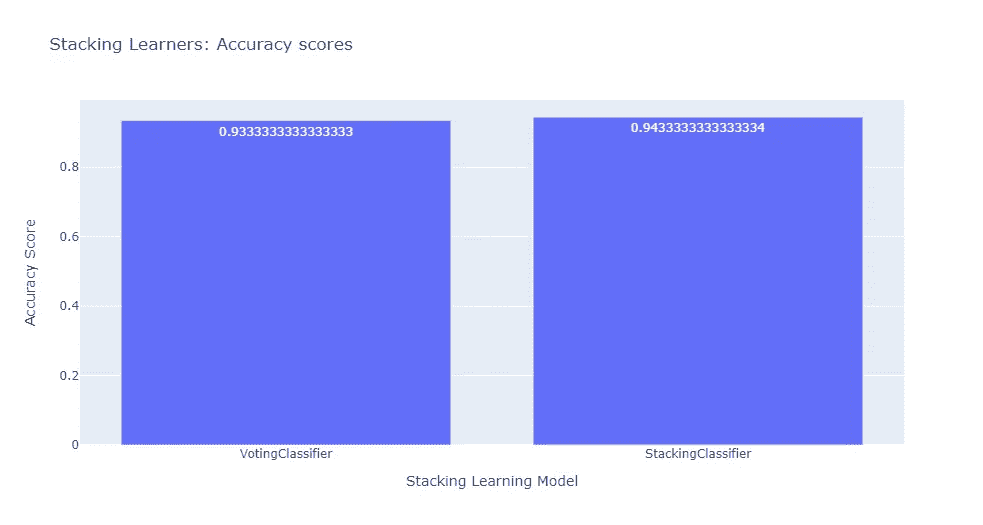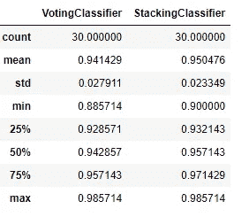

使用的堆叠集成算法是使用前一轮的获胜者创建的，并且通常比单轮的获胜者执行得更好。堆叠分类器的平均 cv 值为 95.04%，标准差为 2.33%。投票分类器也不远了，cv 分 94.14%。看来这种高级类的算法才是真正的重量级。

# 获胜者是…

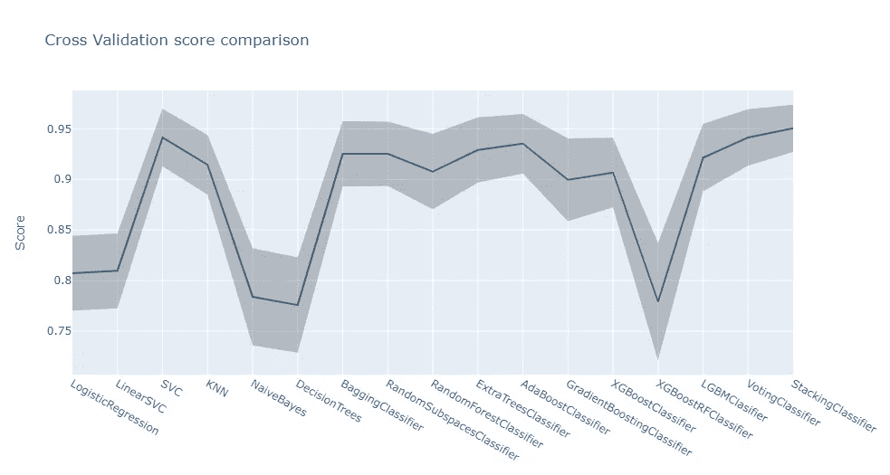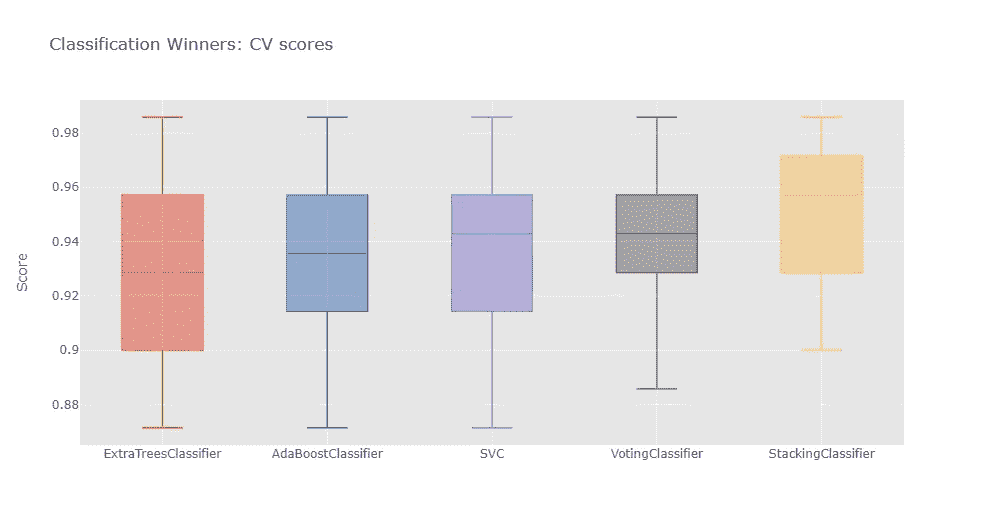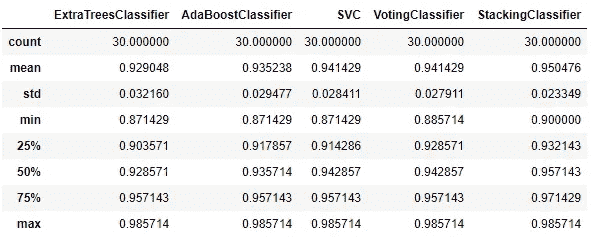

我们可以看到，通过堆叠已经执行得非常好的算法，我们可以进一步改进结果，并降低错误分类数据的总体概率。这在使用前几轮获胜者的堆叠和投票分类器获得的最高分数中是显而易见的。堆叠分类器的最低 cv 分数是 90%，这优于一些其他算法的最好分数，并且显著优于大约 88%的其他算法的最低分数。这同样适用于 25、50 和 75 百分位的人。堆叠分类器以微弱优势胜出。

# 最后的想法

堆叠分类器及其复杂性只是险胜 SVC，因此它可能是今天的赢家，但其他算法将继续战斗。另一个值得注意的点是，在所有分类任务中简单地使用 XGBoost 或 LGBM 可能不是所有情况下的最佳方法，必须仔细定制解决方案以找到最佳结果。由于这些问题中有许多是非凸优化问题，它们不会总是收敛到相同的结果，选择类似随机状态的东西也会对结果产生影响。

还有其他超参数调整方法，可以更快地得到结果，因此在调整时可以搜索更大的空间。我将在另一篇博客中讨论回归者的冲突。

 [## 回归者的冲突

### 各种回归机器学习算法的比较

yadav-manyu.medium.com](https://yadav-manyu.medium.com/clash-of-the-regressors-b8d2328e748f) 

谢谢，继续学习

阿比