# 回归者的冲突

> 原文：<https://medium.com/nerd-for-tech/clash-of-the-regressors-b8d2328e748f?source=collection_archive---------20----------------------->

伊万娜·卡金娜在 [Unsplash](https://unsplash.com/s/photos/boxing?utm_source=unsplash&utm_medium=referral&utm_content=creditCopyText) 上的照片

# 锦标赛

本文旨在比较回归的各种 ML 算法&为读者提供样例代码来调优和运行大多数流行的回归算法。本文提供了对所选算法的快速介绍，但并不试图深入探究它们背后的数学或科学。为此，网上有一些免费和付费的资源。我试着在适用的地方链接一些好的算法博客/参考资料。

**测试数据:**为了正确测试和理解不同算法的细微差别，我们生成了合成测试数据。我们创建了两个场景(1)其中我们使用了一个**三次多项式**作为基础事实(2)其中我们使用了一个**正弦函数**作为基础事实。在这两种情况下，我们都在测量中加入了均匀的随机噪声。

我们故意不使用来自 scikit-learn 的 make_regression 函数的合成数据或真实世界的数据，因为这几乎不可能获得生成数据的真实底层函数。我们还特意排除了任何线性函数或线性回归算法，因为它们非常简单，只需很少的调整就可以很好地工作。此外，一些非线性函数可以通过变换特征空间变成线性的，但这不是我们今天讨论的重点。

我们的目标是了解如何改进任意函数的回归结果，而无需深入标准化或特征转换等技术，从而使分析仅限于算法的性能，不受预处理步骤的影响。

回归算法的轮次

下面的代码用于创建 1001 个测试数据样本，只有一个特性和一个目标变量。如上所述，有两种情况。1D 特征空间的选择使得可视化结果更加容易。

输入测试数据与地面真实函数的关系图。添加了均匀的随机噪声，添加高斯或泊松噪声会使情况更真实，但更难说明比较。

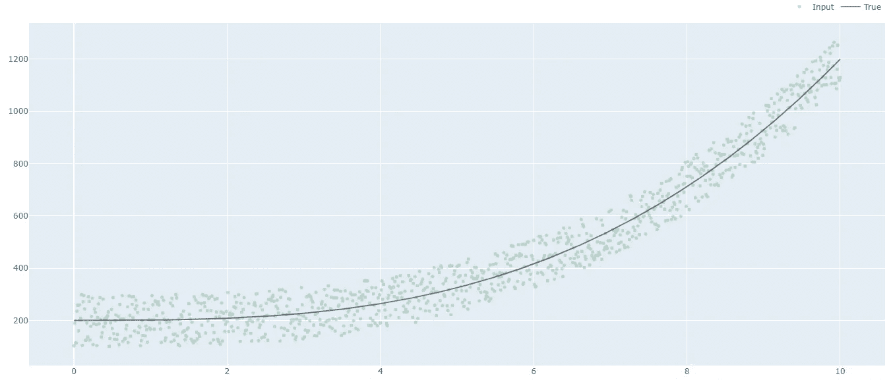

第 1 轮的输入数据，基函数是三次多项式+添加的随机噪声

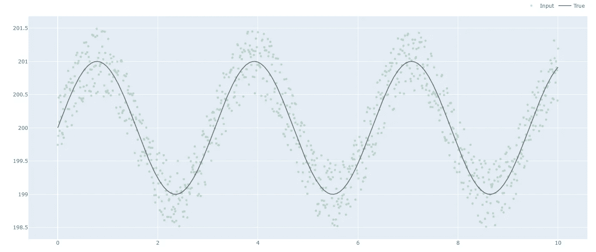

第 2 轮的输入数据，基本函数是正弦函数+添加的随机噪声

**评分标准**:我们有两个评分标准(1)用于交叉验证的平均绝对误差和(2)用于比较测试数据性能的均方根误差。

# 重量回归变量

 [## 回归变量

### 决策树装袋回归器 xgb 回归器堆叠回归器随机森林 AdaBoost 回归器 LGBM…

www.mindmeister.com](https://www.mindmeister.com/1929728145/regressors) 

上面嵌入的思维导图链接到一些解释每种算法的有趣文章。

# 比赛

下面的代码用于初始化和训练各种回归模型，包括投票和堆叠集合。

下面的代码用于生成比较目标变量的预测值与输入值和实际值的图表。

下面的代码用于生成交叉验证 MAE，测试数据的 RMSE，和地面真相的 RMSE。

## 第一轮结果

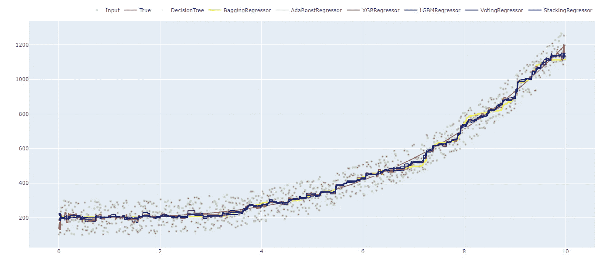

三次函数的所有回归结果

上图显示，当基础函数是三次多项式时，除了决策树之外，其他算法对回归问题的表现相对较好。

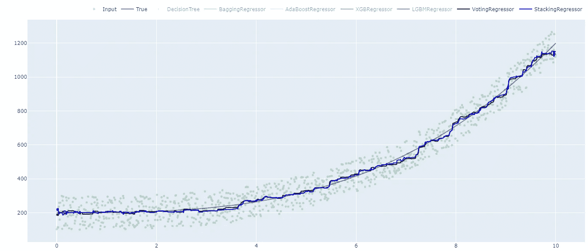

三次函数的最佳回归结果

上面的图表明，投票和堆叠回归算法在密切模拟底层地面真相方面做得非常好，几乎忽略了添加的噪声。

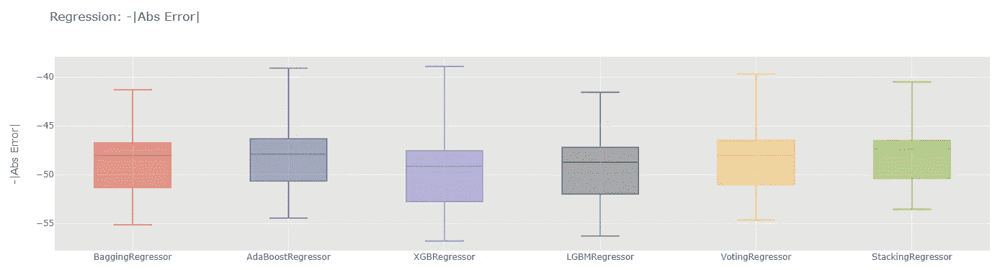

三次函数回归结果的比较

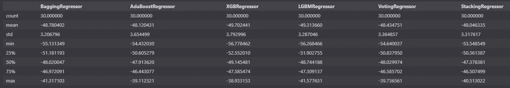

线性回归和决策树的交叉验证分数被有意忽略，因为它们明显高于其他分数，并且使交叉验证图更难解释。

Adaboost，Voting 和 Stacking 回归器都表现得同样好，平均平均误差分别为-48.7，-48.43 和-48.06。三者的标准偏差接近 3.3。

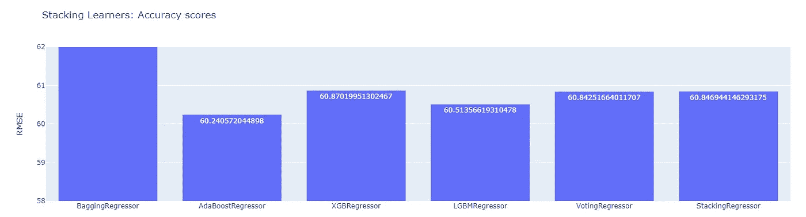

三次函数测试数据回归算法的比较

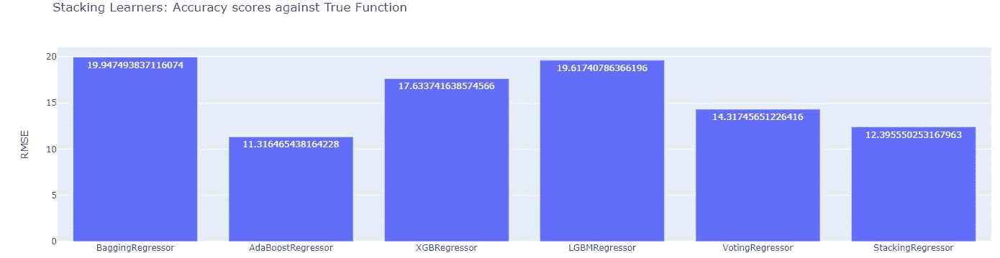

预测无噪声正弦函数的回归算法比较

当我们将测试数据上的结果与没有任何测量噪声的实际情况进行比较时，AdaBoost 回归算法在测试数据上显示出最低的 RMSE 60.24，而当我们将预测与实际情况进行比较时，则为 11.31。紧随其后的是堆叠回归算法，得分分别为 60.84 和 12.39。

## 第 2 轮结果

正弦函数的所有回归结果

上面的图显示，在预测更复杂的基础函数时，堆叠回归算法和 LGBM 回归算法比其他算法都出色。

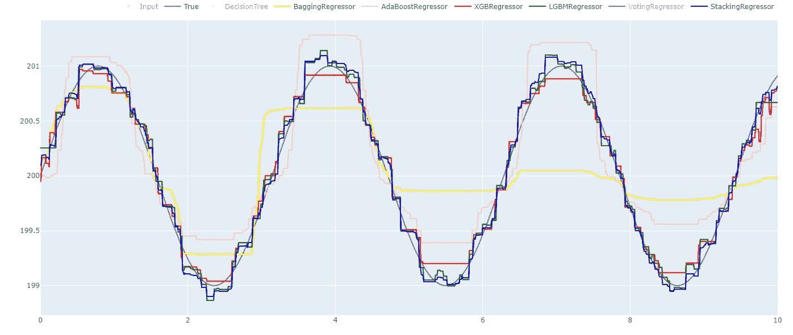

解释堆叠算法的卓越性能

上图解释了堆叠算法表现如此出色的原因。它使用来自多个强学习者的预测，并组合它们以达到最佳结果。

三次函数的最佳回归结果

上图显示，即使对于复杂的回归任务，叠加和 LGBM 回归算法也可以很好地模拟过程，并忽略噪声。

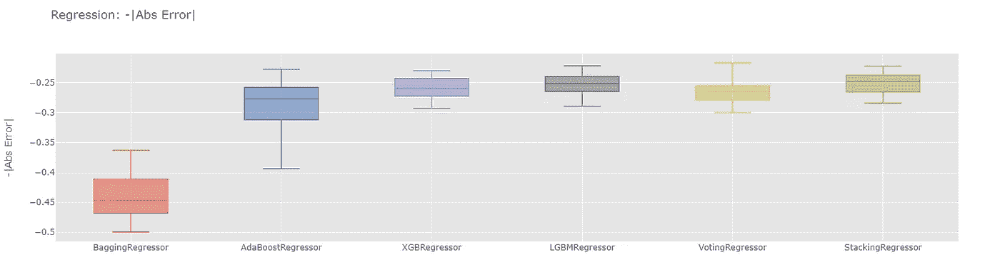

正弦函数回归结果的比较

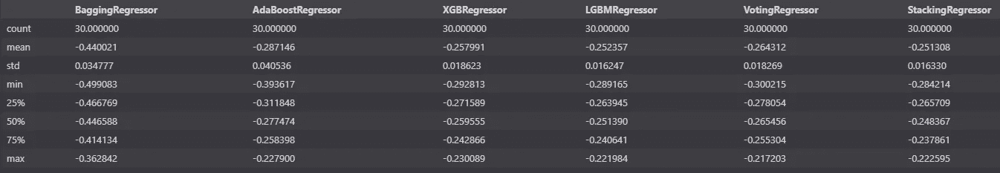

在第 2 轮中，当基础函数稍微复杂一点时，叠加和 LGBM 回归算法更加耀眼，平均交叉验证 MAE 分别为-0.251 和-0.257。两者的标准偏差为 0.016，表明它们通常表现良好，没有过度拟合。

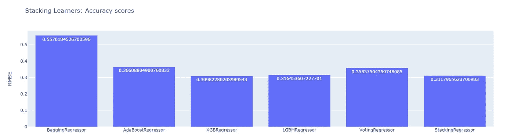

正弦函数测试数据回归算法的比较

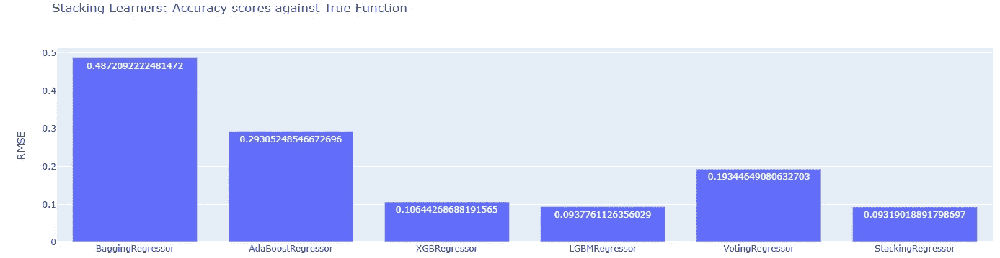

无噪声预测基础正弦函数的回归算法比较

同样，当比较测试数据的结果和没有鼻的真实正弦函数时，叠加回归和 LGM 回归算法优于其他算法。

# 获胜者是…

**叠加回归和 LGBM 回归算法**在第 1 轮和第 2 轮后胜出。这是因为叠加算法能够提供一致的结果，而 LGBM 等算法能够对任意复杂的回归函数进行建模。

# 最后的想法

很难比较回归算法，因为每种算法都有一些独特的特性，适合不同的情况。当我们试图惩罚多特征线性回归模型的权重时，使用了像 Elasticnet、Lasso 和 Ridge 回归这样的算法。当一些特征变量是离散的时，决策树在回归任务中表现更好。然而，使用基于集成的方法总是更好，最好是在训练完其他模型后，最后堆叠回归器或投票回归器。这将在大多数情况下降低标准偏差，从而提高预测能力的可信度。

我将尝试把更多的测试用例放在一起，这样其他算法的好处就会显现出来。

特征向量的标准化也将在获得正确的模型中发挥重要作用。可以花更多的时间来调整模型，但是过一会儿，这就是收益递减法。我有另一篇文章比较了分类算法。你可能也会觉得这很有趣。

 [## 重量级最大似然分类器的冲突

### 机器学习中分类算法的比较

medium.com](/nerd-for-tech/clash-of-the-heavyweight-ml-classifiers-72489c02d2bd) 

我将很快发表一篇文章，比较各种超参数调优算法很快。

谢谢，继续学习

Abhi