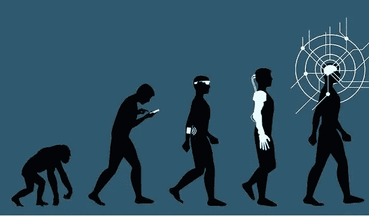

# 人工智能的经典观点

> 原文：<https://medium.com/nerd-for-tech/classic-view-on-artificial-intelligence-9a8d2babde02?source=collection_archive---------14----------------------->

人工智能的概念已经存在了一段时间，其根源可以追溯到 20 世纪 50 年代。虽然这个领域在过去的几年里已经经历了一次完全的蜕变，但是，某些基础知识，即使在今天，仍然是人工智能的基础。在这篇文章中，我试图从 20 世纪 50 年代和 60 年代的经典镜头中呈现一个关于人工智能的观点。随后，你会发现这些年来人工智能发展的细节，因为你会注意到机器中智能本身的定义已经发生了很大的变化。

**人工智能中的哲学问题:**

根据约翰·麦卡锡和帕特里克·j·海斯在 1969 年发表的研究论文，要使计算机具有智能，它必须对周围的世界有一个基本的了解，并以此为基础解释其输入。然而，创建这样一个程序会引导我们首先定义什么是知识以及如何获得知识。这提出了一些人工智能哲学中最传统的问题。由于不同的人对智力这个词可以有不同的解释，因此给这个概念一个普遍的、能被所有人接受的定义就成了一场哲学上的战斗。为了更好地理解这一点，我们需要一个系统来准确地描述我们所知道的世界，并解释它所有的可能性和原因，同时考虑到随机性和可能出现的不同情况。此外，我们还需要一种方法，通过这种方法，我们的程序可以与这个世界模型进行交互，以获取信息并做出决策。

从一开始，人工智能就被认为是为了解决给人类带来智力困难的问题而创造的。这类问题的一个很好的例子是国际象棋。国际象棋一直是人工智能历史上不可或缺的里程碑，因为它是创造“智能机器”道路上必须解决的最大挑战之一。机器可以“思考”并在智力游戏中击败人类的想法让研究人工智能的科学家不寒而栗，直到 20 世纪 70 年代末，人工智能才最终在游戏中击败了一位特级大师。通常，在为这类问题设计程序时，智能机制才会显现出来，测试这些程序可以提供更好的理解。或者，问题也被定义在已经想到的智力机制上，并被用来创建一般的解决方案。

根据艾伦·图灵在 1950 年给出的一个定义，“一台机器如果能成功地伪装成人类半小时，就可以被认为是智能的”。然而，为了符合他的定义，他排除了人类表面行为的许多重要方面。为了更好地理解人工智能，我们需要定义什么是智能，1950 年，约翰·麦卡锡和帕特里克·海斯给了它一个黑盒定义。他们提出了一系列涉及各种逻辑和情景反应的问题，指出“如果一台机器有一个世界模型，可以根据这个模型回答问题，并在需要时从这个模型中获得更多信息，那么它就可以被称为智能的”。然而，这种表述的哲学方面只涉及研究人员提出的证明的正确性，而没有考虑寻找策略和证明的实际方法。考虑到这个定义，出现的第一个问题是定义我们正在为我们的机器建模什么类型的世界。这是一个涵盖了大量问题的总体世界，还是一个拥有更细粒度信息的世界？

因此，要深入了解 AI 领域，我们需要首先了解它的各个组成部分，并从 AI 的立场出发，开始思考基本的哲学观点。让我们从形式主义的角度来看这个问题，因为这将有助于看到这个术语及其成分与某些规则粘在一起。

**形式主义**

形式主义是用数学或逻辑术语描述事物的过程。因此，由于我们已经掌握了如何给智能和能力等现实生活中的概念一个标准定义的要点，我们将回顾人工智能如何提供数学和逻辑支持来构建世界模型的过程。

为了恰当地定义一个世界模型，我们借助于情境和变化。一种情况是宇宙在某一瞬间的完整状态，因为不可能完全描述宇宙，所以我们用一些事实来描述这种特殊情况，这反过来又被用来推断更多关于其他情况及其未来的事实。为了能够提供这些信息或事实，我们需要 Fluents 的帮助。从根本上说，波动是特定情况下函数的结果。例如，流畅的 raining(x)(s)将根据位置 x 和情境 s 提供真或假。情境和流畅都充当模型的基本构建块。

向前看，我们考虑了因果关系，也考虑了不同的情境影响和行动；并将它们分组到策略中，然后用于创建程序。我们需要明白，一个计划需要所有可能的情况和策略，然而，在现实生活中它们是不可行的。

最后，我们考虑知识和一个人实现目标的能力。可能有多种策略来实现一个特定的目标，但是，由于缺乏知识，其中一些策略可能不可行。因此，根据我们所掌握的知识选择最可行的策略变得非常重要。

**并行处理和概率**

世界模型的几个定义也建议将概率纳入其中，以考虑与之相关的不确定性。然而，它有两个主要问题。首先，不确定如何将概率与人们的信念程度相对应，其次，分配数字概率所需的信息通常是不可用的。

此外，在现实世界中，通常会有许多进程同时进行，因此需要用并行处理的思想来取代单一策略的方法。然而，在 1969 年提出这个想法的时候，还没有发展出允许证明并行程序正确性的形式主义。

**知识的逻辑**

Hintika 在 1962 年首次将知识逻辑作为模态逻辑引入。他引入了模态算子 Ka 和它的对偶算子 Pa，然后用它们来引入知识演算。运算符 Ka 基本上读作“在与 a 的知识相容的所有可能的世界中它都是真的”,并在知识演算中广泛使用。除了知识逻辑之外，还需要考虑其他几种逻辑，如模态逻辑、时态逻辑、行为理论等。

**结论**

作为一个概念,“智力”的概念一直在不断变化，每个研究者都有自己的看法。谁知道，未来几年智能意味着什么。随着人工智能领域的发展，它无疑是目前最大的行业之一。当时有人说，“在未来，我们几乎所有的日常活动都将以某种形式涉及人工智能。然而，对于一个进入人工智能世界的人来说，他们需要了解制造人工智能的基本构件”。因此，随着人工智能现在成为现实，理解人工智能的组成部分和智能的演变定义是相关的。

**参考文献**

麦卡锡、约翰和海斯 j、帕特里克(1969)，《从人工智能的立场看一些哲学问题》，斯坦福大学

明斯基，马文(1961)，走向人工智能的步骤，国际反应堆会议录

 [## 人工智能的经典观点

### 人工智能的概念已经存在了一段时间，其根源可以追溯到…

mokshjaswal.com](https://mokshjaswal.com/f/classic-view-on-artificial-intelligence)