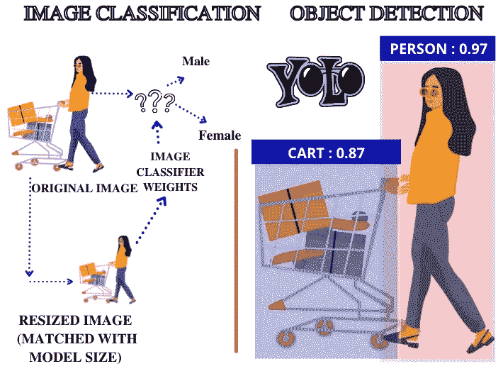
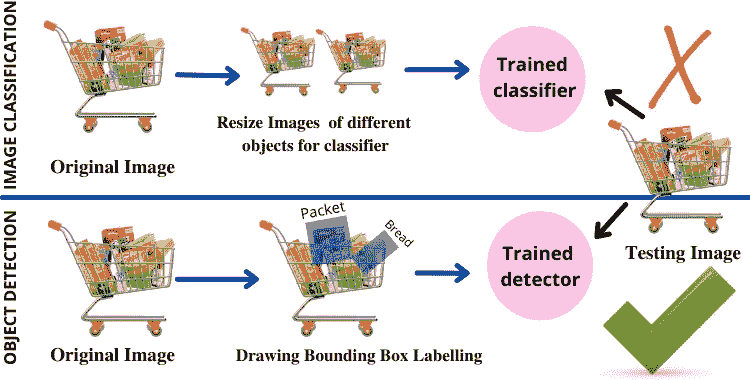
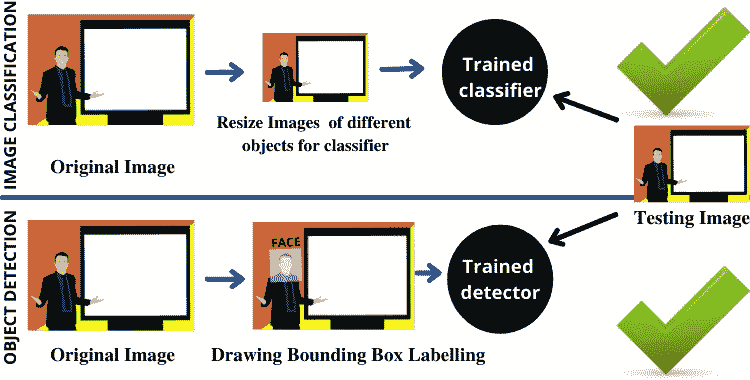

# 分类是比检测更好的解决方案，但 Where❓

> 原文：<https://medium.com/nerd-for-tech/classification-is-better-solution-than-detection-but-where-25dfddaa1e61?source=collection_archive---------0----------------------->

在许多情况下，分类是比对象检测更好的解决方案。在本文中，我们将主要讨论分类比检测更好的地方，但在继续之前，让我们谈谈什么图像分类&对象检测 is❓

> 图像分类是根据特定的规则[1] 对图像中的像素组或向量组进行分类和标记的过程。简而言之，它是将图像的像素分类到一些预定义的类别的过程。
> 
> 对象检测是**一种与计算机视觉和图像处理相关的计算机技术，处理在数字图像和视频****【2】中检测某类语义对象的实例(如人、建筑物或汽车)。**简单来说就是在图像像素中找到一个物体，并高亮显示该物体的区域的过程。

**图像分类 vs 物体检测**

现在，我们将开始关于 ***“哪些场景分类比检测更好”*** 的讨论，考虑上面图像中的一个例子，其中一名女性正在某家商店购物，并将购买的东西放入购物车。

虽然我们可以将这些数据用于许多问题的解决方案，但是这里我们将考虑两种情况来比较检测和分类问题。

*   ***通过扫描购物车中的商品来结账。***
*   ***核实人的身份(姓名)。***

**通过扫描购物车中的元素来制作账单:**这就是问题所在，我们需要检测购物车中的所有产品，以找到每个产品的付款，所以这里我们需要使用检测而不是分类。因为，在购物车中，有许多对象会彼此重叠， ***如果我们将使用分类那么许多特征将会不匹配和错误，所以最终，我们的结果将变得更糟*** 。此外，在分类中，我们必须传递带有类名的图像，而不是边界框(坐标)，因此模型将如何找到购物车中对象的位置(即袋子、瓶子)。这就是为什么我们首先需要沿着每个对象绘制一个边界框，需要根据该数据训练一个对象检测模型，该模型将能够识别对象，然后我们将能够找到每个对象的价格。

**通过扫描购物车中的元素来制作账单的正确决策**

> 是的，如果我们只需要找到**推车**是否存在于上面的图像中，那么在这种情况下，我们也可以使用分类。

**验证人的身份(姓名):**这就是问题，这里我们需要识别一个人的面部，用于不同目的的交叉验证。所以这里我们可以同时使用 **( *物体检测或者图像分类* )** 因为 ***这里我们主要需要的是得到一个人的名字，而不是确切的位置。***

*   如果我们将对象检测用于个人身份，我们将能够通过边界框来获得人脸位置，这将有助于我们进一步解决问题。
*   如果我们将图像分类用于个人身份识别，我们将能够通过人脸识别获得该人的姓名。

> 在这种情况下，分类是更好的解决方案，因为我们需要调整图像大小以匹配模型大小，模型将在特定区域迭代，因此这将需要更少的时间来处理输入。而在检测中，模型将需要迭代图像的每个像素，因此这将比分类花费更多的时间。

**验证人的身份**

**注意:使用检测&分类算法的决定**主要取决于问题工作流程和理解。一般来说，在很多情况下，分类是比检测更好的解决方案。例如，正如我在第二个案例中所讨论的。

**参考文献:**

*   **【1】**[*https://www . science direct . com/topics/engineering/image-class ification*](https://www.sciencedirect.com/topics/engineering/image-classification)
*   **【2】**[http://www.iti.gr/~bmezaris/publications/csvt05.pdf](http://www.iti.gr/~bmezaris/publications/csvt05.pdf)

***关于“分类比检测好但是在哪里”就这些？***

**关于我** ❓

> 我有超过 1 年半的软件开发工作经验。目前，我是一名软件工程师，通过使用零售分析、建立大数据分析工具、创建和维护模型以及加入引人注目的新数据集，为我们的客户改进产品和服务。此前，我是 Spark 基金会的计算机视觉实习生，在那里我获得了分析来自不同开源平台(如 kaggle、google images、openimages 等)的视觉数据的经验。)并在该数据上训练不同的深度学习模型。

*   [*在 LinkedIn 上和我联系*](https://www.linkedin.com/in/muhammadrizwanmunawar/)
*   [*我正在提供的影像分类服务*](https://www.upwork.com/services/product/image-classification-projects-using-deep-learning-1371339028370116608?ref=project_share)
*   [*我正在提供对象检测服务*](https://www.upwork.com/services/product/you-will-get-image-classification-projects-using-machine-learning-with-python-1323963101029052416?ref=project_share)
*   [*我提供的计算机视觉服务*](https://www.upwork.com/services/product/data-science-projects-computer-vision-deep-learning-opencv-yolov5-ssd-1473352216700157952?ref=project_share)
*   [*与我协商*](https://www.upwork.com/services/product/consultation-1477666319161577472?ref=project_share)

***如有任何疑问，欢迎在下方评论***