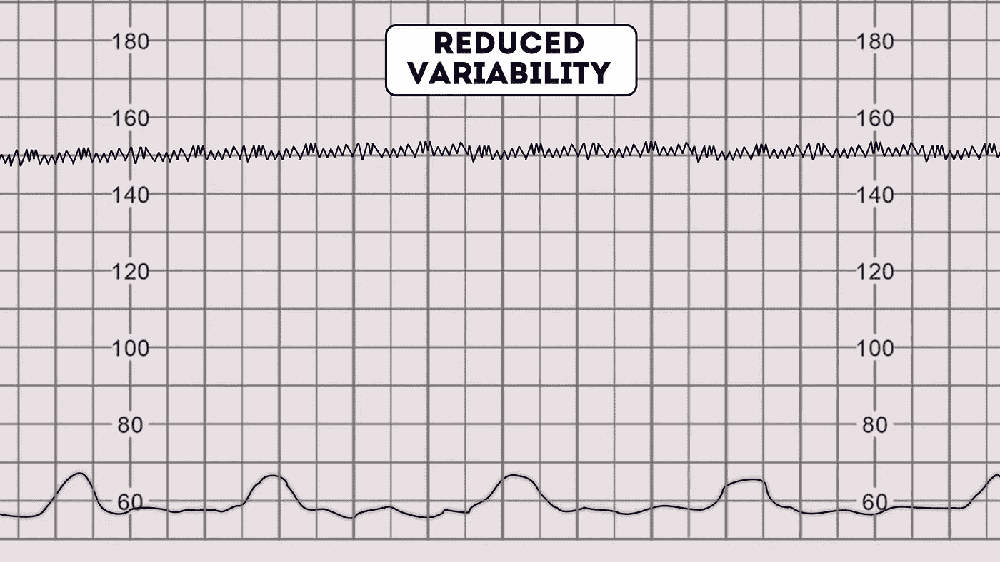
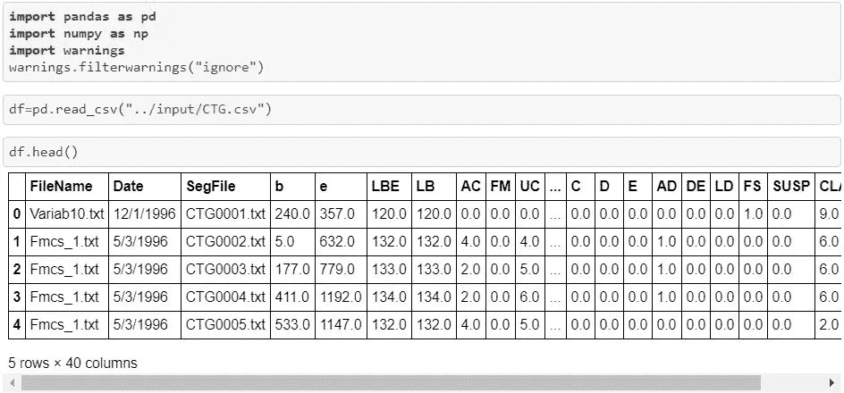
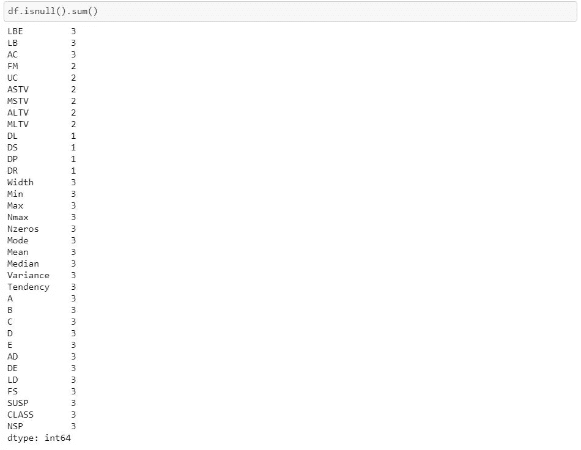
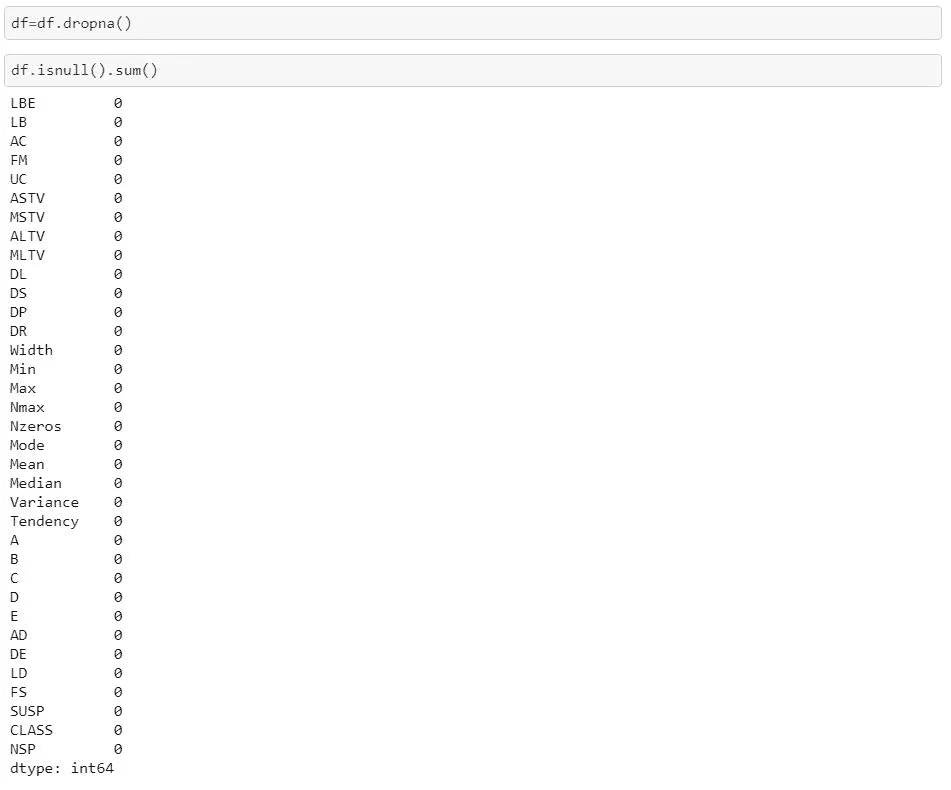
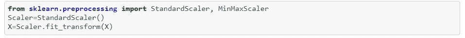
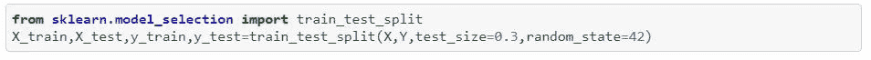
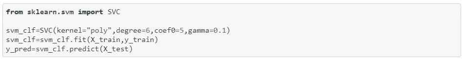
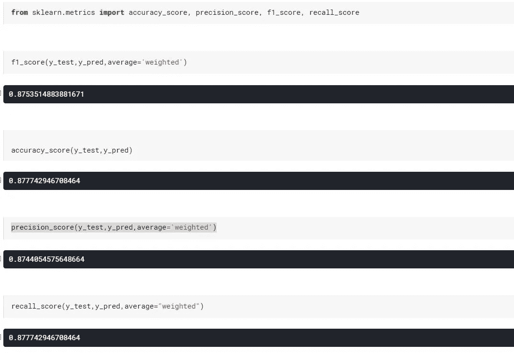

# 使用心脏分娩描记术数据和 SVM 对胎儿状态进行分类

> 原文：<https://medium.com/nerd-for-tech/classification-of-cardiotocography-using-svm-cbc56a4f68b?source=collection_archive---------0----------------------->

# **心脏分娩图**

因为我们都知道有许多技术可用于观察胎儿，超声技术是常用的技术之一，但是这种超声技术对于记录胎儿的心率和其他细节如子宫收缩不是很有帮助。这就是心育图发挥作用的地方。**胎心描记术是一种帮助医生追踪胎儿心率**的技术，包括在**子宫收缩**的帮助下测量加速度、减速度和变异性。此外，这种胎心描记法可用于将胎儿分为三种状态，即:

*   正常轨迹
*   可疑痕迹
*   病理痕迹

# **问题陈述**

胎儿脉搏率和子宫收缩(UC)是在怀孕期间和分娩前判断母亲和胎儿健康的基本和常见的诊断技术。通过观察心脏分娩数据，医生可以预测和观察胎儿的状态。因此**我们将**使用 CTG 数据和支持向量机来预测胎儿的状态。**因此我们将使用 CTG 数据和支持向量机来预测胎儿的状态。**

**定义心育领域的一些最重要的术语:**

1.  CTG 痕迹一般显示两条线。上面的线是以每分钟心跳数为单位的胎儿心率记录。下面一行是 TOCO 记录的子宫收缩。

该图像清楚地显示了两条线。上面的代表胎儿心率，下面的显示子宫收缩。

2.四种胎心率特征是:

*   基线心率
*   变化性
*   加速
*   减速

3.将子宫收缩量化为 10 分钟内出现的收缩次数，并在 30 分钟内取平均值。

*   正常:10 分钟内≤ 5 次宫缩
*   高:10 分钟内收缩≥ 5 次

4.基线心率是平均基线胎儿心率。

*   可靠特性:每分钟 110-160 次(bpm)
*   不可靠特性:100–109 BPM 或 161–180 BPM
*   异常特征:180 bpm

5.可变性是指胎儿心率的波动，这将导致跟踪显示为锯齿状，而不是平滑的线。可变性是胎儿神经系统成熟的标志，并被视为胎儿储备的一种度量。

*   可靠特性:≥ 5 bpm
*   不放心功能:<5 bpm for ≥40 minutes but <90 minutes
*   Abnormal feature: <5 bpm for > 90 分钟

6.减速是指胎儿心率从基线下降至少每分钟 15 次，持续至少 15 秒。根据减速与子宫收缩的关系，有三种类型的减速。早期减速始于子宫收缩开始，止于收缩结束。

*   令人放心的特点:没有减速
*   不可靠的特征:早期减速、可变减速或单次延长减速达 3 分钟
*   异常特征:非典型的可变减速、延迟减速或单次延长减速超过 3 分钟。

7.三类 CTG 痕迹如下:

*   正常迹线:具有所有四个特征的迹线:基线率 110-160 BPM、正常变异性、无减速和加速(可能存在也可能不存在)。
*   可疑跟踪:用一个不可靠的特性跟踪，其他三个是可靠的。
*   病理痕迹:带有两个或两个以上不确定特征或一个或多个异常特征的痕迹。

# **接近**

我们将使用特征基线值(经医学专家验证)、基线值(通过 SisPorto 获得)、加速度、胎动(SisPorto)、子宫收缩(SisPorto)、轻度减速、重度减速、长期减速、重复减速将胎儿分为三类，即正常、可疑和病理性。出于以下原因，我们将使用支持向量机模型来实现此目的:

*   它对高维数据的伸缩性相对较好。
*   **SVM** 未解决局部最优
*   SVM 模型在实践中具有推广性，在 SVM 过拟合的风险较小。
*   内核技巧是支持向量机最棒的地方

# **查看数据集:**

原始数据集可在以下位置找到:[https://github . com/dubeyakshat 07/胎儿心率使用 SVM/tree/master/Dataset](https://github.com/dubeyakshat07/Fetal-Heart-Rate-using-SVM/tree/master/Dataset)

*数据集是从 UCI 机器学习知识库下载的，属于各自的所有者。*

数据集中使用的缩写:

*   LBE:基线值(医学专家)
*   LB:基线值(西斯波尔托)
*   AC:加速度(西斯波尔托)
*   FM:胎动[](https://render.githubusercontent.com/view/ipynb?commit=7d71f777f687cbbc5497219c906891eb7e281808&enc_url=68747470733a2f2f7261772e67697468756275736572636f6e74656e742e636f6d2f6475626579616b7368617430372f466574616c2d48656172742d526174652d7573696e672d53564d2f376437316637373766363837636262633534393732313963393036383931656237653238313830382f4648522e6970796e623f746f6b656e3d414c4d5853484d4e4150454151454c475954494f365043365347355132&nwo=dubeyakshat07%2FFetal-Heart-Rate-using-SVM&path=FHR.ipynb&repository_id=254860563&repository_type=Repository#FM:----foetal-movement-(SisPorto))
*   UC:子宫收缩(西斯波尔托)
*   ASTV:异常短期变化的时间百分比(SisPorto)
*   DL:轻微减速
*   DS:严重减速
*   DP:长期减速
*   DR:反复减速
*   NSP:正常= 1；嫌疑人= 2；病理=3

**寻找空值:**

由于缺失值的数量非常少，因此我们可以删除相应的行。

现在，没有空值。

# **特征缩放**

**执行特征缩放:**

我们使用标准缩放器缩放，因为它提高了我们的 SVM 模型的性能。标准化是一种转换，即**通过移除每个特征的平均值来集中数据，然后通过将(非恒定)特征除以其标准偏差**来缩放数据。标准化数据后，平均值为零，标准偏差为一。

标准化可以极大地提高模型的性能。例如，学习算法的目标函数中使用的许多元素(如支持向量机的 RBF 核或线性模型的 l1 和 l2 正则化子)假设所有特征都以零为中心，并且具有相同顺序的方差

使用 StandardScaler()缩放数据

**将数据拆分为训练集和测试集:**

我们已经将数据集分成了训练集和测试集。30 %将用于测试，70%将用于培训。

使用 train_test_split()拆分数据集

# **训练和测试模型:**

我们将使用多项式核的 SVM。

正如我们可以观察到的，最大精度对应于伽马值 0.1。

使用 gamma=0.1 的内核进行训练和测试

**评估模型:**

我们使用准确度分数、精确度分数、f1 分数和召回分数对模型进行了评估。

我们可以观察到:

*   accuracy_score:准确性是最直观的性能度量，它只是正确预测的观察值与总观察值的比率。有人可能会认为，如果我们有高精度，那么我们的模型是最好的。是的，准确性是一个很好的衡量标准，但只有当您拥有对称的数据集时，假阳性和假阴性的值几乎相同。**我们模型的准确率为 87.74%**
*   precision_score: Precision 是正确预测的正面观察值与总预测正面观察值的比率。**精度高意味着误报率低。我们的模型的准确率为 87.44%**
*   recall_score: Recall 是正确预测的正面观察与实际类中所有观察的比率—是的。它也被称为模型的灵敏度。**我们模型的召回分数是 87.77%**
*   f1_score: F1 得分是准确率和召回率的加权平均值。因此，这个分数同时考虑了误报和漏报。直观上，它不像精确度那样容易理解，但是 F1 通常比精确度更有用，尤其是当你的职业分布不均匀的时候。如果假阳性和假阴性具有相似的成本，则准确性最好。**我们模型的 f1_score 为，87.53%**

**结论:我们的模型在数据集上表现得相当好，也许再做一些修改，它就能产生令医生们信服的结果。**

# **快乐的一天伙计们！**